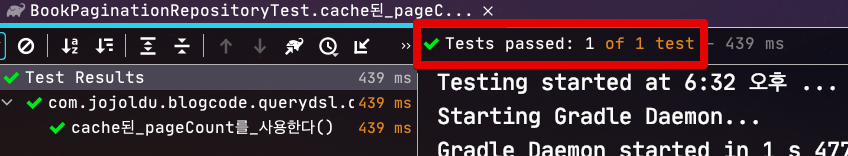
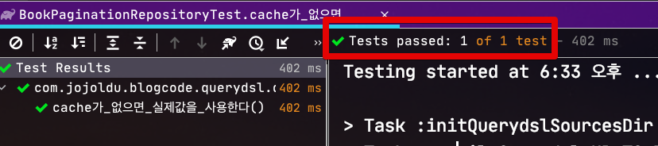

# 3. 페이징 성능 개선하기 - Count 쿼리 최소화하기 

## 3-2. 첫 페이지 조회 결과 cache 하기

> 모든 코드는 [Github](https://github.com/jojoldu/blog-code/blob/master/spring-boot-querydsl/src/main/java/com/jojoldu/blogcode/querydsl/domain/book/pagination/BookPaginationRepositorySupport.java)에 있습니다.

[지난 시간](https://jojoldu.tistory.com/530)에 이어 count와 관련된 2번째 개선 방법은 첫 번째 쿼리의 결과를 Cache하기 인데요.  
방법은 간단합니다.  
  
처음 검색시 조회된 count 결과를 **응답결과로 내려주어** JS에서 이를 캐싱하고, 매 페이징 버튼마다 count 결과를 함께 내려주는 것입니다.  
그리고 Repository에서는 요청에 넘어온 항목 중, 캐싱된 count값이 있으면 이를 재사용하고, 없으면 count 쿼리를 수행합니다.


> [이미지 원작자](https://woowabros.github.io/experience/2020/03/02/pilot-project-wbluke.html)님께 허락을 받고 사용하였습니다. :) (다시 한번 감사드립니다!)

이 방식은 다음과 같은 상황에서 도움이 되는데요.

* 조회 요청이 검색 버튼과 페이지 버튼 **모두에서 골고루 발생**하고
* 실시간으로 데이터 적재 되지 않고, **마감된 데이터**를 사용할 경우

이럴 경우에 사용하신다면 매 페이지 버튼 클릭시마다 발생하는 count 쿼리를 처음 1회만 호출되고 이후부터는 호출되지 않아 count 성능을 향상 시킬 수 있습니다.

> 물론 JS에서 캐싱하고 있기 때문에 브라우저를 새로고침하게 되면 count는 다시 초기화가 되어 이후 첫 조회시 다시 쿼리가 수행되게 됩니다.
  
자 그럼 실제 코드를 한번 보겠습니다.

### 3-2-1. 구현 코드

지난 시간에 이어서 이번에도 역시 기존 페이징 쿼리는 동일합니다.

```java
public Page<BookPaginationDto> paginationCount(Pageable pageable, String name) {
    JPQLQuery<BookPaginationDto> query = querydsl().applyPagination(pageable,
            queryFactory
                    .select(Projections.fields(BookPaginationDto.class,
                            book.id.as("bookId"),
                            book.name,
                            book.bookNo,
                            book.bookType
                    ))
                    .from(book)
                    .where(
                            book.name.like(name + "%")
                    )
                    .orderBy(book.id.desc()));

    List<BookPaginationDto> items = query.fetch(); // 데이터 조회
    long totalCount = query.fetchCount(); // 전체 count
    return new PageImpl<>(items, pageable, totalCount);
}

private Querydsl querydsl() {
    return Objects.requireNonNull(getQuerydsl());
}
```

이 코드를 검색/페이징 버튼 클릭시에 cache된 count를 사용하도록 개선하기 위해서는 다음의 코드가 추가되어야 하는데요.  

1. 프론트 영역에서 넘겨준 count값이 요청 필드에 포함시킨다.
2. Repository에서는 해당 count 값이 있을 경우엔 그대로 페이징 결과에 포함시키고, 없으면 실제 count 쿼리를 실행한다.

굉장히 심플한 로직이기에 바로 해당 로직을 적용해보겠습니다.

> 물론 JS영역 (혹은 모바일 앱)에서 응답객체의 count값을 저장하는 것도 추가되어야 합니다.  
> 여기서는 Querydsl에서 해야하는 것만 소개드립니다.


```java
// (1) 
public Page<BookPaginationDto> paginationCountCache(Long cachedCount, Pageable pageable, String name) {
    JPQLQuery<BookPaginationDto> query = querydsl().applyPagination(pageable,
            queryFactory
                    .select(Projections.fields(BookPaginationDto.class,
                            book.id.as("bookId"),
                            book.name,
                            book.bookNo,
                            book.bookType
                    ))
                    .from(book)
                    .where(
                            book.name.like(name + "%")
                    )
                    .orderBy(book.id.desc()));

    List<BookPaginationDto> elements = query.fetch(); // 데이터 조회
    long totalCount = cachedCount != null ? cachedCount : query.fetchCount(); // (2) 전체 count
    return new PageImpl<>(elements, pageable, totalCount);
}

private Querydsl querydsl() {
    return Objects.requireNonNull(getQuerydsl());
}
```

(1) ```Long cachedCount```

* 프론트 영역에서 넘겨준 count 값입니다.

(2) ```cachedCount != null ? cachedCount : query.fetchCount()```

* Request로 넘어온 cachedCount가 있으면, 해당 값을, 없으면 실제 count 쿼리를 수행시켜 사용합니다.


[[ad]]

자 그럼 한번 정상적으로 작동하는지 테스트 해보겠습니다.

### 3-2-2. 테스트 코드

먼저 cached된 경우입니다.

```java
@BeforeEach
void setUp() {
    for (int i = 1; i <= 30; i++) {
        bookRepository.save(Book.builder()
                .name(prefixName +i)
                .bookNo(i)
                .build());
    }
}

@Test
void cache된_count를_사용한다() throws Exception {
    PageRequest pageRequest = PageRequest.of(1, 10);
    Long cachedCount = 100L;
    Page<BookPaginationDto> page = bookPaginationRepositorySupport.paginationCountCache(cachedCount, pageRequest, prefixName);

    //then
    assertThat(page.getTotalElements()).isEqualTo(cachedCount);
}
```

위 테스트를 돌려보면?



정상적으로 결과가 반환되는 것을 확인할 수 있습니다.  
  
자 그럼 2번째로 cache가 없을 경우 실제 count 값을 사용하는 경우를 테스트해보겠습니다.

```java
@BeforeEach
void setUp() {
    for (int i = 1; i <= 30; i++) {
        bookRepository.save(Book.builder()
                .name(prefixName +i)
                .bookNo(i)
                .build());
    }
}

@Test
void cache가_없으면_실제값을_사용한다() throws Exception {
    PageRequest pageRequest = PageRequest.of(1, 10);
    Long cachedCount = null;
    Page<BookPaginationDto> page = bookPaginationRepositorySupport.paginationCountCache(cachedCount, pageRequest, prefixName);

    //then
    assertThat(page.getTotalElements()).isEqualTo(30);
}
```

위 테스트를 수행해보면? 



원하던대로 실제 count가 반환되는 것을 확인할 수 있습니다.

### 3-2-3. 결론

한번 조회된 **동일 조건의 count**에 대해서는 클라이언트 영역에서 저장후 요청시마다 재사용하는 방식을 사용하게 되면 추가적인 쿼리 요청이 최소화 된다는 장점이 있습니다.  
반면 다음과 같은 단점도 있는데요.

* 첫 페이지 조회가 대부분일 경우 효과가 없습니다.
  * 추가적인 페이징 조회가 필요하지 않으면 결국 매번 첫 조회라서 cache count를 사용할 수가 없습니다.
* 실시간으로 데이터 수정이 필요해 페이지 버튼 반영이 필요한 경우 사용할 수 없습니다.
  * 결국 새로고침 (or 버튼 클릭을 통한 페이지 이동) 하기 전까지는 페이지 버튼들이 계속 그대로 유지 되기 때문에 실시간성이 떨어집니다.
  * 마감된 데이터 혹은 실시간을 유지할 필요 없을 경우에만 사용할 수 있습니다.

위 장/단점을 함께 비교해보시면서 페이징 구성을 진행해보시는 것을 추천드립니다.
