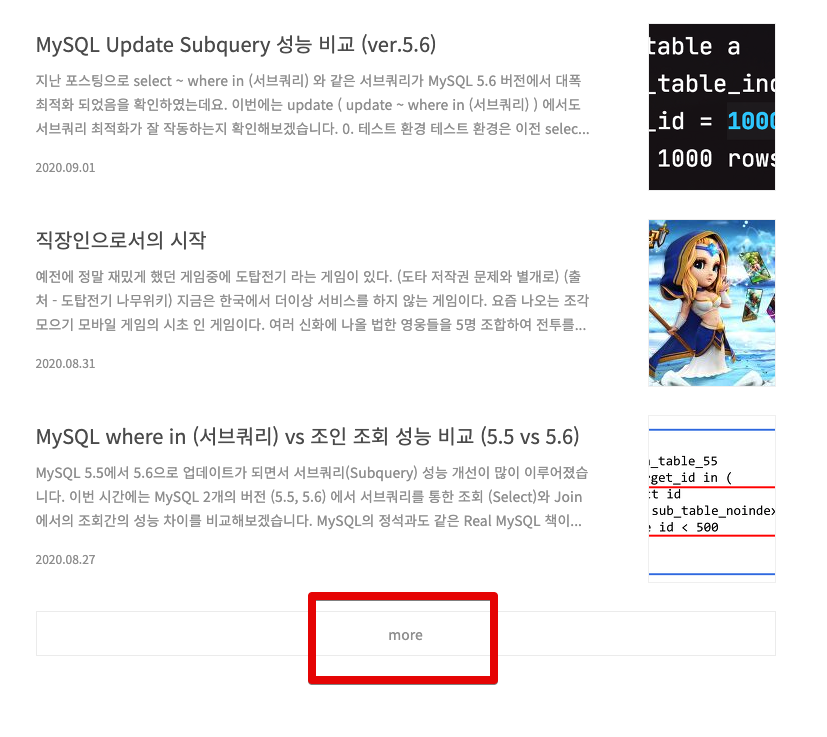
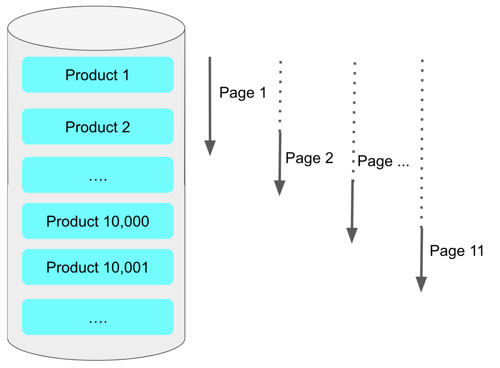

# 페이징 성능 개선하기 (feat. Querydsl)

페이징을 어떻게 구현하느냐에 대해서는 이미 알고 계시다는 가정하에 진행하겠습니다.  

> 이 글은 이전에 사내 기술 블로그에 기고한 [Spring Batch와 Querydsl](https://woowabros.github.io/experience/2020/02/05/springbatch-querydsl.html)와 연결됩니다.

## 1. No Offset 으로 구조 변경하기






## 2. 커버링 인덱스 사용하기

> 커버링 인덱스란 **쿼리를 충족시키는 데 필요한 모든 데이터를 갖고 있는 인덱스**를 이야기합니다.  
> 이에 대한 상세한 내용은 이전에 작성된 포스팅 [커버링 인덱스 시리즈](https://jojoldu.tistory.com/476)를 참고해보시면 좋습니다.

## 3. 불필요한 Count 쿼리 제거하기

```sql
select
    book0_.id as id1_3_,
    book0_.book_no as book_no2_3_,
    book0_.book_type as book_typ3_3_,
    book0_.name as name4_3_ 
from
    book book0_ 
where
    book0_.book_type=? 
order by
    book0_.id desc limit ?, ?
```

불필요한 ```order by``` 와 ```select``` 을 제외해서 count쿼리를 실행해줍니다.

```sql
select
    count(book0_.id) as col_0_0_ 
from
    book book0_ 
where
    book0_.book_type=?
```

### 3-1. 직접 Paging을 구현한 경우

### 3-2. QuerydslSupport의 Paging 사용할 경우


