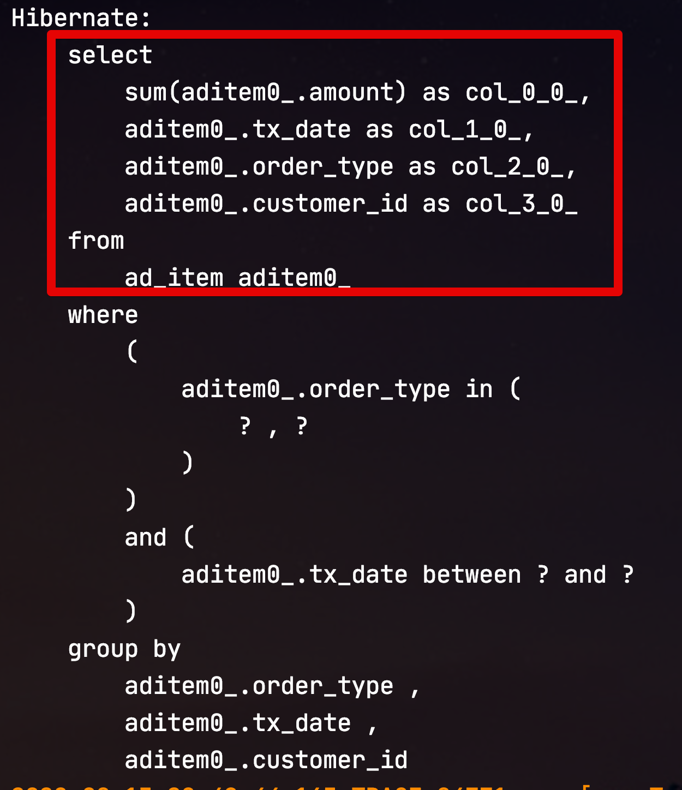
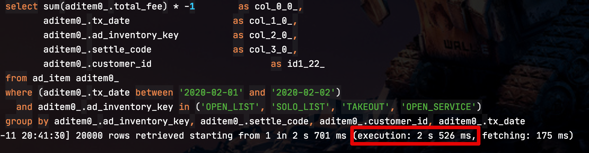
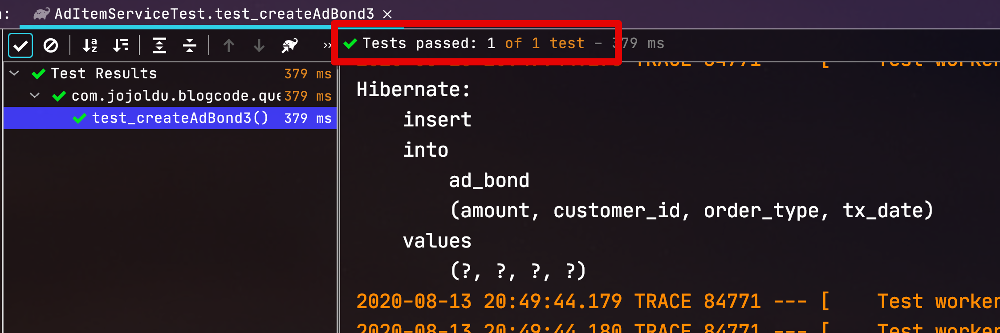

# Querydsl Select 필드로 Entity 사용시 주의 사항

JPA 기반의 애플리케이션 개발에서 복잡한 조회가 필요할때는 Querydsl을 많이 사용합니다.  
Querydsl의 쿼리 한번으로 해결하기 위해 select 필드에 Entity를 그대로 선언하는 경우를 종종 보곤하는데요.  
  
(이를테면 아래와 같은 쿼리일때입니다.)

```java
// customer는 Customer 

queryFactory
.select(Projections.fields(EntityB.class,
        ...
        EntityA.EntityC) // EntityA의 EntityC 를 바로 선언
)
.from(EntityA)
.where(..조건문..)
.fetch()
```

위와 같이 쿼리를 작성하게 되면 EntityA가 갖고 있는 EntityC를 EntityB가 생성하는 시점에 그대로 할당해줄수 있다는 장점이 있습니다.  
  
다만, 이렇게 개발할 경우 몇가지 문제점이 발생합니다.  
어떤 문제점인지, 어떻게 해결해야하는지 등을 이야기해보겠습니다.  

## 1. 문제점

먼저 테스트에 사용할 Entity간의 관계는 아래와 같습니다.


* Customer (1) - AdItem (N) : ManyToOne 단방향
* Customer (1) - AdBond (N) : ManyToOne 단방향
  * AdBond: AdItem을 group by 한 집계 Entity
* Customer (1) - Shop (1) : OneToOne 양방향
  * 이 둘의 관계가 이번 실험과 무슨 관계지? 라고 의문이 드실텐데, 아래 문제점에서 꼭 필요한 관계입니다.

각각의 Entity 클래스들은 아래 코드로 구현되었습니다.  
  

**Customer**

```java
@Entity
@Getter
@NoArgsConstructor
public class Customer {

    @Id
    @GeneratedValue(strategy = GenerationType.IDENTITY)
    private Long id;

    private String customerNo; 
    private String customerName; 
    private String bizNo; 
    private String ceoName;

    @OneToOne(mappedBy = "customer")
    private Shop shop;

    public Customer(Long id) {
        this.id = id;
    }
}
```

**Shop**

```java
@Entity
@Getter
@NoArgsConstructor
public class Shop {

    @Id
    @GeneratedValue(strategy = GenerationType.IDENTITY)
    private Long id;

    private String shopNo;
    private String shopName;

    @OneToOne
    @JoinColumn(name = "customer_id")
    private Customer customer;
}
```

**AdItem**

```java
@NoArgsConstructor
@Getter
@Entity
@Table(indexes = {
        @Index(name = "idx_ad_item_1", columnList = "orderType, txDate")
})
public class AdItem {

    @Id
    @GeneratedValue(strategy = GenerationType.IDENTITY)
    private Long id;

    private String orderType; // 주문유형
    private LocalDate txDate; //거래일자
    private String serviceTxNo; //서비스 거래 번호
    private long amount;

    @ManyToOne(fetch = LAZY)
    @JoinColumn(name = "customer_id", foreignKey = @ForeignKey(name = "fk_ad_item_customer"))
    private Customer customer;
}
```

* customer에 ```(fetch = LAZY)``` 가 선언되었음을 기억해주세요.

**AdBond**

```java
@Getter
@NoArgsConstructor
@Entity
public class AdBond{

    @Id
    @GeneratedValue(strategy = GenerationType.IDENTITY)
    private Long id;

    private long amount;
    private LocalDate txDate;
    private String orderType;

    @ManyToOne(fetch = LAZY)
    @JoinColumn(name = "customer_id", foreignKey = @ForeignKey(name = "fk_ad_bond_customer"))
    private Customer customer;
}
```

그리고 테스트에 사용할 Querydsl 코드는 다음과 같습니다.

```java
@Transactional(readOnly = true)
public List<AdBond> createAdBond(LocalDate startDate, LocalDate endDate, List<String> orderTypes) {
    return queryFactory
            .select(Projections.fields(AdBond.class,
                    adItem.amount.sum().as("amount"),
                    adItem.txDate,
                    adItem.orderType,
                    adItem.customer) // AdBond의 customer 를 바로 지정
            )
            .from(adItem)
            .where(adItem.orderType.in(orderTypes)
                    .and(adItem.txDate.between(startDate, endDate)))
            .groupBy(adItem.orderType, adItem.txDate, adItem.customer)
            .fetch();
}
```

이렇게 조회된 결과를 서비스 메소드에서는 다음과 같이 활용합니다.

```java
@RequiredArgsConstructor
@Service
public class AdItemService {

    private final AdItemQueryRepository queryRepository;
    private final AdBondRepository adBondRepository;
    private final CustomerRepository customerRepository;

    @Transactional
    public void createAdBond1 (LocalDate startDate, LocalDate endDate, List<String> orderTypes) {
        List<AdBond> adBonds = queryRepository.createAdBond(startDate, endDate, orderTypes);
        adBondRepository.saveAll(adBonds);
    }
```

즉, Querydsl로 신규 생성된 AdBond를 테이블에 insert 하는 것이 목적입니다.  
  
자 그럼 이런 상황에서 문제점들을 하나씩 확인해보겠습니다.

### 1-1. 성능 이슈

위 Querydsl 코드를 수행했을때 실행되는 쿼리는 아래와 같습니다.


> group by는 ```adItem.customer```로 선언된 경우 실제 쿼리는 ```aditem_customer_id```로 원하는 형태로 잘 사용된 것을 알 수 있습니다.

위에서 언급한것처럼 이 쿼리는 신규로 저장될 AdBond를 생성하는 것인데요.  
AdBond의 테이블 역시 **customer의 id만 보관** 하는 형태가 될 것임에도, Customer Entity를 **Join 하여 모든 필드 값을 조회**해옵니다.  

> 물론 AdBond 생성 후, Customer Entity를 통한 추가 연산이 있다면 이처럼 한방쿼리를 해야하긴 합니다.  
> 여기선 **추가 연산이 없는 경우**에 한해서입니다. 
  
당연히 Join하여 서브 테이블의 모든 항목을 다 가져왔기 때문에 **단일 테이블로만 조회하는 것에 비해** 성능이 좋을 수가 없습니다.  
  
실제로 약 **3천만건** 정도의 데이터를 넣은뒤 실행해보면?  


**약 14초**의 수행시간이 소요되었습니다.  
일반적인 웹 서비스 하기엔 너무나 느린 시간입니다.  
  
특히 조금만 더 데이터가 쌓이게 되면 **DB 타임아웃**이 발생할 수도 있습니다.  

### 1-2. N+1 문제

2번째 문제로 N+1 문제가 있습니다.  
이 N+1 문제는 OneToMany로 인한 프록시 객체 Lazy Loading을 이야기 하는 것은 아닙니다.  
  
바로 **OneToOne 양방향 관계**일때입니다.  
  
일반적으로 OneToOne 관계에서는 **Lazy Loading이 적용되지 않습니다**.  
OneToOne 관계에서 Lazy Loading으로 변경하려면 아래 조건들을 만족해야하는데요.  

* 부모-자식에서 ```optional = false``` 로 지정되어야 한다.
* 양방향이 아닌 단방향 관계여야한다.
  * **부모가 자식의 key를 가져야 한다**.
* @PrimaryKeyJoin이면 안된다.

특히 여기서 2번은 도메인 설계상 큰 문제가 있습니다.  
  
부모 Entity에서 FK를 가져야 된다는 것은 지속적으로 서비스가 확장하기 위해 **기존 테이블의 변경**이 필요함을 의미합니다.  
자식이 부모의 Key를 가지고 있는 관계에선 신규 추가되는 자식 테이블만 있으면 됩니다.  
하지만 반대로 OneToOne Lazy Loading를 위해 부모의 컬럼을 계속 추가하는 것은 아무래도 큰 약점입니다.  

> 좀 더 자세히 알고 싶으신 분들은 [JPA 도입 — OneToOne 관계에서의 LazyLoading 이슈](https://medium.com/@yongkyu.jang/jpa-%EB%8F%84%EC%9E%85-onetoone-%EA%B4%80%EA%B3%84%EC%97%90%EC%84%9C%EC%9D%98-lazyloading-%EC%9D%B4%EC%8A%88-1-6d19edf5f4d3)을 참고해보세요.

Lazy Loading 문제를 해결하지 못하는 상황에서는 (즉, 지금처럼) Customer Entity를 가져오게 되면 **OneToOne 관계인 Shop도 자동으로 불러지게 됩니다**.  
  
아래 쿼리는 ```adItem``` 쿼리가 실행된 후, 바로 **자동으로 수행되는 쿼리**입니다.
  


Shop Entity가 전혀 필요 없는 상황임에도 Customer Entity를 불러오다보니, Customer의 OneToOne 관계인 Shop역시 추가적으로 불러오는 N+1 쿼리가 수행되게 됩니다.  
  
한방 쿼리의 속도도 느린데, 추가적으로 N+1 쿼리로 대량의 쿼리까지 추가로 발생하는 2가지 문제가 있게 된 것이죠.

## 2. 해결책

자 그럼 위 문제를 해결할 수 있는 방법을 찾아보겠습니다.

### 2-1. ID 로 조회

가장 쉽게 떠올릴 수 있는 해결책은 아래와 같이 Customer Entity가 아닌 **customerId** 만 조회 하는 것입니다.

```java
queryFactory
.select(Projections.fields(AdBondDto.class,
        adItem.amount.sum().as("amount"),
        adItem.txDate,
        adItem.orderType,
        adItem.customer.id.as("customerId")) // Entity 대신 customerId만
)
.from(adItem)
.where(adItem.orderType.in(orderTypes)
        .and(adItem.txDate.between(startDate, endDate)))
.groupBy(adItem.orderType, adItem.txDate, adItem.customer)
.fetch();
}
```

이렇게 되면 실제 수행되는 쿼리는 아래와 같이 **불필요한 Join도, 불필요한 컬럼 조회도 없는** 고성능의 쿼리가 됩니다.



위 쿼리를 동일한 데이터 양에서 수행해보면?



14초 걸리던 쿼리가 **2.5초**로 크게 성능 개선이 되었습니다.  
  
다만, 이렇게 할 경우에도 해결하지 못하는 문제가 있는데요.  
  
신규로 생성할 AdBond Entity에는 **Customer Entity와 어떻게 관계를 맺냐**는 것입니다.  
  
가장 쉬운 방법은 아래와 같이 **Customer Entity를 조회**하는 것입니다.

```java
@Transactional
public void createAdBond2 (LocalDate startDate, LocalDate endDate, List<String> orderTypes) {
    List<AdBondDto> adBondDtos = queryRepository.createAdBondDto(startDate, endDate, orderTypes);
    List<AdBond> adBonds = new ArrayList<>();
    for (AdBondDto dto : adBondDtos) {
        Customer customer = customerRepository.findById(dto.getCustomerId()).get(); // customerId로 Customer Entity 조회 후,
        
        adBonds.add(AdBond.builder()
                .amount(dto.getAmount())
                .txDate(dto.getTxDate())
                .orderType(dto.getOrderType())
                .customer(customer) // AdBond Entity와 관계를 맺음
                .build());
    }

    adBondRepository.saveAll(adBonds);
}
```

하지만 이럴 경우 **모든 AdBond 마다 Customer 조회**가 필요합니다.  
한방 쿼리의 성능을 개선하기 위해 쿼리 조회 회수가 늘어나는 꼴이 됩니다.  

> 물론 기존에 N+1 문제가 발생하여 Shop Entity가 조회되던 쿼리가 삭제됐으니, 실제 쿼리 횟수는 기존과 동일하긴 합니다.

그럼 이 관계도 별도의 조회 없이 맺어보겠습니다.

### 2-2. ID만 담은 Entity 사용

결국 AdBond의 **테이블** 에는 Customer의 Id만 들어가게 되는데요.  
신규 등록하는 AdBond 에서는 **ID만 가진 Customer Entity**와 관계만 맺기만 하면 그 목적을 달성할 수 있습니다.

> 특별히 **cascade가 없다면** AdBond에 넣은 Customer Entity를 통해 Customer 테이블의 값이 Update 되는 일은 없습니다만, 혹시 불안하시다면 테스트 코드로 꼭 한번 검증해보시길 추천드립니다.

즉, 아래와 같이 **별도로 Customer 조회 없이** 바로 ```new Customer(customerId)``` 를 활용합니다.

```java
@Transactional
public void createAdBond3 (LocalDate startDate, LocalDate endDate, List<String> orderTypes) {
    List<AdBondDto> adBondDtos = queryRepository.createAdBondDto(startDate, endDate, orderTypes);
    List<AdBond> adBonds = adBondDtos.stream()
            .map(adBondDto -> AdBond.builder()
                    .amount(adBondDto.getAmount())
                    .txDate(adBondDto.getTxDate())
                    .orderType(adBondDto.getOrderType())
                    .customer(new Customer(adBondDto.getCustomerId())) // customerId만 가진 Customer Entity를 사용
                    .build())
            .collect(Collectors.toList());

    adBondRepository.saveAll(adBonds);
}
```

혹시나 기존 Customer의 다른 필드값들이 null로 채워지진 않을까 걱정된다면 다음과 같이 테스트 코드를 작성해서 검증해봅니다.

```java
@Test
void test_createAdBond3() throws Exception {
    //given
    String expectedNo = "no";
    Customer customer = customerRepository.save(new Customer(expectedNo, "name", "bizNo", "ceo"));
    shopRepository.save(new Shop(expectedNo, "name", customer));
    LocalDate startDate = LocalDate.of(2020,8,11);
    LocalDate endDate = LocalDate.of(2020,8,12);

    String orderType1 = "a";
    String orderType2 = "b";
    adItemRepository.save(new AdItem(orderType1, startDate, "1", 1000L, customer));
    adItemRepository.save(new AdItem(orderType2, endDate, "2", 2000L, customer));

    //when
    adItemService.createAdBond3(startDate, endDate, Arrays.asList(orderType1, orderType2));

    //then
    List<AdBond> adBonds = adBondRepository.findAll();
    AdBond adBond1 = adBonds.get(0);
    AdBond adBond2 = adBonds.get(1);

    assertThat(adBonds).hasSize(2);
    assertThat(adBond1.getCustomer().getCustomerNo()).isEqualTo(expectedNo);
    assertThat(adBond2.getCustomer().getCustomerNo()).isEqualTo(expectedNo);

    assertThat(adBond1.getCustomer().getShop().getShopNo()).isEqualTo(expectedNo);
    assertThat(adBond2.getCustomer().getShop().getShopNo()).isEqualTo(expectedNo);
}
```

Customer와 Shop 모두를 검증해서 확인해보면?



의도한대로 AdBond와 Customer 관계만 맺어지고, 기존 데이터에는 변경이 없음을 확인할 수 있습니다.  
  
이렇게 변경함으로써 서비스 코드도 좀 더 깔끔하게 정리할 수 있는데요.  
**Dto에서 Entity로 한번에 전환** 할 수 있기 때문입니다.  
  
**AdBondDto**

```java
@Getter
@NoArgsConstructor
public class AdBondDto {
    ...

    public AdBond toEntity() {
        return AdBond.builder()
                .amount(amount)
                .txDate(txDate)
                .orderType(orderType)
                .customer(new Customer(customerId))
                .build();
    }
}
```

**Service**

```java
@Transactional
public void createAdBond4 (LocalDate startDate, LocalDate endDate, List<String> orderTypes) {
    List<AdBondDto> adBondDtos = queryRepository.createAdBondDto(startDate, endDate, orderTypes);
    List<AdBond> adBonds = adBondDtos.stream()
            .map(AdBondDto::toEntity) // dto.toEntity로 한번에 해결
            .collect(Collectors.toList());

    adBondRepository.saveAll(adBonds);
}
```

## 마무리

이번 글을 정리하면 다음과 같습니다.

* ```select``` 항목 중 Entity를 선언하게 되면 
  * **불필요한 Join과 불필요한 컬럼 조회**가 발생한다.
  * 해당 Entity와 OneToOne 양방향관계인 Entity가 있으면 **N+1문제**도 추가로 발생한다.
* 이를 해결하기 위해서는
  * Entity를 조회 항목에 넣지 않고 해당 Entity의 Id만 사용한다.
  * 만약 해당 Entity와 관계가 필요하면 Id만 가진 인스턴스를 생성하여 연관관계를 맺게 한다.