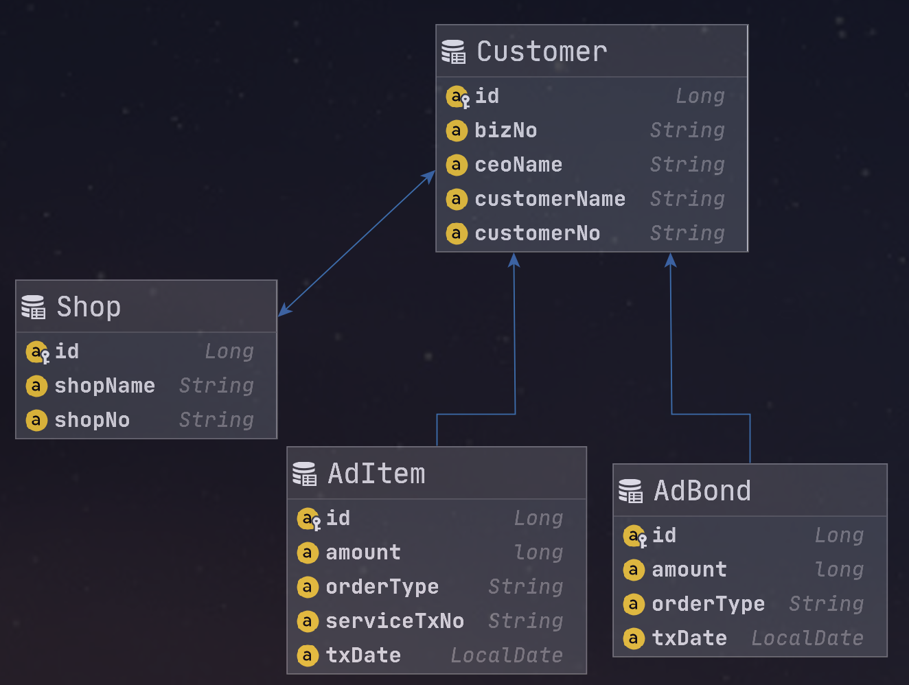
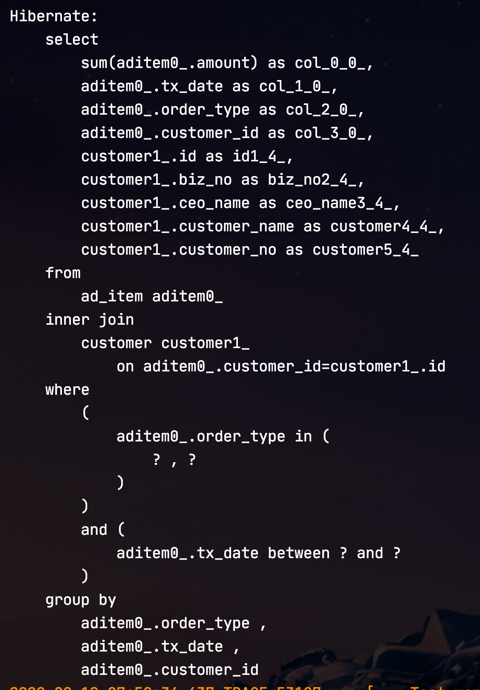
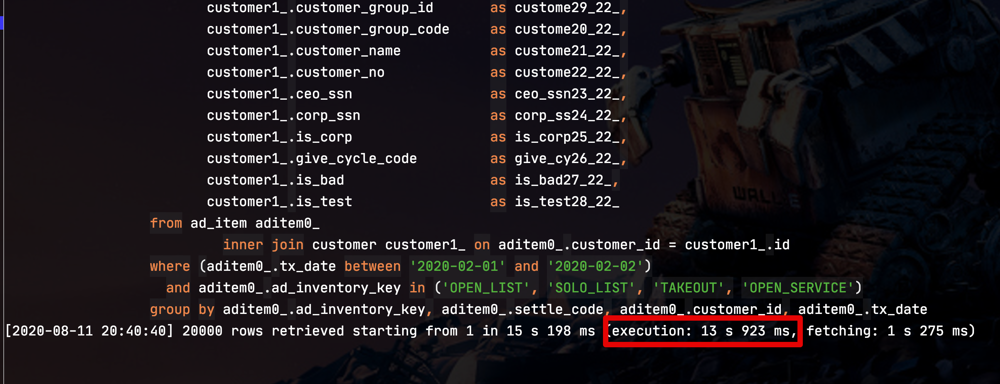
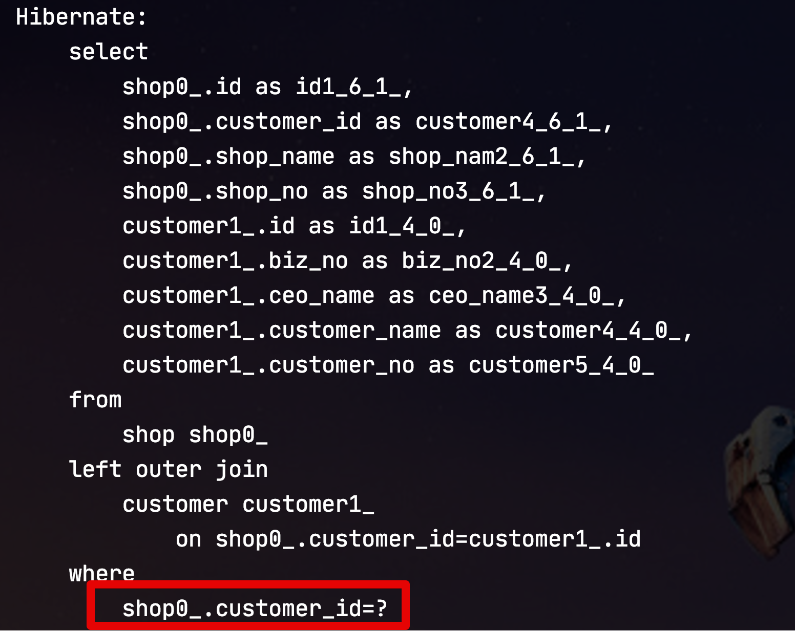

# Querydsl Select 필드로 Entity 사용시 주의 사항

JPA 기반의 애플리케이션에서 개발할때 복잡한 조회에 한해서는 Querydsl을 많이 사용하곤 합니다.  
Querydsl로 개발을 하다보면 쿼리 한번으로 해결하기 위해 select 필드에 Entity를 그대로 선언하는 경우를 종종 보곤하는데요.  
  
이를테면 아래와 같은 쿼리일때입니다.

```java
// customer는 Customer 

queryFactory
.select(Projections.fields(AdBond.class,
        ...
        adItem.customer) // AdBond의 customer entity 를 바로 지정
)
.from(adItem)
.where(..조건문..)
.groupBy(adItem.customer, ... 기타 Group절)
.fetch()
```

위와 같이 쿼리르 작성하게 되면 ```adItem```이 갖고 있는 Customer Entity를 AdBond Entity를 생성하는 시점에 그대로 넣어줄수 있다는 장점이 있습니다만!    
  
이렇게 개발할 경우 몇가지 문제점이 발생합니다.  
어떤 문제점인지, 어떻게 해결해야하는지 등을 이야기해보겠습니다.  


## 1. 문제점

먼저 테스트에 사용할 Entity간의 관계는 아래와 같습니다.



* Customer (1) - AdItem (N) : ManyToOne 단방향
* Customer (1) - AdBond (N) : ManyToOne 단방향
  * AdBond: AdItem을 group by 한 집계 Entity
* Customer (1) - Shop (1) : OneToOne 양방향
  * 이 둘의 관계가 이번 실험과 무슨 관계지? 라고 의문이 드실텐데, 아래 문제점에서 꼭 필요한 관계입니다.

각각의 Entity 클래스들은 아래 코드로 구현되었습니다.  
  

**Customer**

```java
@Entity
@Getter
@NoArgsConstructor
public class Customer {

    @Id
    @GeneratedValue(strategy = GenerationType.IDENTITY)
    private Long id;

    private String customerNo;  //거래처번호(업주번호)
    private String customerName; //거래처명(상호)
    private String bizNo; //사업자번호
    private String ceoName; //대표자명

    @OneToOne(mappedBy = "customer")
    private Shop shop;

    public Customer(Long id) {
        this.id = id;
    }
}
```

**Shop**

```java
@Entity
@Getter
@NoArgsConstructor
public class Shop {

    @Id
    @GeneratedValue(strategy = GenerationType.IDENTITY)
    private Long id;

    private String shopNo;
    private String shopName;

    @OneToOne
    @JoinColumn(name = "customer_id")
    private Customer customer;
}
```

**AdItem**

```java
@NoArgsConstructor
@Getter
@Entity
@Table(indexes = {
        @Index(name = "idx_ad_item_1", columnList = "orderType, txDate")
})
public class AdItem {

    @Id
    @GeneratedValue(strategy = GenerationType.IDENTITY)
    private Long id;

    private String orderType; // 주문유형
    private LocalDate txDate; //거래일자
    private String serviceTxNo; //서비스 거래 번호
    private long amount;

    @ManyToOne(fetch = LAZY)
    @JoinColumn(name = "customer_id", foreignKey = @ForeignKey(name = "fk_ad_item_customer"))
    private Customer customer;
}
```


**AdBond**

```java
@Getter
@NoArgsConstructor
@Entity
public class AdBond{

    @Id
    @GeneratedValue(strategy = GenerationType.IDENTITY)
    private Long id;

    private long amount;
    private LocalDate txDate;
    private String orderType;

    @SuppressWarnings("JpaDataSourceORMInspection")
    @ManyToOne
    @JoinColumn(name = "customer_id", foreignKey = @ForeignKey(name = "fk_ad_bond_customer"))
    private Customer customer;
}
```

그리고 테스트에 사용할 Querydsl 코드는 다음과 같습니다.

```java
@Transactional(readOnly = true)
public List<AdBond> createAdBond(LocalDate startDate, LocalDate endDate, List<String> orderTypes) {
    return queryFactory
            .select(Projections.fields(AdBond.class,
                    adItem.amount.sum().as("amount"),
                    adItem.txDate,
                    adItem.orderType,
                    adItem.customer) // AdBond의 customer 를 바로 지정
            )
            .from(adItem)
            .where(adItem.orderType.in(orderTypes)
                    .and(adItem.txDate.between(startDate, endDate)))
            .groupBy(adItem.orderType, adItem.txDate, adItem.customer)
            .fetch();
}
```

어떤 것들이 문제인지 하나씩 확인해보겠습니다.

### 1-1. 성능 이슈

위 Querydsl 코드를 수행했을때 실행되는 쿼리는 아래와 같습니다.



> group by는 ```adItem.customer```로 선언된 경우 실제 쿼리는 ```aditem_customer_id```로 원하는 형태로 잘 사용된 것을 알 수 있습니다.




### 1-2. N+1 문제

OneToOne 관계에서는 기본적으로 **Lazy Loading이 적용되지 않습니다**.  
OneToOne 관계에서 Lazy Loading으로 변경하려면 아래 조건들을 만족해야하는데요.  

* 부모-자식에서 ```optional = false``` 로 지정되어야 한다.
* 양방향이 아닌 단방향 관계여야한다.
  * **부모가 자식의 key를 가져야 한다**.
* @PrimaryKeyJoin이면 안된다.

특히 여기서 2번은 도메인 설계상 큰 문제가 있는데요.  
부모 Entity에서 FK를 가져야 된다는 것은 지속적으로 서비스가 확장하려면, **기존 테이블의 컬럼 추가**가 필요함을 의미합니다.  
자식이 부모의 Key를 가지고 있는 관계에선 신규 추가되는 자식 테이블만 있으면 되나, OneToOne Lazy Loading를 위해 부모의 컬럼을 계속 추가하는 것은 아무래도 큰 약점입니다.  

> 좀 더 자세히 알고 싶으신 분들은 [JPA 도입 — OneToOne 관계에서의 LazyLoading 이슈](https://medium.com/@yongkyu.jang/jpa-%EB%8F%84%EC%9E%85-onetoone-%EA%B4%80%EA%B3%84%EC%97%90%EC%84%9C%EC%9D%98-lazyloading-%EC%9D%B4%EC%8A%88-1-6d19edf5f4d3)을 참고해보세요.


Customer(parent) - Shop(child) 관계라면 객체 생성시 N+1 쿼리가 발생한다.




## 2. 해결책

### 2-1. ID 로 조회

### 2-2. ID만 담은 Entity 사용

특별히 cascade가 없다면 