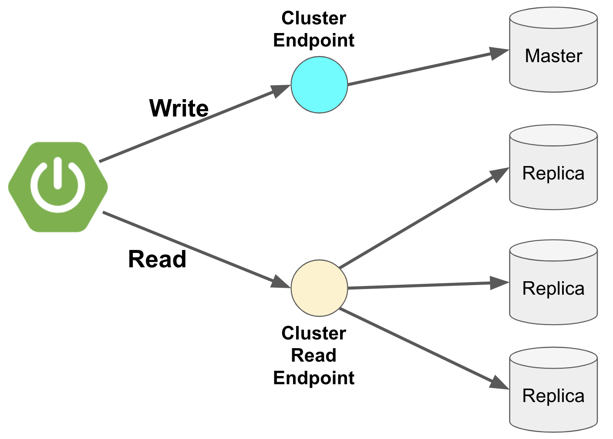
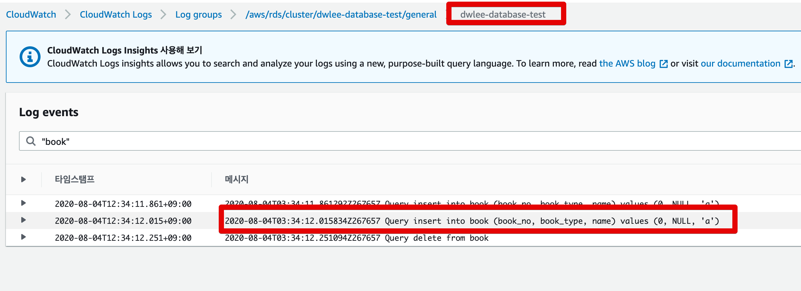
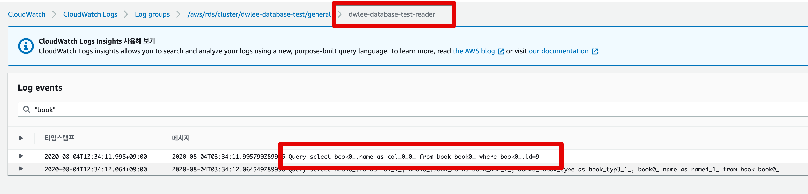
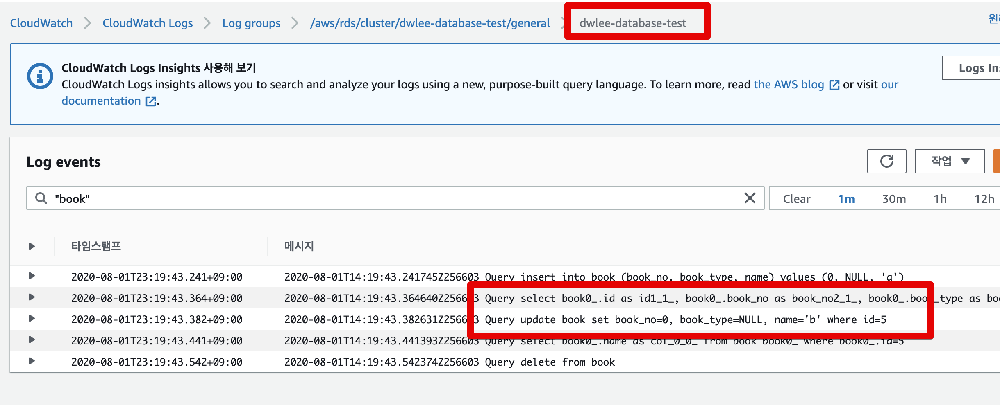
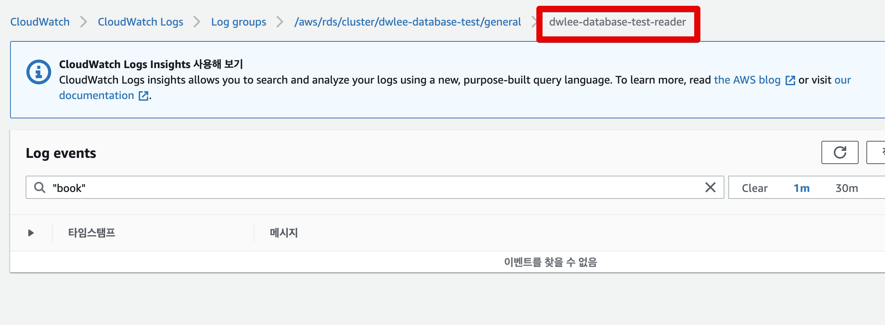

# JPA에서 Reader DB 사용하기



일반적으로는 **서비스의 트랜잭션을 따라가도록 한다**.

아래와 같이 선언하여도 ```@Transactional``` 의 기본 propagation 이 ```REQUIRES``` 라서 
상위 호출자의 트랜잭션을 같이 사용한다.

```java
@RequiredArgsConstructor
@Repository
public class BookQueryRepository {
    private final JPAQueryFactory queryFactory;

    @Transactional(readOnly = true)
    public Book getBookById (Long bookId) {
        return queryFactory
                .select(book)
                .from(book)
                .where(book.id.eq(bookId))
                .fetchOne();
    }
}
```

그래서 아래와 같이 

```java
@RequiredArgsConstructor
@Repository
public class BookQueryRepository {
    private final JPAQueryFactory queryFactory;

    @Transactional(readOnly = true, propagation = Propagation.REQUIRES_NEW)
    public Book getBookById (Long bookId) {
        return queryFactory
                .select(book)
                .from(book)
                .where(book.id.eq(bookId))
                .fetchOne();
    }
}
```











## 정리

정리하면 다음과 같다.

* 일반적으로는 Service 혹은 Repository에 ```@Transactional(readOnly = true)``` 를 걸어주면 쿼리는 Reader DB로 호출된다.
* 다만 Repository에 ```@Transactional(readOnly = true)```가 있어도 상위 호출자인 Service에서 ```@Transactional``` 로 되어있다면 MasterDB를 호출한다.
    * 이는 ```@Transactional``` 의 기본 propagation 이 ```REQUIRES``` 이기 때문이다.
    * Repository의 propagation 을 ```REQUIRES_NEW``` 으로 지정하면 ReadOnly 트랜잭션이 신규 생성되어 ReaderDB로 호출이 전달된다.
    * 단, 이럴 경우 DirtyChecking이 안되기 때문에 DirtyChecking이 필요할 경우 적용하지 않는다.  