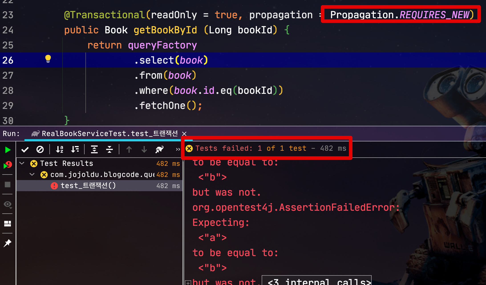

# JPA에서 Reader DB 사용하기 (feat. AWS Aurora)

[이전 시간](https://jojoldu.tistory.com/506) 에 AWS Aurora 환경에서 Spring Batch ItemReader가  Reader DB를 사용 하는 것에 대해서 소개 드렸는데요.  
  
이번엔 일반적인 JPA 기반의 웹 애플리케이션에서 Reader DB는 어떻게 사용할지에 대해서 소개드리겠습니다.  
  
AWS Aurora 기반의 환경이라고 하면 아래와 같은 환경을 이야기 합니다.


일반적으로 DB의 확장이라고 하면 Write 요청은 Master로만 발생시키고, 나머지 Replica 되고 있는 DB들은 조회용 (ReaderDB) 으로 사용하는 구조인데요.  
  
그렇다면 조회 요청에 한해서 어떻게 ReaderDB로 보낼지, JPA에서 문제는 없는지 알아보겠습니다.  
  
## 1. 일반적인 사용법

이미 아시겠지만, ```@Transactional(readOnly=true)``` 가 선언되어있다면 **자동으로 ReaderDB로 요청**이 전달됩니다.  
  
> 만약 정상적으로 ReaderDB 호출이 안된다면 jdbc-url에 클러스터 엔드 포인트와 리더 엔트포이트를 둘다 등록하시면 됩니다.  
> ex: ```jdbc-url: jdbc:mysql:aurora://클러스터엔드포인트:포트,리더엔드포인트:포트```   


즉, 아래와 같이 사용하시면 ReaderDB로 요청이 전달되는 것이죠.

```java
@Transactional(readOnly=true)
public Book void get (Long bookId) {
    return bookQueryRepository.getBookById(bookId);
}
```

혹은 **트랜잭션이 없는 서비스에서** 호출한다면 Repository에 ```@Transactional(readOnly=true)``` 를 선언해서 사용해도 됩니다.

```java
@Transactional(readOnly = true)
public Book getBookById (Long bookId) {
    return queryFactory
            .select(book)
            .from(book)
            .where(book.id.eq(bookId))
            .fetchOne();
}
```

## 2. 상위 호출자가 readOnly가 아닌 경우

예를 들어 Service에 선언된 트랜잭션이 readOnly가 아닌 경우 (```@Transactional```) 는 어떻게 작동할까요?  
  
아래 예제 코드로 한번 테스트 해보겠습니다.

**Service**

```java
@Transactional
public void update (Long bookId, String bookName) {
    Book book = bookQueryRepository.getBookById(bookId);
    book.changeName(bookName);
}
```

**Repository**

```java
@Transactional(readOnly = true)
public Book getBookById (Long bookId) {
    return queryFactory
            .select(book)
            .from(book)
            .where(book.id.eq(bookId))
            .fetchOne();
}
```

* Service는 ```@Transactional```
* Repository는 ```@Transactional(readOnly = true)```

트랜잭션 전파 (propagation)에 대해서 공부를 해보신분들은 바로 아시겠지만, 위 코드는 실제로 **모든 쿼리가 Master DB**로 요청이 전달됩니다.  
  
**Master Log**


**Reader Log**


로그를 보시면 Repository 요청 역시 Master로 전달된 것을 알 수 있습니다.  
  
이는 Repository에 ```readOnly``` 트랜잭션이 선언되어있어도, 기본 전파 (propagation) 전략이 **REQUIRES** 라서 그렇습니다.  
  
> REQUIRES 전파레벨: 미리 시작된 트랜잭션이 있으면 참여하고 없으면 새로 시작합니다.  
> 하나의 트랜잭션이 시작된 후에 다른 트랜잭션 경계가 설정된 메소드를 호출하면 자연스럽게 같은 트랜잭션으로 묶이게 됩니다.
> 즉, 상위 호출자의 트랜잭션에 포함되는 형태

일반적으로 ```@Transactional``` 가 선언되었다는 것은 **Entity 변경**이 필요한 경우 입니다.  
[JPA의 더티체킹](https://jojoldu.tistory.com/415) 을 위해서 Reader DB가 아닌 Master DB에서 데이터를 가져와서 반영하는게 맞는 경우이죠.  

헌데, 만약에 아래와 같이 **조회 데이터와 Update가 필요한 Entity**가 다른 경우에도 굳이 MasterDB에서 가져와야할까요?  

예를 든다면 아래와 같은 코드입니다.

```java
@Transactional
public void backup (Long bookId) {
    String name = bookQueryRepository.getBookNameById(bookId); // (1)
    Book newBook = Book.create(name); // (2)
    bookRepository.save(newBook);
}
```

(1) ```bookQueryRepository.getBookNameById(bookId);```

* 필요한 name값만 가져옵니다.

(2) ```Book.create(name);```

* 새로운 Book Entity를 생성해서 등록합니다.

이런 경우엔 ```bookQueryRepository.getBookNameById(bookId);``` 코드는 ReaderDB에서 가져와서 ```bookRepository.save(newBook);``` 만 MasterDB에서 실행되면 됩니다.  
  
위와 같은 상황이 필요하다면 이땐 **Repository의 전파 레벨 변경**이 필요 합니다.  
기본값인 ```REQUIRES``` 에서 ```REQUIRES_NEW``` 로 변경하여 **조회에선 readOnly 트랜잭션**을 새롭게 생성하여 처리하도록 합니다.

```java
@Transactional(readOnly = true, propagation = Propagation.REQUIRES_NEW)
public String getBookNameById (Long bookId) {
    return queryFactory
            .select(book.name)
            .from(book)
            .where(book.id.eq(bookId))
            .fetchOne();
}
```

위 코드로 변경 후 다시 쿼리 로그를 확인해보면?  
  

**Master Log**


**Reader Log**


정상적으로 쿼리가 나눠져서 처리 되는 것을 확인할 수 있습니다.

> 단, 이럴 경우 매 요청마다 트랜잭션과 커넥션이 더 많이 생성되니 성능 테스트가 필요합니다.  

## 3. ReaderDB에서의 DirtyChecking

바로 위에서 진행된 것 처럼 ReaderDB에서 가져온 Entity에서 더티체킹이 발생하면 어떻게 될까요?  
  
아래처럼 더티체킹이 필요한 서비스 코드에서 ReaderDB에서 Entity를 가져와서 테스트해보겠습니다.

**Service**

```java
@Transactional
public void update (Long bookId, String bookName) {
    Book book = bookQueryRepository.getBookById(bookId);
    book.changeName(bookName);
}
```

**Repository**

```java
@Transactional(readOnly = true, propagation = Propagation.REQUIRES_NEW)
public Book getBookById (Long bookId) {
    return queryFactory
            .select(book)
            .from(book)
            .where(book.id.eq(bookId))
            .fetchOne();
}
```

테스트를 해보면?  



더티체킹이 발생하지 않아 테스트가 실패합니다.  
  
실제 쿼리 로그에서도 **Update쿼리가 실행되지 않았습니다**.

**Master Log**


**Reader Log**


즉, Reader에서 가져온 Entity는 결국 트랜잭션이 끝나는 시점에 반영되는 DB가 ReaderDB이기 때문에 더티체킹이 발생하지 않는 것을 확인할 수 있습니다.


## 정리

위 테스트를 정리하면 다음과 같습니다.

* 일반적으로는 Service 혹은 Repository에 ```@Transactional(readOnly = true)``` 를 걸어주면 쿼리는 Reader DB로 호출된다.
* 다만 Repository에 ```@Transactional(readOnly = true)```가 있어도 상위 호출자인 Service에서 ```@Transactional``` 로 되어있다면 MasterDB를 호출한다.
    * 이는 ```@Transactional``` 의 기본 propagation 이 ```REQUIRES``` 이기 때문이다.
* Repository의 propagation 을 ```REQUIRES_NEW``` 으로 지정하면 ReadOnly 트랜잭션이 신규 생성되어 ReaderDB로 호출이 전달된다.
    * 단, 이럴 경우 DirtyChecking이 안되기 때문에 DirtyChecking이 필요한 Entity 조회시에는 Service의 트랜잭션을 사용한다.