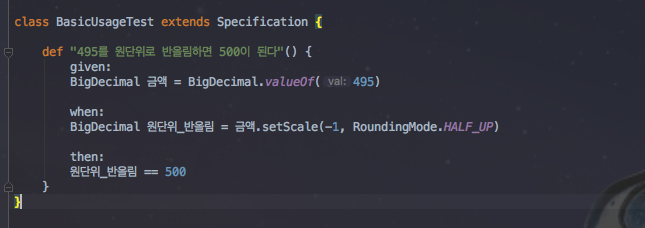
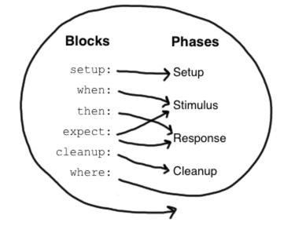

# spring-boot-spock

안녕하세요? 이번 시간엔 spring-boot-spock 예제를 진행해보려고 합니다.  
모든 코드는 [Github](https://github.com/jojoldu/blog-code/tree/master/spring-boot-spock)에 있기 때문에 함께 보시면 더 이해하기 쉬우실 것 같습니다.  
(공부한 내용을 정리하는 [Github](https://github.com/jojoldu/blog-code)와 세미나+책 후기를 정리하는 [Github](https://github.com/jojoldu/review), 이 모든 내용을 담고 있는 [블로그](http://jojoldu.tistory.com/)가 있습니다. )<br/>
 

## 소개

> BDD는 한 TDD 실천자가 테스트의 의도를 더 명확하게 표현하기 위한 용어를 찾는 과정에서 탄생하였다.  
사실 테스트라는 단어는 **원하는 동작을 정의한다는 정신을 잘 반영하지 못하며 의미가 너무 함축적**이다.  
개발자 커뮤니티에서는 테스트와 테스트메소드보다는 **명세와 행위**라는 용어를 거론하기 시작했다.  
더 적합한 용어를 찾는 노력의 부산물로, BDD 커뮤니티는 JUnit 등 기존 테스트 프레임워크의 대안도 다수 만들어낼 수 있었다.
(Effective Unit Testing p.240)

Spock을 소개하기전에 꼭 읽어보셨으면 해서 책의 한 구절을 소개드렸습니다.  
Spock은 BDD 프레임워크입니다.  
TDD프레임워크인 JUnit과 비슷한 점이 많으나, **기대하는 동작과 테스트의 의도를 더 명확하게 드러내주고 산만한 코드는 뒤로 숨겨주는 등**의 큰 장점이 있습니다.

## 기본 사용법

### 기존 JUnit 테스트 코드

### 기본 사용법



groovy 언어로 작성하기 때문에 **테스트 메소드 이름을 문자열로** 작성할 수 있게 되었습니다.  
한글 메소드명은 Java에서도 되지 않냐고 반문하실수 있으실텐데요.  
groovy는 문자열이 허용되기 때문에 띄어쓰기, 가장앞에 특수문자 사용하기 등의 **메소드 네이밍 제약에서 전부 벗어날 수 있습니다**.  
  

 ```given:```, ```when:```, ```then:```등과 같은 메소드를 Spock에선 **feature** 메소드라고 합니다.  
이 3개외에 추가로 3개가 더 있어 총 6단계의 라이프사이클을 가지고 있습니다.  



(출처: [spock 공식 문서](http://spockframework.org/spock/docs/1.0/spock_primer.html))

1. ```given``` (혹은 ```setup```) : 
2. ```when``` : 테스트 대상 코드를 
3. ```then``` :
4. ```expect``` :
5. ```cleanup``` :
6. ```where``` : feature 메소드를 파라미터로 삼아 실행시킵니다.

### Spock으로 전환한 테스트 코드


## SpringBoot + Spock

### 기본적인 사용법

### SpringBatch

### @MockBean, @SpyBean

## 출처

* [Naver D2 - Spock으로 테스트하기](http://d2.naver.com/helloworld/568425)
* [spockframework.org](http://spockframework.org/spock/docs/1.0/spock_primer.html)