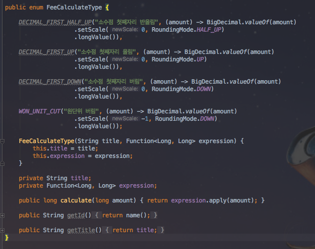
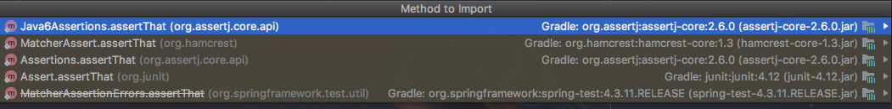
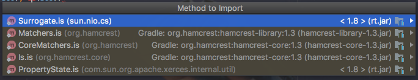
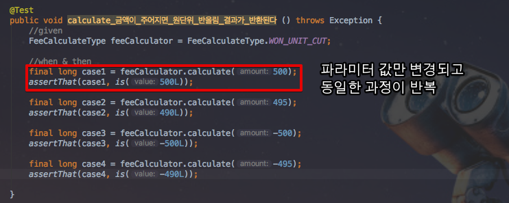
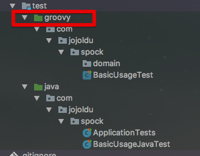
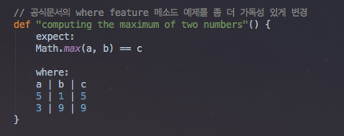
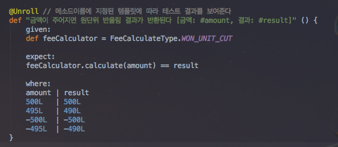
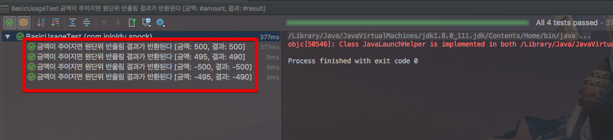
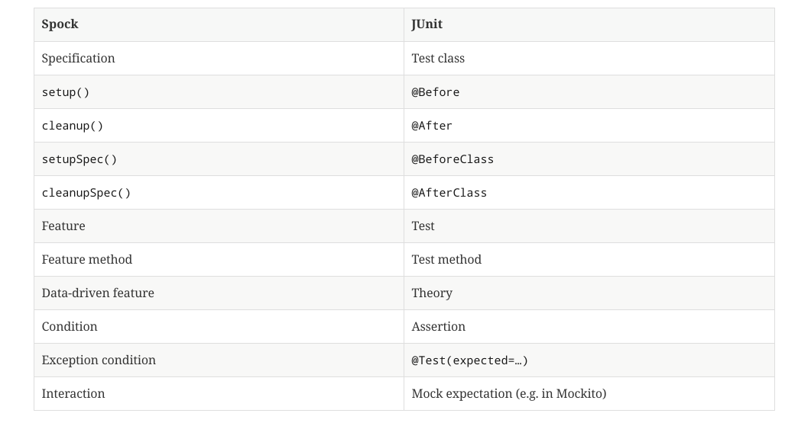

# spring-boot-spock

안녕하세요? 이번 시간엔 spring-boot-spock 예제를 진행해보려고 합니다.  
모든 코드는 [Github](https://github.com/jojoldu/blog-code/tree/master/spring-boot-spock)에 있기 때문에 함께 보시면 더 이해하기 쉬우실 것 같습니다.  
(공부한 내용을 정리하는 [Github](https://github.com/jojoldu/blog-code)와 세미나+책 후기를 정리하는 [Github](https://github.com/jojoldu/review), 이 모든 내용을 담고 있는 [블로그](http://jojoldu.tistory.com/)가 있습니다. )<br/>
 

## 소개

> BDD는 한 TDD 실천자가 테스트의 의도를 더 명확하게 표현하기 위한 용어를 찾는 과정에서 탄생하였다.  
사실 테스트라는 단어는 **원하는 동작을 정의한다는 정신을 잘 반영하지 못하며 의미가 너무 함축적**이다.  
개발자 커뮤니티에서는 테스트와 테스트메소드보다는 **명세와 행위**라는 용어를 거론하기 시작했다.  
더 적합한 용어를 찾는 노력의 부산물로, BDD 커뮤니티는 JUnit 등 기존 테스트 프레임워크의 대안도 다수 만들어낼 수 있었다.
(Effective Unit Testing p.240)

Spock을 소개하기전에 꼭 읽어보셨으면 해서 책의 한 구절을 소개드렸습니다.  
Spock은 BDD 프레임워크입니다.  
TDD프레임워크인 JUnit과 비슷한 점이 많으나, **기대하는 동작과 테스트의 의도를 더 명확하게 드러내주고 산만한 코드는 뒤로 숨겨주는 등**의 큰 장점이 있습니다.

## 본문

### 기존 JUnit 테스트 코드

소수점 자리에 맞춰 반올림/올림/버림 하는 ```Enum```을 생성하여 테스트를 진행해보겠습니다.  



위 ```Enum``` 타입이 계산을 올바르게 하는지 검증하기 위한 테스트 코드를 작성합니다.  
테스트 코드를 작성하다보면 몇가지 문제점을 만나게 됩니다.



1. 이 중 어느 ```assertThat```을 써야할까요?



2. ```is```는 어떤걸 써야할까요?
 


3. 파라미터만 변경되고 동일한 과정이 반복되는데 과정 자체를 재사용할순 없을까요?

### Spock 설치

Spock을 사용하기 위해선 의존성 도구(Maven, Gradle)에 2개의 의존성 추가가 필요합니다.

```
testCompile('org.spockframework:spock-core:1.1-groovy-2.4') // Spock 의존성 추가
testCompile('org.spockframework:spock-spring:1.1-groovy-2.4') // Spock 의존성 추가
``` 

추가로 저처럼 groovy 테스트 디렉토리를 생성하고 싶으시면 build.gradle에 groovy 플러그인 추가가 필요합니다.



```groovy

apply plugin: 'groovy' // groovy 지원

```

위와 같이 설정하면 Spock을 사용할 수 있는 환경설정은 끝입니다.  
  
이제 기본적인 사용법을 소개드리겠습니다.

### 기본 사용법


* ```Specification```: ```extends``` 하면 ```Spock Test``` 클래스가 됩니다.  
* ```def``` : groovy의 동적 타입 선언(메소드, 변수에 모두 사용할 수 있음. JS의 ```var``` 같은 존재)
* ```given```, ```when```, ```then``` : Spock의 feature 메소드

groovy 언어로 작성하기 때문에 **테스트 메소드 이름을 문자열로** 작성할 수 있게 되었습니다.  
Java에서도 한글 메소드명이 가능하긴 했지만 띄어쓰기, 가장 앞에 특수문자 사용하기 등의 제약조건이 있는 반면 groovy는 이 모든 제약 조건에서 빠져나올수 있습니다.  
  

 ```given:```, ```when:```, ```then:```등과 같은 메소드를 Spock에선 **feature** 메소드라고 합니다.  
이 3개외에 추가로 3개가 더 있어 총 6단계의 라이프사이클을 가지고 있습니다.  


(출처: [spock 공식 문서](http://spockframework.org/spock/docs/1.0/spock_primer.html))

1. ```given``` (혹은 ```setup```) : 테스트 하기 위한 기본 설정작업 (테스트 환경 구축)
2. ```when``` : 테스트할 대상 코드를 실행 (Stimulus)
3. ```then``` : 테스트할 대상 코드의 결과를 검증 
4. ```expect``` : 테스트할 대상 코드를 실행 및 검증
5. ```cleanup``` : ```@After```와 마찬가지로 사용한 모든 자원들을 반환
6. ```where``` : feature 메소드를 파라미터로 삼아 실행시킵니다.

다른 메소드들은 많이들 들어보셨을텐데, ```where```에 대해서는 생소하실것 같습니다.  
 ```where``` 블록에 대해선 [공식 문서 - Where Blocks](http://spockframework.org/spock/docs/1.0/spock_primer.html) 에 있는 예시가 정말 좋습니다.



위 코드는 ```Math.max(a, b) == c``` 테스트 코드의 a,b,c에 각각 ```5```, ```1```, ```5```와 ```3```, ```9```, ```9```를 입력하여 실행하게 됩니다.  
즉, ```where```는 **feature 메소드를 파라미터화하여 실행**합니다.  


### Spock으로 전환한 테스트 코드






### Spock과 JUnit 비교


Spock이 조금 생소한 용어를 사용하고 있지만, JUnit과 크게 다르지 않은 사용법을 제공하고 있습니다.  
아래는 Spock과 JUnit의 대치되는 예약어를 비교한 것입니다.



(출처: [공식문서](http://spockframework.org/spock/docs/1.0/spock_primer.html))

## SpringBoot + Spock

### 기본 사용법

### SpringBatch

### @MockBean, @SpyBean

## 출처

* [Naver D2 - Spock으로 테스트하기](http://d2.naver.com/helloworld/568425)
* [spockframework.org](http://spockframework.org/spock/docs/1.0/spock_primer.html)