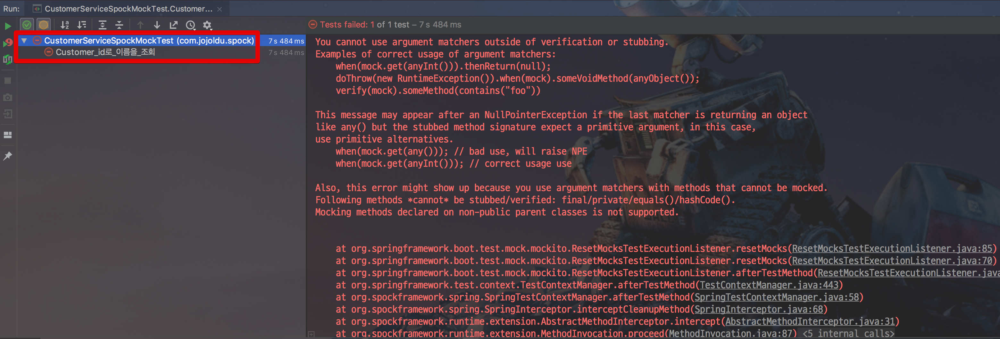
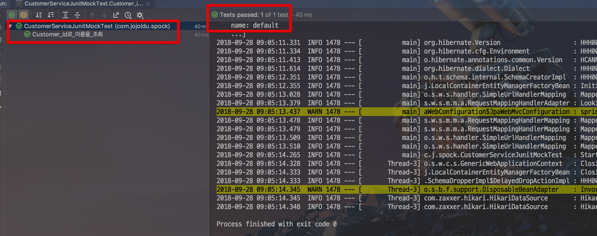
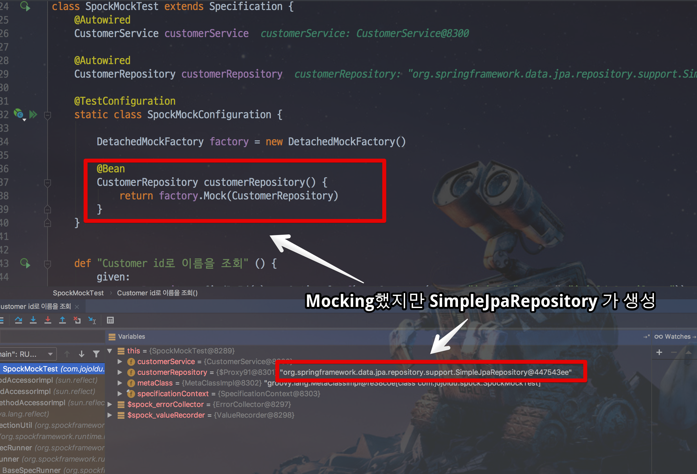

# SpringBoot & Spock Mock 처리

## 문제점

Spring Boot의 ```@MockBean```, ```@SpyBean```은 Junit & Mockito를 지원합니다.  
그러다보니 Spock을 쓴다 해도 Spring의 Bean을 Mocking하려면 Mocking은 Mockito 방식을 사용해야 합니다.

```groovy
example)

@SpringBootTest
class CustomerServiceSpockMockTest extends Specification {

    @Autowired
    CustomerService customerService

    @MockBean(name = "jdbcTemplate")
    JdbcTemplate jdbcTemplate

    def "Customer_id로_이름을_조회"() {
        given:
        given(jdbcTemplate.query(anyString(), any(BeanPropertyRowMapper.class)))
                .willReturn(Arrays.asList("jojoldu"))
        when:
        List<String> queryResult = customerService.execute("sql")

        then:
        queryResult.get(0) == "jojoldu"
    }
}
```

하지만 이럴 경우 **Overloading Method를 Mocking 해야할 경우 문제**가 발생합니다.  



동적 언어인 Groovy 특성상 **어떤 메소드를 Mocking 해야할지 선택하지 못해** Mocking 실패로 테스트가 실패해버립니다.  
같은 코드를 Junit 기반으로 변경해서 돌려보면

```java
@RunWith(SpringRunner.class)
@SpringBootTest
public class CustomerServiceJunitMockTest {

    @Autowired
    CustomerService customerService;

    @MockBean(name = "jdbcTemplate")
    JdbcTemplate jdbcTemplate;

    @Test
    public void Customer_id로_이름을_조회 () {
        //given:
        given(jdbcTemplate.query(anyString(), any(BeanPropertyRowMapper.class)))
                .willReturn(Arrays.asList("jojoldu"));

//        when:
        List<String> queryResult = customerService.execute("sql");

//        then:
        assertThat(queryResult.get(0), is("jojoldu"));
    }
}
```

성공하는 것을 확인할 수 있습니다.



이 문제점을 해결하기 위해 찾아보던중 []Spock의 Spring 모듈](http://spockframework.org/spock/docs/1.1/module_spring.html)을 발견하였습니다.

## Spock Spring Mock으로 해결

Spock이 지원하는 Spring Mock으로 위에서 발생한 문제를 해결할 수 있습니다.

```groovy
@SpringBootTest
class CustomerServiceSpockMockFactoryTest extends Specification {

    @Autowired
    CustomerService customerService

    @Autowired
    JdbcTemplate jdbcTemplate

    @TestConfiguration
    static class SpockMockConfiguration {

        def factory = new DetachedMockFactory()

        @Bean
        JdbcTemplate jdbcTemplate() {
            return factory.Mock(JdbcTemplate)
        }
    }

    def "Customer id로 이름을 조회" () {
        given:
        jdbcTemplate.query(_, _) >> Arrays.asList("jojoldu")

        when:
        List<String> queryResult = customerService.execute("sql")

        then:
        queryResult.get(0) == "jojoldu"
    }
}
```
## Spock Spring Mock의 문제점

Spring-data-jpa에서 제공하는 JpaRespotiroy 인터페이스는 Mocking 하지 못합니다.  
JPA가 cglib 프록시를 생성하면서 Spock이 Mock으로 생성한 프록시를 무시하기 때문입니다.  



Mocking이 되지 않고, Jpa가 구현체를 생성해버리니 테스트가 항상 실패합니다.

## Spock Spring Mock의 문제 해결

이 문제를 아직까지는 해결하지 못했습니다.    
임시방편으로 진행하고 있는 것이,  
  
JpaRepository 인터페이스 Mocking이 필요할 경우 Junit 혹은 Spock & Mockito로 Mocking하며 
그 외 나머지 컨크리트 클래스나 메소드 Mocking이 필요할 경우 
Spock의 Mock을 사용하려고 합니다.  
  
혹시나 더 좋은 방법이 있으신분들은 댓글 꼭 부탁드리겠습니다.  
감사합니다 :)
