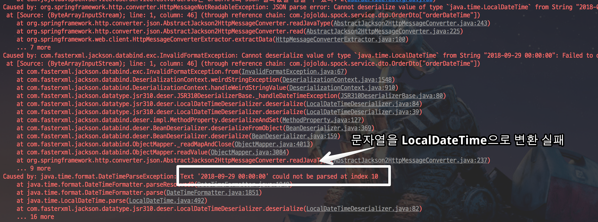
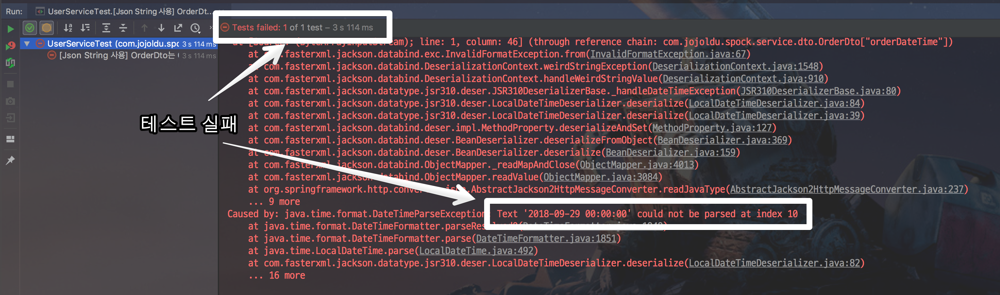
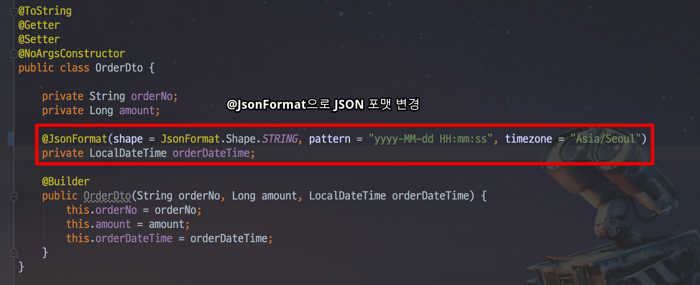
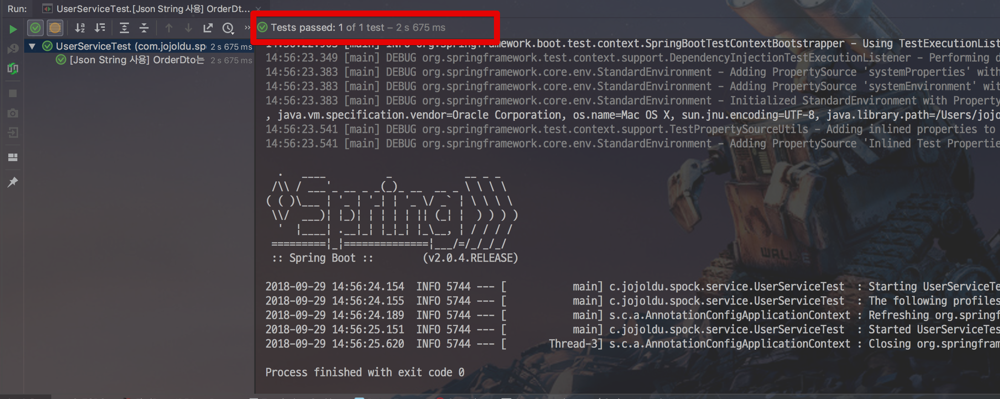

# Spring Boot @RestClientTest 사용하기

안녕하세요? 이번 시간엔 Spring Boot의 ```@RestClientTest``` 예제를 진행해보려고 합니다.  
모든 코드는 [Github](https://github.com/jojoldu/blog-code/tree/master/spring-boot-spock)에 있기 때문에 함께 보시면 더 이해하기 쉬우실 것 같습니다.  

## 1. 문제 상황

예를 들어 외부 API를 통해 데이터를 가져와야 하는 경우가 있다고 가정해보겠습니다.  
예제로 사용할 Service 코드는 다음과 같습니다.

```java
@Slf4j
@Service
public class UserService {

    private final RestTemplate restTemplate;

    @Value("${order.api.url}")
    private String orderApiUrl;

    public UserService(RestTemplateBuilder restTemplateBuilder) {
        this.restTemplate = restTemplateBuilder.build();
    }

    public OrderDto getUserOrder(String orderNo) {
        UriComponentsBuilder builder = UriComponentsBuilder.fromHttpUrl(orderApiUrl)
                .queryParam("orderNo", orderNo);

        HttpHeaders httpHeaders = new HttpHeaders();
        httpHeaders.set(HttpHeaders.ACCEPT, MediaType.APPLICATION_JSON_VALUE);
        httpHeaders.set(HttpHeaders.CONTENT_TYPE, MediaType.APPLICATION_JSON_VALUE);

        HttpEntity<?> httpEntity = new HttpEntity<>(httpHeaders);
        return restTemplate.exchange(builder.toUriString(), HttpMethod.GET, httpEntity, OrderDto.class).getBody();
    }
}
```
코드는 간단합니다.  
orderApiUrl로 API 요청을 하면 그 결과로 넘어오는 Json을 OrderDto로 변환되서 받도록 한 것입니다.  
그리고 결과를 받을 OrderDto 클래스는 아래와 같습니다.

```java

@ToString
@Getter
@Setter
@NoArgsConstructor
public class OrderDto {

    private String orderNo;
    private Long amount;
    private LocalDateTime orderDateTime; //문제 요소

    @Builder
    public OrderDto(String orderNo, Long amount, LocalDateTime orderDateTime) {
        this.orderNo = orderNo;
        this.amount = amount;
        this.orderDateTime = orderDateTime;
    }
}
```

자 이 상황에서 테스트 코드를 작성한다면 어떻게 할까요?  
보통 이런 외부 자원을 사용하는 메소드를 테스트 코드로 작성할때 많은 분들이 **외부 자원 사용 코드를 Mocking** 합니다.  
위 코드 같은 경우에선 ```restTemplate``` 을 사용하는 부분을 Mocking 해서 **결과가 정상적으로 넘어올거라는 가정하에** 모든 테스트를 작성합니다.  
그렇지만 이런 테스트 방식에는 큰 문제가 있습니다.  
저 코드를 실제로 서버에 배포한 뒤 테스트 해보면 다음과 같은 에러가 발생합니다.



이유는 orderApi에서 넘겨준 Json 결과는 ```yyyy-MM-dd HH:mm:ss```로 넘어오는데, LocalDateTime의 기본 포맷은 ```yyyy-MM-ddTHH:mm:ss``` 이기 때문입니다.  

> 포맷 중간에 ```T```가 차이입니다  

즉, Dto 클래스와 API의 Json 결과 포맷에 문제가 있는 상황이였습니다.  
하지만 **RestTemplate을 Mocking 하면 이런 이슈를 확인할 수 없습니다**.  
배포해야만 확인할 수 있어 큰 문제가 될 수 있습니다.  
  
어떻게 하면 이런 문제를 테스트 코드로 검증할 수 있을까요?
 
## 2. 해결책

이 문제를 해결할 수 있는 방법은 **원하는 형태로 Json 결과를 반환해줄 수 있는 Mock 서버를 사용**하는 것입니다.  
Spring Boot에서는 이미 이런 테스트 방식을 지원하고 있습니다.  

* [@RestClientTest](https://docs.spring.io/spring-boot/docs/current/reference/html/boot-features-testing.html#boot-features-testing-spring-boot-applications-testing-autoconfigured-rest-client)

 ```@RestClientTest```는 요청 받는 쪽을 위한 테스트가 아닌, **요청 하는 쪽 입장에서의 테스트**라고 보시면 됩니다.  
특히나 좋은 점은 ```@RestClientTest```를 사용하면 ```MockRestServiceServer```라는 임시 서버를 Bean으로 생성해주기 때문에 
**원하는 형태의 요청이 오면 지정된 값으로 응답을 줄 수 있습니다**.  
  
자 그럼 실제로 테스트 코드를 작성해보겠습니다.  

> 테스트 코드는 Spock 기반으로 작성됩니다.  
Junit과 크게 문법적으로 차이가 없어 보시는데 무리는 없을것 같습니다.

```groovy
import org.springframework.test.web.client.MockRestServiceServer

import static org.springframework.test.web.client.match.MockRestRequestMatchers.requestTo
import static org.springframework.test.web.client.response.MockRestResponseCreators.withSuccess

@RestClientTest(value=[UserService.class])
class UserServiceTest extends Specification {

    @Autowired
    private UserService userService

    @Autowired
    private MockRestServiceServer mockServer

    private String orderApiUrl = "http://localhost:8090/order?orderNo="

    def "[Json String 사용] OrderDto는 OrderAPI의 Json 결과값을 담을 수 있다."() {
        given:
        String expectOrderNo = "1"
        Long expectAmount = 1000L
        LocalDateTime expectOrderDateTime = LocalDateTime.of(2018,9,29,0,0)

        String expectResult = "{\"orderNo\":\"1\",\"amount\":1000,\"orderDateTime\":\"2018-09-29 00:00:00\"}"
        mockServer.expect(requestTo(orderApiUrl+expectOrderNo))
                .andRespond(withSuccess(expectResult, MediaType.APPLICATION_JSON))

        when:
        OrderDto response = userService.getUserOrder(expectOrderNo)

        then:
        response.getOrderNo() == expectOrderNo
        response.getAmount() == expectAmount
        response.getOrderDateTime() == expectOrderDateTime
    }
}
```

 ```@RestClientTest```는 ```@SpringBootTest```와 달리 **최소한의 Context만 사용해서 테스트를 진행**합니다.  
그래서 테스트할 대상을 ```value```에 등록해줘야만 합니다.  
여기서는 UserService.class를 테스트할 예정이기 때문에 UserService만 등록하겠습니다.  
나머지 코드는 메소드명만으로 충분히 이해가실것 같습니다.

* ```mockServer.expect```
    * MockRestServiceServer가 어떤 요청이 올때 지정된 결과를 반환할지를 결정하는 메소드입니다.
    * 여기서는 ```orderApiUrl+expectOrderNo``` 라는 URL로 요청이 올때를 Mocking 결과를 반환하도록 지정하였습니다.
* ```mockServer.andRespond```
    * 지정된 URL로 올 경우 어떤 데이터를 반환할지를 결정하는 메소드입니다.
    * 여기서는 ```"{\"orderNo\":\"1\",\"amount\":1000,\"orderDateTime\":\"2018-09-29 00:00:00\"}"``` 라는 문자열을 JSON 형태로 반환하도록 지정하였습니다.

자 이렇게 만든 테스트 코드를 실행해보면!  
좀전과 마찬가지로 Json 파싱 실패로 테스트가 깨지는 것을 확인하였습니다.



그리고 이를 성공시키기 위해 ```OrderDto```의 코드를 다음과 같이 변경하겠습니다.



변경후 테스트를 실행해보시면!



성공적으로 테스트가 통과하는 것을 알 수 있습니다.  
  
자, 지금 이 방식에서도 한가지 아쉬운 점이 있습니다.  
외부에서 반환해줄 Json을 직접 작성해야하는 것인데요.  
문자열로 직접 만들기에는 불편한 점이 많으니, 이 부분은 별도의 이너 클래스로 작성해서 해결합니다.

```groovy
    @Autowired
    private ObjectMapper objectMapper
    
    def "[ExpectOrderDto 사용] OrderDto는 OrderAPI의 Json 결과값을 담을 수 있다."() {
        given:
        String expectOrderNo = "1"
        Long expectAmount = 1000L
        LocalDateTime expectOrderDateTime = LocalDateTime.of(2018,9,29,0,0)

        String expectResult = objectMapper.writeValueAsString(new ExpectOrderDto(expectOrderNo, expectAmount, "2018-09-29 00:00:00"))
        mockServer.expect(requestTo(orderApiUrl+expectOrderNo))
                .andRespond(withSuccess(expectResult, MediaType.APPLICATION_JSON))

        when:
        OrderDto response = userService.getUserOrder(expectOrderNo)

        then:
        response.getOrderNo() == expectOrderNo
        response.getAmount() == expectAmount
        response.getOrderDateTime() == expectOrderDateTime
    }

    static class ExpectOrderDto {
        private String orderNo
        private Long amount
        private String orderDateTime

        ExpectOrderDto() {}

        ExpectOrderDto(String orderNo, Long amount, String orderDateTime) {
            this.orderNo = orderNo
            this.amount = amount
            this.orderDateTime = orderDateTime
        }

        String getOrderNo() {
            return orderNo
        }

        Long getAmount() {
            return amount
        }

        String getOrderDateTime() {
            return orderDateTime
        }
    }
```

ObjectMapper의 ```writeValueAsString``` 을 사용하여 테스트용 Dto를 Json String으로 변환해서 사용하시면 더욱 유지보수하기 쉬운 테스트 코드가 될 수 있습니다.

> OrderDto를 그대로 변환하시면 테스트의 의미가 없습니다.
여기서 OrderDto를 Json String으로 변환하면 ```yyyy-MM-ddTHH:mm:ss``` 로 출력되어 테스트가 실패하지 않기 때문입니다.

자 이제 외부 API를 사용하는 메소드를 테스트할 때는 다음과 같이 만들면 됩니다.

* 메소드에서 사용하는 ```RestTemplate```만 ```@RestClientTest```로 단위 테스트
* 위의 단위 테스트를 믿고, 해당 메소드에서 ```RestTemplate```를 사용하는 부분은 Mocking후, 메소드 단위 테스트

훨씬 더 탄탄한 테스트와 프로젝트가 될 수 있겠죠?
 
## 3. 주의 사항

여기서 소개한 ```@RestClientTest```의 한가지 아쉬운 점이 있습니다.  
바로 **RestTemplate은 Mocking되지 않는다**는 점입니다.  
그래서 테스트 대상 Bean은 RestTemplateBuilder를 사용해야 합니다.


이 부분 잊지 마시고 테스트 작성하시길 바랍니다.

## 참고

* [Quick Guide to @RestClientTest in Spring Boot](https://www.baeldung.com/restclienttest-in-spring-boot) 