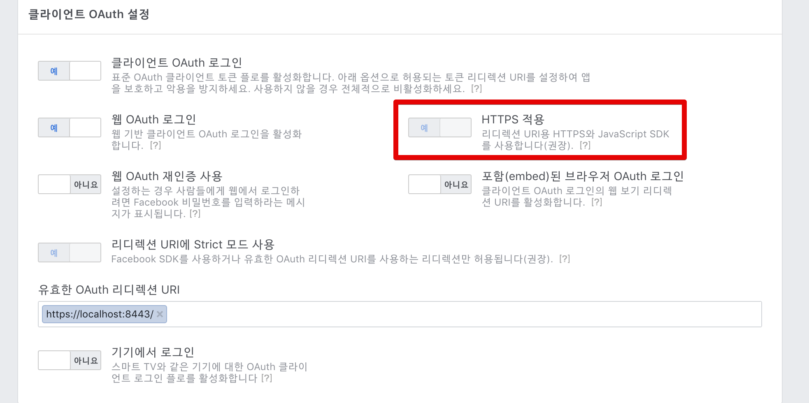
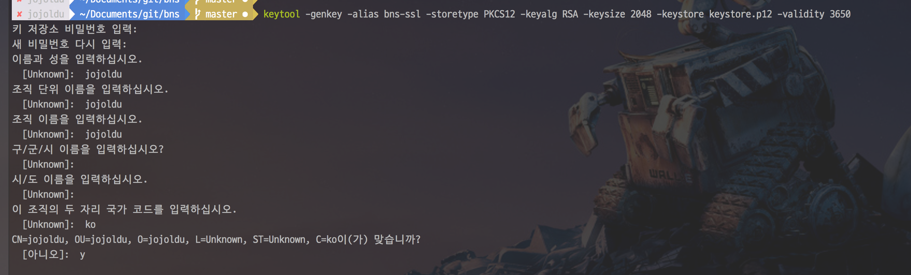
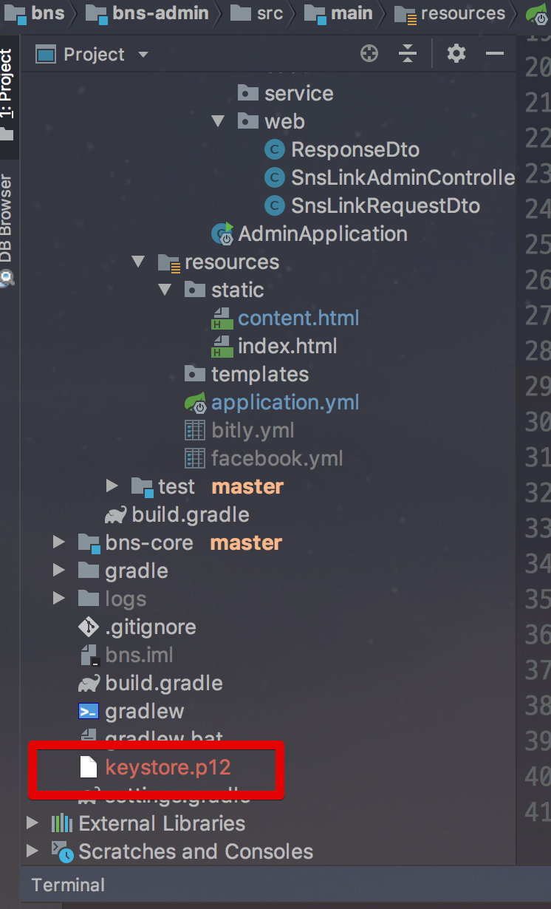
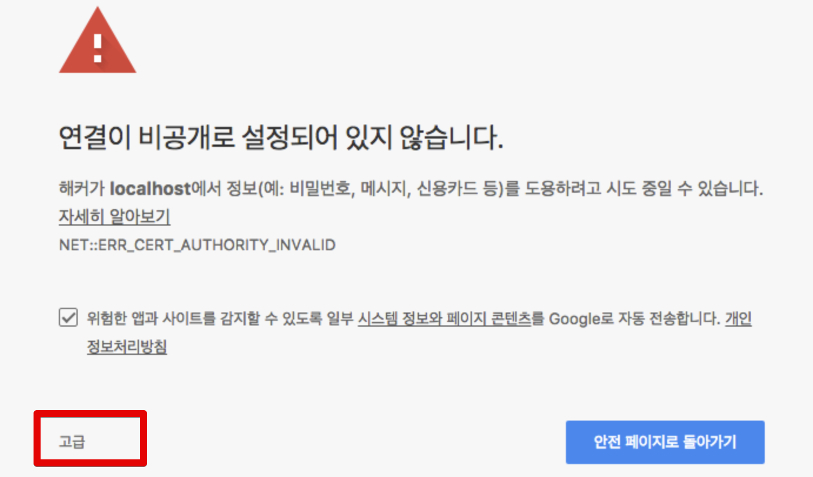
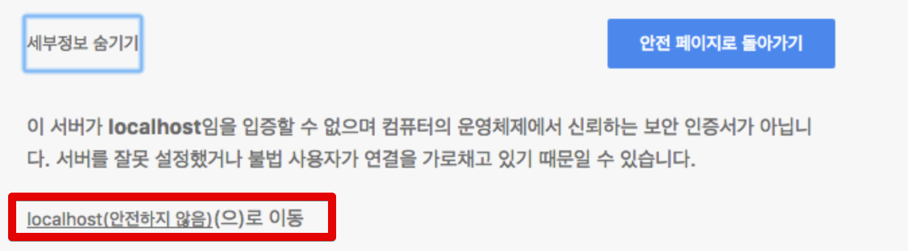
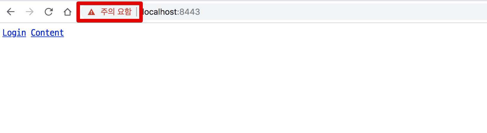

# 로컬 Spring Boot에 SSL 적용하기

Facebook OAuth를 개발해야 하는 경우 등 로컬 환경에서 HTTPS 서버가 필요할때가 종종 있습니다.  



(페이스북 OAuth 설정 화면)  
  
운영 혹은 개발 환경에서는 Nginx 혹은 AWS ELB와 같은 곳에서 SSL 인증서를 설치하기 때문에 순수하게 로컬 환경에서만 SSL 인증서를 사용할 수 있는 방법이 필요합니다.  

이번 시간에는 Spring Boot 로컬 환경에서 SSL 인증서를 개발 & 적용 하는 방법을 소개 드리겠습니다.  
  
먼저 프로젝트 디렉토리 안에서 다음과 같은 명령어를 실행합니다.

```bash
keytool -genkey -alias bns-ssl -storetype PKCS12 -keyalg RSA -keysize 2048 -keystore keystore.p12 -validity 3650 
```

* ```-alias bns-ssl```
    * key alias를 bns-ssl로 지정합니다.
* ```-keystore keystore.p12```
    * key store 이름을 keystore.p12로 지정합니다.

아래와 같이 적절한 값을 입력합니다.



생성이 끝났다면 다음과 같이 파일이 프로젝트 디렉토리 안에서 생성되어야만 합니다.



자 이렇게 생성된 keystore을 프로젝트에 적용하겠습니다.  
  
프로젝트의 application.yml 혹은 application.properties를 열어 다음을 입력합니다.

```yaml
---
spring:
  profiles: local # 로컬환경에서만 사용하기

server:
  ssl:
    enabled: true
    key-store: keystore.p12
    key-store-password: 123456
    key-store-type: PKCS12
    key-alias: bns-ssl
  port: 8443
```

프로젝트 디렉토리 내부에 있기 때문에 keystore의 절대 경로를 지정하지 않고 이름만 등록해도 됩니다.  
  
설정이 다 되셨다면 프로젝트를 실행해서 실제로 Https가 잘 적용되었는지 확인해봅니다.  
브라우저에서 아래 주소를 입력합니다.

```
https://localhost:8443
```

그럼 다음과 같이 신뢰할수 없는 인증서라는 경고문이 나옵니다.  
하단의 **고급** 버튼을 클릭합니다.



**localhost(안전하지 안음)으로 이동**을 클릭합니다.



그럼 Https가 적용된 본인의 사이트를 볼 수 있습니다.



## 참고

* [enable-https-in-spring-boot](https://www.drissamri.be/blog/java/enable-https-in-spring-boot/)