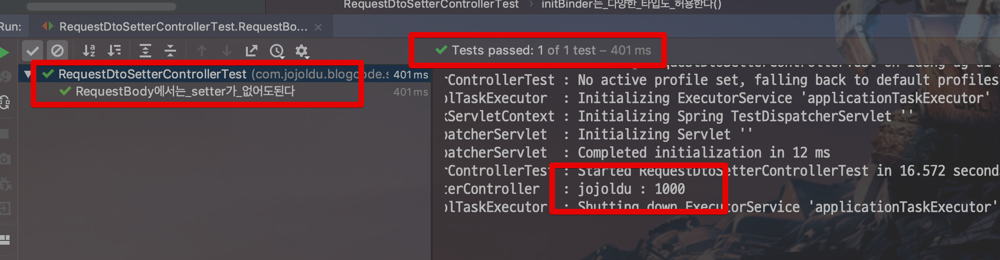
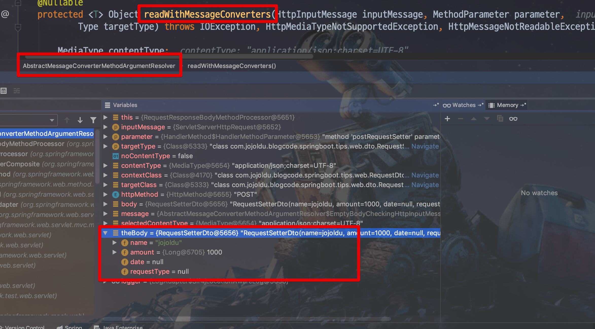
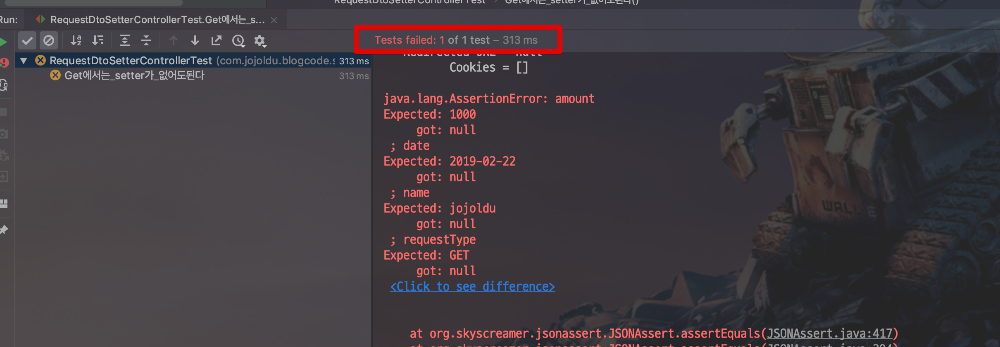

# @Reuqest Body에서는 Setter가 필요없다?

회사에서 근무하던중 새로오신 신입 개발자분이 저에게 하나의 질문을 했습니다.  
POST 요청시에 ```Setter```가 필요없는것 같다고.  

여태 제가 알던것과는 달라서 어떻게 된 일인지 궁금했습니다.  
정말 POST 요청시에는 Setter가 필요없을까요?  
그럼 GET 요청시에는 Setter가 필요할까요?  

한번 확인해보겠습니다.  

> 모든 코드는 [Github](https://github.com/jojoldu/blog-code/tree/master/spring-boot-tips)에 있으니 참고하세요

## 1. Post 요청 테스트

첫번째로 POST 요청시 Setter가 필요없는지 먼저 테스트해봅니다.  
테스트해볼 RequestDto는 아래와 같습니다.

```java
@Getter
@ToString
@NoArgsConstructor
public class RequestSetterDto {
    private String name;
    private Long amount;

    @DateTimeFormat(pattern = "yyyy-MM-dd")
    @JsonFormat(shape = JsonFormat.Shape.STRING, pattern = "yyyy-MM-dd", timezone = "Asia/Seoul")
    private LocalDate date;

    private RequestType requestType;

    @Builder
    public RequestSetterDto(@Nonnull String name, @Nonnull Long amount) {
        this.name = name;
        this.amount = amount;
    }

    public RequestSetterDto(String name, Long amount, LocalDate date, RequestType requestType) {
        this.name = name;
        this.amount = amount;
        this.date = date;
        this.requestType = requestType;
    }

    @AllArgsConstructor
    public enum RequestType {
        GET ("get"),
        POST ("post");

        private String method;
    }

}
```

다양한 타입을 테스트해보기 위해 ```String```, ```Long```, ```LocalDate```, ```Enum``` 4가지 타입을 모두 사용했습니다.  
보시는것처럼 **Setter는 선언하지 않았습니다**  
  
그리고 이 DTO를 수신할 Controller를 생성합니다.

```java

@Slf4j
@RestController
public class RequestDtoSetterController {

    @PostMapping("/request/setter")
    public RequestSetterDto postRequestSetter (@RequestBody RequestSetterDto requestSetterDto) {
        log.info(requestSetterDto.getName() + " : " + requestSetterDto.getAmount());

        return requestSetterDto;
    }
}

```

자 그럼 이 코드들을 테스트할 테스트 코드를 작성해보겠습니다.

```java
import static org.springframework.test.web.servlet.request.MockMvcRequestBuilders.get;
import static org.springframework.test.web.servlet.request.MockMvcRequestBuilders.post;
import static org.springframework.test.web.servlet.result.MockMvcResultMatchers.content;
import static org.springframework.test.web.servlet.result.MockMvcResultMatchers.status;

@RunWith(SpringRunner.class)
@WebMvcTest(RequestDtoSetterController.class)
public class RequestDtoSetterControllerTest {

    @Autowired
    private MockMvc mvc;

    @Autowired
    private ObjectMapper objectMapper;

    @Test
    public void RequestBody에서는_setter가_없어도된다() throws Exception {
        String content = objectMapper.writeValueAsString(new RequestSetterDto("jojoldu", 1000L));
        mvc
                .perform(post("/request/setter")
                        .content(content)
                        .contentType(MediaType.APPLICATION_JSON_UTF8))
                .andExpect(status().isOk())
                .andExpect(content().contentType(MediaType.APPLICATION_JSON_UTF8))
                .andExpect(content().json(content));
    }
}
```

Post로 Request Dto에 값을 채워 보냈으니

* Setter가 없어도 되면 정상적으로 값이 채워져서 테스트가 통과될것이며
* Setter가 있어야만 하면 값이 ```null```로 채워져 테스트가 실패할 것입니다.

테스트를 돌려보면!



Setter없이 성공적으로 값이 들어가는 것을 확인할 수 있습니다.  
이게 어떻게 된 일인지 ```@RequestBody``` 어노테이션을 시작으로 코드를 탐색하기 시작했습니다.  
  
이 글을 보고 계신 대부분의 개발자분들은 아시겠지만, Spring 에서 JSON 형변환을 담당하는 것이 ```Jackson2HttpMessageConverter```입니다.  
즉, ```@RequestBody```로 JSON 데이터가 넘어오면 이 JSON을 Java Object로 변환은 ```Jackson2HttpMessageConverter``` 에서 해줍니다.  
  
코드를 조금만 까보시면 아래와 같이 ```read``` 메소드에서 데이터를 생성하는 것을 볼 수 있는데요.



이때 Converter에서는 ```ObjectMapper```를 사용해서 Object로 전환해줍니다.


 ```ObjectMapper```가 전환을 해주니, **Setter가 없어도 값이 할당**됩니다.  
  
실제로 그런지 확인해볼까요?


ObjectMapper로 Setter없이 ```readValue```를 했더니 값이 제대로 할당된 것을 확인할 수 있습니다.  
  
즉, 정리하자면 **JSON으로 데이터가 넘어올 경우 Jackson2HttpMessageConverter의 ObjectMapper를 사용하여 Setter가 없어도 값이 할당된다**가 됩니다.  
  
이제 Post용 DTO에서는 더이상 Setter를 쓸 필요가 없겠죠?

## 2. Get 요청 테스트

그럼 Jackson2HttpMessageConverter를 사용하지 않는 경우엔 어떻게 될까요?  
  
Get 메소드의 DTO에서도 Setter가 필요없는지 확인해보겠습니다.  
  
DTO는 1번째와 같은 DTO를 사용하며, Controller는 아래와 같습니다.

```java
    @GetMapping("/request/setter")
    public RequestSetterDto getRequestSetter (RequestSetterDto requestSetterDto) {
        log.info(requestSetterDto.getName() + " : " + requestSetterDto.getAmount());

        return requestSetterDto;
    }
```

그리고 이를 테스트할 코드는 아래와 같습니다.

```java
    @Test
    public void Get에서는_setter가_없어도된다() throws Exception {
        String content = objectMapper.writeValueAsString(new RequestSetterDto("jojoldu", 1000L,  LocalDate.of(2019,2,22), RequestSetterDto.RequestType.GET));
        MultiValueMap<String, String> params = new LinkedMultiValueMap<>();
        params.put("name", Arrays.asList("jojoldu"));
        params.put("amount", Arrays.asList("1000"));
        params.put("date", Arrays.asList("2019-02-22"));
        params.put("requestType", Arrays.asList("GET"));

        mvc
                .perform(get("/request/setter")
                        .params(params)
                        .contentType(MediaType.APPLICATION_JSON_UTF8))
                .andExpect(status().isOk())
                .andExpect(content().contentType(MediaType.APPLICATION_JSON_UTF8))
                .andExpect(content().json(content));
    }
```

테스트를 수행해보면!



테스트가 실패하는 것을 확인할 수 있습니다.  
  
자 그럼 Get요청은 어떻게 데이터가 할당되는지 확인해보겠습니다.  
  
Get 요청의 경우 JSON 데이터가 아닌 **Query Parameter**입니다.  
그래서 ```Jackson2HttpMessageConverter```를 사용하지 않는데요.  
이럴 경우 Spring에서는 ```WebDataBinder```를 사용합니다.  
이 클래스를 차근차근 따라가보면 아래와 같은 코드를 확인할 수 있습니다.  


기본값으로 값을 할당하는 방법이 **Java Bean** 방식이라고 합니다.  
Java Bean이라 하면 **Setter**를 통해서 값을 할당하는것을 얘기하죠?  
즉, 별다른 설정이 없다면 Spring 에서는 ```WebDataBinder```의 **기본 값 할당 방법인 Java Bean** 방식을 사용하니 Setter가 없으면 작동하지 않습니다.  
  
## 3. Get에서 Setter 사용하지 않기?

위 2번에서 나온 문제를 해결하여 **Get 요청시에도 Setter를 안써도 되는 방법**이 있을까요?  
  
정답은 ```initBeanPropertyAccess```아래에 있습니다.  
바로 ```initDirectFieldAccess```를 사용하는 것인데요.  
해당 메소드를 사용하면 값 할당 방법은 **setter가 아닌 Field에 직접 접근**합니다.  
  
사용하는 방법은 간단합니다.  
전체 Controller에서 사용할 수 있게 ```ControllerAdvice```에 선언하시면 됩니다.

```java
@Slf4j
@ControllerAdvice
public class WebControllerAdvice {

    @InitBinder
    public void initBinder(WebDataBinder binder) {
        binder.initDirectFieldAccess();
    }
}
```

이렇게 변경후 다시 Get 테스트를 수행해보면!


성공적으로 통과하는 것을 확인할 수 있습니다.