# Get 요청시 LocalDate 필드에 2월 31일 올 경우 정상 처리 방법 (feat. @DateTimeFormat 제거하기)

Spring Boot로 LocalDate를 Request Parameter로 받을 경우 예상치 못한 이슈가 발생합니다.  
이번 시간에는 여러 이슈 중 하나인 초과된 날짜에 대해 LocalDate로 받으면 400에러가 발생하는 경우를 어떻게 안전하게 해결할지에 대해서 이야기해보겠습니다.  

> 모든 코드는 [Github](https://github.com/jojoldu/blog-code/tree/master/spring-boot-tips)에 있습니다.

## 문제 상황

예를 들어 다음과 같은 상황이 있다고 가정해봅시다.  
날짜를 파라미터로 하는 API를 제공하고, 다른 팀에서 해당 API를 사용한다고 가정해봅시다.  
해당 파라미터는 문자열이 아닌 **LocalDate**를 필드값으로 선언해서 사용합니다.  
  
그럼 사용하는 팀에선 아래와 같은 투정(?)을 할 수 있습니다.


[[ad]]


"아니 LocalDate에 2020-02-31을 넣으면 **2020년 2월 29일**로 잘 반환되던데?"  
"API쪽에서 31일로 받으면 자동으로 말일로 변환해야하지않아?"  
"사용하는 우리가 매번 말일 계산을 해야해??"

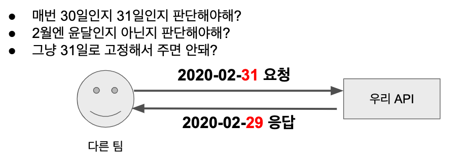  

실제로 **문자열을 LocalDate로 변환** 해보시면 아래와 같이 **2월 31일이 29일로** 잘 변환되는 것을 확인할 수 있습니다.

```java
@Test
void 문자열_없는날짜도_변환이_가능하다() throws Exception {
    //when
    LocalDate date = LocalDate.parse("2020-02-31", DateTimeFormatter.ofPattern("yyyy-MM-dd"));

    //then
    assertThat(date).isEqualTo(LocalDate.of(2020,2,29));
}
```

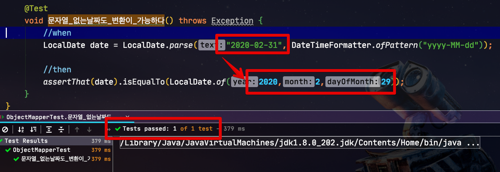

LocalDate의 ```parse``` 메소드에 문자열을 넣으면 잘 되는것을 확인하였는데요.  
그럼 이걸 본 해당 API를 사용하는 쪽에선 자연스레 불평할 수 있겠죠?  
실제로 **Request Dto에서 사용할때는 어떨까요?**  
  
하나씩 확인해보겠습니다.  
  
먼저 테스트로 사용할 Dto와 Controller 코드들입니다.

**Dto**

```java

@Getter
@ToString
@NoArgsConstructor
public class RequestSetterDto {

    @DateTimeFormat(pattern = "yyyy-MM-dd")
    @JsonFormat(shape = JsonFormat.Shape.STRING, pattern = "yyyy-MM-dd", timezone = "Asia/Seoul")
    private LocalDate date;

}
```

Get과 Post에서의 사용 방식이 달라 Controller의 코드 역시 Get/Post 2개를 모두 만들어서 테스트해보겠습니다.  
  
**Controller**

```java

@Slf4j
@RestController
public class RequestDtoSetterController {

    @PostMapping("/request/setter")
    public RequestSetterDto postRequestSetter (@RequestBody RequestSetterDto requestSetterDto) {
        log.info("requestDto={}", requestSetterDto.toString());

        return requestSetterDto;
    }

    @GetMapping("/request/setter")
    public RequestSetterDto getRequestSetter (RequestSetterDto requestSetterDto) {
        log.info("requestDto={}", requestSetterDto.toString());

        return requestSetterDto;
    }
}
```
  
자 그럼 이 Controller를 테스트 해보겠습니다.  
  
먼저 Get에 대한 테스트 코드입니다.

```java

@Test
public void GET_없는_날짜도_LocalDate바인딩이_가능하다() throws Exception {
    MultiValueMap<String, String> params = new LinkedMultiValueMap<>();
    params.put("date", Arrays.asList("2020-02-31"));

    mvc
            .perform(get("/request/setter")
                    .params(params)
                    .contentType(MediaType.APPLICATION_JSON))
            .andExpect(status().isOk())
            .andExpect(content().contentType(MediaType.APPLICATION_JSON))
            .andExpect(content().json("{\"date\":\"2020-02-29\"}"));
}
```

해당 테스트 코드를 실행해보면?

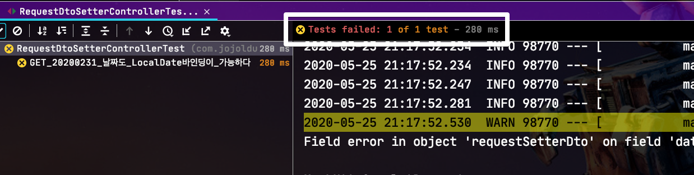

테스트가 실패합니다.  
자세하게 메세지를 보시면

```bash

Field error in object 'requestSetterDto' on field 'date': rejected value [2020-02-31]; 
codes [typeMismatch.requestSetterDto.date,typeMismatch.date,typeMismatch.java.time.LocalDate,typeMismatch]; 
arguments [org.springframework.context.support.DefaultMessageSourceResolvable: codes [requestSetterDto.date,date]; arguments []; default message [date]]; 
default message [Failed to convert property value of type 'java.lang.String' to required type 'java.time.LocalDate' for property 'date';
```

내용을 읽어보면 문자열 ```2020-02-31```을 ```LocalDate``` 으로 변환이 안된다는 것을 알 수 있습니다.  

그럼 Post에선 어떻게 작동할까요?  
  
Post의 테스트 코드를 실행해보면

```java

@Test
public void POST_20200231_날짜도_LocalDate바인딩이_가능하다() throws Exception {
    String content = "{\"date\":\"2020-02-31\"}";
    mvc
            .perform(post("/request/setter")
                    .content(content)
                    .contentType(MediaType.APPLICATION_JSON))
            .andExpect(status().isOk())
            .andExpect(content().contentType(MediaType.APPLICATION_JSON))
            .andExpect(content().json("{\"date\":\"2020-02-29\"}"));
}
```

정상적으로 변환이 성공하는 것을 확인할 수 있습니다.


그럼 ```2020-02-31```와 같이 **LocalDate.parse를 사용할땐 되지만, 실제로 존재하지는 않는 날짜**의 경우 Get요청시에만 변환이 실패한다는 것을 알 수 있습니다.  
  
Post에서는 가능한 이유는 Post로 인한 값 직렬화는 **ObjectMapper를 통해 변환**하기 때문인데요.  
(```@RequestBody```를 통해 JSON 변환이 시도되기 때문입니다.)

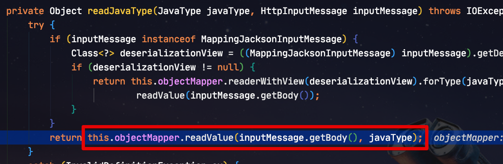

실제로 ObjectMapper로 변환을 시도하면 정상적으로 잘 변환되는 것을 확인할 수 있습니다.

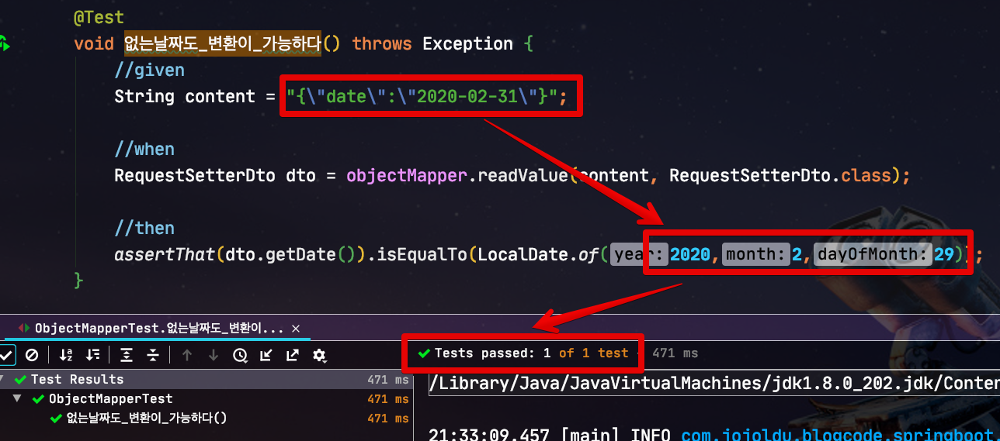

> Get에서 사용되는 ```@DateTimeFormat```과 Post에서 사용되는 ```@JsonFormat``` 에 대한 소개와 차이는 이전 포스팅 [SpringBoot에서 날짜 타입 JSON 변환에 대한 오해 풀기](https://jojoldu.tistory.com/361) 을 참고해주세요.

자 그럼 Get에서만 변환이 실패하는 이슈에 대해서 한번 수정해보겠습니다.

## 해결 방법

해결 방법엔 2가지가 있습니다.

### 1. PropertyEditor

먼저 Get 요청시 값 변환에 대한 코드를 확인해봅니다.  
코드를 쫓아가시다보면 ```TypeConverterDelegate``` 클래스에서 필드 변환이 발생하는 것을 확인할 수 있는데요.  

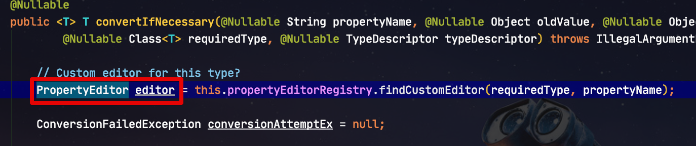

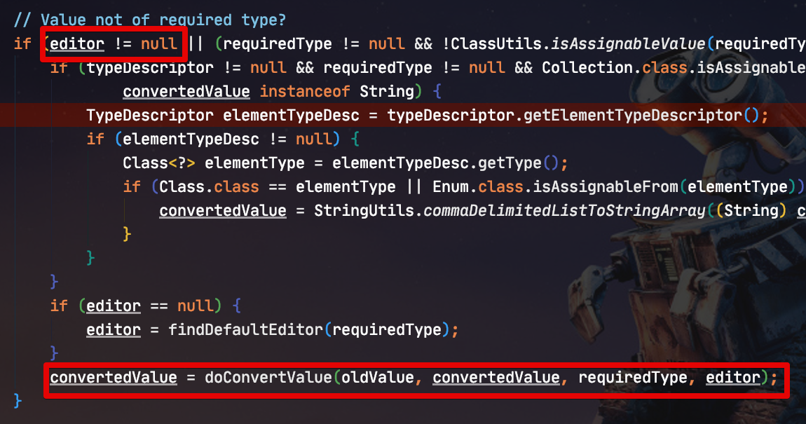

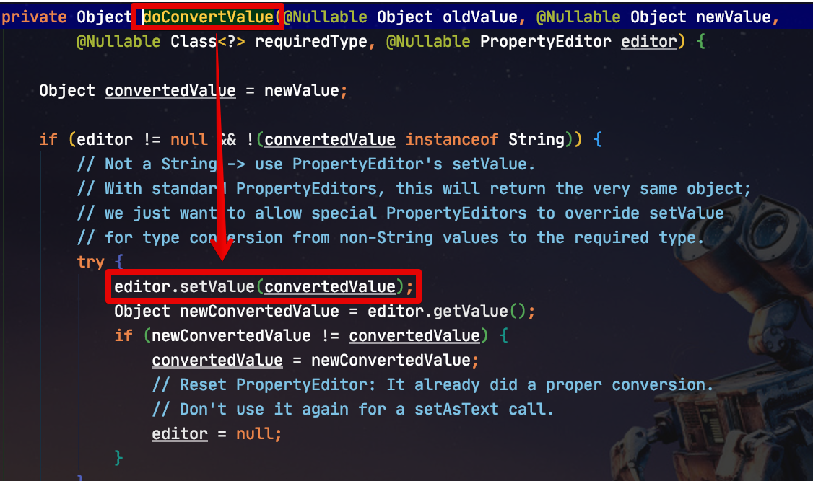

여기서 값을 임의로 바꾸기 위해서는 첫번쨰 사진에 있듯이 **Custom한 PropertyEditor**가 등록되어있으면 된다는 것을 알 수 있습니다.  
  
> ```PropertyEditor```란 입력된 값에 대해 지정된 타겟 객체로 변환을 지원하는 데이터 바인딩 클래스입니다.  
> 이 클래스의 경우 스프링 API는 아니며 JavaBean 표준에 정의된 API인데요.  
> 스프링은 이 PropertyEditor를 문자열-오브젝트 상호변환이 필요한 XML 설정이나 HTTP 파라미터 변환에 유용하게 사용할 수 있다고 판단하여 이를 일찍부터 사용해왔습니다.  
> 이와 관련한 예제는 이미 [인터넷](https://www.baeldung.com/spring-mvc-custom-property-editor)에 많이 있으니 참고해보시면 좋습니다.  
  
자 그럼 Get 요청시 문자열 값을 ```LocalDate```로 변환하는 PropertyEditor를 ```WebDataBinder```에 등록해보겠습니다.

> ```WebDataBinder```란 Web의 Request Parameter를 JavaBean 객체로 데이터 바인딩을 위한 특별한 DataBinder 클래스입니다.  
> 지금과 같이 RequestParameter의 문자열 -> ```LocalDate``` 변환 외에도 [Get 요청에 대해서 Field Injection](https://jojoldu.tistory.com/407)을 지원하는 등 여러가지 데이터 바인딩 기능을 지원합니다.

WebDataBinder 를 등록하기 위해서는 ```@ControllerAdvice``` 를 사용해야하니 아래와 같이 코드를 작성하여 등록하시면 됩니다.

```java
@Slf4j
@ControllerAdvice
public class WebControllerAdvice {

    @InitBinder
    public void initBinder(WebDataBinder binder) {
        binder.registerCustomEditor(LocalDate.class, new PropertyEditorSupport() {
            @Override
            public void setAsText(String text) {
                LocalDate localDate = LocalDate.parse(text, DateTimeFormatter.ofPattern("yyyy-MM-dd"));
                setValue(localDate);
            }
        });
    }
}
```

* PropertyEditor는 **Thread Safe하지 않습니다**.
* 그래서 PropertyEditor를 Bean으로 등록할 경우 Thread 문제가 발생할 수 있으니 ```@InitBinder```를 통해 Thread Safe를 보장받도록 하였습니다. 

> 여기서는 익명 클래스로 ```PropertyEditorSupport``` 구현체를 만들었지만, 별도의 클래스로 생성해서 사용하셔도 무방합니다.

자 이렇게 등록하신 뒤 다시 Get 테스트 코드를 수행해보면!?

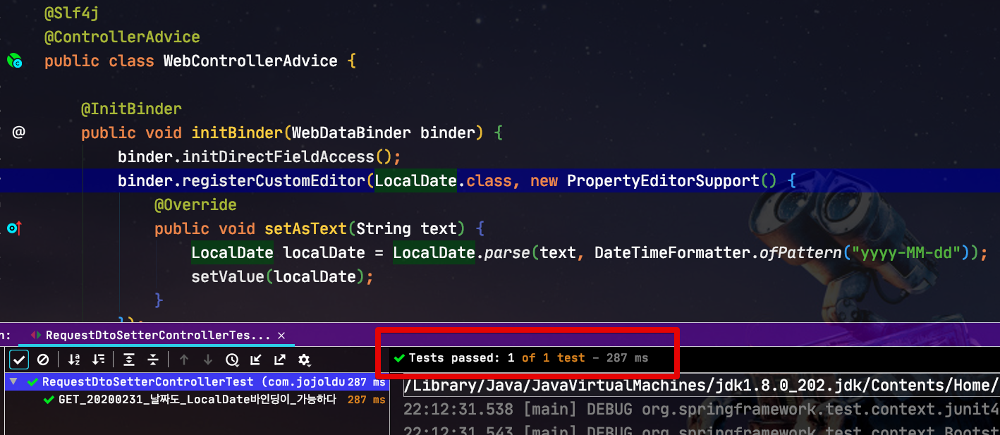

ObjectMapper의 변환처럼 문자열 2020-02-31 값이 ```LocalDate``` 2020-02-29 값으로 잘 변환되는 것을 확인할 수 있습니다.  
  
기존에 잘 작동하던 Post 요청 역시 해당 옵션이 추가되어도 문제 없음을 확인할 수 있습니다.

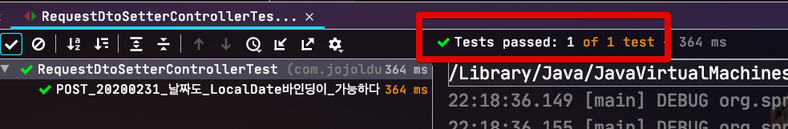


### 2. Formatter 

hojinDev님께서 댓글로 알려주신건데요.  
최근엔 ```Formatter```를 통해 바인딩 정보를 변경하는 것을 권장하고 있습니다.

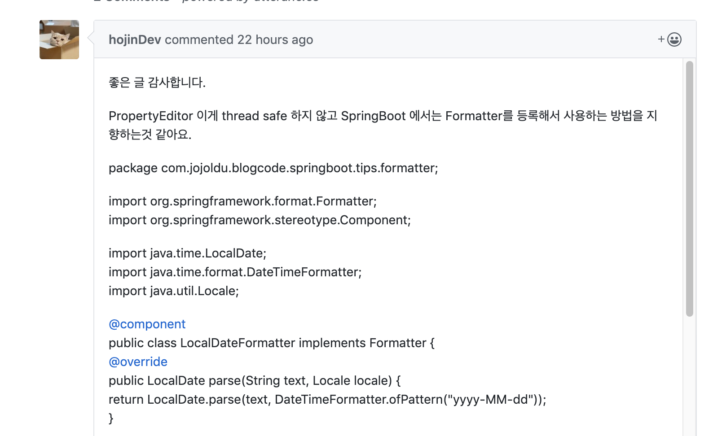

그래서 PropertyEditor가 아닌 Formatter를 사용한다면 아래와 같은 코드로 개선할 수 있습니다.  
  
먼저 ```LocalDate``` 변환을 담당할 Formatter 구현체를 만들고,

```java
public class LocalDateFormatter implements Formatter<LocalDate> {

    @Override
    public LocalDate parse(String text, Locale locale) {
        return LocalDate.parse(text, DateTimeFormatter.ofPattern("yyyy-MM-dd"));
    }

    @Override
    public String print(LocalDate object, Locale locale) {
        return DateTimeFormatter.ofPattern("yyyy-MM-dd").format(object);
    }
}
```

이를 프로젝트의 Config 클래스에 Bean으로 등록하면 됩니다.

```java
@Configuration
public class AppConfig {

    ...

    @Bean
    public LocalDateFormatter localDateFormatter() {
        return new LocalDateFormatter();
    }
}
```

이렇게 변경 후 다시 테스트를 돌려보면?

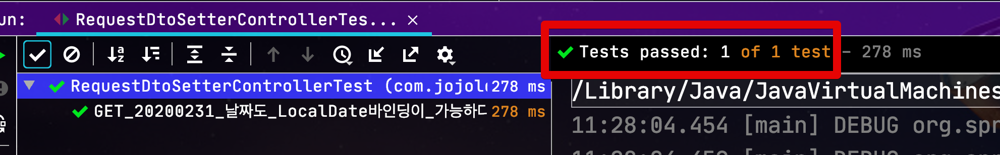

정상적으로 테스트가 통과하는 것을 확인할 수 있습니다.

> 제보 감사합니다 hojinDev님!

## 마무리

위 2가지 방법 어느것을 사용하더라도 **모든 Get요청에 대해선 일관된 규칙**을 가지게 됩니다.  
  
즉, 수많은 Request Dto에서 더이상 ```@DateTimeFormat```을 사용하지 않아도 된다는 것이죠.

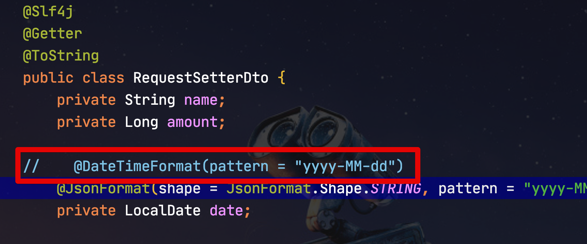

팀에서 일관된 규칙의 날짜 파라미터를 사용한다면 한번쯤 고려해볼만한 옵션이라고 생각됩니다.  
  
위에선 강제로 2월 31일에 대해서 문제 없이 발생하도록 구현하였는데요.  
무조건 그렇게 해야된다기 보다는 **기획상/팀 규칙상** 정확하게 2020-02-29 로 파라미터를 받고, 그 외에는 에러를 발생하는게 맞다면 이런 옵션은 전혀 사용하지 않으셔도 됩니다.
