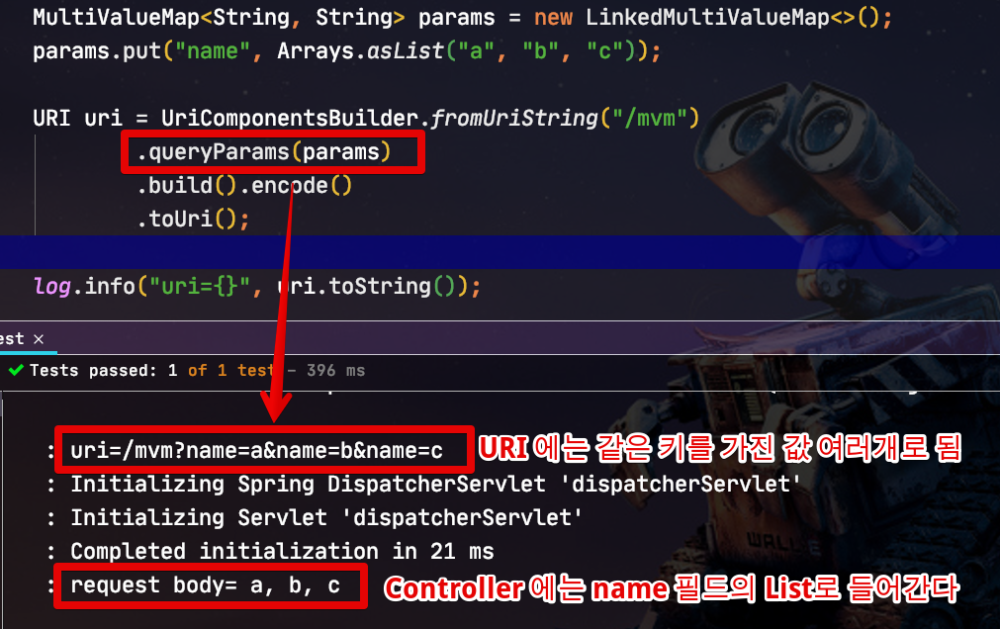

# Dto 클래스에서 MultiValueMap로 쉽게 타입 변환하기

## 1. 문제 상황

RestTemplate의 ```exchange``` 메소드를 이용해 ```HTTP.GET``` 호출을 할때면 매번 불편한게 있습니다.  
바로 **Query string** 처리인데요.  
  
Request Body로 데이터를 전달하는 ```HTTP.POST```의 경우에는 아래와 같이 간단하게 Dto 인스턴스 그대로 데이터를 전달할 수 있습니다.

```java
XssRequestDto2 requestBody = new XssRequestDto2("content", expected);
HttpEntity<XssRequestDto2> entity = new HttpEntity<>(requestBody, headers); // Dto 인스턴스를 그대로 HttpEntity 생성자로 주입 (Request Body로 등록된다)

ResponseEntity<XssRequestDto2> response = restTemplate.exchange(
        "/xss2",
        HttpMethod.POST,
        entity,
        XssRequestDto2.class);
```

헌데, Query string를 사용하는 Get의 경우엔 Dto클래스를 그대로 사용하진 못하고, **직접 URL 파라미터를 만들거나 / MultiValueMap** 을 사용해야만 합니다.  

> 위 코드를 HttpMethod.GET 으로 변경해서 테스트 해보면 안된다는걸 알수 있습니다.
  
보통 직접 URL 파라미터를 만드는건 코드가 그리 깔끔하지 못하니 아래처럼 MultiValueMap을 사용합니다.

```java
MultiValueMap<String, String> queryParams = new LinkedMultiValueMap<>();
queryParams.add("name", requestDto.getName());
queryParams.add("amount", String.valueOf(requestDto.getAmount()));
queryParams.add("checked", String.valueOf(requestDto.isChecked()));
queryParams.add("dateTime", toStringDateTime(requestDto.getDateTime()));
queryParams.add("status", requestDto.getStatus().name());

URI uri = UriComponentsBuilder.fromUriString(url)
        .queryParams(queryParams)
        .build().encode()
        .toUri();
```

이렇게 Dto 인스턴스의 필드들을 하나씩 꺼내와 MultiValueMap에 **키와 값을 직접 다 입력**하게 되면 결국 누락된 필드가 발생할 확률이 높습니다.  
(필드가 10개, 15개일 경우는 끔찍하죠?)  
  
자 그럼 이를 해결할 수 있는 가장 쉬운 방법은 무엇일까요?  
형변환에서 가장 많이 사용되는 **ObjectMapper**를 사용하는 것입니다.  
  
그래서 아래와 같이 

```java
MultiValueMap<String, String> params = objectMapper.convertValue(dto, new TypeReference<MultiValueMap<String, String>>() {});
```

```java
java.lang.IllegalArgumentException: Cannot find a deserializer for non-concrete Map type [map type; class org.springframework.util.MultiValueMap, [simple type, class java.lang.String] -> [collection type; class java.util.List, contains [simple type, class java.lang.String]]]
```

### 그럼 왜 MultiValueMap가 사용되는걸까?



```java
@Getter
@Setter
@NoArgsConstructor
public static class Request {
    private List<String> name; // name 을 Key로 한 모든 Query string이 담긴다

    @Override
    public String toString() {
        return String.join(", ", name);
    }
}
```

## 해결책


## 주의할 점

* 컬렉션 타입의 필드가 있으면 **작동하지 않습니다**.
  * Query string 에 사용될 Request Dto 클래스가 만약 Collection 필드가 있다면, 아래 2가지 중 골라 사용하셔야 합니다
    * 해당 필드가 Query string 에 들어갈 필드가 아니라면 ```@JsonIgnore```를 붙여서 변환 과정에서 제거해주세요.
    * Query string 에 사용될 필드라면 기존처럼 **MutliValueMap** 으로 하나씩 담아주세요.