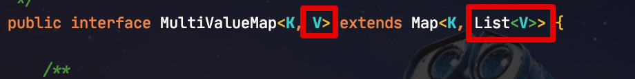
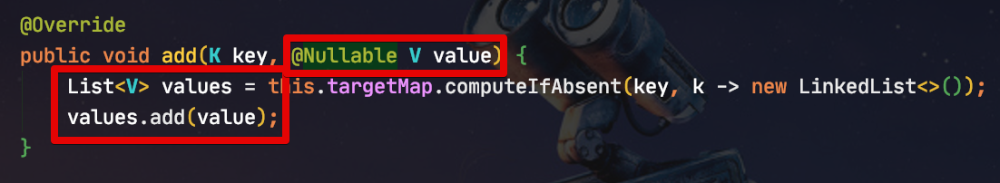
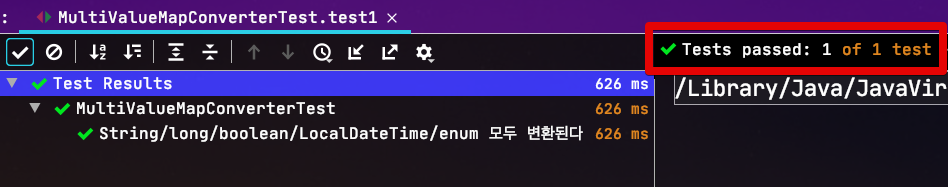
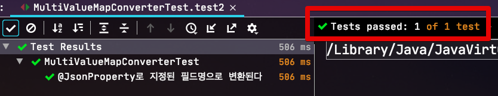
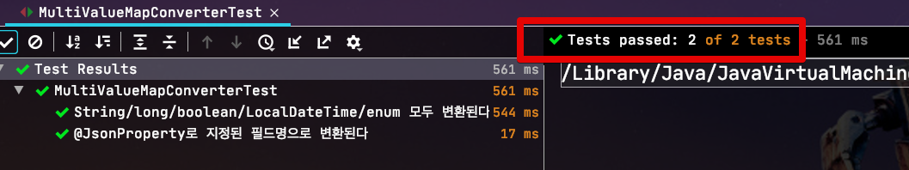

# Dto 클래스에서 MultiValueMap로 쉽게 타입 변환하기

> 모든 코드는 [Github](https://github.com/jojoldu/blog-code/tree/master/spring-boot-tips)에 있습니다

## 1. 문제 상황

RestTemplate의 ```exchange``` 메소드를 이용해 ```HTTP.GET``` 호출을 할때면 매번 불편한게 있습니다.  
바로 **Query string** 처리인데요.  
  
Request Body로 데이터를 전달하는 ```HTTP.POST```의 경우에는 아래와 같이 간단하게 Dto 인스턴스 그대로 데이터를 전달할 수 있습니다.

```java
XssRequestDto2 requestBody = new XssRequestDto2("content", expected);
HttpEntity<XssRequestDto2> entity = new HttpEntity<>(requestBody, headers); // Dto 인스턴스를 그대로 HttpEntity 생성자로 주입 (Request Body로 등록된다)

ResponseEntity<XssRequestDto2> response = restTemplate.exchange(
        "/xss2",
        HttpMethod.POST,
        entity,
        XssRequestDto2.class);
```

헌데, Query string를 사용하는 Get의 경우엔 Dto클래스를 그대로 사용하진 못하고, **직접 URL 파라미터를 만들거나 / MultiValueMap** 을 사용해야만 합니다.  

> 위 코드를 HttpMethod.GET 으로 변경해서 테스트 해보면 안된다는걸 알수 있습니다.
  
보통 직접 URL 파라미터를 만드는건 코드가 그리 깔끔하지 못하니 아래처럼 MultiValueMap을 사용합니다.

```java
MultiValueMap<String, String> queryParams = new LinkedMultiValueMap<>();
queryParams.add("name", requestDto.getName());
queryParams.add("amount", String.valueOf(requestDto.getAmount()));
queryParams.add("checked", String.valueOf(requestDto.isChecked()));
queryParams.add("dateTime", toStringDateTime(requestDto.getDateTime()));
queryParams.add("status", requestDto.getStatus().name());

URI uri = UriComponentsBuilder.fromUriString(url)
        .queryParams(queryParams)
        .build().encode()
        .toUri();
```

이렇게 Dto 인스턴스의 필드들을 하나씩 꺼내와 MultiValueMap에 **키와 값을 직접 다 입력**하게 되면 결국 누락된 필드가 발생할 확률이 높습니다.  
(필드가 10개, 15개일 경우는 끔찍하죠?)  
  
보통 이렇게 Dto -> Map으로 형변환을 할때면 가장 쉬운 방법으로 **ObjectMapper**를 사용합니다.  
  
그래서 아래와 같이 형변환을 해보면?

```java
MultiValueMap<String, String> params = objectMapper.convertValue(dto, new TypeReference<MultiValueMap<String, String>>() {});
```

에러가 발생하며 실패합니다.

```java
java.lang.IllegalArgumentException: Cannot find a deserializer for non-concrete Map type [map type; class org.springframework.util.MultiValueMap, [simple type, class java.lang.String] -> [collection type; class java.util.List, contains [simple type, class java.lang.String]]]
```

메세지를 읽어 보시면, "**String 타입을 List 타입으로 변환이 불가능**하다" 라고 합니다.  
그래서 MultiValueMap 코드를 확인해보면?



이렇게 Value(```V```) 가 사실은 ```List<V>``` 에 사용되는 것을 알 수 있습니다.  

실제로 ```add``` 로 단일값을 넣을때면 기존의 값이 없는 Key가 들어올 경우 List를 만들어 단일값을 추가하도록 되어있습니다.



즉, **단순히 Dto -> Map 변환하듯이 변환할수는 없다는 것이죠**.  
모든 Key에 매핑된 Value들은 사실은 **List Value**가 되도록 변환이 되어야합니다.  

### 그럼 왜 MultiValueMap가 사용되는걸까?

그럼 한가지 의문이 있죠?  
왜 Query string을 만들때 MultiValueMap 를 사용하도록 했을까요?  
단순히 HashMap 과 같은 단일값을 가진 Map을 사용해도 될텐데?  
  
이는 **같은 Key를 가진 파라미터 값이 여러개일 경우**를 대비한 것입니다.  
  
아래와 같이 동일하게 ```name``` 을 Key로 하는 여러 파라미터가 있을 경우도 웹은 정상적으로 이를 인식할 수 있으며, 수신하는 곳에서는 ```name```을 List로 가진 곳에 정상적으로 매핑됩니다.


```java
@Getter
@Setter
@NoArgsConstructor
public static class Request {
    private List<String> name; // name 을 Key로 한 모든 Query string이 담긴다

    @Override
    public String toString() {
        return String.join(", ", name);
    }
}
```

(Controller에서 사용한 Request Dto 클래스)  
  
만약 일반적인 ```Map<Key, Value>```로 선언된 Map 클래스를 사용할 경우 위와 같은 케이스에 대해서는 전혀 대응할 수가 없습니다.  
(즉, Http.GET으로 List 값을 넘길수가 없는 것이죠)  
  
그래서 MultiValueMap이 사용되었다고 보시면 됩니다.

## 해결책

왜 MultiValueMap이 RestTemplate에서 Query string이 필요할때 사용되는 타입인지를 알게 되었습니다.  
  
하지만, 저희가 생각하는 일반적인 케이스에서는 **Http.GET 요청에 List로 값을 넘길 경우가 거의 없습니다**.  
GET 요청은 **조회요청** 이기 때문에 대부분은 단일 필드로 이루어진 Query string으로 사용됩니다.

> ex: ?name=a&year=2020&month=12

현재 진행중인 프로젝트에서도 모든 GET 요청이 단일값으로 파라미터가 이루어져있어, 한번에 **Dto -> MultiValueMap**으로 변환하는 유틸 클래스를 만들어서 사용합니다.  
  
유틸 클래스의 코드는 아래와 같습니다.

```java
@Slf4j
@NoArgsConstructor(access = AccessLevel.PRIVATE)
public abstract class MultiValueMapConverter {

    public static MultiValueMap<String, String> convert(ObjectMapper objectMapper, Object dto) { // (2)
        try {
            MultiValueMap<String, String> params = new LinkedMultiValueMap<>();
            Map<String, String> map = objectMapper.convertValue(dto, new TypeReference<Map<String, String>>() {}); // (3)
            params.setAll(map); // (4)

            return params;
        } catch (Exception e) {
            log.error("Url Parameter 변환중 오류가 발생했습니다. requestDto={}", dto, e);
            throw new IllegalStateException("Url Parameter 변환중 오류가 발생했습니다.");
        }
    }
}
```

(1) ```@NoArgsConstructor(access = AccessLevel.PRIVATE)```

* 유틸 클래스이니 **상속이나 인스턴스 생성을 막기위해** private scope의 기본생성자를 만들어둡니다.

(2) ```convert(ObjectMapper objectMapper```

* 형변환을 위해 사용될 ObjectMapper는 **주입 받아서** 사용합니다.
* 보통 ObjectMapper는 스프링 Bean으로 등록되어 전체 코드에서 DI 받아 사용되는 경우가 많습니다.
* 이를 무시하고 Converter 에서 직접 생성해서 사용하면 **호출하는 쪽이 원하는 형태로 형변환 할 수가 없습니다**
* 이는 ObjectMapper으로 형변환 되는 여러 설정들이 **Converter에 종속되지 않도록** 하기 위함입니다.
* 어떤 설정으로 형변환 하고 싶은지 판단은 Converter 클래스를 호출하는 쪽이 결정 하도록 구현했다고 보시면 됩니다.

(3) ```objectMapper.convertValue(dto, new TypeReference<Map<String, String>>() {})```

* Dto 클래스를 ```Map<String, String>``` 으로 형변환을 먼저 진행합니다.
* ```TypeReference```가 없으면 ```Map<String, String>``` 이 아닌 ```Map``` 으로 변환되니 꼭 사용하셔야 합니다.

(4) ```params.setAll(map);```

* ```Map<String, String>``` 를 MultiValueMap 에 전체 등록합니다.
* ```setAll``` 메소드는 Map의 모든 Key에 해당하는 Value들을 **1개의 값을 가진 LinkedList로 변환하여 set** 해줍니다.

자 이제 컨버터가 생성되었으니 한번 테스트 코드로 검증해봅니다.

### 테스트 코드

첫번째 테스트는 단순한 문자열/숫자부터 ```LocalDateTime```, ```enum```까지 잘 변환되는지 검증해봅니다.  
  
테스트용 Dto클래스는 아래와 같습니다.

```java
@Getter
@NoArgsConstructor
public class MultiValueMapTestDto1 {

    private String name;
    private long amount;
    private boolean checked;

    @DateTimeFormat(pattern = "yyyy-MM-dd HH:mm:ss")
    @JsonFormat(shape = JsonFormat.Shape.STRING, pattern = "yyyy-MM-dd HH:mm:ss", timezone = "Asia/Seoul")
    private LocalDateTime dateTime;

    private Status status;

    @Builder
    public MultiValueMapTestDto1(String name, long amount, boolean checked, LocalDateTime dateTime, Status status) {
        this.name = name;
        this.amount = amount;
        this.checked = checked;
        this.dateTime = dateTime;
        this.status = status;
    }

    public enum Status {
        SUCCESS, FAIL;
    }
}
```

그리고 이 Dto를 테스트할 테스트 코드입니다.

> 모든 테스트는 JUnit5로 되어있습니다.  
> JUnit4와 문법상 크게 차이가 없어 보시는덴 문제가 없을것 같습니다.

```java
@Test
@DisplayName("String/long/boolean/LocalDateTime/enum 모두 변환된다")
void test1() throws Exception {
    //given
    String expectedName = "name";
    int expectedAmount = 1000;
    boolean expectedChecked = true;
    LocalDateTime expectedDateTime = LocalDateTime.of(2020, 2, 22, 19, 35, 1);
    Status expectedStatus = SUCCESS;

    MultiValueMapTestDto1 dto = MultiValueMapTestDto1.builder()
            .name(expectedName)
            .amount(expectedAmount)
            .checked(expectedChecked)
            .dateTime(expectedDateTime)
            .status(expectedStatus)
            .build();
    //when
    result = MultiValueMapConverter.convert(objectMapper, dto);

    //then
    assertThat(result.size()).isEqualTo(5);
    assertValue("name", expectedName);
    assertValue("amount", String.valueOf(expectedAmount));
    assertValue("checked", String.valueOf(expectedChecked));
    assertValue("dateTime", toStringDateTime(expectedDateTime));
    assertValue("status", expectedStatus.name());
}
```

이 테스트를 수행해보면?



정상적으로 통과하는 것을 확인할 수 있습니다.  
  
다음으로는 ```@JsonProperty```로 **필드명이 아닌 별도의 필드명으로 변환이 필요할때**입니다.  
  
아래 코드를 보시면 새로운 Dto 클래스에는 ```@JsonProperty``` 로 **필드명과 다른 이름**으로 지정된 필드들이 있습니다.

```java
@Getter
@NoArgsConstructor
public class MultiValueMapTestDto2 {

    @JsonProperty("na") // json 필드명
    private String name;
    private long amount;
    private boolean checked;

    @JsonProperty("date_time") // json 필드명
    @DateTimeFormat(pattern = "yyyy-MM-dd HH:mm:ss")
    @JsonFormat(shape = JsonFormat.Shape.STRING, pattern = "yyyy-MM-dd HH:mm:ss", timezone = "Asia/Seoul")
    private LocalDateTime dateTime;

    @JsonProperty("st") // json 필드명
    private Status status;

    @Builder
    public MultiValueMapTestDto2(String name, long amount, boolean checked, LocalDateTime dateTime, Status status) {
        this.name = name;
        this.amount = amount;
        this.checked = checked;
        this.dateTime = dateTime;
        this.status = status;
    }

    public enum Status {
        SUCCESS, FAIL;
    }
}
```

이를 테스트하기 위한 테스트 코드입니다.

```java
@Test
@DisplayName("@JsonProperty로 지정된 필드명으로 변환된다")
void test2() throws Exception {
    //given
    String expectedName = "name";
    int expectedAmount = 1000;
    boolean expectedChecked = true;
    LocalDateTime expectedDateTime = LocalDateTime.of(2020, 2, 22, 19, 35, 1);
    MultiValueMapTestDto2.Status expectedStatus = MultiValueMapTestDto2.Status.SUCCESS;

    MultiValueMapTestDto2 dto = MultiValueMapTestDto2.builder()
            .name(expectedName)
            .amount(expectedAmount)
            .checked(expectedChecked)
            .dateTime(expectedDateTime)
            .status(expectedStatus)
            .build();
    //when
    result = MultiValueMapConverter.convert(objectMapper, dto);

    //then
    assertThat(result.size()).isEqualTo(5);
    assertValue("na", expectedName);
    assertValue("date_time", toStringDateTime(expectedDateTime));
    assertValue("st", expectedStatus.name());
}
```

테스트를 돌려보면?



**@JsonProperty**로 변경된 필드명으로 잘 변환된 것을 확인할 수 있습니다.  
  
마지막으로 전체 테스트를 실행해보겠습니다.



전체 테스트도 잘 되는 것을 확인할 수 있습니다.

## 주의할 점

해당 Converter로 쉽게 변환될 수 있지만 주의할점이 있습니다.

* 컬렉션 타입의 필드가 있으면 **작동하지 않습니다**.
  * Query string 에 사용될 Request Dto 클래스가 만약 Collection 필드가 있다면, 아래 2가지 중 골라 사용하셔야 합니다
    * 해당 필드가 Query string 에 들어갈 필드가 아니라면 ```@JsonIgnore```를 붙여서 변환 과정에서 제거해주세요.
    * Query string 에 사용될 필드라면 **기존처럼 MutliValueMap** 을 직접 사용해주세요.