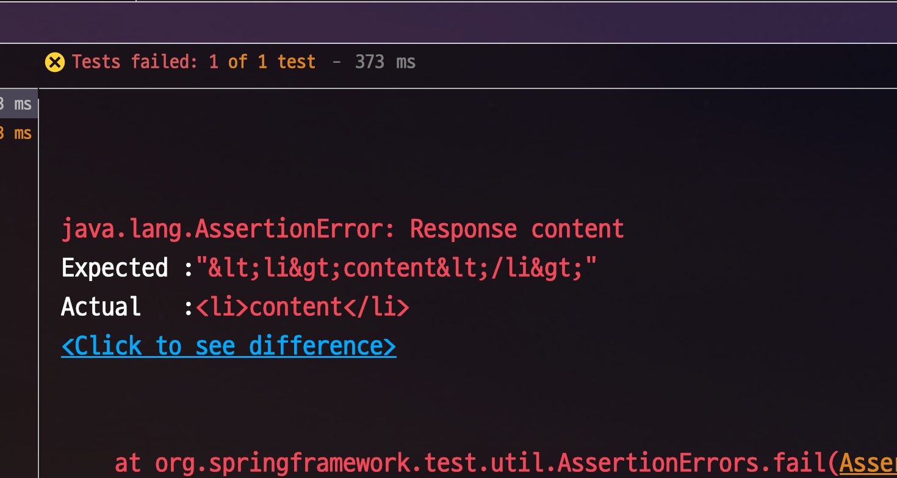
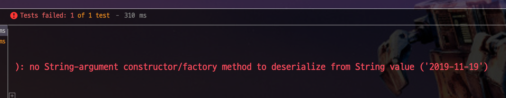

# Spring Boot에서 JSON API에 XSS Filter 적용하기

일반적인 웹 애플리케이션에서 기본적으로 해야할 보안으로 XSS 방지가 있습니다.  
기존에 많이들 알고 계시는 lucy filter의 단점은 이미 오명운 님께서 잘 정리해주셨기 때문에 한번쯤 읽어 보셔도 좋을것 같습니다.  

* [homoefficio.github.io - Spring에서 JSON에 XSS 방지 처리 하기](https://homoefficio.github.io/2016/11/21/Spring%EC%97%90%EC%84%9C-JSON%EC%97%90-XSS-%EB%B0%A9%EC%A7%80-%EC%B2%98%EB%A6%AC-%ED%95%98%EA%B8%B0/)

요약하자면,  

* lucy 필터는 form data 전송방식엔 유효하지만, **Request Body**로 전달되는 JSON 요청은 처리해주지 않는다

> 정말 친절하게 설명해주셨기 때문에 꼭 읽어보시길 추천드립니다.

다만 오명운님께서 제시한 방법중 ```WebMvcConfigurerAdapter``` 는 이미 Deprecated가 되었습니다.


## 1. 문제 상황 재현


```java
@Slf4j
@RestController
public class XssRequestController {

    @PostMapping("/xss")
    public String xss (@RequestBody XssRequestDto xssRequestDto) {
        log.info("requestDto={}", xssRequestDto);

        return xssRequestDto.getContent();
    }
}

@ToString
@Getter
@NoArgsConstructor
public class XssRequestDto {
    private String content;

    public XssRequestDto(String content) {
        this.content = content;
    }
}
```

```java
@RunWith(SpringRunner.class)
@WebMvcTest(XssRequestController.class)
public class XssTest0 {

    @Autowired
    private MockMvc mvc;

    @Autowired
    private ObjectMapper objectMapper;

    @Test
    public void 태그가_치환되지않는다() throws Exception {
        String content = "<li>content</li>";
        String expected = "\"&lt;li&gt;content&lt;/li&gt;\"";
        String requestBody = objectMapper.writeValueAsString(new XssRequestDto(content));
        mvc
                .perform(post("/xss")
                        .content(requestBody)
                        .contentType(MediaType.APPLICATION_JSON))
                .andExpect(status().isOk())
                .andExpect(content().string(expected));
    }
}
```



## 2. 해결책

일단 태그 변환을 위한 HtmlCharacterEscapes 클래스를 생성합니다.

```java
import com.fasterxml.jackson.core.SerializableString;
import com.fasterxml.jackson.core.io.CharacterEscapes;
import com.fasterxml.jackson.core.io.SerializedString;
import org.apache.commons.text.StringEscapeUtils;

public class HtmlCharacterEscapes extends CharacterEscapes {

    private final int[] asciiEscapes;

    public HtmlCharacterEscapes() {
        // 1. XSS 방지 처리할 특수 문자 지정
        asciiEscapes = CharacterEscapes.standardAsciiEscapesForJSON();
        asciiEscapes['<'] = CharacterEscapes.ESCAPE_CUSTOM;
        asciiEscapes['>'] = CharacterEscapes.ESCAPE_CUSTOM;
        asciiEscapes['\"'] = CharacterEscapes.ESCAPE_CUSTOM;
        asciiEscapes['('] = CharacterEscapes.ESCAPE_CUSTOM;
        asciiEscapes[')'] = CharacterEscapes.ESCAPE_CUSTOM;
        asciiEscapes['#'] = CharacterEscapes.ESCAPE_CUSTOM;
        asciiEscapes['\''] = CharacterEscapes.ESCAPE_CUSTOM;
    }

    @Override
    public int[] getEscapeCodesForAscii() {
        return asciiEscapes;
    }

    @Override
    public SerializableString getEscapeSequence(int ch) {
        return new SerializedString(StringEscapeUtils.escapeHtml4(Character.toString((char) ch)));
    }
}
```

### 2-1. 해결책 1

```java
@RunWith(SpringRunner.class)
@SpringBootTest(classes = {XssRequestController.class, XssTest1.WebMvcConfig.class, AppConfig.class})
@AutoConfigureMockMvc
public class XssTest1 {

    @Autowired
    private MockMvc mvc;

    @Autowired
    private ObjectMapper objectMapper;

    @Test
    public void 태그가_치환된다() throws Exception {
        String content = "<li>content</li>";
        String expected = "\"&lt;li&gt;content&lt;/li&gt;\"";
        String requestBody = objectMapper.writeValueAsString(new XssRequestDto(content));
        mvc
                .perform(post("/xss")
                        .content(requestBody)
                        .contentType(MediaType.APPLICATION_JSON))
                .andExpect(status().isOk())
                .andExpect(content().contentType(MediaType.APPLICATION_JSON))
                .andExpect(content().string(expected));
    }

    @Configuration
    @EnableWebMvc
    public static class WebMvcConfig implements WebMvcConfigurer {

        @Override
        public void configureMessageConverters(List<HttpMessageConverter<?>> converters) {
            converters.add(htmlEscapingConverter());
        }

        private HttpMessageConverter<?> htmlEscapingConverter() {
            ObjectMapper objectMapper = new ObjectMapper();
            objectMapper.getFactory().setCharacterEscapes(new HtmlCharacterEscapes());

            MappingJackson2HttpMessageConverter htmlEscapingConverter =
                    new MappingJackson2HttpMessageConverter();
            htmlEscapingConverter.setObjectMapper(objectMapper);

            return htmlEscapingConverter;
        }
    }
}


```
### 2-2. 해결책 2

위 해결책에는 한가지 문제점이 추가로 있습니다.  
바로 **LocalDate 변환이 되지 않는다**는 점입니다.  

```java
@Test
public void LocalDate가_치환되지않는다() throws Exception {
    String content = "<li>content</li>";
    String expected = "\"&lt;li&gt;content&lt;/li&gt;\"";
    String requestBody = objectMapper.writeValueAsString(new XssRequestDto2(content, LocalDate.now()));
    mvc
            .perform(post("/xss2")
                    .content(requestBody)
                    .contentType(MediaType.APPLICATION_JSON))
            .andExpect(status().isOk())
            .andExpect(content().contentType(MediaType.APPLICATION_JSON))
            .andExpect(content().string(expected));
}
```



### 2-3. 해결책 3

```java
@Configuration
public static class WebMvcConfig extends WebMvcConfigurationSupport {

    @Override
    public void configureMessageConverters(List<HttpMessageConverter<?>> converters) {
        converters.add(htmlEscapingConverter());
        super.addDefaultHttpMessageConverters(converters);
    }

    private HttpMessageConverter<?> htmlEscapingConverter() {
        ObjectMapper objectMapper = new Jackson2ObjectMapperBuilder()
                .featuresToDisable(SerializationFeature.WRITE_DATES_AS_TIMESTAMPS)
                .modules(new JavaTimeModule())
                .timeZone("Asia/Seoul")
                .build();

        objectMapper.getFactory().setCharacterEscapes(new HtmlCharacterEscapes());

        MappingJackson2HttpMessageConverter htmlEscapingConverter =
                new MappingJackson2HttpMessageConverter();
        htmlEscapingConverter.setObjectMapper(objectMapper);

        return htmlEscapingConverter;
    }
}
```


## 3. 결론

```java
@Configuration
public class WebMvcConfig extends WebMvcConfigurationSupport {

    @Override
    public void configureMessageConverters(List<HttpMessageConverter<?>> converters) {
        converters.add(htmlEscapingConverter());
        super.addDefaultHttpMessageConverters(converters);
    }

    private HttpMessageConverter<?> htmlEscapingConverter() {
        ObjectMapper objectMapper = new Jackson2ObjectMapperBuilder()
                .featuresToDisable(SerializationFeature.WRITE_DATES_AS_TIMESTAMPS)
                .modules(new JavaTimeModule())
                .timeZone("Asia/Seoul")
                .build();

        objectMapper.getFactory().setCharacterEscapes(new HtmlCharacterEscapes());

        MappingJackson2HttpMessageConverter htmlEscapingConverter =
                new MappingJackson2HttpMessageConverter();
        htmlEscapingConverter.setObjectMapper(objectMapper);

        return htmlEscapingConverter;
    }
}
```