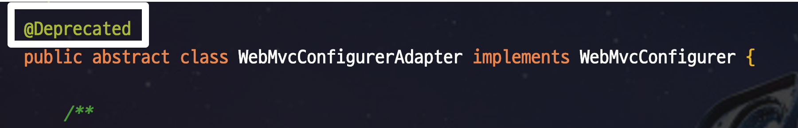
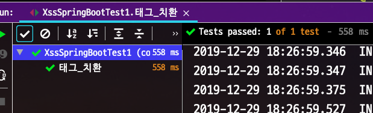
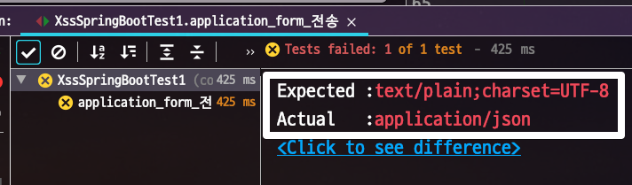
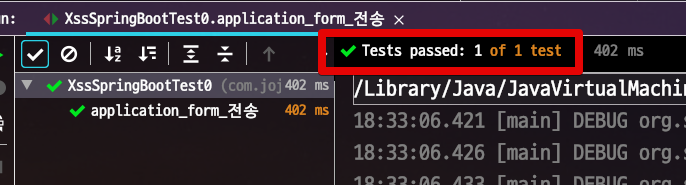
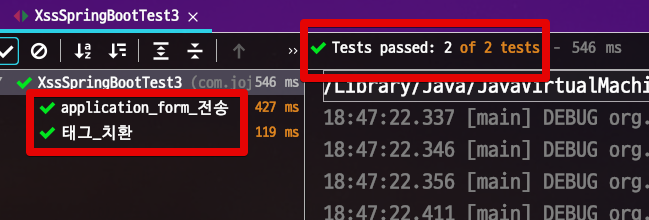
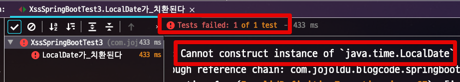
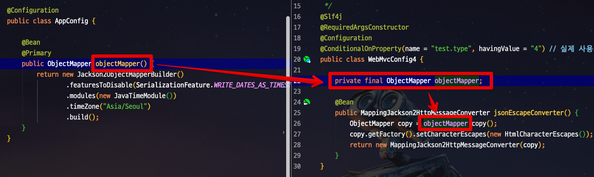
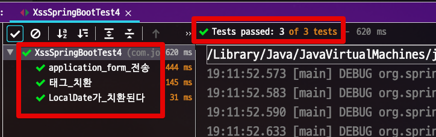

# Spring Boot에서 JSON API에 XSS Filter 적용하기

일반적인 웹 애플리케이션에서 기본적으로 해야할 보안으로 XSS 방지가 있습니다.  
기존에 많이들 알고 계시는 lucy filter의 단점은 이미 오명운 님께서 잘 정리해주셨기 때문에 한번쯤 읽어 보셔도 좋을것 같습니다.  

* [homoefficio.github.io - Spring에서 JSON에 XSS 방지 처리 하기](https://homoefficio.github.io/2016/11/21/Spring%EC%97%90%EC%84%9C-JSON%EC%97%90-XSS-%EB%B0%A9%EC%A7%80-%EC%B2%98%EB%A6%AC-%ED%95%98%EA%B8%B0/)

요약하자면,  

* lucy 필터는 form data 전송 방식엔 유효하지만, **@RequestBody**로 전달되는 JSON 요청은 처리해주지 않는다

> 정말 친절하게 설명해주셨기 때문에 꼭 읽어보시길 추천드립니다.

다만  ```WebMvcConfigurerAdapter``` 가 스프링 부트 버전이 올라가면서 **Deprecated**가 되었습니다.



그래서 다른 방법으로 해결해보겠습니다.

> 이 방식은 오명운님께서 작성해주신 방법을 응용한 형태입니다.
> 즉, **Response를 클라이언트로 내보내는** 단계에서 escape 합니다.


테스트한 환경은

* Java 8
* Spring Boot 2.2.2

입니다.

## 1. 문제 상황 재현

먼저 문제 상황을 재현해봅니다.

```java
@Slf4j
@RestController
public class XssRequestController {

    @PostMapping("/xss")
    public String xss (@RequestBody XssRequestDto xssRequestDto) {
        log.info("requestDto={}", xssRequestDto);

        return xssRequestDto.getContent();
    }
}

@ToString
@Getter
@NoArgsConstructor
public class XssRequestDto {
    private String content;

    public XssRequestDto(String content) {
        this.content = content;
    }
}
```

* HTML 태그가 담길 Request Body 를 생성하여 ```/xss``` 컨트롤러에서 사용합니다.

테스트 코드로 이를 검증해봅니다.

```java
@RunWith(SpringRunner.class)
@SpringBootTest(webEnvironment = RANDOM_PORT)
public class XssSpringBootTest0 {

    @Autowired
    private TestRestTemplate restTemplate;

    @Test
    public void 태그_치환() {
        String content = "<li>content</li>";
        String expected = "&lt;li&gt;content&lt;/li&gt;";
        ResponseEntity<XssRequestDto> response = restTemplate.postForEntity(
                "/xss",
                new XssRequestDto(content),
                XssRequestDto.class);
        assertThat(response.getStatusCode()).isEqualTo(HttpStatus.OK);
        assertThat(response.getBody().getContent()).isEqualTo(expected);
    }
}
```

당연히 어떤 추가적인 작업도 없으니 해당 테스트는 실패합니다.  
예상한 대로 escape 처리가 되지 않아 테스트가 실패합니다. 


이제부터 하나씩 해결해보겠습니다.

## 2. 해결책

일단 태그 변환을 위한 HtmlCharacterEscapes 클래스를 생성합니다.

> 해당 클래스는 이미 오명운님께서 만들어주신걸 사용했습니다.

```java
import com.fasterxml.jackson.core.SerializableString;
import com.fasterxml.jackson.core.io.CharacterEscapes;
import com.fasterxml.jackson.core.io.SerializedString;
import org.apache.commons.text.StringEscapeUtils;

public class HtmlCharacterEscapes extends CharacterEscapes {

    private final int[] asciiEscapes;

    public HtmlCharacterEscapes() {
        // 1. XSS 방지 처리할 특수 문자 지정
        asciiEscapes = CharacterEscapes.standardAsciiEscapesForJSON();
        asciiEscapes['<'] = CharacterEscapes.ESCAPE_CUSTOM;
        asciiEscapes['>'] = CharacterEscapes.ESCAPE_CUSTOM;
        asciiEscapes['\"'] = CharacterEscapes.ESCAPE_CUSTOM;
        asciiEscapes['('] = CharacterEscapes.ESCAPE_CUSTOM;
        asciiEscapes[')'] = CharacterEscapes.ESCAPE_CUSTOM;
        asciiEscapes['#'] = CharacterEscapes.ESCAPE_CUSTOM;
        asciiEscapes['\''] = CharacterEscapes.ESCAPE_CUSTOM;
    }

    @Override
    public int[] getEscapeCodesForAscii() {
        return asciiEscapes;
    }

    @Override
    public SerializableString getEscapeSequence(int ch) {
        return new SerializedString(StringEscapeUtils.escapeHtml4(Character.toString((char) ch)));
    }
}
```

그리고 ```StringEscapeUtils``` 를 사용하기 위해 ```commons-text``` 의존성을 추가해줍니다.  
  
**build.gradle**

```groovy
compile('org.apache.commons:commons-text:1.8')
```

> 이 코드에 대한 자세한 설명은 다시 한번 오명운님의 글을 참고해보세요

이제 이 ```HtmlCharacterEscapes``` 가 적용되도록 설정 해보겠습니다.

### 2-1. 해결책 1

첫번째 방법으로 ```WebMvcConfigurer``` 을 구현 (```implements```) 한 Config 클래스를 추가해보겠습니다.  

> **각각의 테스트가 독립적으로 실행**되기 위해 Config 클래스들은 모두 ```@ConditionalOnProperty``` 를 선언해서 사용합니다.

```java
@Slf4j
@Configuration
@EnableWebMvc
@ConditionalOnProperty(name = "test.type", havingValue = "1") // 실제 사용시에는 제거해주세요 (개별 테스트를 위해 사용)
public class WebMvcConfig1 implements WebMvcConfigurer {

    @Override
    public void configureMessageConverters(List<HttpMessageConverter<?>> converters) {
        log.info(">>>>>>>>>>>>>>>>>>> [WebMvcConfig1]");
        converters.add(htmlEscapingConverter());
    }

    private HttpMessageConverter<?> htmlEscapingConverter() {
        ObjectMapper objectMapper = new ObjectMapper();
        objectMapper.getFactory().setCharacterEscapes(new HtmlCharacterEscapes());

        return new MappingJackson2HttpMessageConverter(objectMapper);
    }
}
```

이 Config를 적용한 테스트 코드입니다.

```java
@RunWith(SpringRunner.class)
@SpringBootTest(webEnvironment = RANDOM_PORT)
@TestPropertySource(properties = "test.type=1")
public class XssSpringBootTest1 {

    @Autowired
    private TestRestTemplate restTemplate;

    @Test
    public void 태그_치환() {
        String content = "<li>content</li>";
        String expected = "&lt;li&gt;content&lt;/li&gt;";
        ResponseEntity<XssRequestDto> response = restTemplate.postForEntity(
                "/xss",
                new XssRequestDto(content),
                XssRequestDto.class);
        assertThat(response.getStatusCode()).isEqualTo(HttpStatus.OK);
        assertThat(response.getBody().getContent()).isEqualTo(expected);
    }
}
```

이 테스트를 수행해보면!



성공적으로 통과 합니다!  
  
오 이렇게 하면 이제 성공한걸까요?  
  
추가로 테스트를 사용해봅니다.  
이번에는 ```application/json``` 이 아닌 ```application/x-www-form-urlencoded``` 요청을 보내보겠습니다.  
  
요청을 받을 Controller입니다.

```java
    @PostMapping("/form")
    public @ResponseBody String form (XssRequestDto requestDto) {
        log.info("requestDto={}", requestDto);
        return requestDto.getContent();
    }
```

해당 Controller에 요청을 보낼 테스트 코드입니다.

```java
@Test
public void application_form_전송() {
    String content = "<li>content</li>";
    HttpHeaders headers = new HttpHeaders();
    headers.setContentType(MediaType.APPLICATION_FORM_URLENCODED);
    MultiValueMap<String, String> map = new LinkedMultiValueMap<>();
    map.add("content", content);

    HttpEntity<MultiValueMap<String, String>> entity = new HttpEntity<>(map, headers);

    ResponseEntity<String> response = restTemplate.exchange("/form",
            HttpMethod.POST,
            entity,
            String.class);

    assertThat(response.getStatusCode()).isEqualTo(HttpStatus.OK);
    assertThat(response.getHeaders().getContentType().toString()).isEqualTo("text/plain;charset=UTF-8");
    assertThat(response.getBody()).isEqualTo(content);
}
```

테스트를 수행해보면?



실패합니다.  

* ```text/plain```을 기대했는데, 실제 응답 타입은 ```application/json```으로 왔습니다.
  
@ResponseBody 때문일까요?  
한번 확인해보겠습니다.  
별도로 Config 파일을 사용하지 않는 상태에서 다시 테스트해봅니다.



**WebMvcConfig1** 가 없는 버전에서는 정상적으로 ```text/plain``` 이 왔습니다.  
  
왜 이럴까요?  
  
이는 ```@EnableWebMvc``` 때문인데요.  
스프링에서는 기본적으로 별도로 설정이 없다면 HttpMessageConverter 에 아래의 Converter들을 추가합니다.

* ```ByteArrayHttpMessageConverter```
* ```StringHttpMessageConverter```
* ```FormHttpMessageConverter```
* ```MappingJacksonHttpMessageConverter / MappingJackson2HttpMessageConverter2```
* ```ResourceHttpMessageConverter```
  
헌데, ```@EnableWebMvc``` 이 활성화되면 이들 Converter들이 모두 ```@EnableWebMvc```가 들어간 설정으로 **덮어써집니다**.  
  
여기선 htmlEscapingConverter만 유일하게 적용되니 실제 스프링 애플리케이션에 **htmlEscapingConverter만** (json converter) 남게 된 것입니다.  
  
그럼 ```@EnableWebMvc```를 제외하면 문제가 해결될까요?

### 2-2. 해결책 2

해결책 1번이 문제가 있으니 ```@EnableWebMvc```를 **제거한 버전의 설정**을 적용해보겠습니다.

```java
@Slf4j
@Configuration
@ConditionalOnProperty(name = "test.type", havingValue = "2") // 실제 사용시에는 제거해주세요 (개별 테스트를 위해 사용)
public class WebMvcConfig2 implements WebMvcConfigurer {

    @Override
    public void configureMessageConverters(List<HttpMessageConverter<?>> converters) {
        log.info(">>>>>>>>>>>>>>>>>>> [WebMvcConfig2]");
        converters.add(htmlEscapingConverter());
    }

    private HttpMessageConverter<?> htmlEscapingConverter() {
        ObjectMapper objectMapper = new ObjectMapper();
        objectMapper.getFactory().setCharacterEscapes(new HtmlCharacterEscapes());

        return new MappingJackson2HttpMessageConverter(objectMapper);
    }
}
```

이 설정을 사용한 테스트 코드들입니다.

* 태그 치환
* application_form_전송

2가지 테스트가 모두 포함입니다.

```java
@RunWith(SpringRunner.class)
@SpringBootTest(webEnvironment = RANDOM_PORT)
@TestPropertySource(properties = "test.type=2")
public class XssSpringBootTest2 {

    @Autowired
    private TestRestTemplate restTemplate;

    @Test
    public void 태그_치환() {
        String content = "<li>content</li>";
        String expected = "&lt;li&gt;content&lt;/li&gt;";
        ResponseEntity<XssRequestDto> response = restTemplate.postForEntity(
                "/xss",
                new XssRequestDto(content),
                XssRequestDto.class);
        assertThat(response.getStatusCode()).isEqualTo(HttpStatus.OK);
        assertThat(response.getBody().getContent()).isEqualTo(expected);
    }

    @Test
    public void application_form_전송() {
        String content = "<li>content</li>";
        HttpHeaders headers = new HttpHeaders();
        headers.setContentType(MediaType.APPLICATION_FORM_URLENCODED);
        MultiValueMap<String, String> map = new LinkedMultiValueMap<>();
        map.add("content", content);

        HttpEntity<MultiValueMap<String, String>> entity = new HttpEntity<>(map, headers);

        ResponseEntity<String> response = restTemplate.exchange("/form",
                HttpMethod.POST,
                entity,
                String.class);

        assertThat(response.getStatusCode()).isEqualTo(HttpStatus.OK);
        assertThat(response.getBody()).isEqualTo(content);
    }
}
```

이를 테스트 해보면?


* application form은 성공
* 태그 치환은 실패

즉, **Config 설정이 전혀 적용 안된**상태입니다.  
  
이 문제를 해결하기 위해서 추가로 ```WebMVcConfigureAdapter``` 를 사용하는 방법도 있겠지만, 여기서는 **좀 더 쉬운 방법**을 소개드리겠습니다.  

### 2-3. 해결책 3

가장 쉬운 방법은 **htmlEscapingConverter를 Bean으로 등록**하는 것입니다.  

```java
@Slf4j
@RequiredArgsConstructor
@Configuration
@ConditionalOnProperty(name = "test.type", havingValue = "3") // 실제 사용시에는 제거해주세요 (개별 테스트를 위해 사용)
public class WebMvcConfig3 {

    @Bean
    public MappingJackson2HttpMessageConverter jsonEscapeConverter() {
        ObjectMapper objectMapper = new ObjectMapper();
        objectMapper.getFactory().setCharacterEscapes(new HtmlCharacterEscapes());
        return new MappingJackson2HttpMessageConverter(objectMapper);
    }
}
```

HttpMessageConverter가 Bean으로 등록할 경우 스프링 컨텍스트의 **Converter 리스트에 이를 자동으로 추가**해줍니다.  
  
자 그럼 이 설정을 가지고 테스트를 수행해보겠습니다.

```java
@RunWith(SpringRunner.class)
@SpringBootTest(webEnvironment = RANDOM_PORT)
@TestPropertySource(properties = "test.type=3")
public class XssSpringBootTest3 {

    @Autowired
    private TestRestTemplate restTemplate;

    @Test
    public void 태그_치환() {
        String content = "<li>content</li>";
        String expected = "&lt;li&gt;content&lt;/li&gt;";
        ResponseEntity<XssRequestDto> response = restTemplate.postForEntity(
                "/xss",
                new XssRequestDto(content),
                XssRequestDto.class);
        assertThat(response.getStatusCode()).isEqualTo(HttpStatus.OK);
        assertThat(response.getBody().getContent()).isEqualTo(expected);
    }

    @Test
    public void application_form_전송() {
        String content = "<li>content</li>";
        HttpHeaders headers = new HttpHeaders();
        headers.setContentType(MediaType.APPLICATION_FORM_URLENCODED);
        MultiValueMap<String, String> map = new LinkedMultiValueMap<>();
        map.add("content", content);

        HttpEntity<MultiValueMap<String, String>> entity = new HttpEntity<>(map, headers);

        ResponseEntity<String> response = restTemplate.exchange("/form",
                HttpMethod.POST,
                entity,
                String.class);

        assertThat(response.getStatusCode()).isEqualTo(HttpStatus.OK);
        assertThat(response.getBody()).isEqualTo(content);
    }
}
```

자 테스트를 돌려보면?



2개의 테스트가 모두 통과합니다!  
  
이제 끝난걸까요?  
한가지 문제가 더 남았습니다.  
  
JSON을 사용할때 문자열외에도 여러 타입을 사용합니다.  
대표적으로 ```LocalDate```가 있는데요.  
  
LocalDate를 사용하는 API에선 어떨까요?

```java
@PostMapping("/xss2")
public @ResponseBody XssRequestDto2 xss2 (@RequestBody XssRequestDto2 requestDto) {
    log.info("requestDto={}", requestDto);

    return requestDto;
}
```

이 Controller에서 사용할 Dto 클래스입니다.

```java
@ToString
@Getter
@NoArgsConstructor
public class XssRequestDto2 {
    private String content;

    @DateTimeFormat(pattern = "yyyy-MM-dd")
    @JsonFormat(shape = JsonFormat.Shape.STRING, pattern = "yyyy-MM-dd", timezone = "Asia/Seoul")
    private LocalDate requestDate;

    public XssRequestDto2(String content, LocalDate requestDate) {
        this.content = content;
        this.requestDate = requestDate;
    }
}
```

보시는것처럼 LocalDate 를 사용하고 그 포맷을 ```yyyy-MM-dd```를 사용합니다.  
테스트 코드를 추가해보겠습니다.

```java
@Test
public void LocalDate가_치환된다() throws Exception {
    String content = "<li>content</li>";
    String expected = "&lt;li&gt;content&lt;/li&gt;";
    LocalDate requestDate = LocalDate.of(2019,12,29);
    ResponseEntity<XssRequestDto2> response = restTemplate.postForEntity(
            "/xss2",
            new XssRequestDto2(content, requestDate),
            XssRequestDto2.class);
    assertThat(response.getStatusCode()).isEqualTo(HttpStatus.OK);
    assertThat(response.getBody().getContent()).isEqualTo(expected);
    assertThat(response.getBody().getRequestDate()).isEqualTo(requestDate);
}
```

테스트를 수행해보면?



이는 **기존에 등록된 ObjectMapper**가 jsonEscapeConverter에 등록되어 있지 않기 때문입니다.  


### 2-4. 해결책 4

이미 json 변환에 대해서는 Bean에 등록된 ```ObjectMapper``` 에 다 설정되어있습니다.  
이를 그대로 Converter에서 그대로 사용만 하면 되겠죠?

```java
@Configuration
public class AppConfig {

    @Bean
    @Primary
    public ObjectMapper objectMapper() {
        return new Jackson2ObjectMapperBuilder()
                .featuresToDisable(SerializationFeature.WRITE_DATES_AS_TIMESTAMPS)
                .modules(new JavaTimeModule())
                .timeZone("Asia/Seoul")
                .build();
    }
}
```

자 그럼 마지막 설정입니다.

```java
@Slf4j
@RequiredArgsConstructor
@Configuration
@ConditionalOnProperty(name = "test.type", havingValue = "4") // 실제 사용시에는 제거해주세요 (개별 테스트를 위해 사용)
public class WebMvcConfig4 {

    private final ObjectMapper objectMapper;

    @Bean
    public MappingJackson2HttpMessageConverter jsonEscapeConverter() {
        ObjectMapper copy = objectMapper.copy();
        copy.getFactory().setCharacterEscapes(new HtmlCharacterEscapes());
        return new MappingJackson2HttpMessageConverter(copy);
    }
}
```



그리고 이를 가지고 다시 테스트를 수행해봅니다.

```java
@RunWith(SpringRunner.class)
@SpringBootTest(webEnvironment = RANDOM_PORT)
@TestPropertySource(properties = "test.type=4")
public class XssSpringBootTest4 {

    @Autowired
    private TestRestTemplate restTemplate;

    @Test
    public void 태그_치환() {
        String content = "<li>content</li>";
        String expected = "&lt;li&gt;content&lt;/li&gt;";
        ResponseEntity<XssRequestDto> response = restTemplate.postForEntity(
                "/xss",
                new XssRequestDto(content),
                XssRequestDto.class);
        assertThat(response.getStatusCode()).isEqualTo(HttpStatus.OK);
        assertThat(response.getBody().getContent()).isEqualTo(expected);
    }

    @Test
    public void application_form_전송() {
        String content = "<li>content</li>";
        HttpHeaders headers = new HttpHeaders();
        headers.setContentType(MediaType.APPLICATION_FORM_URLENCODED);
        MultiValueMap<String, String> map = new LinkedMultiValueMap<>();
        map.add("content", content);

        HttpEntity<MultiValueMap<String, String>> entity = new HttpEntity<>(map, headers);

        ResponseEntity<String> response = restTemplate.exchange("/form",
                HttpMethod.POST,
                entity,
                String.class);

        assertThat(response.getStatusCode()).isEqualTo(HttpStatus.OK);
        assertThat(response.getBody()).isEqualTo(content);
    }

    @Test
    public void LocalDate가_치환된다() throws Exception {
        String content = "<li>content</li>";
        String expected = "&lt;li&gt;content&lt;/li&gt;";
        LocalDate requestDate = LocalDate.of(2019,12,29);
        ResponseEntity<XssRequestDto2> response = restTemplate.postForEntity(
                "/xss2",
                new XssRequestDto2(content, requestDate),
                XssRequestDto2.class);
        assertThat(response.getStatusCode()).isEqualTo(HttpStatus.OK);
        assertThat(response.getBody().getContent()).isEqualTo(expected);
        assertThat(response.getBody().getRequestDate()).isEqualTo(requestDate);
    }
}
```

테스트를 수행하면!



성공적으로 모든 테스트가 통과됩니다.  
끝났습니다!

## 3. 결론

최종 결론입니다.  

* ```@EnableWebMvc```를 사용하면 기존 Converter 설정이 모두 Override 되니 사용할 수 없습니다.
* HttpMessageConverter는 Bean으로 등록시 자동으로 메세지 컨버터 목록에 추가 됩니다.
  * 별도로 ```WebMvcConfigurer```, ```configureMessageConverters``` 를 사용하지 않으니 기존 설정들이 오염되지 않습니다.
* 이미 기존에 등록된 ```ObjectMapper``` Bean이 있다면 JSON 요청/응답에서 사용하기 위해 의존성 주입을 받아 사용합니다.
 
최종적으로는 실제 코드에서 아래의 config 클래스를 추가해서 사용합니다.

```java
@Slf4j
@RequiredArgsConstructor
@Configuration
public class WebMvcConfig {

    private final ObjectMapper objectMapper;

    @Bean
    public MappingJackson2HttpMessageConverter jsonEscapeConverter() {
        ObjectMapper copy = objectMapper.copy();
        copy.getFactory().setCharacterEscapes(new HtmlCharacterEscapes());
        return new MappingJackson2HttpMessageConverter(copy);
    }
}
```

