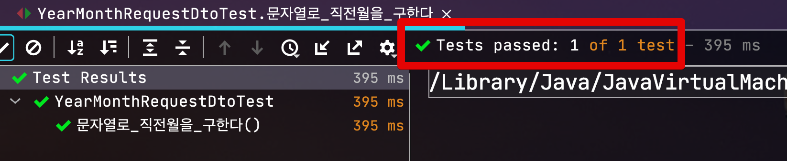
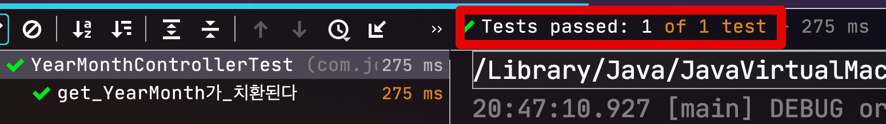
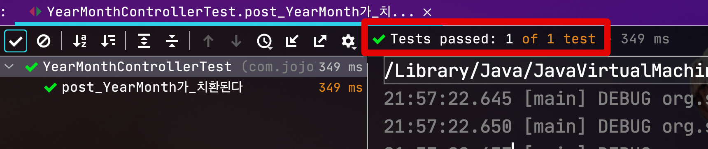
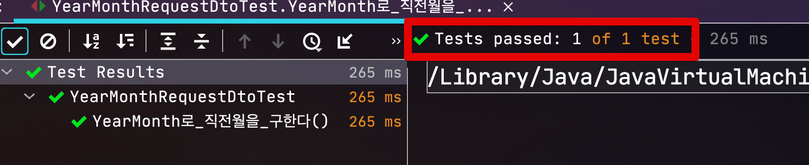
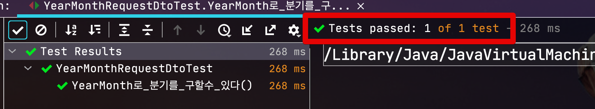

# Spring Boot에서 yyyy-MM 포맷으로 날짜 받고싶을때

Spring Boot에서 Request 항목으로 **년월** (2020-09, 202009 등)만 필요할때가 종종 있습니다.  
  
2020-09-01과 같은 일자의 경우 Request Dto로 LocalDate를 사용할 수 있었는데요.  

> Spring Boot 환경에서의 LocalDate, LocalDateTime에 대한 상세한 내용은 이전에 작성된 [SpringBoot에서 날짜 타입 JSON 변환에 대한 오해 풀기](https://jojoldu.tistory.com/361)을 참고해보시면 좋습니다.

년/월만 있을 경우 LocalDate로 처리할 수가 없습니다.  
  
그래서 아래와 같이 **문자열로 받고, LocalDate로 치환**한 뒤에 다시 월 연산을 시작하곤 하는데요.  

```java
@ToString
@Getter
@NoArgsConstructor
public class YearMonthRequestDto {

    @Pattern(regexp = "^\\d{4}\\-(0[1-9]|1[012])$", message = "년월 형식(yyyy-MM)에 맞지 않습니다") // yyyy-MM만 받기 위한 정규표현식
    private String strYearMonth;

    ...

    /**
        입력 받은 년/월의 **한달전** 날짜 구하기
    **/
    public String getBeforeMonthByString () {
        String strDate = this.strYearMonth+"-01";
        LocalDate date = parse(strDate, DateTimeFormatter.ofPattern("yyyy-MM-dd"));
        LocalDate beforeDate = date.minusMonths(1);

        return beforeDate.format(DateTimeFormatter.ofPattern("yyyy-MM"));
    }
}
```

단순히 직전 월을 구하는 기능임에도 1) 대량의 코드 2) 컴파일 체크를 위한 정규표현식과 포맷들이 가득찬 코드임을 알 수 있습니다.  
  
물론 위 코드는 실제로는 잘 작동합니다.

```java
@Test
void 문자열로_직전월을_구한다() throws Exception {
    //given
    String month = "2020-09";
    YearMonthRequestDto dto = YearMonthRequestDto.builder()
            .strYearMonth(month)
            .build();
    //when
    String beforeMonth = dto.getBeforeMonthByString();

    //then
    assertThat(beforeMonth).isEqualTo("2020-08");
}
```



다만 누가봐도 불편하고 비효율적인 코드임은 당연하기 때문에 기존의 LocalDate처럼 **년월만 전문적으로 다뤄줄 타입**이 별도로 필요해보입니다.  
  
해당 타입은 바로 [YearMonth](https://docs.oracle.com/javase/8/docs/api/java/time/YearMonth.html) 인데요.  
Java 8부터 도입된 **년월을 다루는 타입**입니다.  
년월을 다루기 위해 여러가지 지원이 있는데요.  
어떤 것들이 가능한지 상세히 살펴보겠습니다.

> Java 7이하를 사용하신다면 [Joda-Time 라이브러리](https://d2.naver.com/helloworld/645609)를 사용하시면 됩니다.

자 그럼 YearMonth를 사용해보겠습니다.

## 1. API 필드로 받기

먼저 해당 타입이 API로 받을 수 있는지 보겠습니다.

### 1-1. Get

[이전에 작성된 포스팅](https://jojoldu.tistory.com/361)을 통해 날짜 타입을 원하는 포맷으로 받기 위해서는 

* Get: ```@DateTimeFormat```
* Post: ```@JsonFormat```

을 사용해야함을 공유드렸는데요.  
그래서 테스트로 사용할 Dto 클래스에도 Get/Post 모두를 사용할 수 있게 ```@DateTimeFormat```와 ```@JsonFormat``` 둘 다 선언합니다.

> 포맷은 ```yyyy-MM``` 을 사용합니다.

```java
@ToString
@Getter
@NoArgsConstructor
public class YearMonthRequestDto {

    @DateTimeFormat(pattern = "yyyy-MM")
    @JsonFormat(shape = JsonFormat.Shape.STRING, pattern = "yyyy-MM", timezone = "Asia/Seoul")
    private YearMonth yearMonth;

}
```

그리고 이를 Controller에서는 기존 Dto와 동일하게 사용하면 됩니다.


```java
@GetMapping("/yearMonth")
public YearMonth getYearMonth (YearMonthRequestDto requestDto) {
    log.info("requestDto={}", requestDto);
    return requestDto.getYearMonth();
}
```

해당 코드가 잘 작동하는지 테스트 코드로 검증해봅니다.


```java
@RunWith(SpringRunner.class)
@WebMvcTest(controllers = {YearMonthController.class, AppConfig.class})
public class YearMonthControllerTest {

    @Autowired
    private MockMvc mvc;

    @Test
    public void get_YearMonth가_치환된다() throws Exception {
        String yearMonth = "2020-08";
        MultiValueMap<String, String> params = new LinkedMultiValueMap<>();
        params.put("yearMonth", Arrays.asList(yearMonth));

        mvc
                .perform(get("/yearMonth")
                        .params(params)
                        .contentType(MediaType.APPLICATION_JSON))
                .andExpect(status().isOk())
                .andExpect(content().contentType(MediaType.APPLICATION_JSON))
                .andExpect(content().string(containsString(yearMonth)));
    }
}
```



LocalDate와 마찬가지로 원하는 포맷으로 날짜값을 정확히 받는 것을 확인할 수 있습니다.

### 1-2. Post

바로 Post로 넘어가서 테스트 해보겠습니다.  
Post의 경우 Json으로 데이터를 주고 받을 예정이라 ```@RequestBody```를 추가합니다.

```java
@PostMapping("/yearMonth")
public YearMonth postYearMonth (@RequestBody YearMonthRequestDto requestDto) {
    log.info("requestDto={}", requestDto);
    return requestDto.getYearMonth();
}
```

마찬가지로 테스트 코드 역시 Post용으로 추가하여서 검증해봅니다.

```java
@Test
public void post_YearMonth가_치환된다() throws Exception {
    String content = "{\"yearMonth\":\"2020-08\"}";
    mvc
            .perform(post("/yearMonth")
                    .content(content)
                    .contentType(MediaType.APPLICATION_JSON))
            .andExpect(status().isOk())
            .andExpect(content().contentType(MediaType.APPLICATION_JSON))
            .andExpect(content().string(containsString("2020-08")));
}
```



Post 역시 정상적으로 데이터를 받는 것을 확인할 수 있습니다.

## 2. Dto 내부에서 연산

이렇게 HTTP API로 받은 YearMonth 필드는 다음과 같이 여러가지 날짜와 관련된 기능을 편하게 사용해볼 수 있습니다.

### 2-1. 직전 월 구하기

Dto 클래스에서 String 필드 외에 YearMonth를 추가하면 다음과 같이 됩니다.  

```java
public class YearMonthRequestDto {

    @DateTimeFormat(pattern = "yyyy-MM")
    @JsonFormat(shape = JsonFormat.Shape.STRING, pattern = "yyyy-MM", timezone = "Asia/Seoul")
    private YearMonth yearMonth;

    public YearMonth getBeforeMonthByYearMonth () {
        return this.yearMonth.minusMonths(1);
    }
}
```

LocalDate와 마찬가지로 일자를 다루는 타입이기 때문에 ```plusMonth```, ```minusYear``` 등의 메소드를 지원합니다.  
그래서 직전 월을 구하는 코드는 아주 간단하게 사용할 수 있습니다.

```java
public YearMonth getBeforeMonthByYearMonth () {
    return this.yearMonth.minusMonths(1);
}
```

테스트 코드로 돌려보면?

```java
@Test
void YearMonth로_직전월을_구한다() throws Exception {
    //given
    YearMonth month = YearMonth.of(2020,9);
    YearMonthRequestDto dto = YearMonthRequestDto.builder()
            .yearMonth(month)
            .build();
    //when
    YearMonth beforeMonth = dto.getBeforeMonthByYearMonth();

    //then
    assertThat(beforeMonth).isEqualTo(YearMonth.of(2020,8));
}
```



원하는대로 잘 작동되는 것을 확인할 수 있습니다.  

### 2-2. 분기 구하기

년월을 다루는 타입이다보니 **분기와 같이 1년, 월에서 파생 될 수있는 모든 필드**를 얻을 수도 있는데요.  
  
이를테면 **해당 월의 분기**가 필요하다면 다음과 같이 구할 수 있습니다.

```java
YearMonth.of(2020,1).get(IsoFields.QUARTER_OF_YEAR)
```

실제로 테스트를 돌려보면?

```java
@Test
void YearMonth로_분기를_구할수_있다() throws Exception {
    assertThat(YearMonth.of(2020,1).get(IsoFields.QUARTER_OF_YEAR)).isEqualTo(1);
    assertThat(YearMonth.of(2020,4).get(IsoFields.QUARTER_OF_YEAR)).isEqualTo(2);
    assertThat(YearMonth.of(2020,7).get(IsoFields.QUARTER_OF_YEAR)).isEqualTo(3);
    assertThat(YearMonth.of(2020,10).get(IsoFields.QUARTER_OF_YEAR)).isEqualTo(4);
}
```



원하는 분기를 반환하는 것을 확인할 수 있습니다.  


