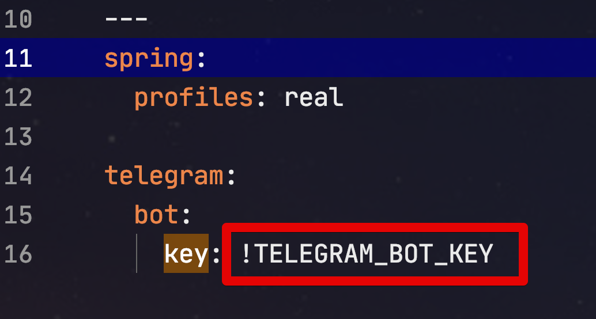

# YAML ConstructorException 발생시 해결 방법

Spring Boot 환경에서 ```application.yml``` 파일에 여러 설정을 하다보면 가끔 아래와 같은 에러 메세지가 발생하며 애플리케이션 실행이 실패하게 됩니다.

```bash
Caused by: org.yaml.snakeyaml.constructor.ConstructorException: could not determine a constructor for the tag !TELEGRAM_BOT_KEY
 in 'reader', line 16, column 10:
        key: !TELEGRAM_BOT_KEY
```

