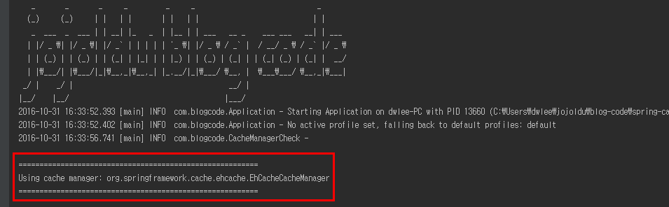
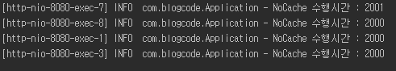
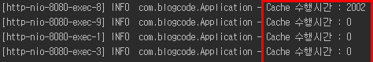
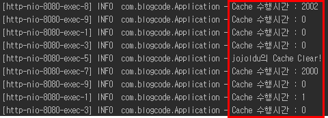
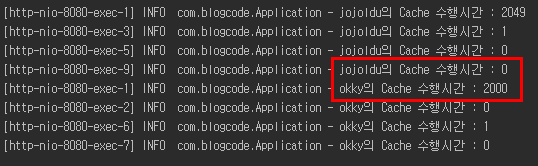

# Spring 캐시 서비스
팀내 신입사원들이 입사하게 되어 간단하게나마 참고할 수 있도록 Spring Cache에 대해 샘플예제와 소개를 정리하게 되었다. <br/>
아주 간단한 예제이기도 하고, 웬만한 경력 웹 개발자분들은 다 아는 이야기라 한번도 캐시를 사용해보지 않은 분들에게 도움이 될것 같다. <br/>
여기서 사용할 CacheManager는 **EhCache** 이다. <br/>
Spring Cache의 대표격이라고 생각했다. <br/>
Redis나 Memcached를 선택하지 않은 이유는 Cache 본연의 기능에 초점을 맞추기가 힘들어 여러가지 한눈팔기 쉬울것 같아서였다. <br/>
(물론 우리회사 시스템은 Ehcache/Redis/Memcached를 다 쓰고 있다.) <br/>
그럼 이제 시작하겠다.

### 소개
캐시란 동일한 요청이 들어오면 복잡한 작업을 수행해서 결과를 만드는 대신 **이미 보관된 결과를 바로 돌려주는 방식**을 말한다. <br/>


(구글에서 캐시 검색하면 나오는 이분이 아닙니다..)

일반적으로 사용자가 만드는 데이터 보다는 **서비스에서 제공하는 컨텐츠(뉴스,허브,실시간 검색어 등)에** 대부분 적용해서 사용 중이다 <br/>


(관리자들로 인해 최소 1분에서 최대 하루까지 같은 데이터가 노출되니 캐시하기 딱 좋다.) <br/>
<br/>
캐시의 경우 모든 상황에서 쓸 수 있는 것은 아니다. 아래의 조건을 만족한다면 캐시 사용을 한번 고려해보는 것이 좋다.<br/>
* 반복적으로 동일한 결과를 돌려주는 작업
* 각 작업의 시간이 오래 걸리거나 서버에 부담을 주는 경우 (외부 API/DB 데이터호출 등)

<br/>
이제 예제코드로 본론을 시작하겠다.

### 예제
예제 코드는 SpringBoot + Gradle + Ehcache 2.x + Logback 환경이다. <br/>
모든 코드는 [Github](https://github.com/jojoldu/blog-code/tree/master/spring-cache)에서 관리중이니 필요하다면 확인하면 될것 같다.
**캐시** 기능에 집중하기 위해서 불필요한 설정은 제외하기 위해 선택하였다. <br/>
그럼 하나하나 코드를 작성해나가겠다. <br/>
<br/>

**build.gradle**

```
buildscript {
	ext {
		springBootVersion = '1.4.1.RELEASE'
	}
	repositories {
		mavenCentral()
	}
	dependencies {
		classpath("org.springframework.boot:spring-boot-gradle-plugin:${springBootVersion}")
	}
}

apply plugin: 'java'
apply plugin: 'eclipse'
apply plugin: 'spring-boot'

jar {
	baseName = 'spring-cache'
	version = '0.0.1-SNAPSHOT'
}
sourceCompatibility = 1.8
targetCompatibility = 1.8

repositories {
	mavenCentral()
}


dependencies {
	compile('org.springframework.boot:spring-boot-starter-cache')
	compile('org.springframework.boot:spring-boot-starter-web')

	compile group: 'net.sf.ehcache', name: 'ehcache', version: '2.10.3'

	testCompile('org.springframework.boot:spring-boot-starter-test')
}
```

spring-boot-starter-cache는 **캐시관련 설정을 편리하게 지원해주는 패키지** 이다. 덕분에 CacheManager, EhCacheManagerFactoryBean 등의 bean 생성을 직접 안할수 있게 되었다. <br/>
spring-boot-starter-cache는 기본 CacheManager로 ConcurrentHashMap을 사용하고 있어서 Ehcache 2.x 로 교체하기 위해 직접 의존성을 추가하였다. <br/>
여기서 DB를 사용하지 않기 때문에 추가적인 starter 패키지는 없다. <br/>
혹시나 SpringBoot 환경이 아니라면 [mykong님의 포스팅](https://www.mkyong.com/spring/spring-caching-and-ehcache-example/)을 따라 설정하면 된다. <br/>

**CacheManagerCheck.java**

```
import org.slf4j.Logger;
import org.slf4j.LoggerFactory;
import org.springframework.boot.CommandLineRunner;
import org.springframework.cache.CacheManager;
import org.springframework.stereotype.Component;

@Component
public class CacheManagerCheck implements CommandLineRunner {

    private static final Logger logger = LoggerFactory.getLogger(CacheManagerCheck.class);

    private final CacheManager cacheManager;

    public CacheManagerCheck(CacheManager cacheManager) {
        this.cacheManager = cacheManager;
    }

    @Override
    public void run(String... strings) throws Exception {
        logger.info("\n\n" + "=========================================================\n"
                + "Using cache manager: " + this.cacheManager.getClass().getName() + "\n"
                + "=========================================================\n\n");
    }
}
```

<br/>
EhCache가 설정 안된것 아닐까 의구심을 갖고 있을수 있기에 현재 어플리케이션에서 사용중인 CacheManager가 무엇인지 확인하기 위한 Component를 추가하였다. <br/>
CommandLineRunner를 통해 Application 실행시 무조건 run() 이 실행되도록 하여 CacheManager를 확인할 수 있다.
<br/>

**ehcache.xml**

```
<?xml version="1.0" encoding="UTF-8"?>
<ehcache xmlns:xsi="http://www.w3.org/2001/XMLSchema-instance"
	xsi:noNamespaceSchemaLocation="http://ehcache.org/ehcache.xsd"
	updateCheck="false">
	<diskStore path="java.io.tmpdir" />

	<cache name="findMemberCache"
		   maxEntriesLocalHeap="10000"
		   maxEntriesLocalDisk="1000"
		   eternal="false"
		   diskSpoolBufferSizeMB="20"
		   timeToIdleSeconds="300" timeToLiveSeconds="600"
		   memoryStoreEvictionPolicy="LFU"
		   transactionalMode="off">
		<persistence strategy="localTempSwap" />
	</cache>

</ehcache>
```

ehcache를 사용하기 위한 필수 xml 파일이다. <br/>
설정에 대한 자세한 내용은 [최범균님의 포스팅](http://javacan.tistory.com/entry/133)으로 확인할 수 있다. <br/>
여기서 중요하게 볼 것은 ```<cache name="findMemberCache"``` 이다. <br/>
findMemberCache은 캐시의 이름이다.<br/>
즉, 내가 캐시하고 싶은 메소드에 findMemberCache를 지정하면 설정이 그대로 적용되는 것이다. <br/>
여기서는 MemberRepositoryImpl의 캐시 관련 메소드들이 findMemberCache 캐시를 사용할 것이다.

**Application.java**

```
import org.slf4j.Logger;
import org.slf4j.LoggerFactory;
import org.springframework.beans.factory.annotation.Autowired;
import org.springframework.boot.SpringApplication;
import org.springframework.boot.autoconfigure.SpringBootApplication;
import org.springframework.cache.annotation.EnableCaching;
import org.springframework.stereotype.Controller;
import org.springframework.web.bind.annotation.GetMapping;
import org.springframework.web.bind.annotation.PathVariable;
import org.springframework.web.bind.annotation.ResponseBody;

@SpringBootApplication
@EnableCaching // 어노테이션을 이용한 캐시기능을 사용하겠다는 선언
@Controller
public class Application {

	private static Logger logger = LoggerFactory.getLogger(Application.class);

	@Autowired
	MemberRepository memberRepository;

	@GetMapping("/member/nocache/{name}")
	@ResponseBody
	public Member getNoCacheMember(@PathVariable String name){

		long start = System.currentTimeMillis(); // 수행시간 측정
		Member member = memberRepository.findByNameNoCache(name); // db 조회
		long end = System.currentTimeMillis();

		logger.info(name+ "의 NoCache 수행시간 : "+ Long.toString(end-start));

		return member;
	}

	@GetMapping("/member/cache/{name}")
	@ResponseBody
	public Member getCacheMember(@PathVariable String name){

		long start = System.currentTimeMillis(); // 수행시간 측정
		Member member = memberRepository.findByNameCache(name); // db 조회
		long end = System.currentTimeMillis();

		logger.info(name+ "의 Cache 수행시간 : "+ Long.toString(end-start));

		return member;
	}

	@GetMapping("/member/refresh/{name}")
	@ResponseBody
	public String refresh(@PathVariable String name){
		memberRepository.refresh(name); // 캐시제거
		return "cache clear!";
	}


	public static void main(String[] args) {
		SpringApplication.run(Application.class, args);
	}

	@GetMapping("/")
	@ResponseBody
	public String index(){
		return "HelloWorld";
	}
}
```

Application.java는 application과 config, controller를 다같이 수행하도록 작성하였다. <br/>
샘플 예제에서 굳이 분리하여 코드양을 늘리고 싶지 않았기 때문이다. <br/>
**@EnableCaching** 은 이 프로젝트에서 캐시 관련 어노테이션 (@Cacheable, @CacheEvict)을 사용하겠다는 선언이다. <br/>
**/member/~~~** 메소드들은 캐시와 노캐시, 캐시삭제 등을 테스트할 메소드들이다. <br/>
실제 캐시 관련 처리를 memberRepository에서 진행하기 때문에 여기선 memberRepository에서 처리하는데 얼마나 많은 시간이 소모되었는지만 측정하도록 하였다.

**Member.java**

```
public class Member {
    private long idx;

    private String email;

    private String name;

    public Member() {
    }

    public Member(long idx, String email, String name) {
        this.email = email;
        this.name = name;
    }

    public long getIdx() {
        return idx;
    }

    public void setIdx(long idx) {
        this.idx = idx;
    }

    public String getEmail() {
        return email;
    }

    public void setEmail(String email) {
        this.email = email;
    }

    public String getName() {
        return name;
    }

    public void setName(String name) {
        this.name = name;
    }
}
```

별 기능이 없는 Domain 클래스이다. <br/>
DB를 사용하지 않기 때문에 별도의 어노테이션 지정은 없다.

**MemberRepository**

```
public interface MemberRepository {
    Member findByNameNoCache(String name);
    Member findByNameCache(String name);
    void refresh(String name);
}
```

흔히들 말하는 Dao인 MemberRepository 인터페이스이다. <br/>
크게 볼것은 없다.

**MemberRepositoryImpl**

```
import org.slf4j.Logger;
import org.slf4j.LoggerFactory;
import org.springframework.cache.annotation.CacheEvict;
import org.springframework.cache.annotation.Cacheable;

@Repository
public class MemberRepositoryImpl implements MemberRepository {

    private static Logger logger = LoggerFactory.getLogger(MemberRepositoryImpl.class);

    @Override
    public Member findByNameNoCache(String name) {
        slowQuery(2000);
        return new Member(0, name+"@gmail.com", name);
    }

    @Override
    @Cacheable(value="findMemberCache", key="#name")
    public Member findByNameCache(String name) {
        slowQuery(2000);
        return new Member(0, name+ "@gmail.com", name);
    }

    @Override
    @CacheEvict(value = "findMemberCache", key="#name")
    public void refresh(String name) {
        logger.info(name + "의 Cache Clear!");
    }

    // 빅쿼리를 돌린다는 가정
    private void slowQuery(long seconds) {
        try {
            Thread.sleep(seconds);
        } catch (InterruptedException e) {
            throw new IllegalStateException(e);
        }
    }
}
```

오늘의 핵심 코드이다. <br/>
**@Cacheable(value="findMemberCache", key="#name")** 은 ehcache.xml에서 지정한 findMemberCache 캐시를 사용하겠다는 의미이며, 여기서 key는 메소드 argument인 name을 사용하겠다는 의미이다. <br/>
즉, name에 따라 별도로 캐시한다는 의미이다. <br/>
findByNameCache 메소드의 argument에 따라 캐시되기 때문에 name이 jojoldu인지, test1인지 등 name에 캐시 여부를 체크하여 캐시 안되어 있을 경우 캐시를 하고, 있으면 캐시된걸 전달하게 된다. <br/>

**@CacheEvict(value = "findMemberCache", key="#name")** 은 해당 캐시 내용을 지우겠다는 의미이다. <br/>
캐시 데이터가 갱신되어야 한다면 @CacheEvict가 선언된 메소드를 실행시키면 캐시 데이터는 삭제되고 새로운 데이터를 받아 캐시하게 된다. <br/>
@Cacheable과 마찬가지로 key에 따라 캐시를 선택해서 제거가 가능하다.

캐시와 비캐시 메소드들 간의 성능비교를 하기 위해 slowQuery라는 메소드를 추가하였다. <br/>
엄청나게 많은 양의 데이터가 존재하여 **한번 조회 할때마다 2초 이상의 시간이 필요하다고 가정** 했다. <br/>
slowQuery가 2초간 thread를 sleep 시키기 때문에 findByNameNoCache와 findByNameCache 메소드는 **최소 2초 이상의 시간이 수행** 된다. <br/>
이 상황에서 캐시에 따라 어떻게 수행속도에서 차이가 나는지 비교해볼 것이다.

**logback.xml**

```
<?xml version="1.0" encoding="UTF-8"?>
<configuration>
	<appender name="STDOUT" class="ch.qos.logback.core.ConsoleAppender">
		<layout class="ch.qos.logback.classic.PatternLayout">
			<pattern>%d{yyyy-MM-dd HH:mm:ss.SSS} [%thread] %-5level %logger{36} - %msg%n</pattern>
		</layout>
	</appender>

	<logger name="com.blogcode" level="INFO" additivity="false">
		<appender-ref ref="${logAppender:-STDOUT}" />
	</logger>

</configuration>
```

기본적인 stdout용 logback.xml 설정이다. <br/>

### 실습
프로젝트를 구동시키면 아래와 같이 현재 CacheManager가 EhCache임을 표시해준다. <br/>



먼저 캐시하지 않는 메소드를 호출해보자 <br/>
브라우저에 아래 URL을 입력후 새로고침을 몇번 해보자.

```
http://localhost:8080/member/nocache/jojoldu
```

그러면 IDE의 콘솔에는 다음과 같은 화면이 출력된다.



일정하게 약 2초의 시간이 수행되는 것을 확인할 수 있다. <br/>
<br/>
그러면 이제는 캐시하는 메소드를 호출해보자.

```
http://localhost:8080/member/cache/jojoldu
```



짜잔! <br/>
처음 수행할때는 캐시된 데이터가 없기 때문에 노캐시 메소드를 호출하듯이 약 2초의 시간이 필요하지만,
이후부터는 0.000초의 시간으로 결과가 리턴되는 것을 확인할 수 있다. <br/>
즉, **한번 캐시된 데이터는 해당 메소드를 실행시키지 않고 캐시된 데이터를 그대로 전달** 한다는 것을 확인할 수 있다.<br/>

자 그러면 만약 DB에 저장된 데이터에 update가 일어나면 캐시 데이터도 다시 저장되어야 할 것이다. <br/>
이럴 경우 기존에 저장된 캐시 데이터를 제거하면, 이후 호출에 대해 다시 갱시된 데이터를 캐시하게 될 것이다.

```
http://localhost:8080/member/cache/jojoldu
를 몇번 수행후,

http://localhost:8080/member/refresh/jojoldu
를 한번 해보자.

이후 다시
http://localhost:8080/member/cache/jojoldu
를 수행하자.
```



보는 것처럼 캐시 클리어 후, 다시 캐시를 하기 위해 메소드를 호출하고 (2초시간 소요) <br/>
이후부터는 캐시된 데이터를 사용하는 것을 확인할 수 있다!! <br/>
<br/>
마지막 실습으로, 동일 Cache가 key에 따라 별도로 캐시되는지 확인해보자.

```
http://localhost:8080/member/cache/jojoldu

를 몇번 수행후, 아래 url을 호출해보자

http://localhost:8080/member/cache/okky
```



jojoldu 요청과 okky 요청이 별도로 캐시되고 관리됨을 알 수 있다. <br/>

### 마무리
아주 짧은 예제이긴 하지만 대략적으로 캐시가 무엇인지, 어떤 효과가 있는지 알 수 있었을 것 같다. <br/>
최근엔 Redis나 Memcached를 캐시 솔루션으로 많이 사용되고 있지만, Ehcache는 아직까지 많이 쓰이고 있어 <br/>
본인의 개인 프로젝트에 한번쯤 적용해보는 것도 좋을것 같다. <br/>
<br/>

### 끝!!!
