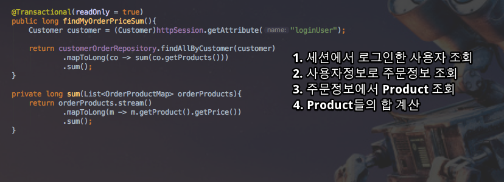
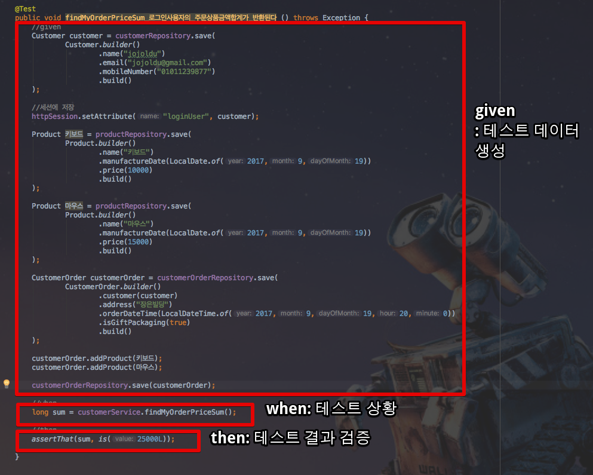
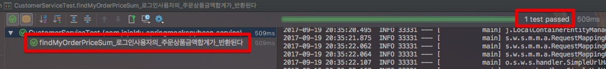
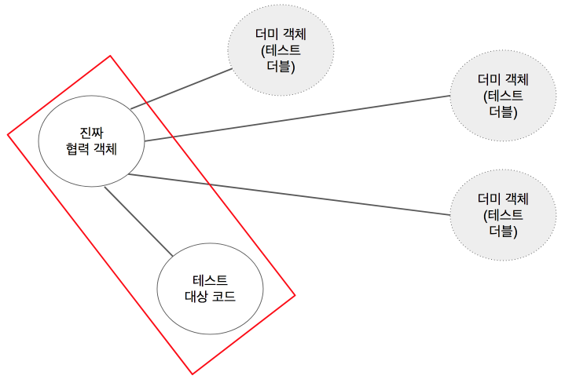
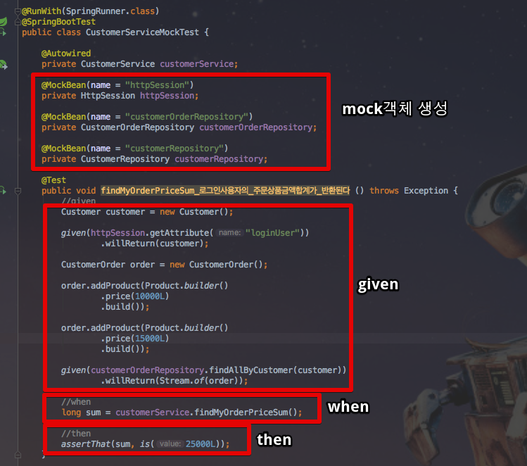
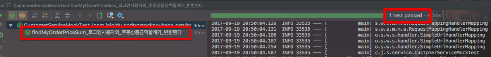
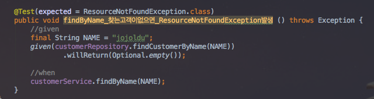
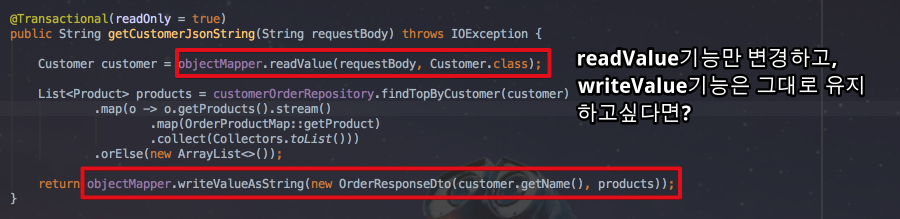
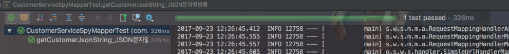
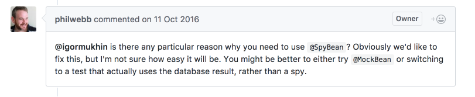

# @MockBean, @SpyBean

안녕하세요? 이번 시간엔 SpringBoot의 ```@MockBean```, ```@SpyBean``` 예제를 진행해보려고 합니다.  
모든 코드는 [Github](https://github.com/jojoldu/blog-code/tree/master/spring-mock-spy-bean)에 있기 때문에 함께 보시면 더 이해하기 쉬우실 것 같습니다.  
(공부한 내용을 정리하는 [Github](https://github.com/jojoldu/blog-code)와 세미나+책 후기를 정리하는 [Github](https://github.com/jojoldu/review), 이 모든 내용을 담고 있는 [블로그](http://jojoldu.tistory.com/)가 있습니다. )<br/>


## 들어가며

[SpringBoot 1.4](https://docs.spring.io/spring-boot/docs/current/reference/html/boot-features-testing.html#boot-features-testing-spring-boot-applications-mocking-beans)에서 2개의 테스트 어노테이션 ```@MockBean```, ```@SpyBean``` 이 추가되었습니다.  
(기존에 [Mockito](http://site.mockito.org/)를 통해 Mock 테스트를 진행하신 분들에게 좀 더 편의성을 제공해주기 위함인것 같습니다.)  
  
유닛테스트에 익숙하지 않을때는 테스트 코드 작성을 통합테스트 (Integration Test)로 작성하였습니다.  
(즉, 하나의 Service 메소드 단위로 테스트 코드를 작성하였습니다.)  
서비스 메소드가 단순하다면 문제가 없지만 보통은 **여러 레파지토리와 비지니스 로직이 함께** 있어, 많은 불편함에 마주쳤습니다.

* 불필요한 데이터 생성이 많습니다.
* 테스트 대상 범위가 넓어져 실제 테스트 대상에 집중할 수 없습니다.
* 테스트 코드 수행시간이 길어져 피드백이 느립니다.
* 테스트 상황 설정이 어렵습니다 (로그인상태, 보안처리 등등)

간단한 예제로 확인해보겠습니다.

### 문제상황  

기본적인 상황을 설정하기 위해 다음과 같은 Entity 클래스를 생성하겠습니다.

* Customer
* CustomerOrder
* Product
* OrderProductMap


 ```Customer.java```

```java

@Entity
@Getter
@NoArgsConstructor
public class Customer {

    @Id
    @GeneratedValue
    private Long id;

    @Column(nullable = false)
    private String name;

    @Column(nullable = false)
    private String email;

    @Column(nullable = false)
    private String mobileNumber;

    @Builder
    public Customer(String name, String email, String mobileNumber) {
        this.name = name;
        this.email = email;
        this.mobileNumber = mobileNumber;
    }
}

```

 ```CustomerOrder.java```

```java
@Entity
@Getter
@NoArgsConstructor
public class CustomerOrder {

    @Id
    @GeneratedValue
    private Long id;

    @Column(nullable = false)
    private LocalDateTime orderDateTime;

    @Column(nullable = false)
    private String address;

    @Column(nullable = false)
    private boolean isGiftPackaging;

    private String memo;

    @OneToOne
    @JoinColumn(name = "customer_id", foreignKey = @ForeignKey(name = "FK_ORDER_CUSTOMER"))
    private Customer customer;

    @OneToMany(mappedBy = "customerOrder", cascade = CascadeType.ALL, orphanRemoval = true)
    private List<OrderProductMap> products = new ArrayList<>();

    @Builder
    public CustomerOrder(LocalDateTime orderDateTime, String address, boolean isGiftPackaging, String memo, Customer customer, List<OrderProductMap> products) {
        this.orderDateTime = orderDateTime;
        this.address = address;
        this.isGiftPackaging = isGiftPackaging;
        this.memo = memo;
        this.customer = customer;
        this.products = products;
    }

    public void addProduct(Product product){
        if(this.products == null){
            this.products = new ArrayList<>();
        }

        this.products.add(new OrderProductMap( this, product));
    }
}

```

 ```Product.java```

```java
@Entity
@Getter
@NoArgsConstructor
public class Product {

    @Id
    @GeneratedValue
    private Long id;

    @Column(nullable = false)
    private String name;

    @Column(nullable = false)
    private long price;

    @Column(nullable = false)
    private LocalDate manufactureDate;

    @Builder
    public Product(String name, long price, LocalDate manufactureDate) {
        this.name = name;
        this.price = price;
        this.manufactureDate = manufactureDate;
    }
}
```

 ```OrderProductMap.java```

```java
@Entity
@Getter
public class OrderProductMap {

    @Id
    @GeneratedValue
    private Long id;

    @ManyToOne
    @JoinColumn(name = "customer_order_id", foreignKey = @ForeignKey(name = "FK_CUSTOMER_ORDER_MAP"))
    private CustomerOrder customerOrder;

    @ManyToOne
    @JoinColumn(name = "product_id", foreignKey = @ForeignKey(name = "FK_PRODUCT_MAP"))
    private Product product;

    public OrderProductMap(CustomerOrder customerOrder, Product product) {
        this.customerOrder = customerOrder;
        this.product = product;
    }
}

```

그리고 테스트할 서비스 메소드는 아래와 같습니다.



1. 세션에서 사용자정보(```Customer```)를 가져옵니다.
2. 사용자 정보로 주문정보(```CustomerOrder```)를 조회합니다.
3. 주문정보에서 ```Product``` 목록을 가져옵니다.
4. ```Product```들의 price 합을 계산합니다.

굉장히 많은 과정이 필요합니다.  
이를 위한 통합 테스트를 작성하겠습니다.



1. Customer 인스턴스의 **필수값들을 채운후**, DB에 저장합니다.
2. 생성한 Customer 인스턴스를 세션에 저장합니다.
3. **필수값들을 채운** Product 인스턴스들을 DB에 저장합니다.
4. CustomerOrder 인스턴스의 필수값을 채운후 DB에 저장합니다.
5. CustomerOrder 인스턴스에 Product 인스턴스를 추가합니다. 
6. Product 인스턴스가 추가된 CustomerOrder 인스턴스를 다시한번 DB에 반영합니다. (이 경우는 테스트 메소드에 ```@Transactional```이 선언되면 생략할 수 있습니다.)



테스트는 정상적으로 통과했습니다.  
하지만 코드를 보시면 어떠신가요?  
여기서 실제로 테스트 해야할 코드가 보이시나요?  
실제 **테스트 대상과는 무관한 객체와 필드가 너무 많아** 코드 작성 자체가 부담스럽습니다.  
자 그럼 이런 부담스러운 부분을 Mock 테스트를 통해 해결해보겠습니다.


[[ad]]

## 해결

위 테스트 코드의 가장 큰 문제는 무엇일까요?  
하나의 테스트를 위해 **필요한 주변 코드가 너무 많다는 것**입니다.  

1. DB에 저장하기 위해 각 Entity들은 필수값을 모두 채워야만 합니다.
2. Repository에서 조회하기 위해 Entity간 연관관계를 모두 형성해야 합니다.
3. HttpSession 저장등 외부 모듈에 대한 작업이 추가됩니다.

테스트 대상 코드와 주변 부분을 격리시키지 못해 이렇게 많은 불편함이 발생했습니다.  
**테스트 하는 코드가 주변 코드와 확실하게 격리**할 수 있는 방법이 있습니다.

### 테스트 더블

목적에 따라 비슷한듯 하면서도 다른 객체를 사용하는 모든 행위를 **테스트 더블**이라 합니다.  
(Stub, Dummy, Mock, Spy 등등)  



(테스트 더블로 대체하여 테스트 범위를 대상코드 자체의 동작과 협력객체와의 연계동작으로만 제한할 수 있습니다.)  
  
  
테스트 더블을 사용하면 여러 장점이 있습니다.

* 테스트 대상 코드 격리
* 테스트 속도 개선
* 예측 불가능한 실행 요소 제거
* 특수한 상황 테스트 가능
* 감춰진 정보를 확인 가능

딱 지금 상황에 필요한 모든 장점이 있습니다!  
실제로 한번 사용해보겠습니다.

### @MockBean

아래에 나온 코드외에 좀더 많은 내용을 알고 싶으시다면 [스프링부트 레퍼런스](https://docs.spring.io/spring-boot/docs/current/reference/html/boot-features-testing.html#boot-features-testing-spring-boot-applications-mocking-beans), [Mockito 위키 - 한글버전](https://github.com/mockito/mockito/wiki/Mockito-features-in-Korean)을 방문해주세요.  
  
  
Mock은 껍데기만 있는 객체를 얘기합니다.  
인터페이스의 추상메소드가 메소드 바디는 없고 파라미터 타입과 리턴타입만 선언된 것처럼, Mock Bean은 **기존에 사용되던 Bean의 껍데기만 가져오고 내부의 구현 부분은 모두 사용자에게 위임**한 형태입니다.  
즉, 해당 Bean의 어떤 메소드가 어떤 값이 입력 되면 어떤 값이 리턴 되어야 한다는 내용 모두 **개발자 필요에 의해서 조작이 가능**합니다.  
  
위에서 사용한 코드를 한번 변경해보겠습니다.



(given 코드가 절반 이하로 줄었습니다.)

* ```@MockBean```
  * 기존에 사용되던 스프링 Bean이 아닌 Mock Bean을 주입합니다.
  * 어노테이션 내부에 문자열 값을 등록한 것은 **기존에 선언된 Bean 객체를 덮어쓰기 위함**입니다.
  * 만약 Bean의 이름을 강제로 지정하지 않으면, Spring에선 어떤 Bean을 가져와야할지 알수 없어 오류가 발생합니다.

* ```given```
  * 해당 Mock Bean이 **어떤 행동을 취하면 어떤 결과를 반환한다**를 선언하는 부분입니다.
  * ```given(httpSession.getAttribute("loginUser")).willReturn(customer)``` 를 예로 들면
  * ```given(httpSession.getAttribute("loginUser"))``` : ```httpSession.getAttribute()```를 호출할때 파라미터 값이 ```"loginUser"```라면
  * ```.willReturn(customer)``` : ```customer```를 리턴하라는 의미 입니다.

자 위와 같이 테스트 코드를 실행하면 테스트 수행시 ```httpSession```, ```CustomerOrderRepository```는 모두 테스트 코드에서 선언한 **Mock Bean이 주입되어 실행**됩니다.  
테스트할 코드인 ```CustomerService``` 역시 ```httpSession```, ```CustomerOrderRepository```를 Mock Bean이기 때문에 메소드 호출시에 ```given```에서 선언된 값이 반환됩니다.  
아주 간단하죠?  
  
실제로 잘 작동하는지 확인해볼까요



아주 잘 작동하는 것을 확인할 수 있습니다.  
추가로 한가지 더 수행해보겠습니다.  


위와 같은 메소드에서 **조회되는 값이 없으면 ```ResourceNotFoundException```이 발생**하는것을 테스트하고 싶다고 가정 하겠습니다.  
이런 상황도 ```@MockBean```을 쓴다면 쉽게 해결됩니다.



 ```willReturn```에서 ```Optional.empty()```를 반환하도록 선언만 하면 됩니다.  
  

처음 작성한 통합 테스트 코드와 한번 비교해보셨으면 합니다.  
테스트더블을 통해 테스트 코드 외에 다른 코드가 거의 사라진 것을 알 수 있습니다.  
특히 **불필요한 필드를 채울 필요가 없게** 되었습니다.  
  
어떤 기능에, 어떤 상황/결과에 개발자가 좀 더 집중해야하는지 확연하게 알 수 있습니다.

> 여기서는 간단한 소개만 할 예정입니다.  
좀 더 자세한 내용은 [Mockito 위키 - 한글버전](https://github.com/mockito/mockito/wiki/Mockito-features-in-Korean)를 참고하세요!  

[[ad]]

### @SpyBean

 ```@SpyBean```은 말그대로 Spy(스파이)입니다.  
영화를 보면 한 조직에 스파이가 침투해서 여러 교란작업을 수행합니다.  
**스파이는 조직 전체에 퍼져있지 않고, 조직 구성원 중 1명 혹은 일부분**입니다.  
스파이외에 **다른 조직원들은 모두 진짜 조직원**입니다.  
  
 ```@MockBean```은 ```given```에서 **선언한 코드 외에는 전부 사용할 수 없습니다**.  
 반면에 ```@SpyBean```은 ```given```에서 **선언한 코드 외에는 전부 실제 객체의 것을 사용**합니다.  
이미 존재하는 Bean을 SpyBean으로 Wrapping한 형태라고 생각하시면 됩니다.  
  
기본적인 개념은 조금 다르나 사용법은 ```@MockBean```과 ```@SpyBean```은 동일합니다.  
  
예제로 사용법을 알아보겠습니다.  
아래와 같은 서비스 메소드를 테스트 해야한다고 가정하겠습니다.



1. 외부에서 받은 Json String을 ```Customer```객체로 변환합니다.
2. ```customerOrderRepository```에서 주문한 상품정보들을 가져옵니다.
3. 가져온 정보들을 조합하여 ```OrderResponseDto```의 Json String으로 변환하여 반환합니다.

여기서 **1번 케이스만 변경**해서 테스트를 진행하고 싶습니다.  


 ```MockBean```을 사용할때와 마찬가지로 ```given()```과 ```willReturn```을 통해 ```objectMapper.readValue```를 모의코드로 지정합니다.  
단, ```writeValuesAsString```은 그대로 사용하게 별도의 코드를 추가하지 않았습니다.  
  
해당 코드를 실행해보면!



잘 통과됨을 확인할 수 있습니다.  

### @SpyBean 주의사항

현재(v1.5.7 / 2017.09.20) ```@SpyBean```은 인터페이스 Bean (```JpaRepository```, ```HttpSession``` 등등)에서는 작동되지 않습니다.  
  
(참고: [@SpyBean on Data Jpa Repository bean isn't working](https://github.com/spring-projects/spring-boot/issues/7033) )  
  
> 아마도 프록시 객체에 다시 프록시를 씌우는게 안되는게 아닐까 싶은데 개인적인 추측입니다^^;

이 이슈는 해결할 예정이라고 답글이 있는데요, philwebb은 ```repository```에서는 spy보다는 mock을 써야한다고 합니다.   



무슨 말이냐 하면, ```repository```를 ```@SpyBean```을 통해 테스트 하려면 해당 테스트 범위가 너무 커지고 통합테스트와 다름 없는 테스트가 될 수 있다는 것입니다.  
 ```repository```만 테스트 한다면 ```repository```만 테스트를 하고, 그 외에 ```repository```를 호출하는 메소드들을 테스트할때는 ```repository```의 메소드들 중 사용하는 부분만 Mock으로 구현하는 것이 좀 더 올바른 방식이라고 얘기합니다.  

만약 위와 같은 케이스가 발생하신다면 **테스트 단위가 너무 큰건 아닌지** 다시 한번 생각해보셔도 좋을것 같습니다.

## 마무리

Mock, Spy는 활용도가 굉장히 높습니다.  
테스트해야할 메소드의 validation 을 무시하도록 설정하기도 하고,  
외부 API와 굳이 연동할 필요 없이 테스트를 수행하기도 하고,  
DB에 데이터 입력 없이 테스트를 수행하기도 하고,  
불필요한 필드 데이터는 채우지 않고도 테스트를 수행할 수도 있습니다.  
  
물론 모든 테스트를 다 Mock, Spy만으로 할수는 없습니다.  
통합 테스트 코드는 분명 필요해서 **모든 메소드를 정상코드로 테스트하는 코드도 필요**하지만, 단위 테스트로 쪼개서 테스트할때는 Mock, Spy를 적극적으로 활용하시는 것을 추천드립니다.  
  
포스팅 내용이 짧은 튜토리얼과 소개 뿐이라 보충하기 위해 한권의 책을 소개드립니다.  
[Effective Unit Testing](http://www.yes24.com/24/goods/11361087?scode=032&OzSrank=1) 을 꼭 읽어보시길 바랍니다.  
단위 테스트의 전반적인 이야기를 예제코드와 함께 잘 소개 되어있습니다.  
  
이번 포스팅은 여기까지입니다.  
끝까지 읽어주셔서 감사합니다!

