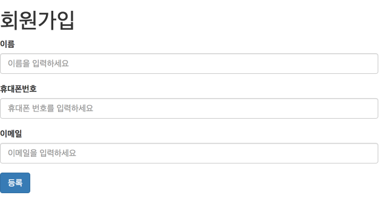
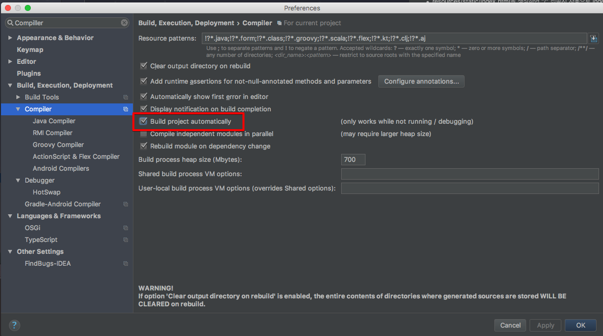

# Validation 공통모듈 만들기
안녕하세요? 이번 시간엔 유효성 체크(이하 validation) 공통 모듈 생성하는 예제를 진행해보려고 합니다. 모든 코드는 [Github](https://github.com/jojoldu/blog-code/tree/master/spring-validation)에 있기 때문에 함께 보시면 더 이해하기 쉬우실 것 같습니다.  
(공부한 내용을 정리하는 [Github](https://github.com/jojoldu/blog-code)와 세미나+책 후기를 정리하는 [Github](https://github.com/jojoldu/review), 이 모든 내용을 담고 있는 [블로그](http://jojoldu.tistory.com/)가 있습니다. )<br/>

예를 들어 아래와 같은 회원 가입 양식이 있다고 가정해보겠습니다.  


대부분의 입력 양식처럼 위 양식도 등록시 몇가지 조건들이 있습니다.  
* 이름/휴대폰번호/이메일은 **필수값**입니다.
* 휴대폰번호는 **10자리 혹은 11자리의 숫자**로 이루어져야 합니다.
* 이메일은 이메일 양식을 지켜야한다 (xxx@xxx)

이 조건들을 체크하기 위해서 많은 분들이 하는 방법중 하나가 **클라이언트 사이드에서 체크**를 하는 것입니다.  
하지만 클라이언트 사이드에서 validation을 하게 될 경우 얼마든지 브라우저에서 조작이 가능하기 때문에 validation을 무효화해서 잘못된 데이터를 전송할 수 있습니다.  
그래서 이런 체크는 백엔드에서 필수적으로 하게 되는데, 이때 유용하게 사용되는 것이 **Validation 어노테이션**들입니다.  
위 조건을 만족하도록 간단하게 프로젝트를 구성해보겠습니다.  

### 코드
예제코드에 앞서서 좀 더 실제 프로젝트와 유사하게 맞추기 위해 조건을 추가하겠습니다.  
* 휴대폰 번호는 입력 받을때는 숫자만 입력 받는다.
* 휴대폰 번호를 DB 저장시에는 조건 검색이 가능하도록 3개 컬럼에 나눠서 저장한다. (ex: 컬럼1: 010, 컬럼2: 1234, 컬럼3: 5678)
* 휴대폰 번호 출력시에는 - 문자가 포함되야 한다 (ex: 010-1234-5678)   

그럼 이제 추가 조건까지 포함해서 코드를 작성해보겠습니다.  

**Member**  

```
@Entity
public class Member {

    @Id
    @GeneratedValue
    private Long id;

    @Column(nullable = false)
    private String name;

    @Column(nullable = false)
    private String phone1;

    @Column(nullable = false)
    private String phone2;

    @Column(nullable = false)
    private String phone3;

    @Column(nullable = false)
    private String email;

    public Member() {}

    public Member(String name, String phone1, String phone2, String phone3, String email) {
        this.name = name;
        this.phone1 = phone1;
        this.phone2 = phone2;
        this.phone3 = phone3;
        this.email = email;
    }

    public Long getId() {
        return id;
    }

    public String getName() {
        return name;
    }

    public String getPhone1() {
        return phone1;
    }

    public String getPhone2() {
        return phone2;
    }

    public String getPhone3() {
        return phone3;
    }

    public String getEmail() {
        return email;
    }
}
```

**MemberRequestDto**  

```
public class MemberRequestDto {

    private Long id;

    @NotBlank(message = "이름을 작성해주세요.")
    private String name;

    @NotBlank(message = "전화번호를 작성해주세요.")
    @Pattern(regexp = "[0-9]{10,11}", message = "10~11자리의 숫자만 입력가능합니다")
    private String phoneNumber;

    @NotBlank(message = "메일을 작성해주세요.")
    @Email(message = "메일의 양식을 지켜주세요.")
    private String email;

    public MemberRequestDto() {}

    public Member toEntity(){
        String[] phones = parsePhone();
        return new Member(name, phones[0], phones[1], phones[2], email);
    }

    private String[] parsePhone(){
        String[] phones = new String[3];
        int mid = phoneNumber.length() == 10? 7:8;
        phones[0] = phoneNumber.substring(0,3);
        phones[1] = phoneNumber.substring(4,mid);
        phones[2] = phoneNumber.substring(mid,phoneNumber.length()-1);
        return phones;
    }

    public Long getId() {
        return id;
    }

    public String getName() {
        return name;
    }

    public String getPhoneNumber() {
        return phoneNumber;
    }

    public String getEmail() {
        return email;
    }
}
```  

**MemberResponseDto**  

```
public class MemberResponseDto {
    private Long id;
    private String name;
    private String phoneNumber;
    private String email;

    public MemberResponseDto() {}

    public MemberResponseDto(Member member) {
        id = member.getId();
        name = member.getName();
        phoneNumber = toStringPhone(member.getPhone1(), member.getPhone2(), member.getPhone3());
        email = member.getEmail();
    }

    private String toStringPhone(String phone1, String phone2, String phone3){
        return phone1+"-"+phone2+"-"+phone3;
    }

    public Long getId() {
        return id;
    }

    public String getName() {
        return name;
    }

    public String getPhoneNumber() {
        return phoneNumber;
    }

    public String getEmail() {
        return email;
    }
}
```

Member, MemberRequestDto, MemberResponseDto 3개의 클래스를 생성하였습니다.  
회원 정보를 나타내기 위해 Member클래스만 사용하지 않은 이유는, Entity 클래스를 파라미터 혹은 View 데이터로 사용하게 되면 **변화에 대응하기가 힘들기 때문**입니다.  
휴대폰 번호 같은 경우 테이블에 저장되는 형태는 3개의 컬럼으로 저장되는데, 화면에 입력 받는 형태는 하나의 문자열입니다. 이걸 Entity에서 구현하려면 Entity 클래스는 테이블의 역할을 벗어난 **많은 책임을 담당**하게 되고, **파라미터가 변경될 때마다 메인이 되는 Entity 클래스의 구조가 계속해서 변경**되게 됩니다.  
반면에 MemberRequestDto가 화면에서 입력 받는 파라미터 타입의 역할을 하게 될 경우 파라미터 형태가 변경되어도 MemberRequestDto만 변경하면 되고 Entity 클래스는 변경되지 않아도 되기에 테이블 구조가 변경될일은 없습니다.  
동일한 이유로 View에 출력되는 타입 역시 Entity가 아닌 Response 클래스를 별도로 두어 어떤 출력 형태라도 큰 변경 없이 대응할 수 있도록 하였습니다.  
<br/>
그럼 이를 사용하는 Controller/Service/Repository를 생성하겠습니다.  
<br/>
**MemberRepository**  
<br/>

```
public interface MemberRepository extends JpaRepository<Member, Long>{
    Optional<Member> findByEmail(String email);
}
```
<br/>
**MemberService**

```
@Service
public class MemberService {

    private MemberRepository memberRepository;

    public MemberService(MemberRepository memberRepository) {
        this.memberRepository = memberRepository;
    }

    @Transactional
    public Long save(MemberRequestDto memberRequestDto){
        return memberRepository.save(memberRequestDto.toEntity()).getId();
    }


    @Transactional(readOnly = true)
    public List<MemberResponseDto> findAll() {
        return memberRepository
                .findAll()
                .stream()
                .map(MemberResponseDto::new)
                .collect(Collectors.toList());
    }
}
```
<br/>
**MemberController**  

```
@RestController
public class MemberController {

    private MemberService memberService;

    public MemberController(MemberService memberService) {
        this.memberService = memberService;
    }

    @PostMapping("/member")
    public Long saveMember(@RequestBody @Valid MemberRequestDto memberRequestDto) {
        return memberService.save(memberRequestDto);
    }

    @GetMapping("/members")
    public List<MemberResponseDto> findAll(){
        return memberService.findAll();
    }
}
```

스프링에 대한 의존성을 낮추고 Mock 객체 주입을 좀 더 쉽게하기 위해 생성자 Injection을 하였습니다.   

* resources/static/index.html을 생성하면 "/" 접속시 자동으로 index.html을 호출한다


