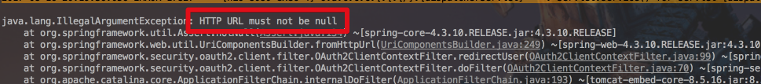
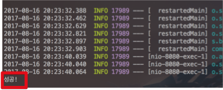
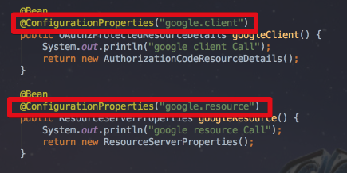
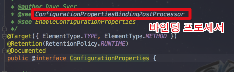
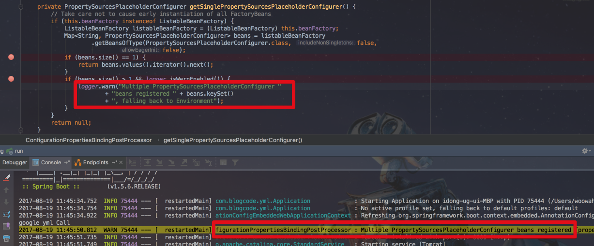
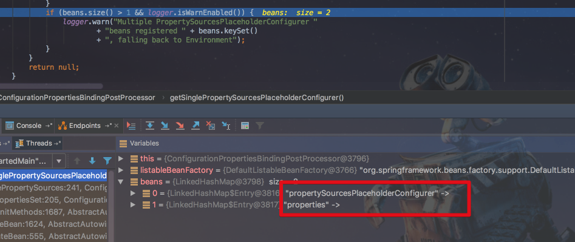
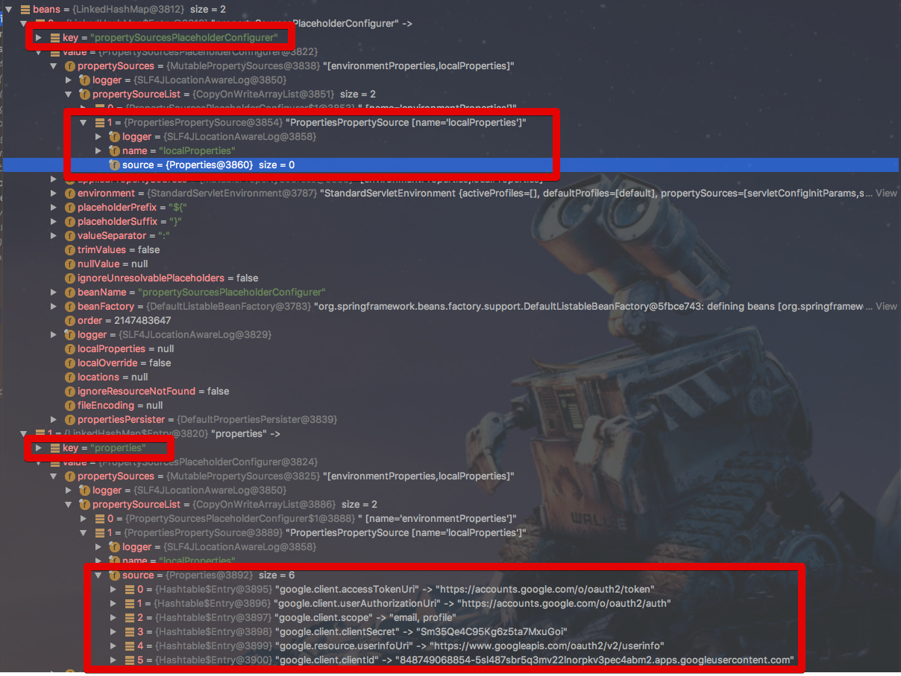
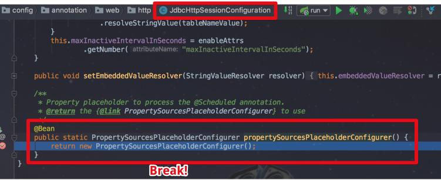
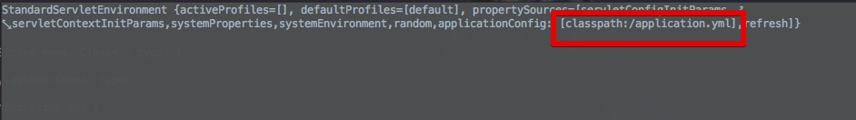
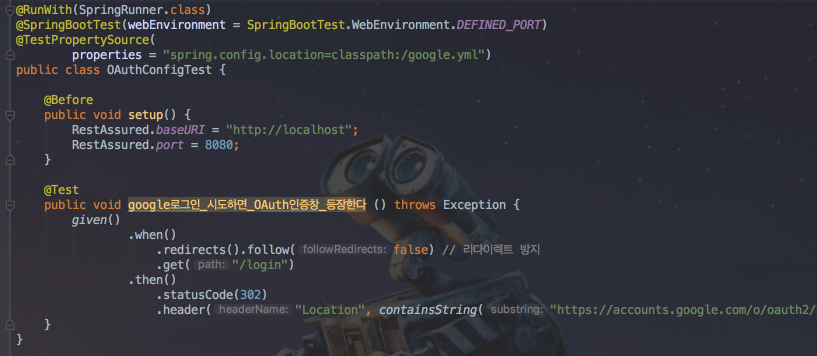

# Spring OAuth + Spring Session시 HTTP URL must not be null 발생 원인 및 해결

안녕하세요? 이번 시간엔 Spring OAuth + Spring Session시 HTTP URL must not be null 발생시 원인 및 해결방안을 소개드디려 합니다.   
모든 코드는 [Github](https://github.com/jojoldu/blog-code/tree/master/spring-yml-import)에 있기 때문에 함께 보시면 더 이해하기 쉬우실 것 같습니다.  
(공부한 내용을 정리하는 [Github](https://github.com/jojoldu/blog-code)와 세미나+책 후기를 정리하는 [Github](https://github.com/jojoldu/review), 이 모든 내용을 담고 있는 [블로그](http://jojoldu.tistory.com/)가 있습니다. )<br/>


## 문제 상황

Spring Session과 Spring OAuth2를 조합해서 로그인 시스템을 구축한다고 가정해보겠습니다.  

### Spring OAuth2 적용

가장 먼저 Spring OAuth2를 프로젝트에 적용시켜보겠습니다.  
  
**build.gradle**  

```
buildscript {
	ext {
		springBootVersion = '1.5.6.RELEASE'
	}
	repositories {
		mavenCentral()
	}
	dependencies {
		classpath("org.springframework.boot:spring-boot-gradle-plugin:${springBootVersion}")
	}
}

apply plugin: 'java'
apply plugin: 'eclipse'
apply plugin: 'org.springframework.boot'

version = '0.0.1-SNAPSHOT'
sourceCompatibility = 1.8

repositories {
	mavenCentral()
}


dependencies {
	compile('org.springframework.boot:spring-boot-starter-web')
	compile('org.springframework.security.oauth:spring-security-oauth2')
	compile
	compileOnly('org.projectlombok:lombok')

	runtime('com.h2database:h2')
	runtime('org.springframework.boot:spring-boot-devtools')

	testCompile('org.springframework.boot:spring-boot-starter-test')
}

```

application.yml

```yml
spring:
  session:
    store-type: jdbc
  datasource:
    platform: h2
    schema: classpath:schema-h2.sql
  h2:
    console:
      enabled: true
      path: /h2-console # h2 db 웹 클라이언트 접속 url
  devtools:
    livereload:
      enabled: true # 정적파일들의 실시간 갱신
  jpa:
    hibernate:
      ddl-auto: create-drop


security:
  basic:
    enabled: false # security 기본 인증 옵션 제거
logging:
  level:
    org.hibernate.type: trace  # JPA로 생성되는 쿼리의 파라미터 값 확인

```

보안상 이슈가 될 수 있는 OAuth2 정보는 별도로 google.yml로 분리하겠습니다.  
  
**google.yml**

```yml
google:
  client:
    clientId: //각자의 정보
    clientSecret: //각자의 정보
    accessTokenUri: https://accounts.google.com/o/oauth2/token
    userAuthorizationUri: https://accounts.google.com/o/oauth2/auth
    scope: email, profile

  resource:
    userInfoUri: https://www.googleapis.com/oauth2/v2/userinfo
```

자 이런 설정파일들을 OAuth2와 함께 적용해보겠습니다.  
  
OAuth2.java

```java
@Configuration
@EnableOAuth2Client
public class OAuthConfig {

    private OAuth2ClientContext oauth2ClientContext;
    private BeanFactory beanFactory;

    public OAuthConfig(OAuth2ClientContext oauth2ClientContext, BeanFactory beanFactory) {
        this.oauth2ClientContext = oauth2ClientContext;
        this.beanFactory = beanFactory;
    }

    @Bean
    public Filter ssoFilter() {
        OAuth2ClientAuthenticationProcessingFilter oauth2Filter = new OAuth2ClientAuthenticationProcessingFilter("/login");
        OAuth2RestTemplate oAuth2RestTemplate = new OAuth2RestTemplate(googleClient(), oauth2ClientContext);
        oauth2Filter.setRestTemplate(oAuth2RestTemplate);
        oauth2Filter.setTokenServices(new UserInfoTokenServices(googleResource().getUserInfoUri(), googleClient().getClientId()));
        oauth2Filter.setAuthenticationSuccessHandler(successHandler()); // 인증 성공시 진행될 Handler 등록
        return oauth2Filter;
    }

    @Bean
    public AuthenticationSuccessHandler successHandler(){
        return (request, response, authentication) -> {
            System.out.println("성공!");
            response.sendRedirect("/");
        };
    }

    @Bean
    @ConfigurationProperties("google.client")
    public OAuth2ProtectedResourceDetails googleClient() {
        System.out.println("google client Call");
        return new AuthorizationCodeResourceDetails();
    }

    @Bean
    @ConfigurationProperties("google.resource")
    public ResourceServerProperties googleResource() {
        System.out.println("google resource Call");
        return new ResourceServerProperties();
    }

    @Bean
    public FilterRegistrationBean oauth2ClientFilterRegistration(OAuth2ClientContextFilter filter) {
        FilterRegistrationBean registration = new FilterRegistrationBean();
        registration.setFilter(filter);
        registration.setOrder(-100);
        return registration;
    }

    // google.yml을 import
    @Bean
    public static PropertySourcesPlaceholderConfigurer properties() {

        System.out.println("google yml Call");

        YamlPropertiesFactoryBean yaml = new YamlPropertiesFactoryBean();
        yaml.setResources(new ClassPathResource("google.yml"));

        PropertySourcesPlaceholderConfigurer propertySourcesPlaceholderConfigurer = new PropertySourcesPlaceholderConfigurer();
        propertySourcesPlaceholderConfigurer.setProperties(yaml.getObject());
        return propertySourcesPlaceholderConfigurer;
    }
}
```

이렇게 간단하게 설정후, localhost:8080/login으로 접속해보시면 아주 잘 되는 것을 확인할 수 있습니다.

### Spring Session 적용

Spring OAuth2가 아주 잘 적용되었으니, 곧바로 SpringSession 을 적용해보겠습니다.  
build.gradle에 아래 2가지 의존성을 추가합니다.

```
compile('org.springframework.session:spring-session')
compile('org.springframework.boot:spring-boot-starter-jdbc')
```

그리고 JdbcSession을 활성화 하기 위해 HttpSessionConfig.java를 생성하여 아래와 같이 코드를 추가합니다.

```java
@EnableJdbcHttpSession
public class HttpSessionConfig {
}
```

그리고 Session을 관리할 테이블을 자동생성하기 위해 스키마 sql을 생성하겠습니다.  

**src/main/resources/schema-h2.sql**

```sql
CREATE TABLE SPRING_SESSION (
	SESSION_ID CHAR(36) NOT NULL,
	CREATION_TIME BIGINT NOT NULL,
	LAST_ACCESS_TIME BIGINT NOT NULL,
	MAX_INACTIVE_INTERVAL INT NOT NULL,
	PRINCIPAL_NAME VARCHAR(100),
	CONSTRAINT SPRING_SESSION_PK PRIMARY KEY (SESSION_ID)
);

CREATE INDEX SPRING_SESSION_IX1 ON SPRING_SESSION (LAST_ACCESS_TIME);

CREATE TABLE SPRING_SESSION_ATTRIBUTES (
	SESSION_ID CHAR(36) NOT NULL,
	ATTRIBUTE_NAME VARCHAR(200) NOT NULL,
	ATTRIBUTE_BYTES LONGVARBINARY NOT NULL,
	CONSTRAINT SPRING_SESSION_ATTRIBUTES_PK PRIMARY KEY (SESSION_ID, ATTRIBUTE_NAME),
	CONSTRAINT SPRING_SESSION_ATTRIBUTES_FK FOREIGN KEY (SESSION_ID) REFERENCES SPRING_SESSION(SESSION_ID) ON DELETE CASCADE
);

CREATE INDEX SPRING_SESSION_ATTRIBUTES_IX1 ON SPRING_SESSION_ATTRIBUTES (SESSION_ID);

```

추가로 어려운 코드가 없기에 바로 로그인 테스트를 다시 진행했습니다.  
그랬더니! 



```java.lang.IllegalArgumentException: HTTP URL must not be null``` 오류가 발생했습니다.


제가 뭘 잘못했던 걸까요?  
SpringOAuth2가 잘 되는것을 확인 후, Spring Session 의존성을 추가하고, ```@EnableJdbcHttpSession``` 선언만 했는데!  
오류가 발생했습니다.  
이 간단한 설정에서 도대체 무엇이 문제였는지 한번 추적해보겠습니다.

## Trace

이 문제를 추적할때, 저는 1가지 사항은 **배제**하고 시작했습니다.  

* google.yml은 정상로딩 된다.

**Session 적용전에 google.yml을 호출하여 OAuth Login 기능을 확인**했기 때문입니다.  
그래서 여러 이상한 포인트에서 문제점을 찾으려고 했습니다.

* ```@EnableJdbcHttpSession```로 추가되는 필터인 ```springSessionRepositoryFilter```에서 context를 초기화시키는 건가?
  * 해당 필터에서는 OAuth와 관련된 값을 변경하지 않음을 확인

* spring-session 버전과 security-oauth2 버전이 충돌나는 것일까?
  * 2.0 버전으로 모두 올려서 사용해도 문제 발생

* JdbcSession의 문제인가?
  * Redis 세션으로 동일하게 적용해도 문제 발생

* 이렇게 간단한 설정에도 오류가 나는데 왜 Github Issue에는 등록되지 않은거지???

여기서 이상함을 느꼈습니다.  
전 레거시 프로젝트에 적용해본게 아니라, 신규 프로젝트로 생성했고 **문제가 될만큼의 어려운 설정을 추가하지 않았습니다**.  
  
제가 뭘 잘못 가정하고 있는걸까 생각해봤습니다.  
혹시 Session이 적용되고 google.yml을 호출못하는건가!?  
란 생각에 도달했습니다.  
그래서 google.yml에 있는 설정값들을 모두 application.yml로 이동후 다시 실행해보았습니다.  

그랬더니!



성공하였습니다.  


(헐...?)  
  
Spring OAuth2만 있을땐 잘 불러오던 google.yml이 왜 Spring Session을 적용하면 못불러오는걸까요??  
어디서 못불러온건지 하나씩 추적해보겠습니다.  
  
먼저 yml설정값을 통해 인스턴스로 반환해주는 어노테이션인 ```@ConfigurationProperties```을 확인합니다.



해당 어노테이션으로 들어가보면 이렇게 어떤 클래스를 통해 값이 바인딩 되는지를 확인할 수 있습니다.



보시면 ```ConfigurationPropertiesBindingPostProcessor```를 통해 값이 바인딩 되는것을 알 수 있습니다.  
해당 클래스를 살펴보면 여러 메소드 중 ```getSinglePropertySourcesPlaceholderConfigurer()```를 보시면 낯익은 메세지가 보입니다.



Session을 추가하고 발생한 warn 메세지가 해당 메소드에서 발생하고 있었습니다.  
```beans.size```가 2개 이상일때 발생하는데 그럼 왜 2개 이상이 된건지 브레이크를 걸어 확인해보겠습니다.  
if문에 브레이크를 걸어 beans 를 확인해봤더니



2개의 HashMap이 등록된 것이 보입니다.  
여기서 좀 이상함이 느껴집니다.  
저희가 생성한 ```PropertySourcesPlaceholderConfigurer```의 bean은 ```properties```란 이름으로 등록했는데, ```propertySourcesPlaceholderConfigurer```는 어디서 등록된걸까요??  
좀 더 자세히 살펴보겠습니다.



헉!  
역시나 첫번째 bean인 ```propertySourcesPlaceholderConfigurer```은 propertySource가 비어있는 반면, 저희가 등록한 ```properties```는 propertySource가 google.yml로 채워져있음을 확인할 수 있습니다.  
  
여기서 저희는 아주 쉽게 문제의 원인을 가정할 수 있습니다.  
즉, **Spring Session이 추가되어 propertySourcesPlaceholderConfigurer의 bean이 2개가 되고, 직접 생성하지 않은 bean이 자동설정으로 호출**된 것입니다.  
  
첫번째 Bean은 당연히 google.yml을 등록하는 코드가 없기에 google.yml에 등록된 redirect URL과 같은 정보가 없다는 에러가 계속 발생한 것입니다.  

### 궁금 1. propertySourcesPlaceholderConfigurer는 어디에 있나 

Spring Session이 제공하는 여러 Session Config들에서 제공하고 있습니다.  
여기서 사용하는 JdbcHttpSessionConfiguration을 살펴보면!



이렇게 아름답게 텅텅 비어있는 Bean 생성코드를 확인할 수 있습니다.  

### 궁금 2. 왜 application.yml에 넣으면 되는걸까

propertySourcesPlaceholderConfigurer가 application.yml을 기본 Path로 설정하기 때문입니다.  



즉, 첫번째 Bean이나 저희가 생성한 2번째 Bean이나 propertySourcesPlaceholderConfigurer의 인스턴스이기 때문에 어느걸 호출하더라도 기본 Path로 잡혀있는 applicaiton.yml은 불러오게 됩니다.

## 해결책

2가지 방법이 있습니다.  

### 해결책 1. Bean의 우선순위를 고정시킨다. 

JdbcSession이 생성한 ```propertySourcesPlaceholderConfigurer``` 대신에 저희가 생성한 bean을 호출하도록 bean의 우선순위를 변경하는 것입니다.  

```java

    @Bean
    @Primary
    public static PropertySourcesPlaceholderConfigurer propertySourcesPlaceholderConfigurer() {

        System.out.println("google yml Call");

        YamlPropertiesFactoryBean yaml = new YamlPropertiesFactoryBean();
        yaml.setResources(new ClassPathResource("google.yml"));

        PropertySourcesPlaceholderConfigurer propertySourcesPlaceholderConfigurer = new PropertySourcesPlaceholderConfigurer();
        propertySourcesPlaceholderConfigurer.setProperties(yaml.getObject());
        return propertySourcesPlaceholderConfigurer;
    }
```

Bean 이름을 똑같이 하도록 메소드명을 ```propertySourcesPlaceholderConfigurer()```로 변경하고, 
```@Primary```을 추가하여 동일 Bean일 경우 저희가 생성한 Bean이 먼저 호출되도록 우선순위를 고정시키는 방법입니다.


### 해결책 2. google.yml을 기본 path에 추가한다.

SpringBoot를 시작하는 시점에 application.yml 외에도 추가적으로 기본 yml을 추가할 수가 있습니다.  
Application.java 코드에 아래와 같이 properties 옵션을 추가합니다.

```java
@SpringBootApplication
public class Application {

	private static final String PROPERTIES = "spring.config.location=classpath:/google.yml";

	public static void main(String[] args) {
		new SpringApplicationBuilder(Application.class)
				.properties(PROPERTIES)
				.run(args);
	}
}
```

이렇게 할 경우 부트 시작시점에 google.yml을 함께 읽어오게 됩니다.  
이 방법은 테스트 코드를 작성할때 작동이 안되는 문제가 있습니다.  
그럴때는 아래와 같이 테스트 코드에 추가 설정을 해주시면 됩니다.

```java
@TestPropertySource(
        properties = "spring.config.location=classpath:/google.yml")
```

예시는 아래와 같습니다.



## 마무리

진짜 문제해결을 할때 확실한 것을 잘못 지정했을때 얼마나 문제 찾기가 어려운지 체감할 수 있었습니다.  
(이것때문에 평일새벽, 주말낮까지 포함 일주일을 날렸네요 ㅠ)  
경험이 좀 더 쌓이면 이렇게 삽질하는 것을 줄일수 있을까요?  
저 스스로 많이 반성할 수 있는 계기가 되었습니다.  
아무쪼록 다른 분들은 저와 같이 이상한 포인트!?에서 오류를 찾지 않으시길 바라며 포스팅을 마치겠습니다.  
  
감사합니다! ^_^

### 참고

[Github Issue - Third Party PropertySourcesPlaceholderConfigurer](https://github.com/spring-projects/spring-boot/issues/6457)