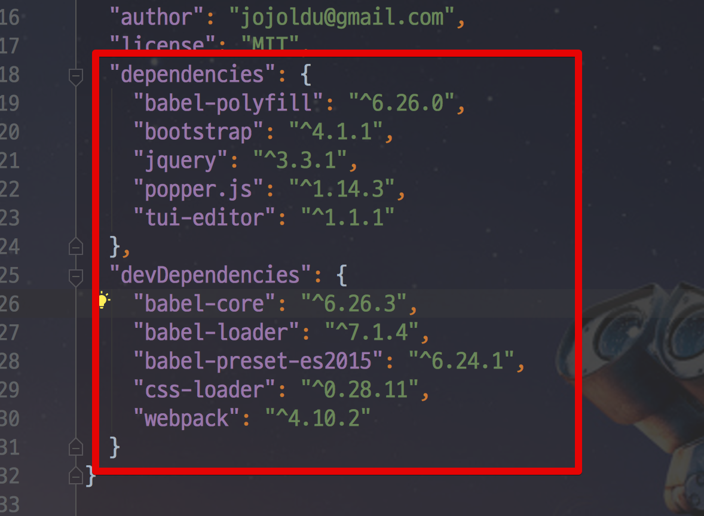

# SpringBoot & AWS S3 & Tui Editor 연동하기

안녕하세요? 이번 시간엔 springboot-aws-tui 예제를 진행해보려고 합니다.  
모든 코드는 [Github](https://github.com/jojoldu/blog-code/tree/master/springboot-aws-tui)에 있기 때문에 함께 보시면 더 이해하기 쉬우실 것 같습니다.  
(공부한 내용을 정리하는 [Github](https://github.com/jojoldu/blog-code)와 세미나+책 후기를 정리하는 [Github](https://github.com/jojoldu/review), 이 모든 내용을 담고 있는 [블로그](http://jojoldu.tistory.com/)가 있습니다. )<br/>


```bash
npm install --save jquery
npm install --save tui-editor
npm install --save popper.js
npm install --save bootstrap


npm install --save-dev webpack
npm install --save-dev babel-core babel-preset-es2015 babel-loader css-loader
npm install --save babel-polyfill
```


