# SpringBoot & AWS S3 연동하기

안녕하세요? 이번 시간엔 SpringBoot & AWS S3 연동하기 예제를 진행해보려고 합니다.  
모든 코드는 [Github](https://github.com/jojoldu/blog-code/tree/master/springboot-aws-tui)에 있기 때문에 함께 보시면 더 이해하기 쉬우실 것 같습니다.  
(공부한 내용을 정리하는 [Github](https://github.com/jojoldu/blog-code)와 세미나+책 후기를 정리하는 [Github](https://github.com/jojoldu/review), 이 모든 내용을 담고 있는 [블로그](http://jojoldu.tistory.com/)가 있습니다. )<br/>
  
SpringBoot로 서비스를 구축하다보면 꼭 만들어야할 것이 **정적 파일 업로더**입니다.  
이미지나 HTML과 같은 정적 파일을 S3에 제공해서 이를 원하는 곳에서 URL만으로 호출할 수 있게 하는걸 말합니다.  
보통 [TUI 에디터](https://github.com/nhnent/tui.editor)와 같은 웹 에디터에서는 꼭 같이 구현해야할 기능입니다.  
  
클라우드가 없던 시절에는 서버 1대에 웹 서버(Apache, Nginx 등)을 설치하여 특정 디렉토리를 지정해서 구현했었는데요.  
클라우드가 생기고 나서는 클라우드에서 제공하는 스토리지 서비스를 사용하면 되서 아주 편해졌습니다.  
여기서는 AWS의 S3를 이용하여 구현해보겠습니다.  
  
Spring Cloud AWS와 AWS S3를 이용하여 아주 쉽게 진행하니 가벼운 마음으로 따라오시면 될것 같습니다.


## 1. 로컬 환경 구성

> 참고로 S3에 bucket이 이미 생성되어있다는 가정하에 시작합니다.  

먼저 프로젝트 구성을 위해 의존성을 추가합니다.  
여기서는 Gradle을 사용합니다.  
  
### build.gradle

```groovy
repositories {
    mavenCentral()
    maven { url 'https://repo.spring.io/libs-milestone'}
}


dependencies {
    compile('org.springframework.boot:spring-boot-starter-web')
    compile('org.springframework.cloud:spring-cloud-starter-aws')

    // handlebars
    compile 'pl.allegro.tech.boot:handlebars-spring-boot-starter:0.3.0'

    compileOnly('org.projectlombok:lombok')
    testCompile('org.springframework.boot:spring-boot-starter-test')
}


dependencyManagement {
    imports {
        mavenBom 'org.springframework.cloud:spring-cloud-aws:2.0.0.RC2'
    }
}
```

> Spring Cloud AWS가 현재 (2018.06.03) 2.0.0.RC2가 최신이라 ```maven { url 'https://repo.spring.io/libs-milestone'}```가 필요합니다.  
  
뷰 템플릿은 본인이 원하시는걸 사용하시면 됩니다. (Freemarker, Thymeleaf 등)  
저는 개인적으로 Handlebars를 선호하기 때문에 ```compile 'pl.allegro.tech.boot:handlebars-spring-boot-starter:0.3.0'```를 추가했습니다.  
  
### S3Uploader.java

다음으로 S3에 정적 파일을 올리는 기능을 하는 ```S3Uploader.java``` 파일을 생성합니다.  

> 여기선 Lombok을 사용한 코드가 있으니 참고하세요.

```java
@Slf4j
@RequiredArgsConstructor
@Component
public class S3Uploader {

    private final AmazonS3Client amazonS3Client;

    @Value("${cloud.aws.s3.bucket}")
    private String bucket;

    public String upload(MultipartFile multipartFile, String dirName) throws IOException {
        File uploadFile = convert(multipartFile)
                .orElseThrow(() -> new IllegalArgumentException("MultipartFile -> File로 전환이 실패했습니다."));

        return upload(uploadFile, dirName);
    }

    private String upload(File uploadFile, String dirName) {
        String fileName = dirName + "/" + uploadFile.getName();
        String uploadImageUrl = putS3(uploadFile, fileName);
        removeNewFile(uploadFile);
        return uploadImageUrl;
    }

    private String putS3(File uploadFile, String fileName) {
        amazonS3Client.putObject(new PutObjectRequest(bucket, fileName, uploadFile).withCannedAcl(CannedAccessControlList.PublicRead));
        return amazonS3Client.getUrl(bucket, fileName).toString();
    }

    private void removeNewFile(File targetFile) {
        if (targetFile.delete()) {
            log.info("파일이 삭제되었습니다.");
        } else {
            log.info("파일이 삭제되지 못했습니다.");
        }
    }

    private Optional<File> convert(MultipartFile file) throws IOException {
        File convertFile = new File(file.getOriginalFilename());
        if(convertFile.createNewFile()) {
            try (FileOutputStream fos = new FileOutputStream(convertFile)) {
                fos.write(file.getBytes());
            }
            return Optional.of(convertFile);
        }

        return Optional.empty();
    }
}
```

> 롬복의 ```@RequiredArgsConstructor```는 ```final``` 멤버변수가 있으면 생성자 항목에 포함시킵니다.  
여기선 ```AmazonS3Client amazonS3Client```만 ```final```에 있으니 생성자에 ```AmazonS3Client amazonS3Client```만 포함됩니다.  
반대로 ```String bucket```는 생성자 항목에 포함되지 않습니다.
생성자에 포함된 ```amazonS3Client```는 DI를 받게되며, ```bucket```는 평범한 멤버변수로 남습니다.

코드의 순서는 간단합니다.

* MultipartFile을 전달 받고
* S3에 전달할 수 있도록 MultiPartFile을 File로 전환
  * S3에 Multipartfile 타입은 전송이 안됩니다.
* 전환된 File을 S3에 **public 읽기** 권한으로 put
  * 외부에서 정적 파일을 읽을 수 있도록 하기 위함입니다.
* 로컬에 생성된 File 삭제
  * Multipartfile -> File로 전환되면서 로컬에 파일 생성된것을 삭제합니다.
* 업로드된 파일의 S3 URL 주소를 반환

여기서 재밌는 것은 별다른 Configuration 코드 없이 ```AmazonS3Client``` 를 DI 받은것인데요.  
Spring Boot Cloud AWS를 사용하게 되면 **S3 관련 Bean을 자동 생성**해줍니다.  
그래서 아래 3개는 **직접 설정할 필요가 없습니다**.

* AmazonS3
* AmazonS3Client
* ResourceLoader

참고로 위의 코드 중, ```dirName```은 **S3에 생성된 디렉토리**를 나타냅니다.  
저 같은 경우 ```jojoldu```라는 **bucket**에 ```static```이란 **디렉토리**를 사용합니다.


그래서 ```upload``` 메소드를 호출하는 쪽에선 ```dirName```으로 ```static```이 전달되야만 합니다.  
  
자 그럼 이제 이 Uploader를 호출할 Controller를 생성해보겠습니다.

### WebController.java

Controller의 코드는 아래와 같습니다.

```java
@RequiredArgsConstructor
@Controller
public class WebController {

    private final S3Uploader s3Uploader;

    @GetMapping("/")
    public String index() {
        return "index";
    }

    @PostMapping("/upload")
    @ResponseBody
    public String upload(@RequestParam("data") MultipartFile multipartFile) throws IOException {
        return s3Uploader.upload(multipartFile, "static");
    }
}
```

여기선 2가지 기능이 있습니다.

* index.hbs를 웹페이지로 반환
* ```data```로 넘어오는 MultipartFile을 S3Uploader로 전달

upload 메소드를 보시면 dirName 파라미터 (2번째 인자)로 ```"static"``` 문자열을 넘기는걸 알 수 있습니다.  
지정된 bucket의 static 디렉토리로 파일을 전달한다는걸 알 수 있겠죠?  
  
Controller 코드는 크게 어려운게 없기 때문에 바로 다음 단계인 ```index.hbs``` 파일을 생성하겠습니다.

### index.hbs

SpringBoot를 사용해보신 분들은 다들 아시겠지만, 템플릿엔진 starter를 사용하시면 ```src/main/resources/templates/```에 뷰 파일을 넣으면 자동으로 Controller에서 사용할 수 있습니다.  
여기서도 마찬가지로 ```src/main/resources/templates/```에 index.hbs 파일을 생성하겠습니다.

```html
<!DOCTYPE HTML>
<html>
<head>
    <title> SpringBoot & AWS S3</title>
    <meta http-equiv="Content-Type" content="text/html; charset=UTF-8"/>
    <meta name="viewport" content="width=device-width, initial-scale=1"/>

    <link rel="stylesheet" href="https://maxcdn.bootstrapcdn.com/bootstrap/3.3.2/css/bootstrap.min.css">
    <script
        src="https://code.jquery.com/jquery-3.3.1.js"
        integrity="sha256-2Kok7MbOyxpgUVvAk/HJ2jigOSYS2auK4Pfzbm7uH60="
        crossorigin="anonymous"></script>
    <script src="https://maxcdn.bootstrapcdn.com/bootstrap/3.3.2/js/bootstrap.min.js"></script>
</head>
<body>
<h1>
    S3 이미지 업로더
</h1>
<div class="col-md-12">
    <div class="col-md-2">
        <form>
            <div class="form-group">
                <label for="img">파일 업로드</label>
                <input type="file" id="img">
            </div>
            <button type="button" class="btn btn-primary" id="btn-save">저장</button>
        </form>
    </div>
    <div class="col-md-10">
        <p><strong>결과 이미지입니다.</strong></p>
        
    </div>
</div>


<script>
    $('#btn-save').on('click', uploadImage);

    function uploadImage() {
        var file = $('#img')[0].files[0];
        var formData = new FormData();
        formData.append('data', file);

        $.ajax({
            type: 'POST',
            url: '/upload',
            data: formData,
            processData: false,
            contentType: false
        }).done(function (data) {
            $('#result-image').attr("src", data);
        }).fail(function (error) {
            alert(error);
        })
    }
</script>
</body>
</html>
```

샘플용이기 때문에 뷰 영역의 코드는 간단하게 작성했습니다.  

* ```jquery```와 ```bootstrap```을 cdn 으로 바로 전달받아 사용
* ```uploadImage``` 함수로 등록한 이미지 파일 Ajax로 전송
  * 전송결과가 성공이면 ``````에 해당 이미지 주소 등록

화면을 열어보면 아래와 같은 형태입니다.

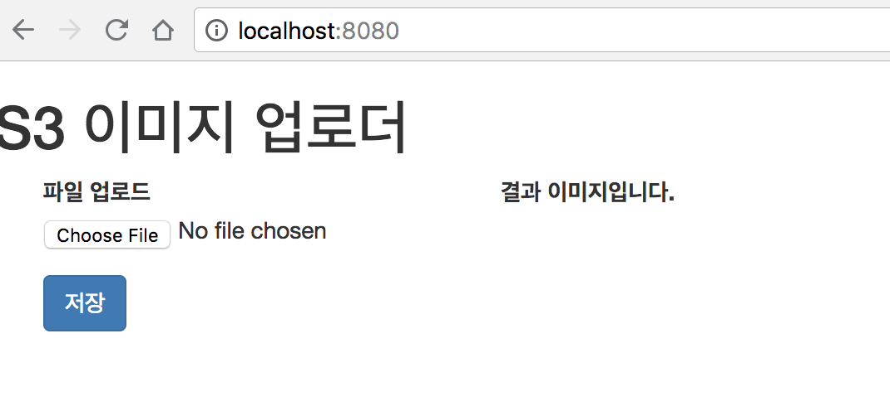

자 프로젝트 코드는 완성되었으니, 이제 S3와 관련된 작업들을 추가로 진행해보겠습니다.

### application.yml

가장 먼저 할일은 AWS S3에 필요한 정보를 ```application.yml```에 추가하는 것입니다.
프로젝트의 ```src/main/resources/application.yml```에 아래와 같이 설정값을 추가합니다.

```yaml
cloud:
  aws:
    s3:
      bucket: 본인 S3 bucket이름
    region:
      static: ap-northeast-2
```

여기서 중요한 값 2개가 빠졌는데요.  
바로 AWS의 ```credentials.accessKey```와 ```credentials.secretKey```입니다.  
AWS 환경이 아닌 로컬 환경에서 S3를 사용하기 위해 별도의 User를 생성해보겠습니다.
먼저 AWS IAM 서비스로 이동하여 **사용자** -> 사용자 추가를 클릭합니다.

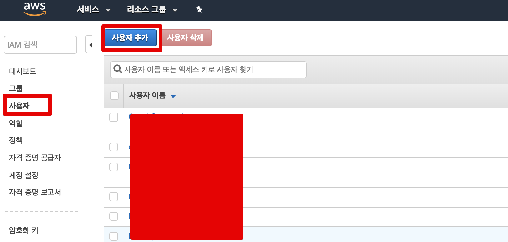

프로그래밍 방식 엑세스를 체크하시고

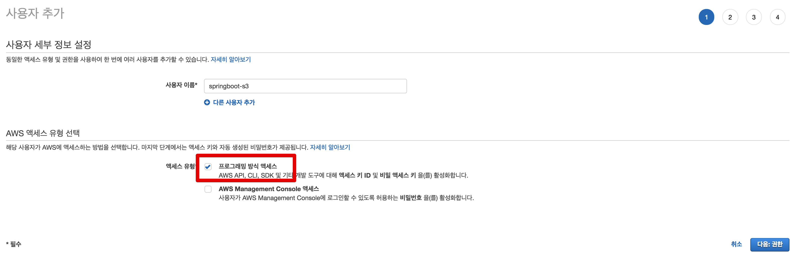

S3를 검색하여 AmazonS3FullAccess를 선택합니다.

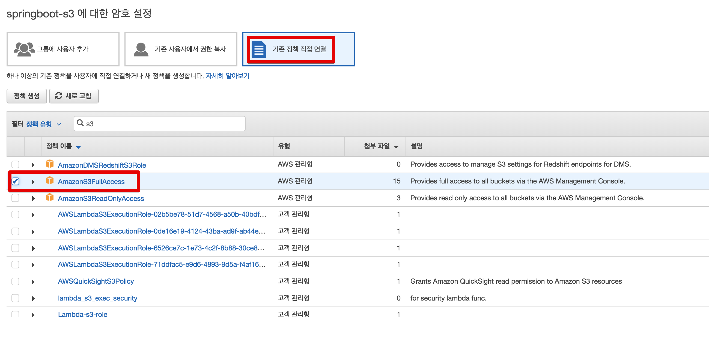

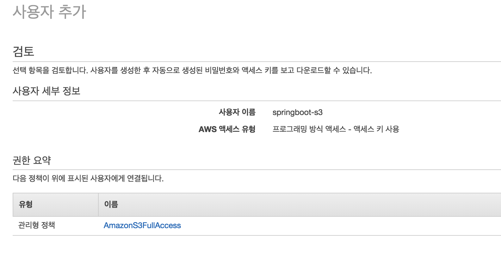

마지막으로 access key와 secret key를 발급 받습니다.  
여기서 발급받은 키가 로컬에서 사용될것이니 csv로 다운로드 받으시거나, 웹에서 나온 항목을 그대로 복사해서 별도로 메모해놓습니다.

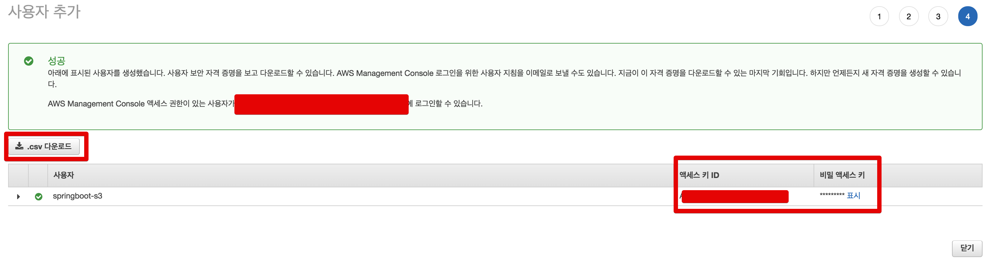

그리고 이 값들을 ```application.yml```와 마찬가지로 ```src/main/resources/``` 아래에 ```aws.yml```를 생성해서 추가합니다.

```yaml
cloud:
  aws:
    credentials:
      accessKey: 발급받은 accessKey
      secretKey: 발급받은 secretKey

```

그리고 현재 프로젝트에서 ```aws.yml```도 사용할 수 있도록 ```Application.java``` 코드를 변경합니다.  

```java
@SpringBootApplication
public class Application {

    public static final String APPLICATION_LOCATIONS = "spring.config.location="
            + "classpath:application.yml,"
            + "classpath:aws.yml";

    public static void main(String[] args) {
        new SpringApplicationBuilder(Application.class)
                .properties(APPLICATION_LOCATIONS)
                .run(args);
    }
}
```

마지막으로 **가장 중요한!!** ```.gitignore```에 ```aws.yml```을 등록합니다.

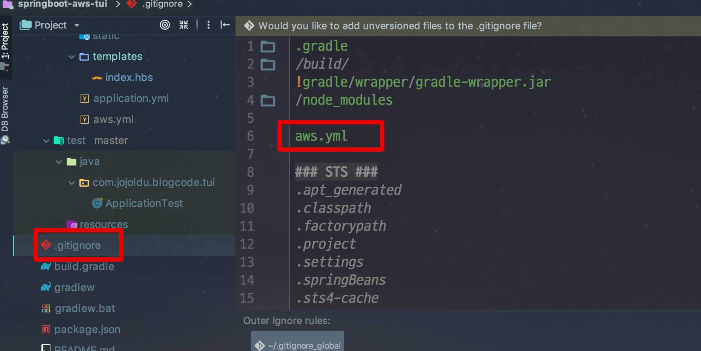

이렇게 두개의 키를 별도의 파일인 ```aws.yml```에 관리하는 이유는 ```application.yml```에서 다루기엔 너무 위험하기 때문입니다.  
Github에 올라가게되면 언제든 다른 사람이 가져갈 수 있기 때문에 **git에서 관리되지 않는 파일에서 별도로 관리**하는 것입니다.  
Git 관리 항목에서 제외 (```.gitignore```) 했기 때문에 더이상 이 키가 외부에 공개될것을 걱정하지 않아도 됩니다.  
자 그럼 이제 모든 프로젝트 설정이 끝났습니다!  
바로 테스트를 진행해보겠습니다.

### 로컬 테스트

프로젝트를 실행시키고 간단하게 기능을 테스트하는 내용을 녹화했습니다.

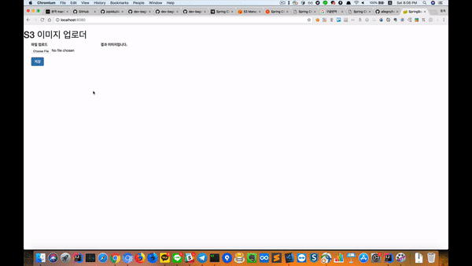

원하던대로 아주 잘 작동하죠?  
여기서 끝이 아닙니다.  
한가지 내용을 좀 더 추가하겠습니다.

## 2. 배포 환경에서 사용하기

자 이제 로컬이 아닌 배포 서버인 EC2에서 이 기능을 어떻게 활용할 수 있는지 소개드리겠습니다.  
로컬과 배포 환경이 뭐가 다른지 궁금하실텐데요.  
저희가 관리하고 있던 AWS S3의 accessKey, secretKey는 Git의 관리 대상이 아닙니다.  
그러다보니 **배포 항목에 포함되지가 않습니다**.  
배포 항목에 포함되지 않으니 EC2에 배포해서는 작동하지 않습니다.  


* 오토스케일링 환경에서 각각의 EC2 마다 ```aws.yml```을 포함시키는 것은 사실상 불가능하다.

그래서 EC2의 IAM Role을 활용하겠습니다.

### EC2에 역할 추가

> 기본 생성된 EC2가 있다는 가정하에 시작합니다.

EC2에 S3 Role을 추가하기 위해 IAM -> 역할 (Role) 생성을 시작합니다.  
  
사용할 서비스로 EC2를 선택하시고
 
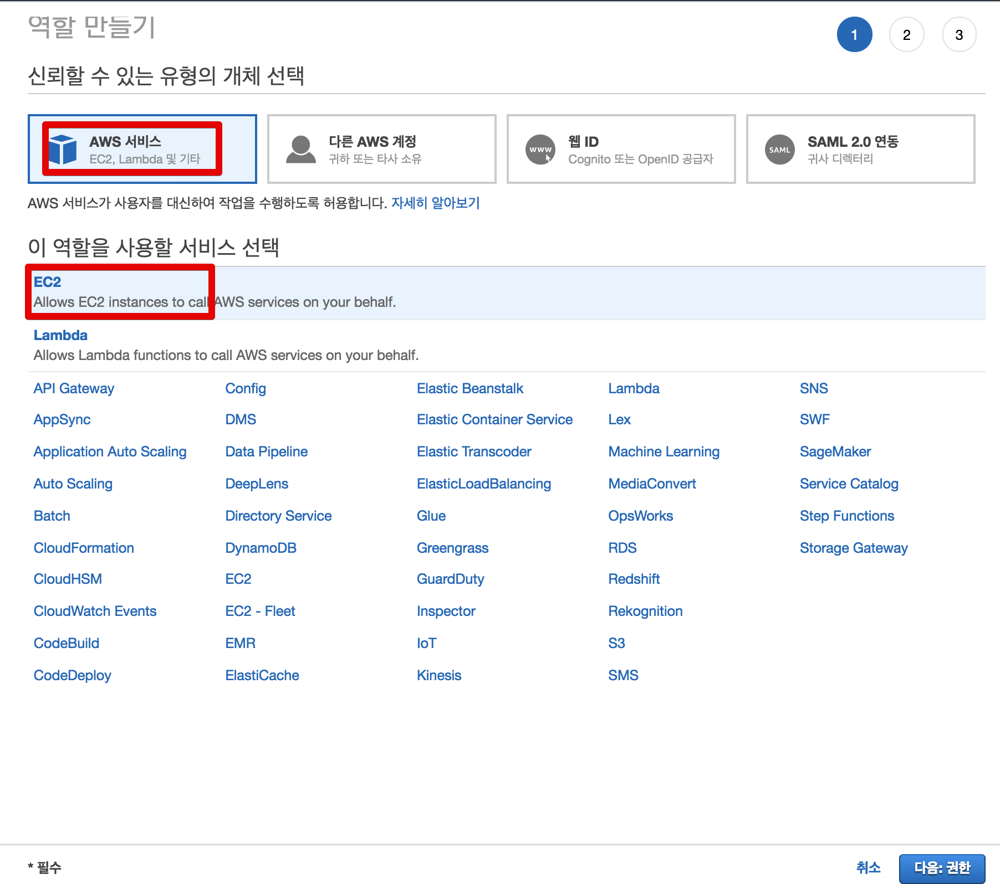

사용자 생성때와 마찬가지로 S3 권한을 선택

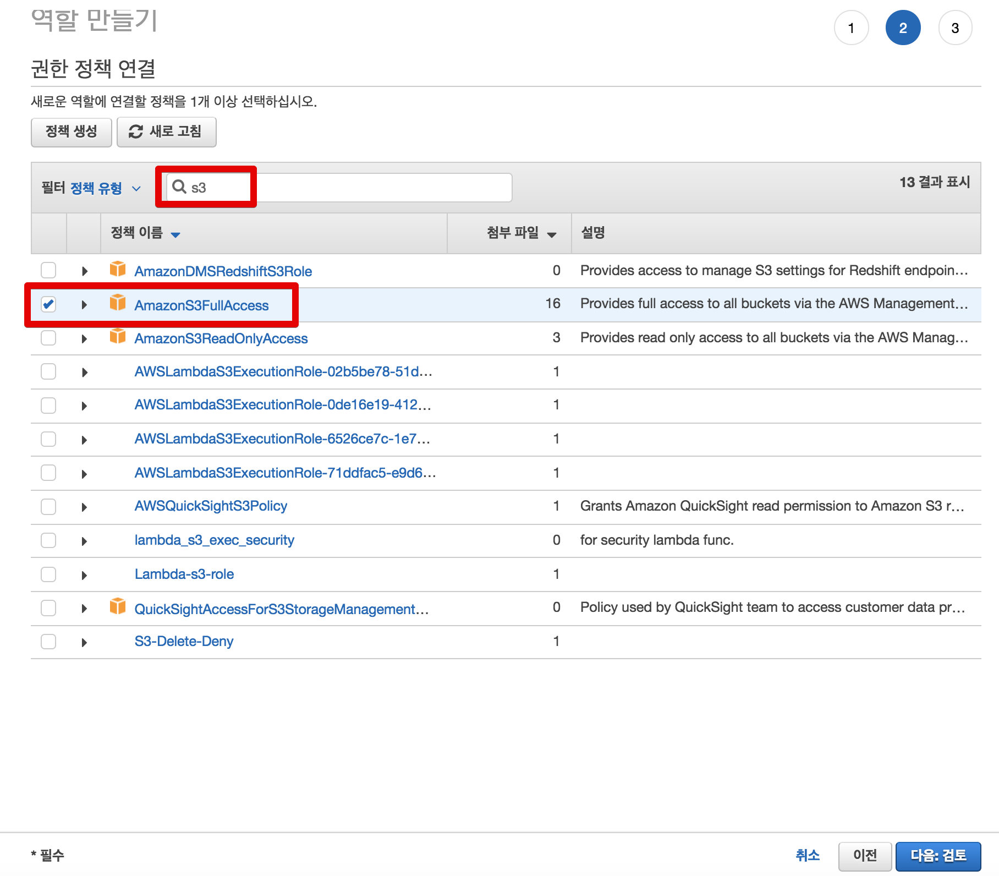

역할 이름을 등록하신뒤 생성을 완료합니다.

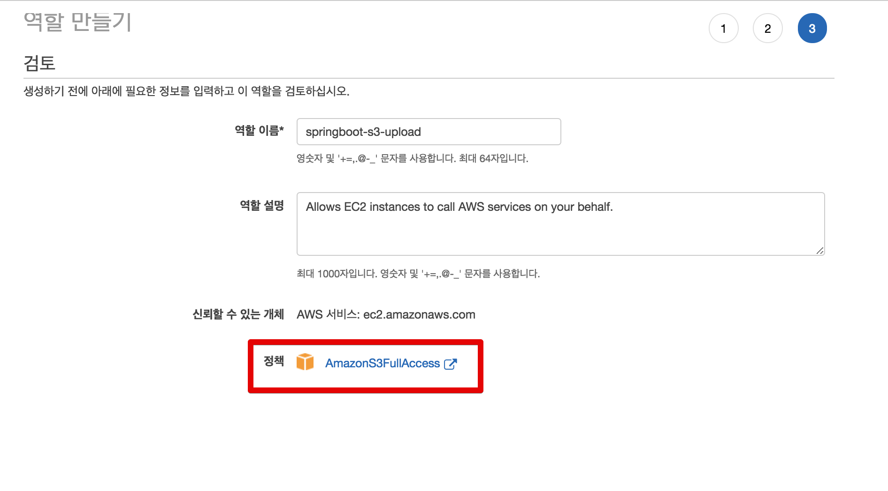

이렇게 생성된 Role을 원하는 EC2에 할당합니다.

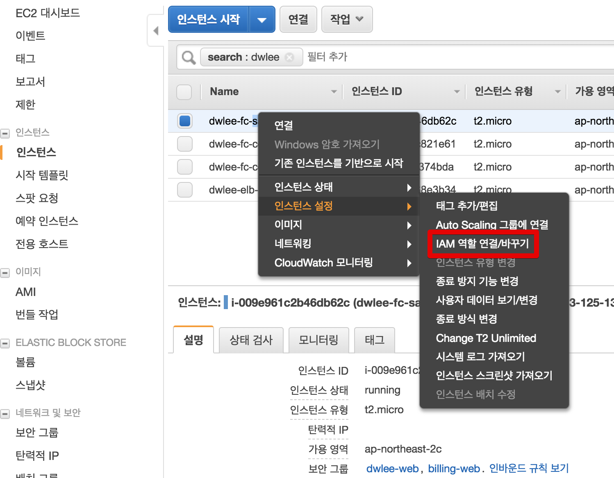

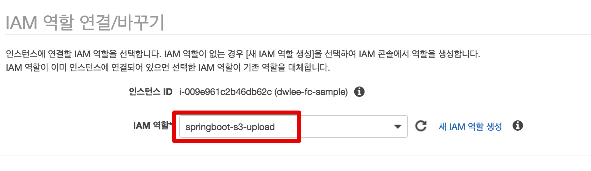

> 만약 기존에 EC2에서 사용하던 Role이 있다면 해당 Role에 S3 정책도 추가만 해주시면 됩니다.

자 이렇게만 하면 EC2 에서 S3를 자유자재로 쓸 수 있습니다.  
보통 일반 서버에서는 ```~/.aws/credentials```에 accessKey와 secretKey를 등록해서 사용하는데요.  
EC2는 별다른 설정이 없어도 **할당된 IAM Role에 따라 accessKey와 secretKey를 발급** 받습니다.  

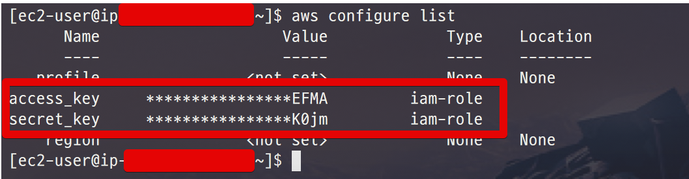

보시는것처럼 ```aws configure list``` 명령어로 확인해보면 해당 EC2의 key Type이 모두 ```iam-role```입니다.  
이는 개발자가 직접 key를 등록한 것이 아니라, **IAM Role을 통해 생성**되었다는 것을 의미합니다.  
여튼! EC2의 설정도 끝났습니다!  
마지막으로 Spring Cloud가 ```aws.yml```에 등록된 Key외에 EC2에 등록된 Key도 사용할 수 있도록 간단한 설정만 추가하겠습니다.

### application.yml 추가

application.yml을 열어서 다음과 같이 변경합니다.

```yaml
cloud:
  aws:
    s3:
      bucket: jojoldu
    region:
      static: ap-northeast-2
    stack:
      auto: false
    credentials:
      instanceProfile: true
```

딱 2줄의 코드가 추가되었는데요.

* ```cloud.aws.stack.auto: false```
  * EC2에서 Spring Cloud 프로젝트를 실행시키면 기본으로 **CloudFormation 구성을 시작**합니다.
  * 설정한 CloudFormation이 없으면 프로젝트 시작이 안되니, 해당 내용을 사용하지 않도록 ```false```를 등록합니다.
* ```cloud.aws.credentials.instanceProfile: true```
  * AWS의 ```instanceProfile```를 사용하겠다는 의미입니다.
  * 좀 전에 ```aws configure list```로 확인한 Key들을 사용한다고 보시면 됩니다.
  * 만약 **이 값들이 없다면 application.yml 이나 Enviroment 등에서 해당 키가 있는지 찾아서 사용**합니다. 

자 모든 설정이 끝났습니다!  
바로 EC2에서 테스트를 진행하겠습니다.

### EC2에서 테스트

각자의 방식으로 EC2에 해당 프로젝트를 배포하시고 Build -> Run 합니다.  
그리고 해당 EC2의 도메인으로 접근해서 테스트 해보시면!


보시는것처럼 EC2에서도 S3 업로드 기능이 아주 잘 작동하는 것을 확인할 수 있습니다.

## 마무리

인터넷에 있는 많은 Spring Boot + S3 사용법이 최근 내용을 반영하지 못한것을 봤습니다.  
좀 더 간결한 코드로 실제 배포환경에서도 사용할 수 있는 방식을 꼭 소개시켜드리고 싶었습니다.  
다음에도 도움이 될만한 내용들을 찾아서 정리하겠습니다.  
감사합니다!

