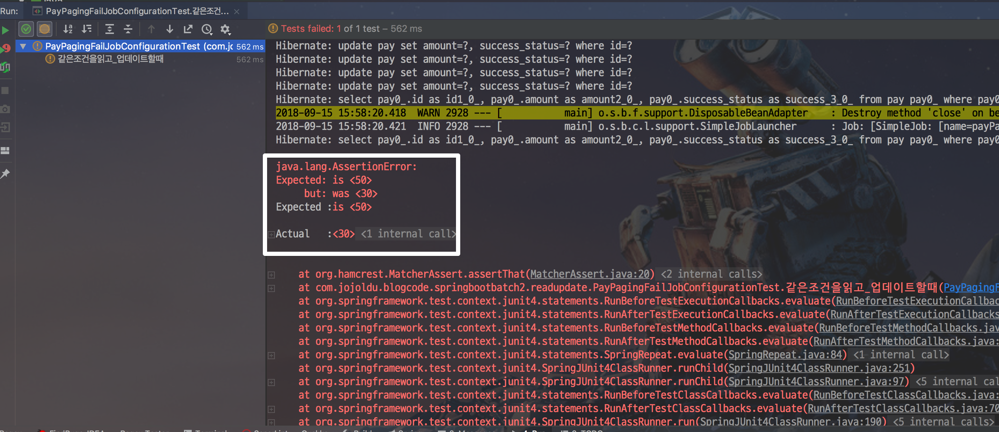
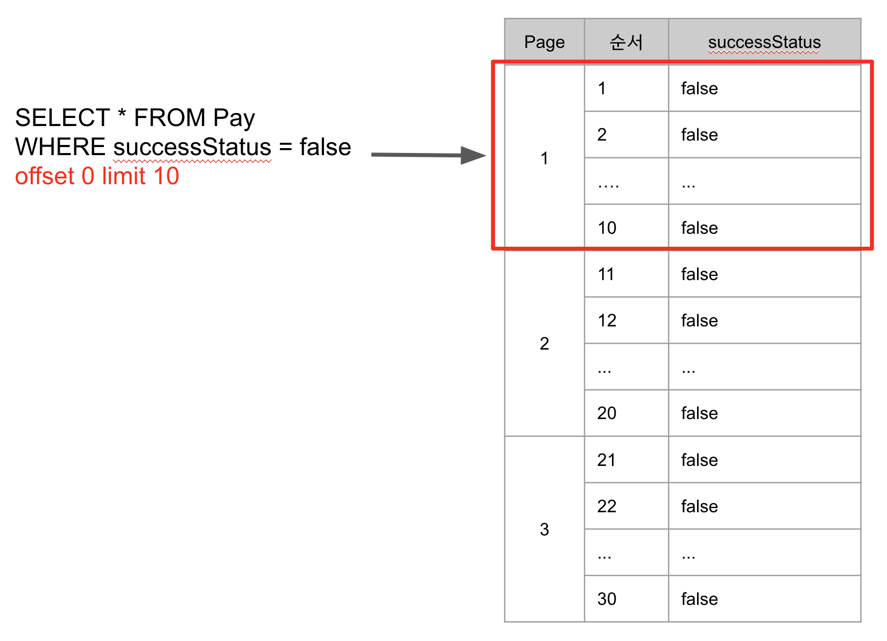
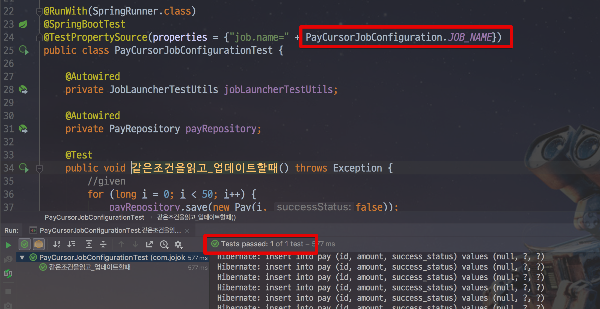
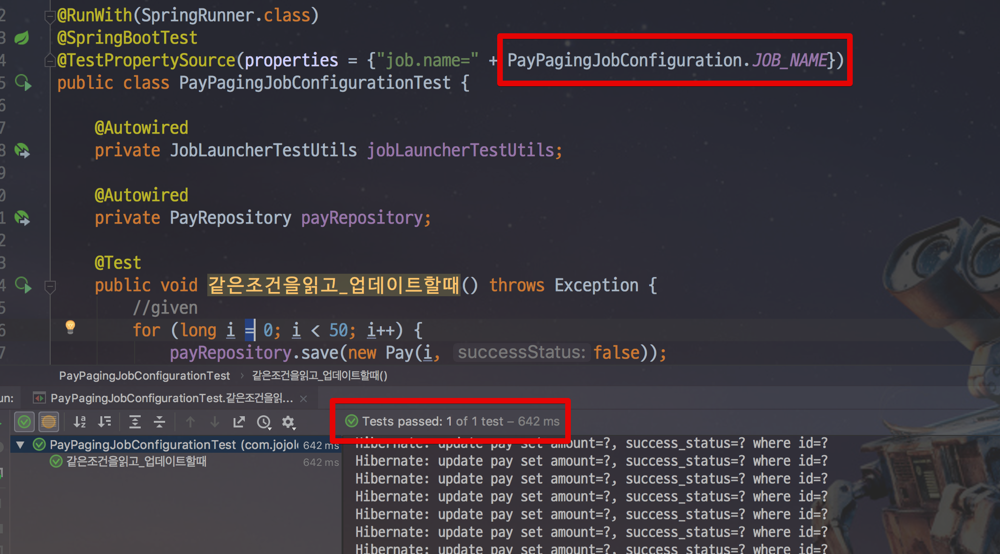

# Spring Batch PagingReader 사용시 같은 조건의 데이터를 읽고 수정할때 문제

안녕하세요.  
이번 시간에는 Spring Batch를 사용하시는 분들이 자주 묻는 질문 중 하나인 **같은 조건의 데이터를 읽고 수정할때 어떻게 해야하는지** 에 대해서 소개드리려고 합니다.  
  
모든 코드는 [Github](https://github.com/jojoldu/blog-code/tree/master/springboot-batch-2)에 있으니 참고하시면 됩니다.

## 문제 상황

예를 들어 아래와 같은 문제가 있다고 가정하겠습니다.  
pay라는 테이블에 ```successStatus```가 ```false```인 데이터를 모두 가져와 ```true```로 변환해야 한다고 보겠습니다.  
  
샘플로 사용할 ```Pay``` Entity는 다음과 같습니다.

```java
import lombok.AccessLevel;
import lombok.Getter;
import lombok.NoArgsConstructor;

import javax.persistence.Entity;
import javax.persistence.GeneratedValue;
import javax.persistence.GenerationType;
import javax.persistence.Id;

@Getter
@NoArgsConstructor(access = AccessLevel.PROTECTED)
@Entity
public class Pay {

    @Id
    @GeneratedValue(strategy = GenerationType.IDENTITY)
    private Long id;

    private Long amount;
    private boolean successStatus;

    public Pay(Long amount, boolean successStatus) {
        this.amount = amount;
        this.successStatus = successStatus;
    }

    public void success() {
        this.successStatus = true;
    }
}
```

자 그리고 배치를 한번 만들어보겠습니다.  
Batch에서는 ```JpaPagingItemReader```를 사용합니다.

```java
@Slf4j
@RequiredArgsConstructor
@Configuration
@ConditionalOnProperty(name = "job.name", havingValue = JOB_NAME)
public class PayPagingFailJobConfiguration {

    public static final String JOB_NAME = "payPagingFailJob";

    private final EntityManagerFactory entityManagerFactory;
    private final StepBuilderFactory stepBuilderFactory;
    private final JobBuilderFactory jobBuilderFactory;

    private final int chunkSize = 10;

    @Bean
    public Job payPagingJob() {
        return jobBuilderFactory.get(JOB_NAME)
                .start(payPagingStep())
                .build();
    }

    @Bean
    @JobScope
    public Step payPagingStep() {
        return stepBuilderFactory.get("payPagingStep")
                .<Pay, Pay>chunk(chunkSize)
                .reader(payPagingReader())
                .processor(payPagingProcessor())
                .writer(writer())
                .build();
    }

    @Bean
    @StepScope
    public JpaPagingItemReader<Pay> payPagingReader() {
        return new JpaPagingItemReaderBuilder<Pay>()
                .queryString("SELECT p FROM Pay p WHERE p.successStatus = false")
                .pageSize(chunkSize)
                .entityManagerFactory(entityManagerFactory)
                .name("payPagingReader")
                .build();
    }

    @Bean
    @StepScope
    public ItemProcessor<Pay, Pay> payPagingProcessor() {
        return item -> {
            item.success();
            return item;
        };
    }

    @Bean
    @StepScope
    public JpaItemWriter<Pay> writer() {
        JpaItemWriter<Pay> writer = new JpaItemWriter<>();
        writer.setEntityManagerFactory(entityManagerFactory);
        return writer;
    }
}
```

JpaPagingItemReader를 사용하는 아주 흔한 방식의 배치입니다.  
이를 한번 테스트 코드로 검증해보겠습니다.

```java
@RunWith(SpringRunner.class)
@SpringBootTest
@TestPropertySource(properties = {"job.name=" + PayPagingFailJobConfiguration.JOB_NAME})
public class PayPagingFailJobConfigurationTest {

    @Autowired
    private JobLauncherTestUtils jobLauncherTestUtils;

    @Autowired
    private PayRepository payRepository;

    @Test
    public void 같은조건을읽고_업데이트할때() throws Exception {
        //given
        for (long i = 0; i < 50; i++) {
            payRepository.save(new Pay(i, false));
        }

        //when
        JobExecution jobExecution = jobLauncherTestUtils.launchJob();

        //then
        assertThat(jobExecution.getStatus(), is(BatchStatus.COMPLETED));
        assertThat(payRepository.findAllSuccess().size(), is(50));

    }
}
```

작성한 배치 코드대로라면 결과는 ```given```에서 등록한 50개가 모두 ```true```로 변경되어서 ```true```인 데이터는 50개가 되어야만 합니다.  
  
자 그럼 테스트를 한번 실행해보겠습니다.  
그러면!



테스트가 깨집니다.  
예상한대로 50개가 결과가 되어야 하는데 30개만 되었다는 결과입니다!  
왜 이런 결과가 나왔을까요?

## 원인

이건 Spring Batch의 문제가 아닌 Paging 이라는 행위 자체의 문제인데요.  

> 즉, 웹 어플리케이션에서 구현할때도 같은 문제가 발생할 수는 있습니다.

Paging이란 ```offset```과 ```limit```을 이용하여 매 조회마다 다음 페이지를 읽어오는 방식을 얘기합니다.  
이 방식이 지금 상황에선 문제가 될 수 있는데요.  
  
예를 들어 첫번째 Paging 쿼리는 다음과 같습니다.

```sql
SELECT * FROM Pay 
WHERE successStatus = false 
offset 0 limit 10
```

이 쿼리가 테이블에 실행되면 다음과 같이 조회됩니다.



그리고 **이 조회된 데이터를 Update** 합니다.  
조회한 데이터를 Update 한 것이 중요합니다.  
이 **Update로 인해서 이제 테이블에는 ```false```인 데이터가 40개만 존재**합니다.  
  
이 상태에서 다음 Paging 쿼리를 실행합니다.  
다음 Paging 쿼리는 아래와 같습니다.

```sql
SELECT * FROM Pay 
WHERE successStatus = false 
offset 11 limit 10
```

자! 이 쿼리가 **Update되어 40개만 남은 테이블에 실행되면** 어떻게 될까요?


**40개 데이터에서 11번째 부터인 데이터를** 가져옵니다.  
앞서 실행된 쿼리에서 대상을 Update하여 제외되이 원래 의도대로라면 21번째인 데이터가 11번째 데이터로 조회가 됩니다.  
그러다보니 원래 **11번째 데이터부터 20번째까지 데이터가 조회되지 않습니다**.  
  
자 그럼 이 문제를 어떻게 해결하면 될까요?

## 해결책

해결책은 크게 2가지가 있습니다.

### 1. Cursor 사용

첫번째 방법은 Cursor를 이용하는 것입니다.  
Cursor는 한번 커넥션을 맺고 Database Cursor를 옮기는 방식이기 때문에 처음 조회했던 결과가 갱신되는 일 없이 조회됩니다.

> Jpa에는 Cursor가 지원되지 않습니다.  
Hibernate를 이용하시거나 Jdbc를 이용하셔야만 합니다.  
그래서 여기서도 JdbcCursorItemReader를 이용하겠습니다.

Cursor를 이용한 코드는 다음과 같습니다.

```java
@Slf4j
@RequiredArgsConstructor
@Configuration
@ConditionalOnProperty(name = "job.name", havingValue = JOB_NAME)
public class PayCursorJobConfiguration {

    public static final String JOB_NAME = "payCursorJob";

    private final EntityManagerFactory entityManagerFactory;
    private final StepBuilderFactory stepBuilderFactory;
    private final JobBuilderFactory jobBuilderFactory;
    private final DataSource dataSource;

    private final int chunkSize = 10;

    @Bean
    public Job payPagingJob() {
        return jobBuilderFactory.get(JOB_NAME)
                .start(payPagingStep())
                .build();
    }

    @Bean
    @JobScope
    public Step payPagingStep() {
        return stepBuilderFactory.get("payPagingStep")
                .<Pay, Pay>chunk(chunkSize)
                .reader(payPagingReader())
                .processor(payPagingProcessor())
                .writer(writer())
                .build();
    }

    @Bean
    @StepScope
    public JdbcCursorItemReader<Pay> payPagingReader() {
        return new JdbcCursorItemReaderBuilder<Pay>()
                .sql("SELECT * FROM pay p WHERE p.success_status = false")
                .rowMapper(new BeanPropertyRowMapper<>(Pay.class))
                .fetchSize(chunkSize)
                .dataSource(dataSource)
                .name("payPagingReader")
                .build();
    }

    @Bean
    @StepScope
    public ItemProcessor<Pay, Pay> payPagingProcessor() {
        return item -> {
            item.success();
            return item;
        };
    }

    @Bean
    @StepScope
    public JpaItemWriter<Pay> writer() {
        JpaItemWriter<Pay> writer = new JpaItemWriter<>();
        writer.setEntityManagerFactory(entityManagerFactory);
        return writer;
    }
}
```

자 이 Batch로 테스트를 수행해보면!



테스트가 통과하는 것을 알 수 있습니다.

### 2. PagingReader Override

두번째 방법은 PagingReader를 개선하는 것입니다.  
내용은 간단합니다.  
Update될때마다 대상 데이터 범위가 줄어드니, **일부러 Page 번호를 계속 변경시키지 않고 0번째로 고정시키는 것**입니다.  
  
JpaPagingItemReader를 사용했던 문제의 코드에서 Reader 부분만 다음과 같이 변경해봅니다.

```java
    @Bean
    @StepScope
    public JpaPagingItemReader<Pay> payPagingReader() {

        JpaPagingItemReader<Pay> reader = new JpaPagingItemReader<Pay>() {
            @Override
            public int getPage() {
                return 0;
            }
        };

        reader.setQueryString("SELECT p FROM Pay p WHERE p.successStatus = false");
        reader.setPageSize(chunkSize);
        reader.setEntityManagerFactory(entityManagerFactory);
        reader.setName("payPagingReader");

        return reader;
    }
```

이 Batch로 테스트를 수행해보면!



Paging을 개선한 Batch 역시 성공적으로 테스트가 통과함을 알 수 있습니다.

## 마무리

해결책 2가지 방법 중 어느것을 쓰셔도 결과는 무방합니다.  
다만 조회할 데이터가 너무 많아 부하가 걱정 되신다면 Paging을 써야하기 때문에 2번째 방법을 쓰시고 데이터 자체가 많지 않다면 Cursor 방식을 추천합니다.

> Paging과 Cursor의 상세한 비교는 [이전 포스팅](https://jojoldu.tistory.com/336)을 참고해보세요.


