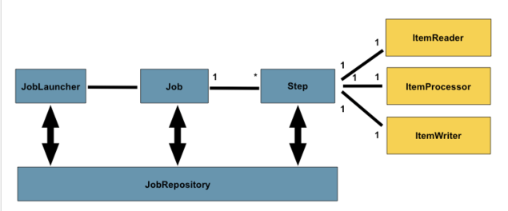
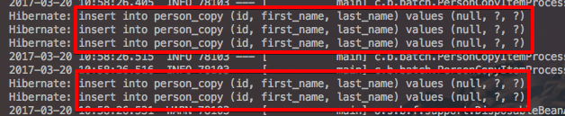

# springboot-batch

안녕하세요? 이번 시간엔 springboot-batch 예제를 진행해보려고 합니다. 모든 코드는 [Github](https://github.com/jojoldu/blog-code/tree/master/springboot-batch)에 있기 때문에 함께 보시면 더 이해하기 쉬우실 것 같습니다.  
(공부한 내용을 정리하는 [Github](https://github.com/jojoldu/blog-code)와 세미나+책 후기를 정리하는 [Github](https://github.com/jojoldu/review), 이 모든 내용을 담고 있는 [블로그](http://jojoldu.tistory.com/)가 있습니다. ) 

### 용어정리

* Job
  * 하나의 배치 작업
* Job Instance
* JobRepository
  * 수행되는 Job에 대한 정보를 담고 있는 저장소
  * 어떠한 Job이 언제 수행되었고, 언제 끝났으며, 몇 번이 실행되었고 실행에 대한 결과가 어떤지 등의 Batch수행과 관련된 모든 meta data가 저장

* Step

* Tasklet
  * 각 step에서 수행되는 로직
  * 개발자가 직접 명세한 배치작업
  * 기본적으로는 아래와 같은 작업을 제공한다.
    * ItermReader : 데이터 읽기
    * ItemProcessor : 읽은 데이터 처리
    * ItemWriter : 처리된 데이터를 저장

* chunck
  * 읽기/쓰기 단위

(chunk를 3개로 할 경우 writer가 3개 단위로 된다.)  

### reader open() 실행되지 않는 문제
**일반 reader item 실행순서**  

* TaskletStep.open() -> CompositeItemStream.open() -> AbstractItemCountingItemStreamItemReader.open() -> JpaPagingItemReader.doOpen()
