# springboot-batch 번외1 - @StepScope 사용시 주의사항
안녕하세요? 이번 시간에는 SpringBatch를 처음 사용하면서 했던 실수 중 하나를 정리하려고 합니다.  
모든 코드는 [Github](https://github.com/jojoldu/blog-code/tree/master/springboot-batch)에 있기 때문에 함께 보시면 더 이해하기 쉬우실 것 같습니다.  
(공부한 내용을 정리하는 [Github](https://github.com/jojoldu/blog-code)와 세미나+책 후기를 정리하는 [Github](https://github.com/jojoldu/review), 이 모든 내용을 담고 있는 [블로그](http://jojoldu.tistory.com/)가 있습니다. )<br/>

이번 포스팅은 Spring Batch에 대해 기본적인 흐름을 알고 계신 것을 가정하고 진행됩니다.  
혹시나 아직 Spring Batch를 모르신다면 곧! 제가 정리해서 올릴 포스팅을 기다려주세요! 
  
### 문제상황
간단한 batch를 작성하였습니다.  
다른 코드는 볼게 없어 reader 부분만 보시면 됩니다.  
reader의 코드는 아래와 같습니다.  

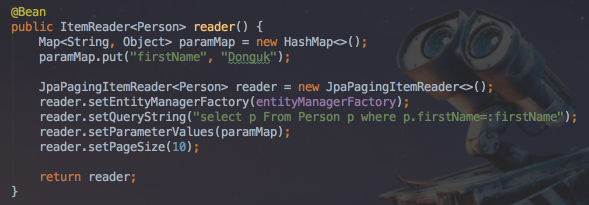

이렇게 reader를 작성하고 간단하게 테스트 코드를 돌렸습니다.  

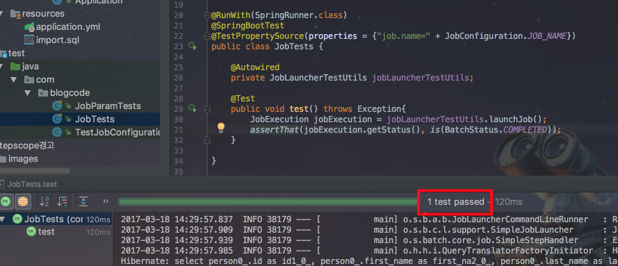

가뿐하게 테스트를 통과하고 다음 step을 작성하였습니다.  
파라미터를 입력 받는 reader를 가진 step을 구현하기 위해 reader 부분을 조금 수정하였습니다.  

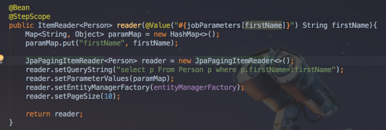

```@StepScope```와 ```@Value("#{jobParameters[firstName]}") String firstName```만 수정하였습니다.  
파라미터를 추가한 테스트코드가 필요하여 테스트 코드도 아래와 같이 수정하였습니다.  

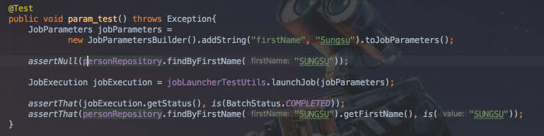

이 테스트를 수행했더니!

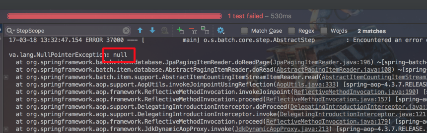

실패하였습니다.  
진짜 멘붕이였던 것이 이전과 달라진 것은 **단 2줄의 코드** 뿐인데 null pointer exception이 발생한 것입니다.  
이때부터 어마어마한 삽질을 시작하게 됩니다.  
(코드를 보신분들은 아마 바로 눈치 채셨겠지만, 당시엔 전혀 보이지 않았습니다 ㅠ)  
  
디버깅을 해보면서 어디서부터 문제가 발생했는지 확인했습니다.  
  
**SimpleStepBuilder**  
  
step의 build 수행시에 문제가 발생한건가 싶어 구현체인 SimpleStepBuilder를 확인했습니다.  

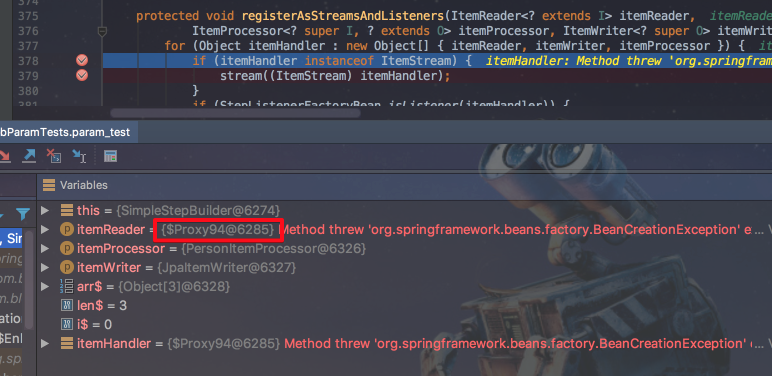

여기서 보시면 ItemReader 부분만 ```Proxy```객체인것을 확인할 수 있습니다.  
이게 이상했습니다.  
제가 작성했던 reader bean객체는 리턴 타입이 ```ItemReader```지만 실제 생성한 것은 ```JpaPagingItemReader```이기 때문입니다.  
한참을 trace 하다가 ```@StepScope```를 확인했더니...  

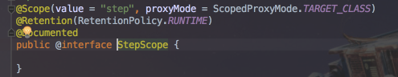  

```proxyMode = ScopedProxyMode.TARGET_CLASS```가 있었습니다.  


  
즉, ```reader()```에서 ItemReader 타입을 리턴할 경우 @StepScope의 ```proxyMode = ScopedProxyMode.TARGET_CLASS```로 인해서 **ItemReader 인터페이스의 프록시 객체**를 생성하여 리턴하게 됩니다.  
(처음 생성된 reader에 문제가 없었던 것은 @StepScope가 없어서 **생성한 객체 그대로를 bean으로 전달**했기 때문에 프록시 객체가 사용되지 않았기 때문입니다.)  
  
이게 중요한 것인데 ItemReader의 프록시 객체이다 보니 아래와 같이 read() 메소드밖에 없습니다.    

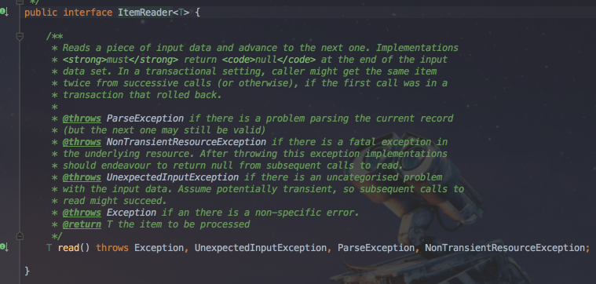

실제로 stream을 open/close하는 메소드는 전혀 없는 상태입니다.  
open/close 메소드는 모두 **ItemStream 인터페이스**에서 갖고 있기 때문입니다.  

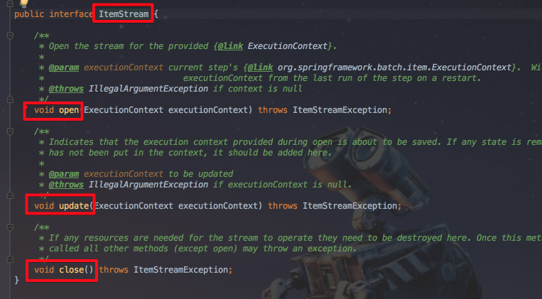  

그러다보니 step의 stream을 등록하는 ```if``` 절을 통과하지 못하게 되었습니다.   

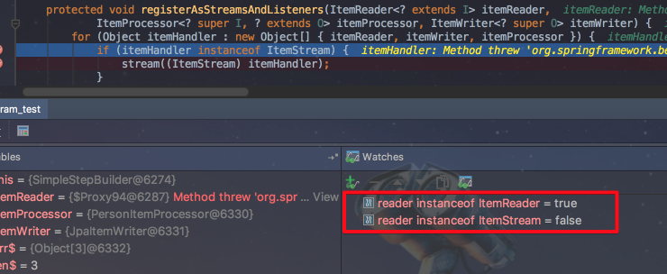

보시다시피 프록시 객체를 가진 reader가 ItemReader타입이지만, ItemStream타입이 아닌것을 확인할 수 있습니다.  
이로 인해서 reader가 stream으로 등록되지 못하였습니다.  

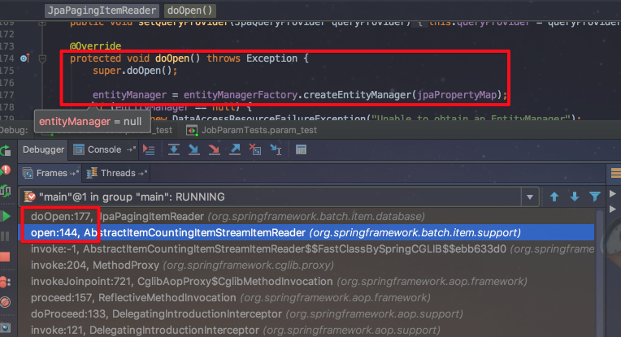

EntityManagerFacotry에서 EntityManger를 생성하는 것은 등록된 stream이 진행하는데 stream이 없다보니 open메소드를 수행하지 못하고 결국은 **EntityManager가 생성되지 않아** null point exception이 발생한 것입니다.   
  
해결책은 간단합니다.  
메소드의 리턴 타입을 구현체의 타입을 직접 사용하는 것입니다.  

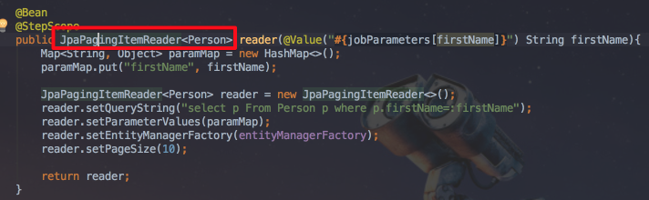  

이렇게 수정 후 테스트를 수행 하면  

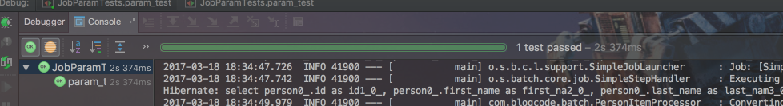

성공한 것을 확인할 수 있습니다.  
하하하하.... ㅠㅠㅠ...  

### 번외
이렇게 저처럼 삽질하는 분들이 계실까봐 스프링배치에선 아주 아주 친절하게 경고 메세지를 출력시켜주고 있었습니다.  

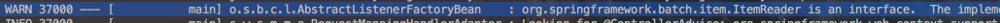  

전체 내용을 보자면,

```
o.s.b.c.l.AbstractListenerFactoryBean    : org.springframework.batch.item.ItemReader is an interface.  The implementing class will not be queried for annotation based listener configurations.  If using @StepScope on a @Bean method, be sure to return the implementing class so listner annotations can be used.
```

위 로그를 번역해보면 아래와 같습니다.

 > org.springframework.batch.item.ItemReader는 인터페이스입니다. 
구현 클래스는 어노테이션 기반 listner 구성에 대해 살행되지 않습니다. 
@Bean 메소드에서 @StepScope를 사용하는 경우 listner 어노테이션을 사용할 수 있도록 구현 클래스를 리턴해야합니다.


### 결론
> error 메세지 외에 warn 메세지도 발생하면 읽어볼 것

머리가 안좋으면 손발이 고생한다는 격언을 다시 한번 느낄수 있었습니다.  
아무쪼록 다른 분들은 저처럼 이상한 포인트에서 많은 시간을 낭비하지 않으시길 바라며 포스팅을 마칩니다.  
  
끝까지 읽어주셔서 감사합니다!!