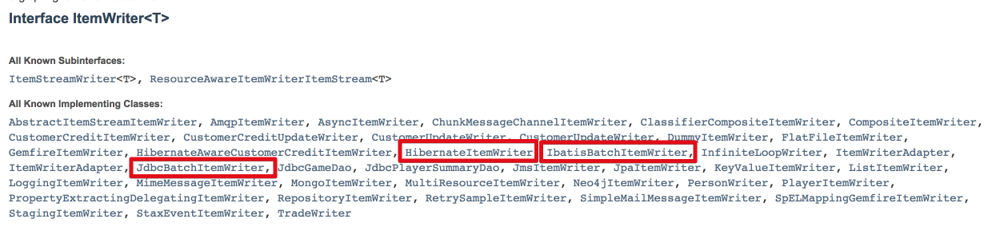
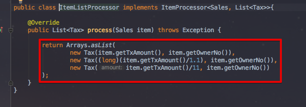
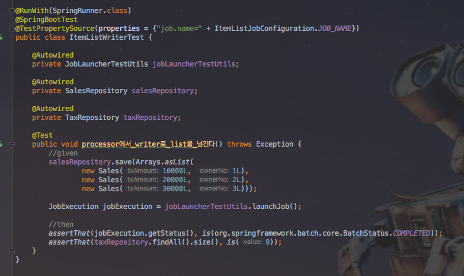
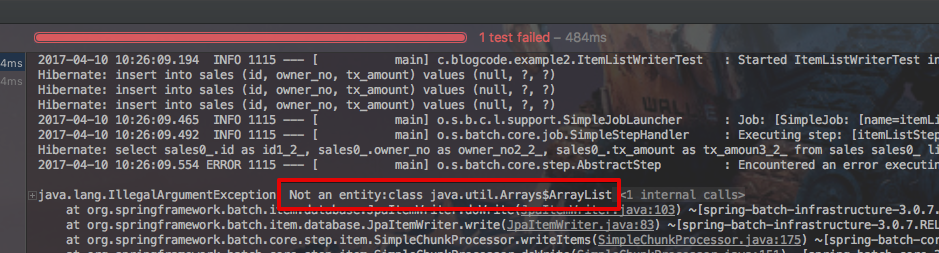
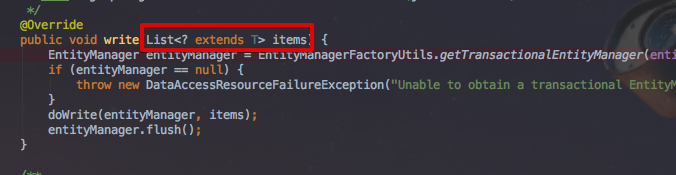
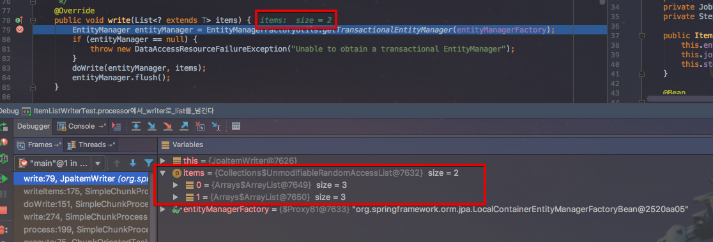
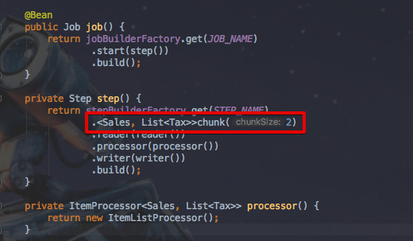
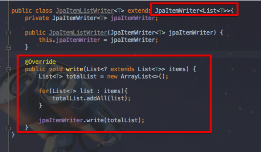
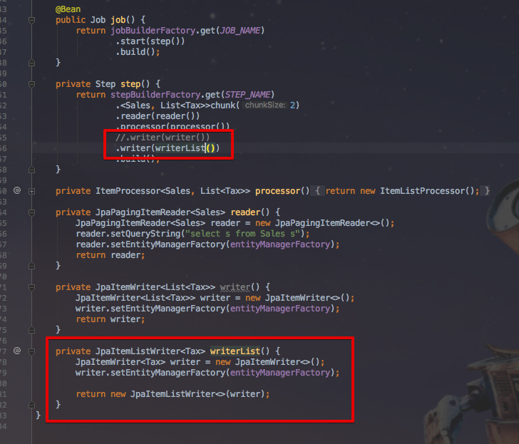
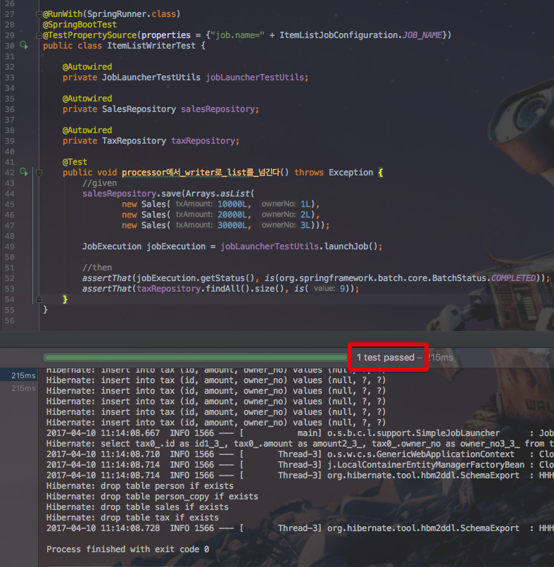

# springboot-batch 번외2 - ItemWriter에 List 전달하기
안녕하세요? 이번 시간엔 springboot-batch에서 writer에 List를 전달하는 예제를 진행해보려고 합니다.  
모든 코드는 [Github](https://github.com/jojoldu/blog-code/tree/master/springboot-batch)에 있기 때문에 함께 보시면 더 이해하기 쉬우실 것 같습니다.  
(공부한 내용을 정리하는 [Github](https://github.com/jojoldu/blog-code)와 세미나+책 후기를 정리하는 [Github](https://github.com/jojoldu/review), 이 모든 내용을 담고 있는 [블로그](http://jojoldu.tistory.com/)가 있습니다. )<br/>

### 문제상황

정산과 관련된 프로젝트를 진행 중, Sales 데이터를 파싱하여 Tax 데이터를 저장하는 spring batch를 만들어야 한다고 가정하겠습니다.  
예를 들어 A Sales가 조회되면 이를 파싱하여 Tax1,Tax2,Tax3으로 저장되어야 합니다.  
그럼 간단하게 ```batch configuration```을 작성하겠습니다.  


특별할것이 없는 코드입니다. 저 같은 경우엔 ```ItemWriter```를 ```JpaItemWriter```를 사용했는데, ```IbatisBatchItemWriter```, ```JdbcBatchItemWriter```등을 사용하셔도 무방합니다.  



([docs.spring.io](https://docs.spring.io/spring-batch/apidocs/org/springframework/batch/item/ItemWriter.html))

코드의 내용은 단순합니다. ```reader```에서 읽은 데이터(```Sales```)를 ```processor```를 거쳐 ```List<Tax>```로 전환한뒤, ```writer```에서 DB에 저장합니다.  

다음 ```ItemListProcessor```의 코드는 아래와 같습니다.  



간단한 수식을 추가하여 3개의 ```Tax```를 생성하여 리턴합니다.  
그리고 마지막으로 이를 테스트할 테스트코드를 작성하겠습니다.  



3개의 ```Sales```를 등록하여 배치를 돌린 뒤, ```Tax```가 9개 등록되었는지 확인하는 코드입니다.  
자 그럼 테스트를 실행해볼까요?  

  

음?  
테스트가 실패했습니다.  
컴파일 에러는 발생하지 않았는데, 런타임의 어느 부분에서 잘못된걸까요?  
여기서 힌트는 바로 ```Not an entity:class java.util.Arrays$ArrayList```입니다.  
이 부분을 좀 더 살펴볼까요?

### 해결

에러로그를 따라 ```JpaItemWriter```의  ```write```메소드를 살펴보겠습니다.  



여기를 보시면 받는 타입이 ```List```를 허용하는것처럼 보이는데요.  
이로 인해 착각하시는 분들이 많으실것 같습니다.  
한번 테스트 코드를 실행하여 실제 값이 어떻게 들어오는지 확인해보겠습니다.  



이상하지 않으신가요? ```items```에 ```ArrayList```가 2개 할당되었습니다.  
1개 혹은 3개도 아닌 2개는 어디서 나온걸까요?  
바로 ```step```에 지정한 ```chunk``` 사이즈입니다.  



즉, ```write``` 메소드에 할당되는 ```List```는 ```chunk``` size만큼 T 데이터를 받는 것입니다.  
T는 ```ArrayList<Tax>```가 할당되고, ```ArrayList```는 ```Entity``` 클래스가 아니기 때문에 오류가 발생한 것입니다.  
이를 해결하려면 결국 JpaItemWriter의 ```write```메소드를 오버라이딩 하는 수 밖에 없습니다.  
그래서 ```JpaItemListWriter```를 만들어 보겠습니다.  



기존의 JpaItemWriter의 대부분 기능은 그대로 유지한채, ```write()```메소드만 오버라이딩 했습니다.  
```ArrayList<Tax>```를 제네릭으로 지정했을때, ```Tax```를 T로 볼 수 있도록 JpaItemWriter는 ```List<T>``` 타입으로 지정하였고, 마찬가지로 ```write()``` 메소드의 인자도 ```List<? extends List<T>>```로 지정하였습니다.  
단, 실제로 DB에 저장하는 ```JpaItemWriter의.write()```는 그대로 사용해야했기에, ```JpaItemWriter```를 멤버변수로 할당해서 이를 사용하도록 하였습니다. (일종의 컴포지트패턴이라고 보시면 됩니다.)  
  
이에 맞춰 batch config도 수정하겠습니다.  



먼저, ```JpaItemWriter```를 생성후, 이를 ```JpaItemListWriter```의 생성자인자로 전달하였습니다.  
자 그럼 테스트 코드를 한번 수행해볼까요?  



짠! 성공적으로 테스트가 통과하였습니다!

### 후기
> spring batch는 하면 할수록 재밌는것이 많은것 같습니다.  
다만 아직까지 국내에 spring batch만 다루는 책이 없어 아쉽습니다.  
착실하게 따라갈 수 있고, 실무에서 만날만한 문제들을 미리 얘기해줄 수 있는 책이 있으면 이런 삽질들을 좀 피할 수 있을텐데 라는 생각이 들었던 것 같습니다.  
여튼! 열심히 삽질하고 기록하겠습니다.  
감사합니다!
