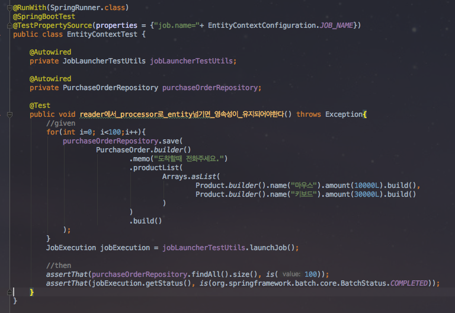
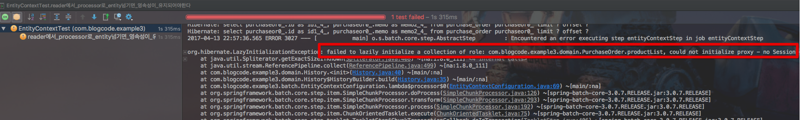
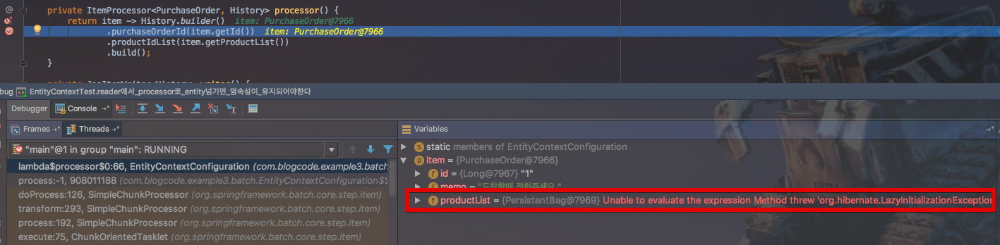
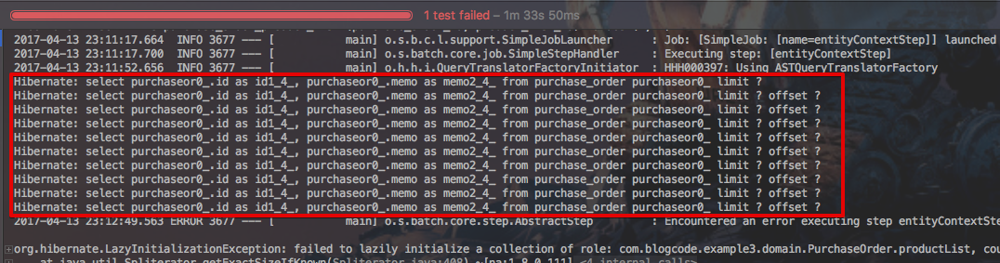
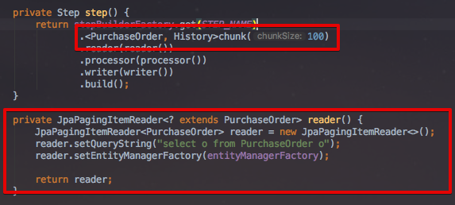
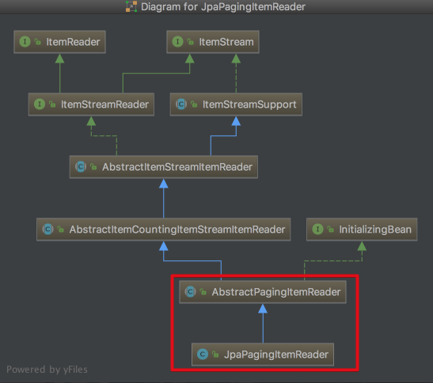
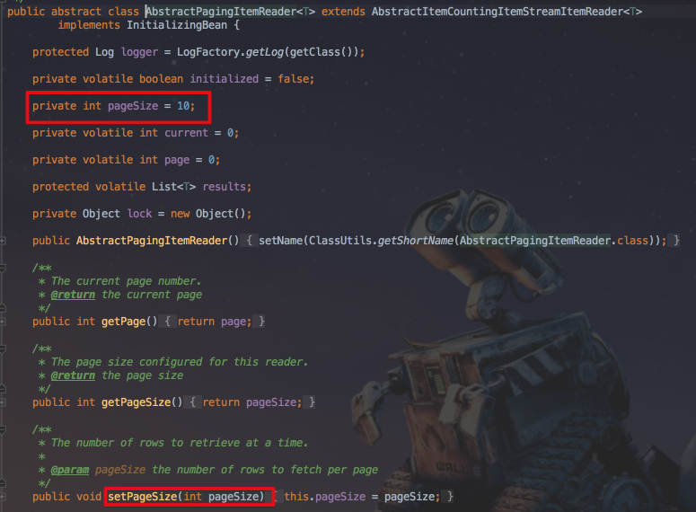
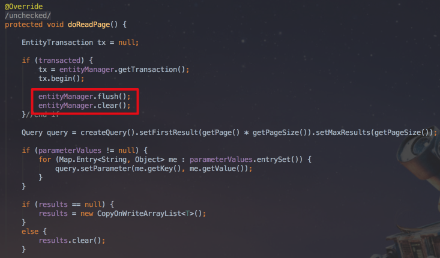
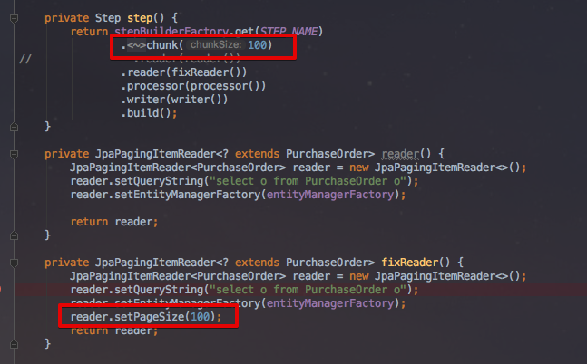
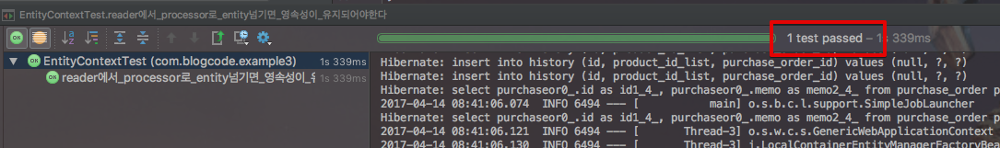

# springboot-batch 번외2 - reader와 processor사이의 영속성 컨텍스트 문제

안녕하세요? 이번 시간엔 springboot-batch에서 reader로 읽은 데이터를 processor로 넘길때 영속성 컨텍스트가 문제가 되는 상황을 해결해보려고 합니다.  
모든 코드는 [Github](https://github.com/jojoldu/blog-code/tree/master/springboot-batch)에 있기 때문에 함께 보시면 더 이해하기 쉬우실 것 같습니다.  
(공부한 내용을 정리하는 [Github](https://github.com/jojoldu/blog-code)와 세미나+책 후기를 정리하는 [Github](https://github.com/jojoldu/review), 이 모든 내용을 담고 있는 [블로그](http://jojoldu.tistory.com/)가 있습니다. )<br/>
  

### 문제 상황

주문 시스템을 구축한다고 가정하겠습니다.  
주문을 받은 뒤, 배치를 돌면서 주문의 내용을 ```History``` 테이블에 저장하는 기능입니다.  
주문(```PurchageOrder```) 테이블에는 상품(```Product```)이 ```OneToMany```로 잡혀있습니다.  
도메인 코드는 아래와 같습니다.  
  


그리고 이를 사용한 배치 코드는 아래와 같습니다.


(processor는 클래스 코드까지 필요가 없어, 람다식으로 익명클래스를 생성하였습니다.)  
  
보시는것처럼 크게 어려운 내용은 없는 코드입니다.  
이를 테스트하기 위한 테스트 코드입니다.  



100개의 주문(```PurchageOrder```)를 입력하면서 상품(```Product```)를 각각 2개씩 추가하였습니다.  
자 이렇게 해서 테스트 코드를 실행을 시키면!  



테스트가 실패가 됩니다.  
발생한 에러는 아래와 같습니다.  

```
org.hibernate.LazyInitializationException: failed to lazily initialize a collection of role: com.blogcode.example3.domain.PurchaseOrder.productList, could not initialize proxy - no Session
```

보시면 ```PurchaseOrder의 productList```를 가져오려니 트랜잭션 세션이 없다는 에러입니다.  
이 부분에서 조금 의아했던 것이 reader에서 읽은 데이터의 트랜잭션이 processor에서 넘길때 유지되지 않는건가?  하는 것이였습니다.  




하지만, 이전에 배치 작업을 했을때를 떠올려보면 **reader에서 processor 간의 트랜잭션 세션은 분명히 유지**되었습니다.  
그래서 어디서 트랜잭션 세션이 종료되었는지 한번 추적하였습니다.  

### 해결

에러가 발생한 코드에서 디버깅 모드로 데이터를 확인하니,


이렇게 ```productList```가 이미 레이지 이셉션이 발생한 상태입니다.  
이상하다 싶어서 발생한 에러로그를 자세히 보면 특이한 점이 발견됩니다.  



표시된것처럼 ```reader```로 실행되는 **조회쿼리가 10개**나 발생한 것입니다.  
저는 ```chunk```를 100개로 잡았고, 실제로 데이터도 100개만 들었기 때문에 1번의 조회쿼리만 발생할 것이라 생각했는데 왜 10개나 발생한거지? 라는 의문이 생겼습니다.  
  
(JPA의 고수 모 선임님의 조언으로 문제점을 찾을 수 있었습니다.)  



여길 보시면 ```chunk```는 100으로 지정되어 있습니다.  
헌데, ```JpaPagingItemReader```의 상위 클래스인 ```AbstractPagingItemReader``` 코드를 보시면,  



(reader의 클래스 계층)



**기본 페이지 수가 10** 으로 잡혀있습니다.  
즉, 기본 페이지로 지정된 수 만큼 ```select``` 를 해오지만, **chunck가 100으로 잡혀있기에 10개씩 총 10번을 조회**한것입니다.  
(chunk 단위로 ```reader```에서 ```processor```로 전달되기에 100개를 채워야만 ```processor```로 데이터가 전달됩니다.)  

10번을 조회해서 문제가 아니라, ```JpaPagingItemReader```는 페이지를 읽을때, 이전 **트랜잭션 초기화**를 시키기 때문입니다.



(```JpaPagingItemReader```의 메소드)  
  
그러다보니 마지막 조회를 제외한 9번의 조회결과들의 트랜잭션 세션이 전부 종료되어 오류가 발생한 것입니다.  
  
이를 해결하는 방법은 간단합니다.  
**chunk와 pageSize 갯수를 똑같이 맞춰주는 것**입니다.  



이렇게 수정 후 테스트를 실행해보면!



1번의 조회와 테스트 통과를 확인할 수 있습니다.

