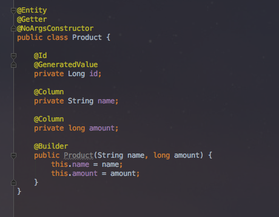
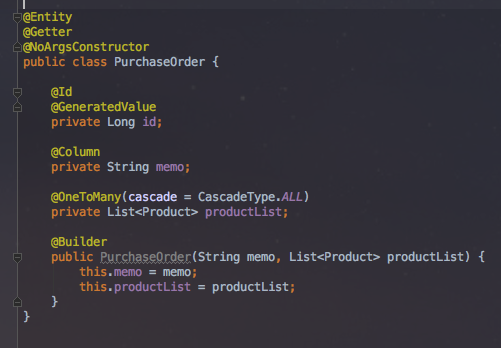
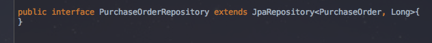
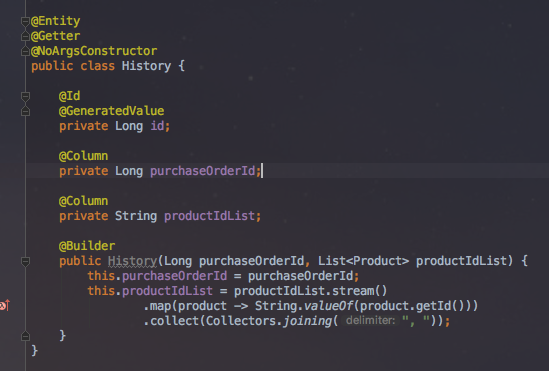
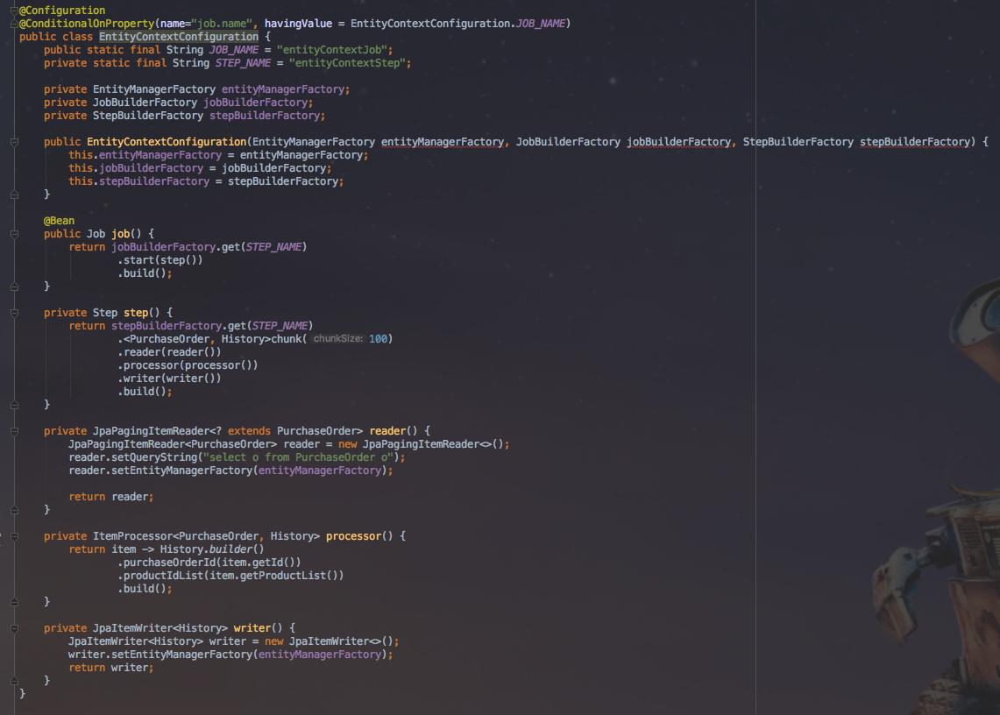

# springboot-batch 번외2 - reader와 processor사이의 영속성 컨텍스트 문제

안녕하세요? 이번 시간엔 springboot-batch에서 reader로 읽은 데이터를 processor로 넘길때 영속성 컨텍스트가 문제가 되는 상황을 해결해보려고 합니다.  
모든 코드는 [Github](https://github.com/jojoldu/blog-code/tree/master/springboot-batch)에 있기 때문에 함께 보시면 더 이해하기 쉬우실 것 같습니다.  
(공부한 내용을 정리하는 [Github](https://github.com/jojoldu/blog-code)와 세미나+책 후기를 정리하는 [Github](https://github.com/jojoldu/review), 이 모든 내용을 담고 있는 [블로그](http://jojoldu.tistory.com/)가 있습니다. )<br/>
  

## 문제 상황

주문 시스템을 구축한다고 가정하겠습니다.  
주문을 받은 뒤, 배치를 돌면서 주문의 내용을 ```History``` 테이블에 저장하는 기능입니다.  
주문(```PurchageOrder```) 테이블에는 상품(```Product```)이 ```OneToMany```로 잡혀있습니다.  
도메인 코드는 아래와 같습니다.  
  








그리고 이를 사용한 배치 코드는 아래와 같습니다.



(processor는 클래스 코드까지 필요가 없어, 람다식으로 익명클래스를 생성하였습니다.)  
  
보시는것처럼 크게 어려운 내용은 없는 코드입니다.

## 해결
