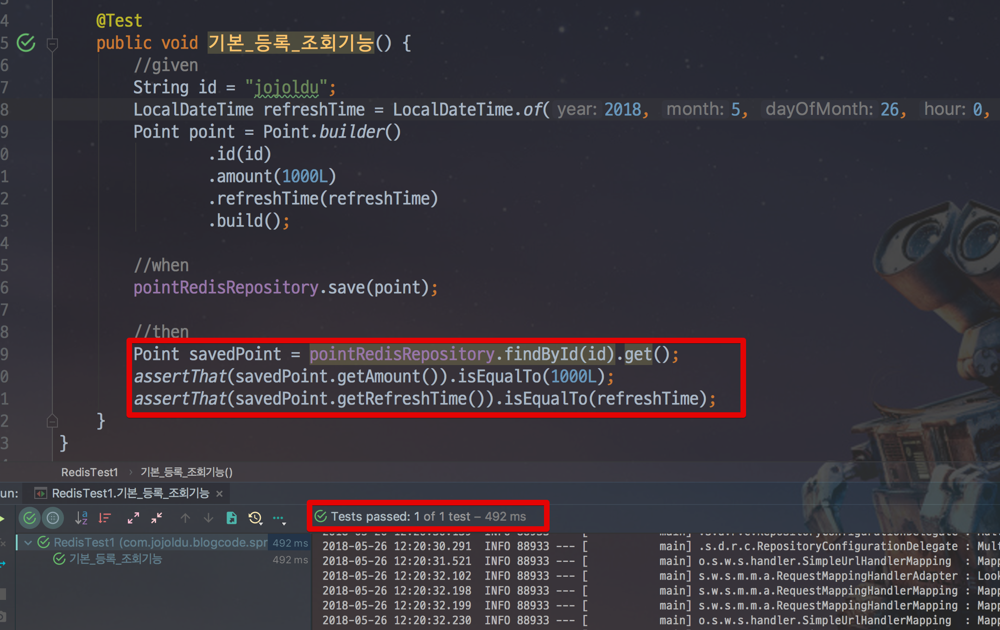
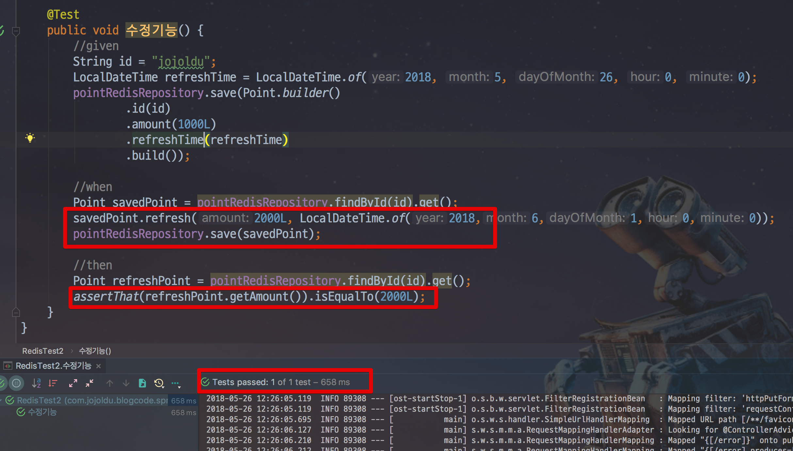
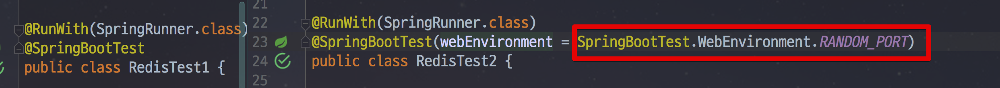
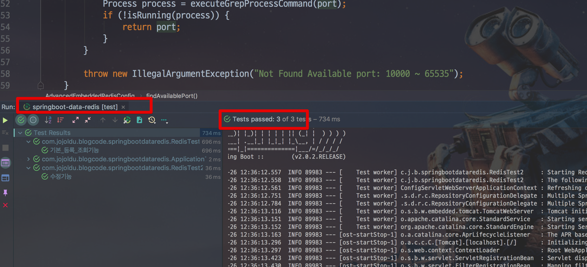

# SpringBoot Data Redis 로컬 테스트 예제

안녕하세요? 이번 시간엔 SpringBoot Data Redis 로컬 테스트 예제를 진행해보려고 합니다.  
모든 코드는 [Github](https://github.com/jojoldu/blog-code/tree/master/springboot-data-redis)에 있기 때문에 함께 보시면 더 이해하기 쉬우실 것 같습니다.  
(공부한 내용을 정리하는 [Github](https://github.com/jojoldu/blog-code)와 세미나+책 후기를 정리하는 [Github](https://github.com/jojoldu/review), 이 모든 내용을 담고 있는 [블로그](http://jojoldu.tistory.com/)가 있습니다. )<br/>
 
## 들어가며

회사 신규 프로젝트로 Redis 를 사용하게 되었습니다.  
로컬에서 개발하고 테스트 할 수 있는 환경구성이 필요했는데요.  
H2처럼 Redis도 **프로젝트에 의존**하는 로컬 환경을 구성하게 되서 정리합니다.  

> 개인적인 생각이지만, 저는 Github에서 프로젝트를 받은뒤 바로 실행이 될수있어야 한다고 생각합니다.  
프로젝트를 실행시키려면 AWS (SQS) 계정이 있어야 한다거나, 특정 데몬(Redis, MySQL)을 설치해야 하는 등이 있으면 개선이 필요하다고 생각합니다.  
누가 오더라도 ```git clone``` 만 받으면 바로 로컬 개발/테스트를 시작할 수 있도록 하는 것을 지향합니다.

사용할 기술은 다음과 같습니다.

* Spring Data Redis
  * Redis를 마치 JPA Repository를 이용하듯이 인터페이스를 제공하는 스프링 모듈
  * ```CrudRepository```를 지원하기 때문에 좀 더 직관적으로 사용 가능
* Lettuce
  * Redis Java Client
  * 현재 (Spring Boot 2.0.2) Spring Data Redis에서 공식지원하는 Client 
      * Jedis, Lettuce만 현재 공식지원
      * Redisson은 아직 미포함
      * 포함되도 사용할지는 고민 ([Redisson 사용 경험](http://redisgate.kr/redis/clients/redisson_intro.php))
  * Jedis가 거의 업데이트 되지 않음
      * [Why is Lettuce the default Redis client used in Spring Session Redis?](https://github.com/spring-projects/spring-session/issues/789) 
* Embedded Redis
  * H2와 같은 내장 Redis 데몬

자 그럼 위 3가지 기술을 통해 로컬 개발/테스트 환경을 구축해보겠습니다.

## 기본 환경 구성

먼저 3개 모듈의 의존성을 추가하겠습니다.  
  
**build.gradle**

```groovy
    // spring-data-redis
    compile('org.springframework.boot:spring-boot-starter-data-redis')
    //embedded-redis
    compile group: 'it.ozimov', name: 'embedded-redis', version: '0.7.2'
```

> 여기서 [it.ozimov.embedded-redis](https://github.com/ozimov/embedded-redis) 를 보고 의아해하실분들이 계실것 같습니다.  
기존에 내장 Redis를 쓸때 [kstyrc.embedded-redis](https://github.com/kstyrc/embedded-redis) 를 사용했는데요.  
3년동안 업데이트가 없어 kstyrc.embedded-redis를 Fork해서 만들어진 모듈입니다.  
현재 많은 분들이 위 모듈을 대신해서 사용중입니다.

그리고 Config 파일을 2개를 생성하겠습니다.  
  
**EmbeddedRedisConfig**

```java
import lombok.extern.slf4j.Slf4j;
import org.springframework.beans.factory.annotation.Value;
import org.springframework.context.annotation.Configuration;
import org.springframework.context.annotation.Profile;
import redis.embedded.RedisServer;

import javax.annotation.PostConstruct;
import javax.annotation.PreDestroy;

@Slf4j //lombok
@Profile("local") // profile이 local일때만 활성화
@Configuration
public class EmbeddedRedisConfig {

    @Value("${spring.redis.port}")
    private int redisPort;

    private RedisServer redisServer;

    @PostConstruct
    public void redisServer() throws IOException {
            redisServer = new RedisServer(redisPort);
            redisServer.start();
    }

    @PreDestroy
    public void stopRedis() {
        if (redisServer != null) {
            redisServer.stop();
        }
    }
}
```

위는 내장 Redis를 프로젝트가 ```profile=local```일때만 실행되도록 하는 설정입니다.  
그리고 아래에선 Spring Data Redis를 설정합니다.  
  
**RedisRepositoryConfig**

```java
import org.springframework.beans.factory.annotation.Value;
import org.springframework.context.annotation.Bean;
import org.springframework.context.annotation.Configuration;
import org.springframework.data.redis.connection.RedisConnectionFactory;
import org.springframework.data.redis.connection.lettuce.LettuceConnectionFactory;
import org.springframework.data.redis.core.RedisTemplate;
import org.springframework.data.redis.repository.configuration.EnableRedisRepositories;

@Configuration
@EnableRedisRepositories
public class RedisRepositoryConfig {
    @Value("${spring.redis.host}")
    private String redisHost;

    @Value("${spring.redis.port}")
    private int redisPort;

    @Bean
    public RedisConnectionFactory redisConnectionFactory() {
        return new LettuceConnectionFactory(redisHost, redisPort);
    }

    @Bean
    public RedisTemplate<?, ?> redisTemplate() {
        RedisTemplate<byte[], byte[]> redisTemplate = new RedisTemplate<>();
        redisTemplate.setConnectionFactory(redisConnectionFactory());
        return redisTemplate;
    }
}
```

* RedisConnectionFactory를 통해 내장 혹은 외부의 Redis를 연결합니다.
* RedisTemplate을 통해 RedisConnection에서 넘겨준 byte 값을 객체 직렬화합니다.  

> 좀 더 자세한 설명이 필요하신 분들은 아라한사님께서 번역하신 [스프링 데이터 레디스](http://arahansa.github.io/docs_spring/redis.html)를 참고하세요!
  
이제 설정은 모두 끝났습니다!  
바로 Redis 객체와 Repository를 만들어보겠습니다.  
  
**Point**

```java
@Getter
@RedisHash("point")
public class Point implements Serializable {

    @Id
    private String id;
    private Long amount;
    private LocalDateTime refreshTime;

    @Builder
    public Point(String id, Long amount, LocalDateTime refreshTime) {
        this.id = id;
        this.amount = amount;
        this.refreshTime = refreshTime;
    }
    
    public void refresh(long amount, LocalDateTime refreshTime){
        if(refreshTime.isAfter(this.refreshTime)){ // 저장된 데이터보다 최신 데이터일 경우
            this.amount = amount;
            this.refreshTime = refreshTime;
        }
    }    
}
```

> 다양한 타입이 되는것을 보여드리기 위해 String, Long, LocalDateTime을 모두 사용했습니다.

**PointRedisRepository**

```java
public interface PointRedisRepository extends CrudRepository<Point, String> {
}
```

자 그럼 테스트 코드로 이 환경이 잘 수행되는지 한번 확인해보겠습니다.  

src/**test**/resources/application.yml

```yaml
spring:
  redis:
    host: localhost
    port: 6379
  profiles:
    active: local
```

테스트 코드는 아래와 같이 작성합니다.

```java
@RunWith(SpringRunner.class)
@SpringBootTest
public class RedisTest1 {
    
    @Autowired
    private PointRedisRepository pointRedisRepository;

    @After
    public void tearDown() throws Exception {
        pointRedisRepository.deleteAll();
    }

    @Test
    public void 기본_등록_조회기능() {
        //given
        String id = "jojoldu";
        LocalDateTime refreshTime = LocalDateTime.of(2018, 5, 26, 0, 0);
        Point point = Point.builder()
                .id(id)
                .amount(1000L)
                .refreshTime(refreshTime)
                .build();

        //when
        pointRedisRepository.save(point);

        //then
        Point savedPoint = pointRedisRepository.findById(id).get();
        assertThat(savedPoint.getAmount()).isEqualTo(1000L);
        assertThat(savedPoint.getRefreshTime()).isEqualTo(refreshTime);
    }
}
```

이 테스트 코드를 한번 수행해보시면!



Redis 테스트가 정상적으로 수행되는걸 확인할 수 있습니다.  
추가로 수정 기능도 한번 테스트 해보겠습니다.

```java
@Test
public void 수정기능() {
    //given
    String id = "jojoldu";
    LocalDateTime refreshTime = LocalDateTime.of(2018, 5, 26, 0, 0);
    pointRedisRepository.save(Point.builder()
            .id(id)
            .amount(1000L)
            .refreshTime(refreshTime)
            .build());

    //when
    Point savedPoint = pointRedisRepository.findById(id).get();
    savedPoint.refresh(2000L, LocalDateTime.of(2018,6,1,0,0));
    pointRedisRepository.save(savedPoint);

    //then
    Point refreshPoint = pointRedisRepository.findById(id).get();
    assertThat(refreshPoint.getAmount()).isEqualTo(2000L);
}
```



수정 기능 역시 잘 수행되는걸 확인할 수 있습니다!  
이렇게만 하면 로컬 테스트 환경이 끝!? 일까요?

## 통합 테스트 환경 구성

아쉽게도 지금 방식으로하면 한가지 큰 문제점을 만나게 됩니다.  
**여러 스프링 테스트 컨텍스트가 실행되면 EmbeddedRedis가 포트충돌**이 납니다.  
예를 들어서,



이렇게 서로 다른 property를 가진 테스트 코드들이 작성되있는 경우 통합테스트 실행시 (ex: ```./gradlew test```) 
새로운 컨텍스트를 생성해서 EmbeddedRedis를 하나더 실행하려고 하는데요.  
이미 지정된 포트 (여기선 6379)가 사용중이라서 다른 테스트들이 수행되지 못합니다.  


 
> ```webEnvironment```외에 @TestPropertySource 등으로 추가 설정한 경우에도 동일합니다.

자 그래서 여기서 한가지 기능을 더 추가하겠습니다.  
**해당 포트가 미사용중이라면 사용하고, 사용중이라면 그외 다른 포트를 사용**하도록 하겠습니다.  
**EmbeddedRedisConfig** 코드를 아래처럼 변경합니다.

> 참고로 **윈도우에서는 안됩니다.**  
맥/리눅스에서만 가능합니다.  
윈도우에서 동일하게 사용하시려면 exe 프로세스 찾는 코드를 작성해야합니다.

```java
@Profile("local")
@Configuration
public class EmbeddedRedisConfig {

    @Value("${spring.redis.port}")
    private int redisPort;

    private RedisServer redisServer;

    @PostConstruct
    public void redisServer() throws IOException {
        int port = isRedisRunning()? findAvailablePort() : redisPort;
        redisServer = new RedisServer(port);
        redisServer.start();
    }

    @PreDestroy
    public void stopRedis() {
        if (redisServer != null) {
            redisServer.stop();
        }
    }

    /**
     * Embedded Redis가 현재 실행중인지 확인
     */
    private boolean isRedisRunning() throws IOException {
        return isRunning(executeGrepProcessCommand(redisPort));
    }

    /**
     * 현재 PC/서버에서 사용가능한 포트 조회
     */
    public int findAvailablePort() throws IOException {

        for (int port = 10000; port <= 65535; port++) {
            Process process = executeGrepProcessCommand(port);
            if (!isRunning(process)) {
                return port;
            }
        }

        throw new IllegalArgumentException("Not Found Available port: 10000 ~ 65535");
    }

    /**
     * 해당 port를 사용중인 프로세스 확인하는 sh 실행
     */
    private Process executeGrepProcessCommand(int port) throws IOException {
        String command = String.format("netstat -nat | grep LISTEN|grep %d", port);
        String[] shell = {"/bin/sh", "-c", command};
        return Runtime.getRuntime().exec(shell);
    }

    /**
     * 해당 Process가 현재 실행중인지 확인
     */
    private boolean isRunning(Process process) {
        String line;
        StringBuilder pidInfo = new StringBuilder();

        try (BufferedReader input = new BufferedReader(new InputStreamReader(process.getInputStream()))) {

            while ((line = input.readLine()) != null) {
                pidInfo.append(line);
            }

        } catch (Exception e) {
        }

        return !StringUtils.isEmpty(pidInfo.toString());
    }
}
```

변경된 설정의 기능은 간단합니다.  
지정된 Redis Port로 실행중인 프로세스가 있다면, 다른 포트로 내장 Redis를 실행시키고,  
없다면 지정된 포트로 내장 Redis를 실행시키는 것입니다.  
자 이렇게 변경후 다시 한번 통합 테스트를 수행해보시면!



통합 테스트 역시 정상적으로 모두 통과하는 것을 확인할 수 있습니다!  

