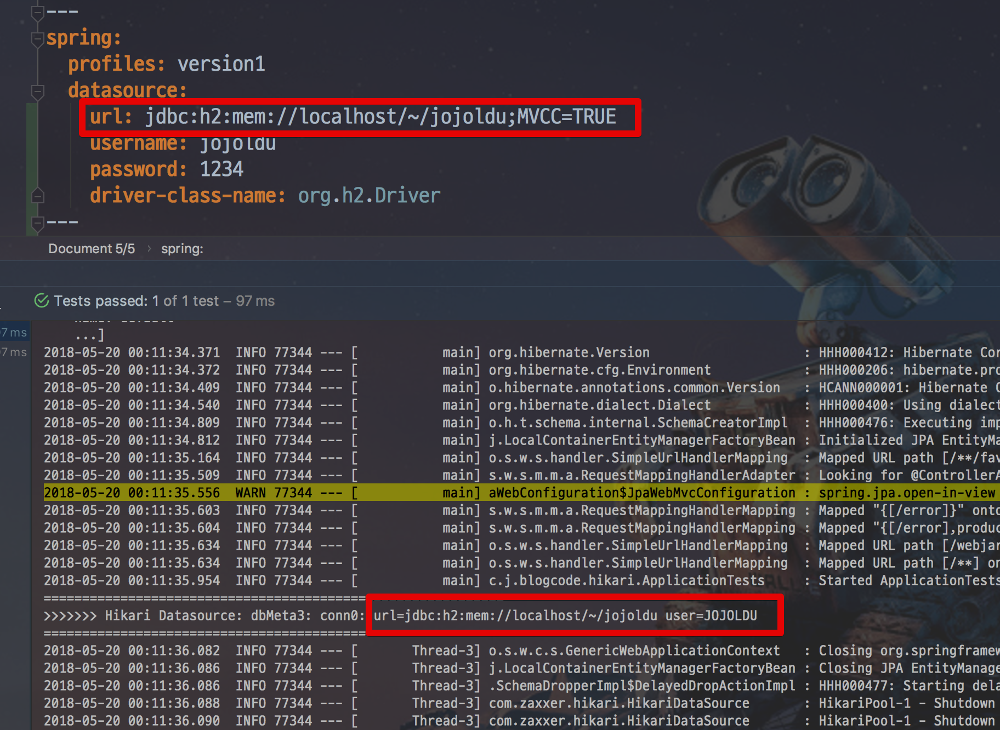
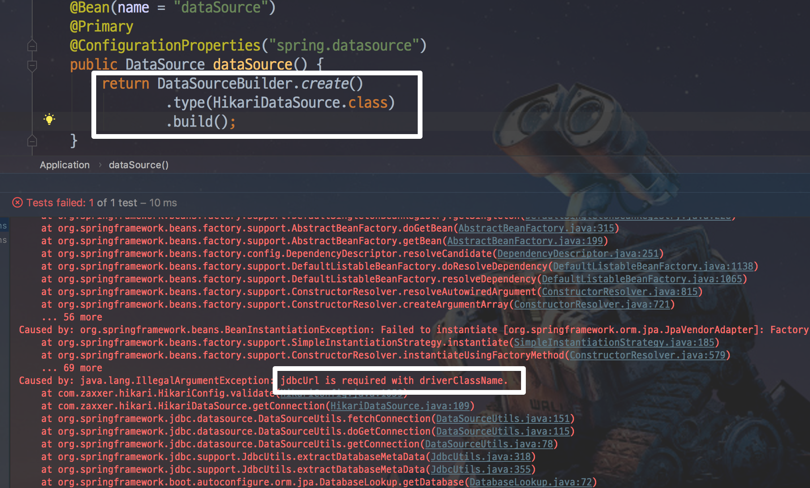
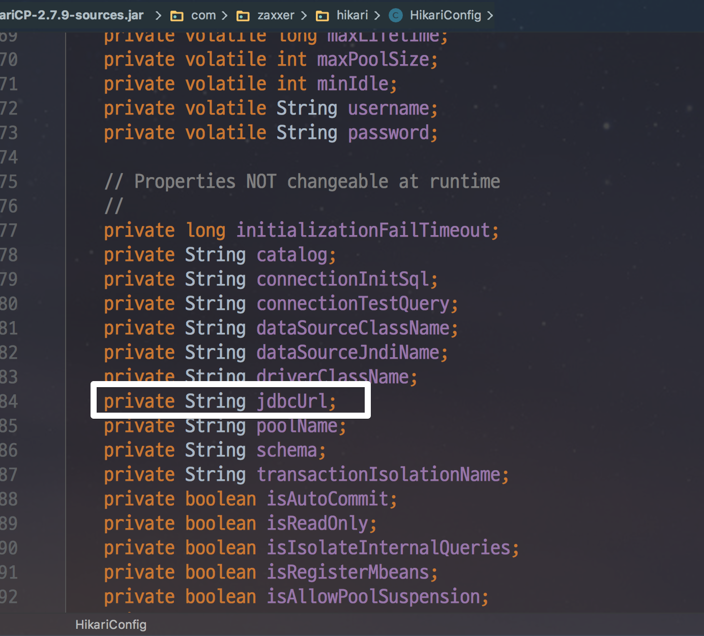
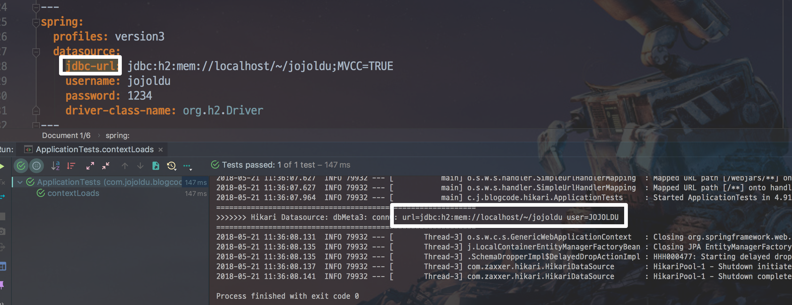
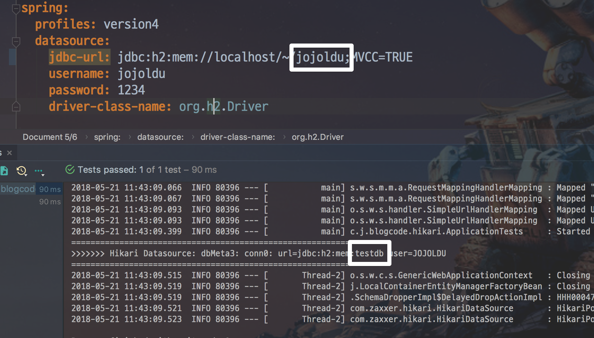

# Spring Boot & Hikari Datasource 연동하기

안녕하세요? 이번 시간엔 Spring Boot & Hikari Datasource 연동하기 예제를 진행해보려고 합니다.  
모든 코드는 [Github](https://github.com/jojoldu/blog-code/tree/master/springboot-hikari-datasource)에 있기 때문에 함께 보시면 더 이해하기 쉬우실 것 같습니다.  
(공부한 내용을 정리하는 [Github](https://github.com/jojoldu/blog-code)와 세미나+책 후기를 정리하는 [Github](https://github.com/jojoldu/review), 이 모든 내용을 담고 있는 [블로그](http://jojoldu.tistory.com/)가 있습니다. )<br/>

기존에 SpringBoot에선 tomcat-jdbc를 기본 Datasource 로 제공했었는데요.  
**2.0부터 HikariCP가 기본**으로 변경되었습니다. ([참고](https://github.com/spring-projects/spring-boot/wiki/Spring-Boot-2.0-Migration-Guide#configuring-a-datasource))  
HikariCP는 이전 버전에서도 많은 분들이 설정을 변경해서 사용했을정도로 인기가 많았습니다.  
HikariCP의 Datasource 정보를 설정하는것에 막히신 분들 혹은 오해하고 계신분들이 계셔서 한번 정리하게 되었습니다.    
  
## 본문

기존에 application.yml, application.properties에서 Datasource를 설정할때는 다음과 같이 설정했습니다.

```yaml
spring:
  profiles: version1
  datasource:
    url: jdbc:h2:mem://localhost/~/jojoldu;MVCC=TRUE
    username: jojoldu
    password: 1234
    driver-class-name: org.h2.Driver
```

datasource.url을 두고 값을 설정했는데요.  
이렇게 설정하고 별도로 Java Config로 설정하지 않은채로 Datasource를 확인해보면!



정상적으로 적용된걸 볼 수 있습니다.  
이건 **기존 Tomcat Jdbc나 HikariCP 둘다 동일하게 적용**됩니다.  
여기서 Datasource 값 세팅을 Java Config로 할때면 문제가 발생하는데요.

> DB를 2개 이상 사용해야할 경우 이렇게 직접 Datasource를 만들어야 합니다.  


 
이렇게 ```jdbcUrl is required with driverClassName``` 에러가 발생합니다.  
오류가 난 이유는 간단합니다.  
HikariCP의 Database URL 설정은 **url이 아닌 jdbcUrl**을 사용하기 때문입니다.



그래서 이 문제를 해결하기 위해 구글링을 해보면 대부분 datasource.url을 datasource.jdbc-url로 변경하라고 합니다. ([참고](https://stackoverflow.com/a/49141541))



이렇게 할 경우 Java Config로 만드는 HikariCP의 Datasource url 문제는 해결되는데요.  

더군다나 로컬에선 이 문제를 발견 못할 확률이 굉장히 높습니다.  



실제로 사용된 Datasource값이 H2에선 기본값이 설정되어 **실행은 되기**때문입니다.  


