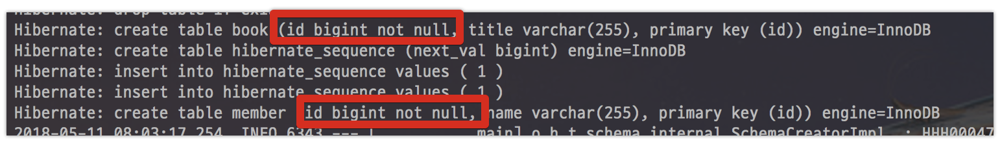
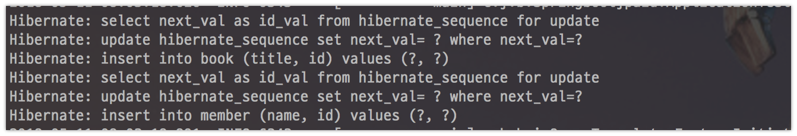
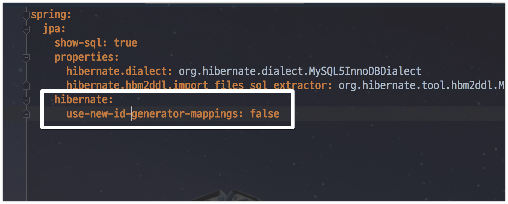
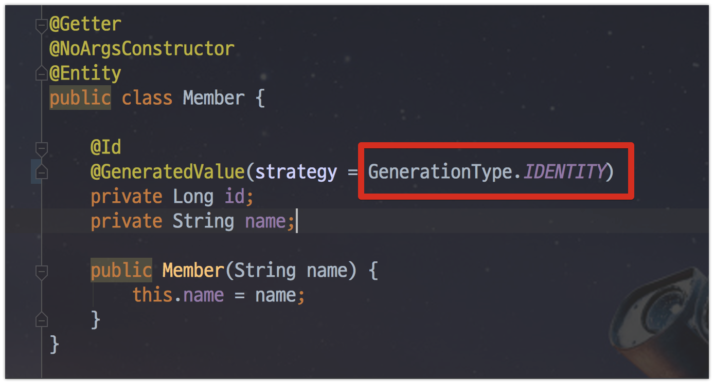
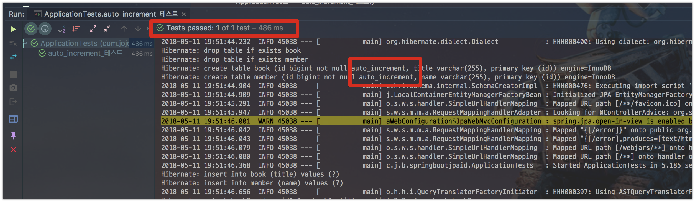

# Spring Boot JPA 2.0 에서 Auto_increment 문제

안녕하세요? 이번 시간엔 Spring Boot JPA 2.0 에서 PK의 Auto_increment 문제를 알아보려고 합니다.  
모든 코드는 [Github](https://github.com/jojoldu/blog-code/tree/master/springboot-jpa-id)에 있기 때문에 함께 보시면 더 이해하기 쉬우실 것 같습니다.  
(공부한 내용을 정리하는 [Github](https://github.com/jojoldu/blog-code)와 세미나+책 후기를 정리하는 [Github](https://github.com/jojoldu/review), 이 모든 내용을 담고 있는 [블로그](http://jojoldu.tistory.com/)가 있습니다. )<br/>
 

## 문제

회사의 신규 시스템 구축을 Spring Boot 2.0으로 진행하게 되었습니다.  
진행 도중 Spring Data Jpa의 ```@GeneratedValue```가 기존과 다르게 작동하는걸 발견하게 되었습니다.  
예를 들어 아래와 같이 1.5.x 에서 사용하던대로 엔티티 클래스를 생성했습니다.


2.0에서도 기본 전략이 **AUTO**임을 확인하고 테스트 코드를 작성했는데요.  


이렇게 Member 클래스의 id가 제대로 생성되지 않았다는 오류가 발생했습니다!  
엇 왜 ```1```이 아니라 ```2```가 생성된거지? 라는 생각으로 로그를 확인했습니다.  



이상하게 table 스키마에 ```auto_increment```가 누락되어 있습니다.  
dialect도 아래처럼 ```MySQL5InnoDBDialect```로 잘 지정되어있습니다.

```yaml
spring:
  jpa:
    show-sql: true
    properties:
      hibernate.dialect: org.hibernate.dialect.MySQL5InnoDBDialect
      hibernate.hbm2ddl.import_files_sql_extractor: org.hibernate.tool.hbm2ddl.MultipleLinesSqlCommandExtractor
    hibernate:
      use-new-id-generator-mappings: false
```

이상하다 싶어 좀 더 로그를 찾아보니!  



**Table sequence** generators가 적용된걸 알 수 있었습니다.

> 공용 시퀀스 테이블을 두고 모든 테이블의 id 시퀀스를 한테이블에서 관리하는 방식입니다.
자세한 내용은 [링크]((https://vladmihalcea.com/hibernate-identity-sequence-and-table-sequence-generator/))를 참고하세요!

**GeneratedValue의 기본값이 GenerationType.AUTO**로 1.5.x와 동일한데 왜 갑자기 변경된거지???  
라는 궁금증이 생겼습니다.  
그래서 이유를 찾아보게 됩니다.

## 추적


### 첫번째

[Spring Boot 2.0 Release Notes](https://github.com/spring-projects/spring-boot/wiki/Spring-Boot-2.0-Release-Notes#third-party-library-upgrades)를 찾아보니 다음과 같은 내용이 있습니다.

* Spring Boot 1.5.x에서는 Hibernate **5.0.x** 버전을 사용
* Spring Boot 2.0.x에서는 Hibernate **5.2.x** 버전을 사용

엇 Hibernate 5.2에서 이 기능이 지원되지 않는건가? 라는 생각이 들었습니다.  
마침 [stackoverflow](https://stackoverflow.com/questions/49241216/has-spring-boot-changed-the-way-auto-increment-of-ids-works-through-generatedva)에도 비슷한 내용의 질문 & 답변이 오고갔습니다.  


뭔가 말이 맞는것 같아서 그런가보다 라고 단정지을려다가!  
점심시간에 팀원분과 이 주제로 얘기하다가  
"엇? 근데 **기존 시스템(1.5.10)은 Hibernate 5.2.11 쓰는데 그런 문제 없지 않았나요**?" 
를 들었습니다.  


(기존 시스템의 builg.gradle)  
  
**Hibernate 5.0 vs 5.2의 문제가 아님**을 깨닫고 다시 한번 더 찾아봅니다.

### 두번째

이번에 Spring Boot 2.0의 [migration guide](https://github.com/spring-projects/spring-boot/wiki/Spring-Boot-2.0-Migration-Guide#id-generator)를 찾아보았습니다.  

> 2.0의 migration guide는 1.5 -> 2.0 마이그레이션시 주의사항이 기록되있습니다.

그리고 아주 큰! 힌트를 찾았습니다.


뭔가 id generator의 기본값이 변경되었다는 패치 내용입니다!  
저 값이 어떤 역할을 하는지 한번 가보겠습니다.  

**2.0 JpaProperties.java**  


Javadoc 내용만 봐도 이 값이 Hibernate의 Id 생성 규칙을 결정하는 설정값임을 알 수 있는데요.  
실제로 코드에서도 해당 설정값이 지정되지 않으면 기본으로 **true**가 되는것을 알 수 있습니다.


그럼 1.5.x에서는 어떤지 한번 보겠습니다.  
  
**1.5 JpaProperties.java**  


1.5의 설정에서는 **false**가 기본값인게 확인 됩니다!  
Javadoc에 재밌는 이야기가 있는데요 **false일 경우 Hibernate 5 설정을 따라가지 않는다**고 합니다.


Hibernate 5에서 어떤일이 있었는지 좀 더 찾아보겠습니다.  
  
[Hibernat 5.0 MySQL id generate](https://vladmihalcea.com/why-should-not-use-the-auto-jpa-generationtype-with-mysql-and-hibernate/) 내용을 정리한 블로그에 딱! 맞는 내용이 있습니다.  
  
**Hibernate 5.0 이전**


**Hibernate 5.0**


즉, **Hibernate 5부터 MySQL에서의 GenerationType.AUTO는 IDENTITY가 아닌 TABLE을 기본 시퀀스 전략**으로 가져간다는 것입니다.  

## 정리

결론은 다음과 같습니다.

* Spring Boot는 Hibernate의 id 생성 전략을 그대로 따라갈지 말지를 결정하는 ```useNewIdGeneratorMappings``` 설정이 있다.
* **1.5에선 기본값이 false**, **2.0부터는 true**
* Hibernate 5.0부터 MySQL의 AUTO는 IDENTITY가 아닌 **TABLE을 기본 시퀀스 전략**으로 선택된다.
* 즉, 1.5에선 Hibernate 5를 쓰더라도 AUTO를 따라가지 않기 때문에 IDENTITY가 선택
* 2.0에선 true이므로 Hibernate 5를 그대로 따라가기 때문에 TABLE이 선택

으로 정리가 됩니다.

## 해결

해결책은 크게 2가지가 있습니다.

1. application.properties/yml의 ```use-new-id-generator-mappings```을 **false**로 설정한다



2. ```@GeneratedValue```의 전략을 ```GenerationType.IDENTITY```로 지정한다



둘 중 어느것을 하더라도 아래처럼 의도했던대로 잘 수행되는 것을 확인할 수 있습니다.



> 저는 일단 2번째 방법인 ```GenerationType.IDENTITY```을 사용하고 있습니다.  
Spring Data Jpa와 Hibernate을 똑같이 가져가는게 이후 문제 해결에 도움이 될것 같아서요 :)

