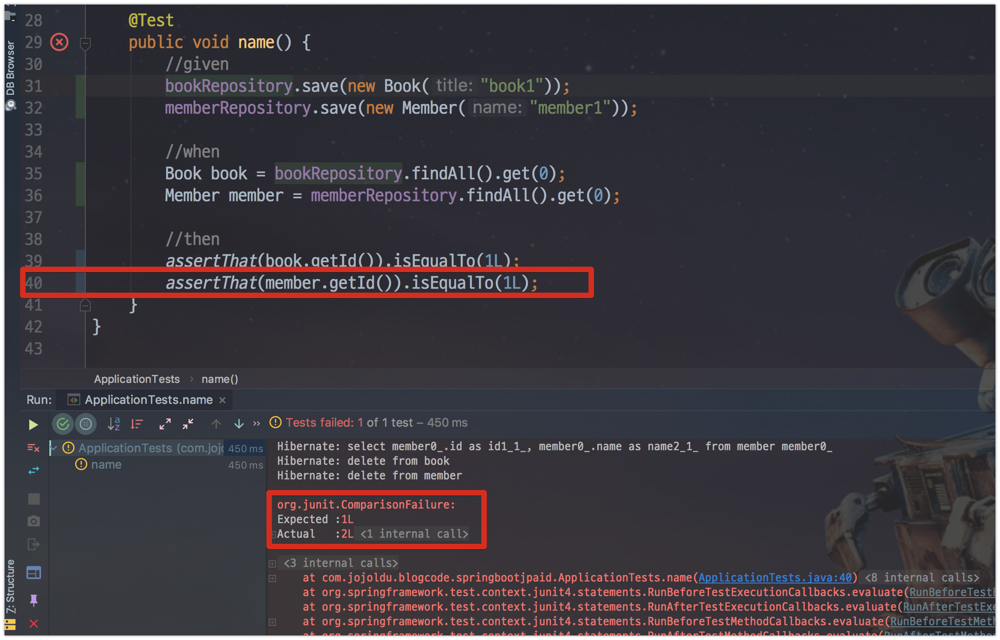

# Spring Boot JPA 2.0 에서 Auto_increment 문제

안녕하세요? 이번 시간엔 Spring Boot JPA 2.0 에서 Auto_increment 문제를 진행해보려고 합니다.  
모든 코드는 [Github](https://github.com/jojoldu/blog-code/tree/master/springboot-jpa-id)에 있기 때문에 함께 보시면 더 이해하기 쉬우실 것 같습니다.  
(공부한 내용을 정리하는 [Github](https://github.com/jojoldu/blog-code)와 세미나+책 후기를 정리하는 [Github](https://github.com/jojoldu/review), 이 모든 내용을 담고 있는 [블로그](http://jojoldu.tistory.com/)가 있습니다. ) 
 

## 문제

 

## 추적

[Spring Boot 2.0 Release Notes](https://github.com/spring-projects/spring-boot/wiki/Spring-Boot-2.0-Release-Notes#third-party-library-upgrades)

기존 Spring Boot 1.5.x에서는 Hibernate 5.0.x 버전을 사용
Spring Boot 2.0.x에서는 Hibernate 5.2.x 버전을 사용

[MySql 문제](https://vladmihalcea.com/why-should-not-use-the-auto-jpa-generationtype-with-mysql-and-hibernate/)
[TABLE SEQUENCE](https://vladmihalcea.com/hibernate-identity-sequence-and-table-sequence-generator/)