# springboot-json

안녕하세요? 이번 시간엔 Spring과 JSON에 대해 정리해보려고 합니다.  
모든 코드는 [Github](https://github.com/jojoldu/blog-code/tree/master/springboot-json)에 있기 때문에 함께 보시면 더 이해하기 쉬우실 것 같습니다.  
(공부한 내용을 정리하는 [Github](https://github.com/jojoldu/blog-code)와 세미나+책 후기를 정리하는 [Github](https://github.com/jojoldu/review), 이 모든 내용을 담고 있는 [블로그](http://jojoldu.tistory.com/)가 있습니다. )<br/>
 
## 0. 들어가며

Spring을 사용할 경우 Controller에서 요청 받는/응답  주는 DTO에서 ```LocalDate```와 ```LocalDateTime```을 사용할 경우가 종종 있습니다.  
  
헌데 이럴 경우 많은 분들이 직렬화를 못해 **String으로 받은 후 서비스 레이어에서 변환**하는 것을 보았습니다.  
Spring에선 굳이 이럴 필요가 없으니 아래 내용을 한번 참고하셔서 번거로운 직렬화 과정을 쉽게 해결하시길 바랍니다.  
  
개발 환경은 아래와 같습니다.

* Spring Boot Starter Web 1.5.17
* Java8
* [JSR 310](https://mvnrepository.com/artifact/com.fasterxml.jackson.datatype/jackson-datatype-jsr310/2.9.7)
    * Spring Boot 2.0에서는 필요없음
    * 1.x에서 이 의존성이 없으면 ```JSON parse error``` 발생

**Spring Boot 2.0과 1.x 는 굉장히 다릅니다**.  
2.0에 대해서는 글 하단에 별도의 코너로 설명하니 참고해주세요.  
자 그럼 하나씩 예제를 진행해보겠습니다.

## 1. Request Parameter

첫번째로 해볼 것은 Request Parameter입니다.  
보통 Get 요청시 URL Parameter로 필드 데이터를 명시할때가 많은데요.  
Spring에선 이를 2가지 방법으로 해결할 수 있습니다.

* ```@ModelAttribute```로 DTO 객체를 받는다.
* ```@RequestParamter```로 필드별로 받는다. 

여기서 이 2가지에서 어떻게 ```LocalDate```와 ```LocalDateTime```을 직렬화 해서 받을 수 있는지 보겠습니다.  

### 1-1. @ModelAttribute

아래와 같은 Controller 메소드가 있다고 가정하겠습니다.

```java
@GetMapping("/get")
public String get(GetModel getModel) {
    log.info("get 요청 데이터 = {}", getModel);

    return "get 성공";
}
```

> ```@ModelAttribute```을 지정하지 않아도 별도로 어노테이션 지정이 없으면 ```@ModelAttribute```을 자동 할당합니다.

HTTP GET 요청을 ```/get``` 주소로 보내면 URL 파라미터의 각 필드들이 ```GetModel```의 필드에 매핑되는 코드입니다.  
  
정상적으로 요청이 왔다면 ```getModel```에는 Request Parameter들이 각각 들어가있겠죠?  
  
그리고 GetModel의 코드는 아래와 같습니다.

```java
@ToString
@Getter
@Setter
@NoArgsConstructor
public class GetModel {
    private String name;
    private LocalDateTime requestDateTime;
}
```

테스트 대상인 ```LocalDateTime```엔 **아무런 어노테이션이 할당되어 있지 않습니다**.  
자 이제 이 코드가 정상적으로 작동하는지 검증할 수 있는 테스트 코드를 작성합니다.  

```java
@RunWith(SpringRunner.class)
@WebMvcTest
public class ApplicationTest {

    @Autowired
    private MockMvc mockMvc;

    @Test
    public void ModelAttribute의_LocalDate는_변환된다() throws Exception {
        //given
        String url = "/get?name=jojoldu&requestDateTime=2018-12-15T10:00:00";

        //when
        ResultActions resultActions = this.mockMvc.perform(get(url));

        //then
        resultActions
                .andExpect(status().isOk())
                .andExpect(content().string(containsString("get 성공")));

    }
}
```

별도의 어노테이션이 ```GetModel```에 없기 때문에 실패하겠죠?  
확인하기 위해 테스트를 실행해보시면!


테스트가 실패합니다.  
이유는 **requestDateTime을 직렬화 하지 못했다**는 것인데요.  

> 많은 분들이 이 부분에서 실패하고 **String으로 그냥 받아서 처리한다는 것**을 들었습니다.  

이를 해결하기 위해 먼저 ```@JsonFormat```을 사용해볼까요?


```java
@ToString
@Getter
@Setter
@NoArgsConstructor
public class GetModel {
    private String name;

    @JsonFormat(shape = JsonFormat.Shape.STRING, pattern = "yyyy-MM-dd'T'HH:mm:ss", timezone = "Asia/Seoul")
    private LocalDateTime requestDateTime;
}
```

> 일반적으로 Get요청시에 LocalDateTime 파라미터가 필요할 경우 ```2018-12-15 10:00:00``` 보다는 ```2018-12-15T10:00:00``` 을 선호합니다.  
**띄어쓰기로 인해서 값이 잘못 넘어올수도 있기** 때문인데요.  
대신 ```T```를 그대로 포맷에선 쓸수 없어서 ` 로 감싸 표현합니다.

이렇게 ```@JsonFormat```으로 ```LocalDateTime``` 포맷을 지정했습니다.  
그리고 다시 테스트를 수행해보면!

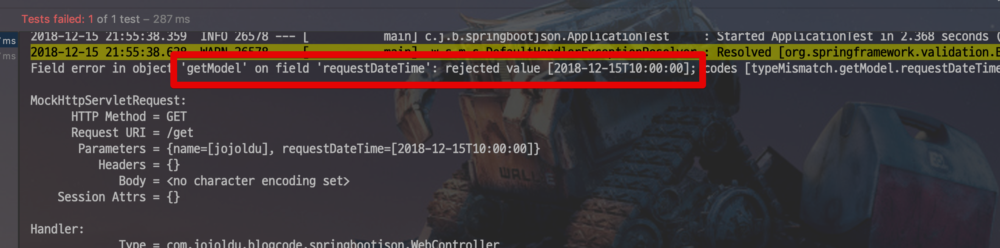

전과 마찬가지로 또! 테스트가 실패합니다.  
  
그럼 어떻게 해야할까요?  
여기서 해결할 수 있는 방법은 바로 ```@DateTimeFormat```입니다.  
 ```@DateTimeFormat```은 **Spring에서 지원하는 어노테이션**으로 ```LocalDate```와 ```LocalDateTime```와 같은 **날짜 관련 타입의 직렬화**를 지원하는 어노테이션입니다.  

한번 ```@DateTimeFormat```으로 변경하고
 
```java
@ToString
@Getter
@Setter
@NoArgsConstructor
public class GetModel {
    private String name;

    @DateTimeFormat(pattern = "yyyy-MM-dd'T'HH:mm:ss")
    private LocalDateTime requestDateTime;
}
```

다시 테스트를 수행해보면!

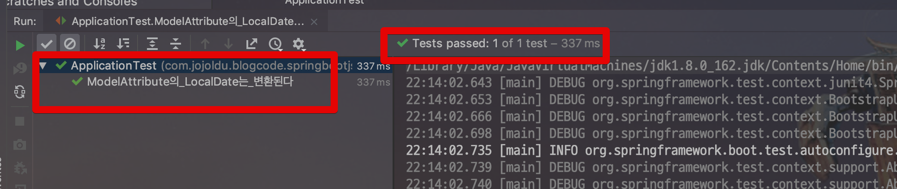

의도한대로 잘 변경된 것을 확인할 수 있습니다.  
즉, ```@ModelAttribute```에서 날짜 직렬화가 필요할 경우 ```@DateTimeFormat```을 사용하면 된다는 것을 확인하였습니다.

### 1-2. @RequestParameter

자 그럼 ```@ModelAttribute```를 알아보았으니 ```@RequestParamter```도 보겠습니다.  
  
먼저 테스트 코드를 작성합니다.

```java
@RunWith(SpringRunner.class)
@WebMvcTest
public class ApplicationTest {

    @Autowired
    private MockMvc mockMvc;

    @Test
    public void requestParameter의_LocalDate는_변환된다() throws Exception {
        //given
        String url = "/requestParameter?requestDateTime=2018-12-15T10:00:00";

        //when
        ResultActions resultActions = this.mockMvc.perform(get(url));

        //then
        resultActions
                .andExpect(status().isOk())
                .andExpect(content().string(containsString("requestParameter 성공")));

    }
}
```

그리고 아래와 같은 Controller 메소드가 있습니다.

```java
    @GetMapping("/requestParameter")
    public String requestParameter(
            @RequestParam("requestDateTime") LocalDateTime requestDateTime) {

        log.info("requestParameter 요청 데이터 = {}", requestDateTime);

        return "requestParameter 성공";
    }

```

이걸 테스트 해보면!

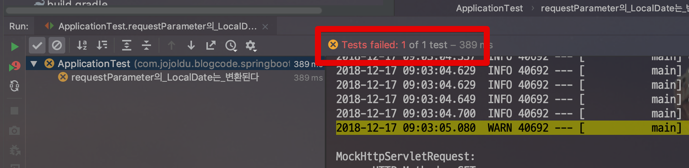

당연히 실패합니다.  
이걸 위에서 사용한 ```@DateTimeFormat```을 적용해보면!  

```java
    @GetMapping("/requestParameter")
    public String requestParameter(
            @DateTimeFormat(pattern = "yyyy-MM-dd'T'HH:mm:ss")
            @RequestParam("requestDateTime") LocalDateTime requestDateTime) {

        log.info("requestParameter 요청 데이터 = {}", requestDateTime);

        return "requestParameter 성공";
    }
```


테스트가 성공합니다.

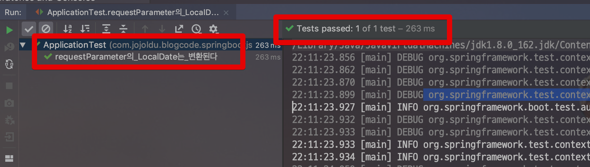

즉, ```@ModelAttribute```와 마찬가지로 ```@RequestParamter``` 역시 날짜 직렬화가 필요할 경우 ```@DateTimeFormat```을 사용하면 된다는 것을 확인하였습니다.

## 2. Request Body

위에서 Get 요청에 대해서 알아보았습니다.  
이번엔 Post 요청시 직렬화에 대해 알아보겠습니다.  
먼저 테스트해볼 Post 파라미터 객체는 다음과 같습니다.

```java
@ToString
@Getter
@Setter
@NoArgsConstructor
public class JsonModel {
    private String name;
    private LocalDateTime requestDateTime;
}
```

자 그리고 이 ```JsonModel```객체를 파라미터로 받을 Controller 메소드는 다음과 같습니다.

```java
    @PostMapping("/post")
    public String post(@RequestBody JsonModel jsonModel) {
        log.info("get 요청 데이터 = {}", jsonModel);

        return "post 성공";
    }
```

크게 어려운 코드는 없습니다.  
단지 Post 요청시 Request 필드들을 받을 ```JsonModel```에 ```@RequestBody```만 추가한 상태입니다.  
  
이 Contrller를 테스트할 코드는 아래와 같습니다.

```java
    @Test
    public void post요청시_requestBody의_LocalDate는_변환된다() throws Exception {
        //given
        String url = "/post";

        //when
        ResultActions resultActions = this.mockMvc.perform(
                post(url)
                        .contentType(MediaType.APPLICATION_JSON_UTF8)
                        .content("{\"name\":\"jojoldu\", \"requestDateTime\":\"2018-12-15T10:00:00\"}"));

        //then
        resultActions
                .andExpect(status().isOk())
                .andExpect(content().string(containsString("post 성공")));
    }

```

이제 하나씩 테스트를 해보겠습니다.  
먼저 아무런 어노테이션이 없는 상태에서 테스트를 해봅니다.


당연히 실패합니다.  
자 그럼 Get에서 사용한 ```@DateTimeFormat```을 사용해보겠습니다.  


다시 테스트를 돌려보면!


테스트가 성공합니다!  
Get과 마찬가지로 ```@DateTimeFormat```는 날짜 직렬화를 지원하는 어노테이션임을 다시한번 확인해볼 수 있습니다.  
  
그럼 **Get 요청에서 실패한** ```@JsonFormat```은 어떨까요?  
다시한번 테스트 해보겠습니다.

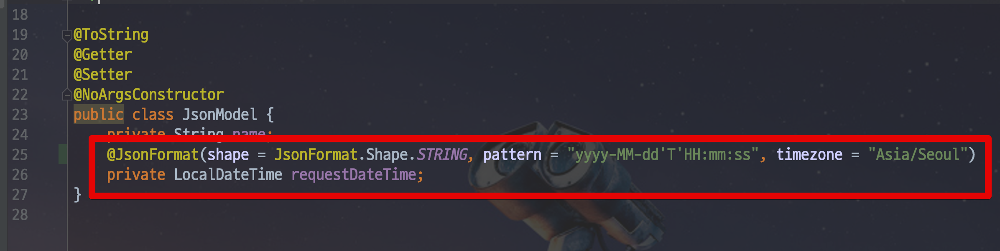

오! Get과 다르게 ```@JsonFormat```으로 성공합니다.

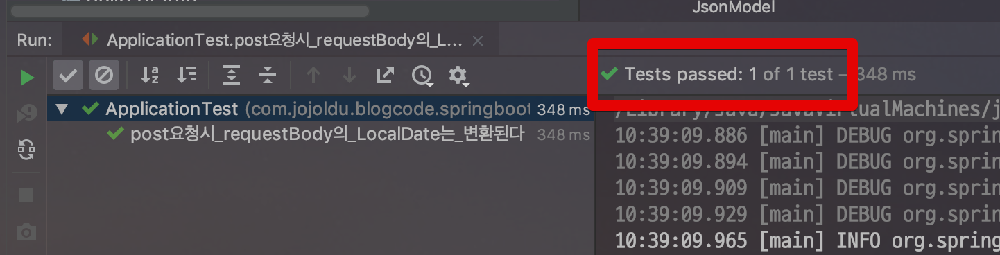

즉, Post로 보내는 Request Body (JSON 객체)는 ```@DateTimeFormat```과 ```@JsonFormat``` 모두 사용할 수 있음을 알 수 있습니다.  
  
자 그러면 한가지 궁금한것이 있죠?  
둘다 된다면, 우선순위는 어떻게 될까요?  
하나씩 검증해보겠습니다.  
먼저 ```@DateTimeFormat```을 해봅니다.

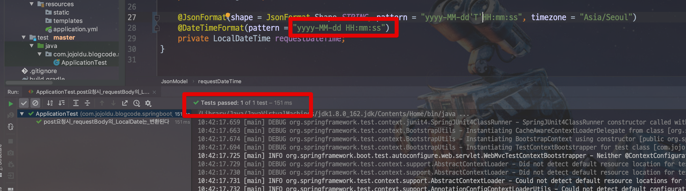

그러면 성공합니다!  
반대로 ```@JsonFormat```을 틀리게 설정하고 테스트해보면!

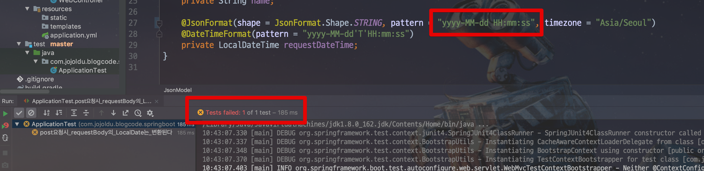

실패합니다.  
  
즉, Request Body 에서 두 어노테이션이 순서는 다음과 같습니다.

* 두 어노테이션 모두가 있으면 ```@JsonFormat```이 진행된다
* ```@JsonFormat```이 틀리면 ```@DateTimeFormat```이 맞더라도 직렬화는 실패한다
* 단, ```@DateTimeFormat```이 있다면 ```@DateTimeFormat```의 포맷으로 직렬화가 진행된다.

## 3. Response Body

마지막으로 Response Body로 JSON 값을 리턴할때는 어떻게 되는지 확인해보겠습니다.  
먼저 리턴할 클래스는 다음과 같습니다.

```java
@Getter
@RequiredArgsConstructor
public class ResponseModel {
    private final String name;
    private final LocalDateTime requestDateTime;
}
```

그리고 Controller 메소드는 다음과 같습니다.

```java
    @GetMapping("/response")
    public ResponseModel responseModel() {
        return new ResponseModel("jojoldu", LocalDateTime.of(2018,12,15,10,0,0));
    }
```

그럼 이 코드를 테스트할 테스트 코드를 작성합니다.

```java
    @Test
    public void responseModel의_LocalDate는_변환된다() throws Exception {
        //given
        String url = "/response";

        //when
        ResultActions resultActions = this.mockMvc.perform(get(url));

        //then
        resultActions
                .andExpect(status().isOk())
                .andExpect(content().json("{\"name\":\"jojoldu\", \"requestDateTime\":\"2018-12-15T10:00:00\"}"));

    }
```

먼저 어노테이션이 전혀 없는 상태로 테스트를 진행합니다.  

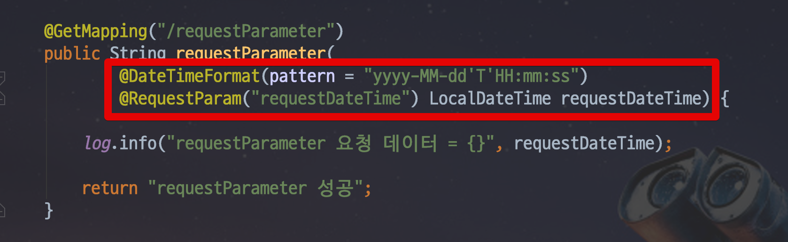

당연히 실패합니다.  
자 그럼 이번엔 ```@DateTimeFormat```을 선언한 뒤, 다시 테스트를 해봅니다.

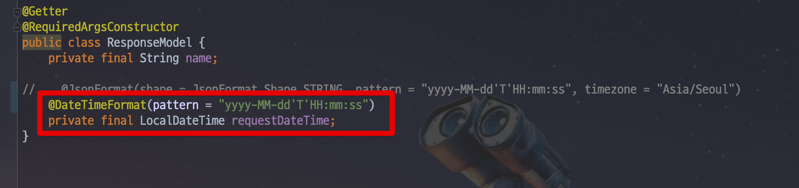

1, 2번과 달리 ```@DateTimeFormat``` 에서 실패합니다!

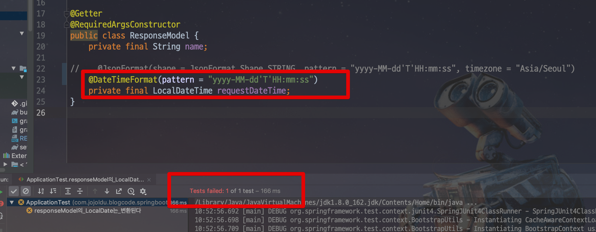

그럼 ```@JsonFormat``` 에서는?

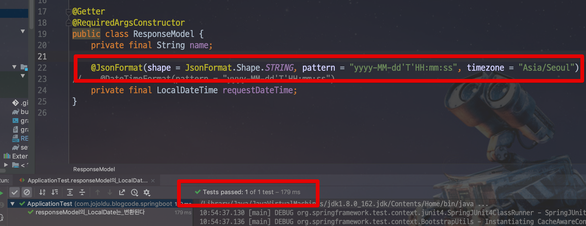

정상적으로 통과합니다!  
  
결론은 **Response Body에서는 @JsonFormat만 가능**하다 입니다.

## 4. @DateTimeFormat vs @JsonFormat

자 그럼 여기서 한가지 궁금한게 있습니다.  
위에서 사용한 ```@JsonFormat```과 ```@DateTimeFormat```은 어떤 차이가 있을까요?.  
 ```@JsonFormat```은 Jackson의 어노테이션이고, ```@DateTimeFormat```은 Spring의 어노테이션입니다.  
  
 ```@JsonFormat```은 ```LocalDate``` 혹은 ```LocalDateTime```을 **JSON으로 직렬화할때 포맷**을 관리합니다.  
  
Spring의 기본 JSON 컨버터는 Jackson입니다.  


그러다보니 **JSON으로 변환을 할때 Jackson을 통해서** 진행됩니다.  
만약 JSON 직렬화 과정에서 ```@JsonFormat```이 없다면 Spring에서는 ```@DateTimeFormat```를 통해 직렬화를 진행합니다.  
  
반면 Jackson은 Spring의 어노테이션인 ```@DateTimeFormat``` 을 전혀 알 수 없습니다.  
(완전히 **별개의 라이브러리들**이니깐요.)  
  
그래서 ```@DateTimeFormat```을 지정했다 하더라도, **Jackson은 이 어노테이션을 전혀 고려하지 않고 JSON 직렬화**을 진행합니다.  
  
**JSON 직렬화 외에는** Jackson이 사용되지 않기 때문에 ```@JsonFormat```은 효과가 없습니다.  
그래서 RequestParameter나 ModelAttribute에선 ```@DateTimeFormat``` 만 적용될 수 있습니다.  

* [stackoverflow](https://stackoverflow.com/questions/37871033/spring-datetimeformat-configuration-for-java-time)

## 5. SpringBoot 2.x vs Spring boot 1.x

Spring Boot 2.0이 되고 **jsr310은 기본 의존성**이 되었습니다.

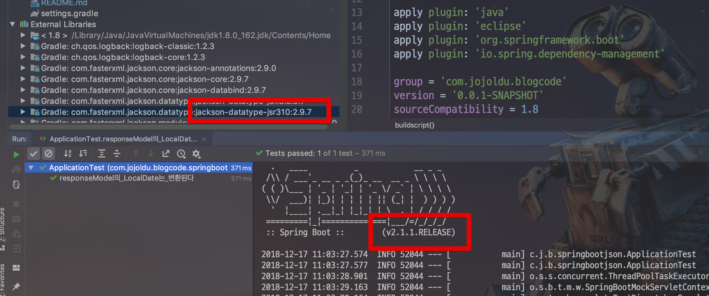

그래서 별도의 의존성을 추가할 필요가 없지만, Spring Boot 1.x 에서는 기본 의존성이 아니라서 항상 추가해주셔야만 합니다.  
이외에도 기본 포맷도 변경이 있었는데요.  
좀 더 자세한 내용은 아래 링크를 참고하시면 됩니다.

* [스프링 부트 2.0과 1.5의 Jackson JSON 날짜 타입 포맷 설정](http://javacan.tistory.com/entry/spring-boot-jackson-json-date-type-format)

## 6. 결론

자! 그래서 위 실험을 통해 다음과 같은 결론을 얻을 수 있습니다.

* Get요청시에는 ```@DateTimeFormat```
* Post 요청, ResponseBody에서는 ```@JsonFormat```
* Post 요청시에도 ```@DateTimeFormat```이 적용될 수 있으나, ```@JsonFormat```이 지정되어 있지 않을때만 가능하다.
* Spring Boot 2.0에서는 JSR 310이 기본 의존성에 포함되어있다.

이번 포스팅을 참고하셔서 더이상 날짜 타입을 문자열로 받는 일은 없으셨으면 합니다.  
감사합니다 :)
