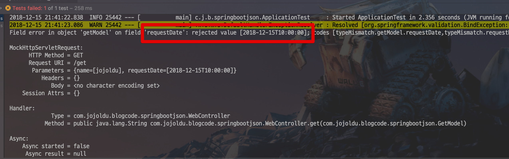
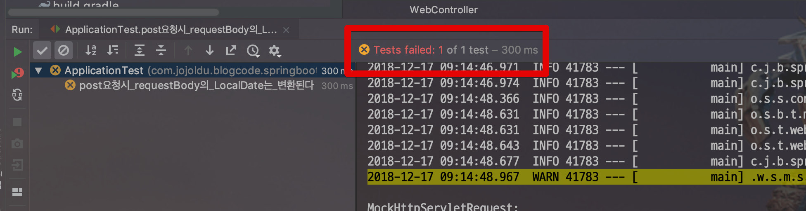
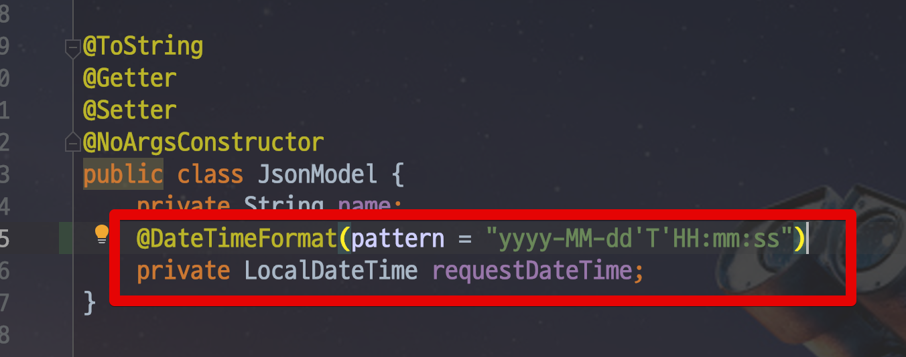
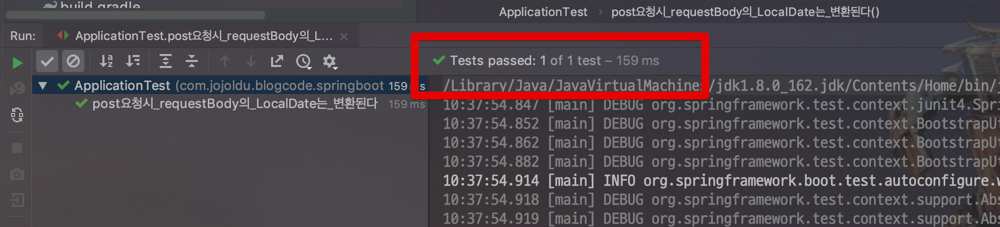
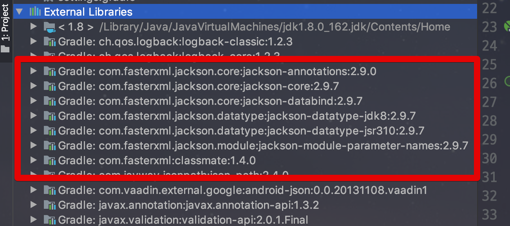

# springboot-json

안녕하세요? 이번 시간엔 springboot-json 예제를 진행해보려고 합니다.  
모든 코드는 [Github](https://github.com/jojoldu/blog-code/tree/master/springboot-json)에 있기 때문에 함께 보시면 더 이해하기 쉬우실 것 같습니다.  
(공부한 내용을 정리하는 [Github](https://github.com/jojoldu/blog-code)와 세미나+책 후기를 정리하는 [Github](https://github.com/jojoldu/review), 이 모든 내용을 담고 있는 [블로그](http://jojoldu.tistory.com/)가 있습니다. )<br/>
 
## 1. Request Parameter

```java
@GetMapping("/get")
public String get(GetModel getModel) {
    log.info("get 요청 데이터 = {}", getModel);

    return "get 성공";
}
```

```java
    @Test
    public void ModelAttribute의_LocalDate는_변환된다() throws Exception {
        //given
        String url = "/get?name=jojoldu&requestDateTime=2018-12-15T10:00:00";

        //when
        ResultActions resultActions = this.mockMvc.perform(get(url));

        //then
        resultActions
                .andExpect(status().isOk())
                .andExpect(content().string(containsString("get 성공")));

    }
```





```java
@ToString
@Getter
@Setter
@NoArgsConstructor
public class GetModel {
    private String name;

    @JsonFormat(shape = JsonFormat.Shape.STRING, pattern = "yyyy-MM-dd'T'HH:mm:ss", timezone = "Asia/Seoul")
    private LocalDateTime requestDateTime;
}
```




자 그럼 어떻게 해야할까요?  
여기서 해결할 수 있는 방법은 바로 ```@DateTimeFormat```입니다.  


```java

@ToString
@Getter
@Setter
@NoArgsConstructor
public class GetModel {
    private String name;

    @DateTimeFormat(pattern = "yyyy-MM-dd'T'HH:mm:ss")
    private LocalDateTime requestDateTime;
}
```




```java
    @Test
    public void requestParameter의_LocalDate는_변환된다() throws Exception {
        //given
        String url = "/requestParameter?requestDateTime=2018-12-15T10:00:00";

        //when
        ResultActions resultActions = this.mockMvc.perform(get(url));

        //then
        resultActions
                .andExpect(status().isOk())
                .andExpect(content().string(containsString("requestParameter 성공")));

    }
}
```

## @DateTimeFormat vs @JsonFormat

자 그럼 여기서 한가지 궁금한게 있습니다.  
바로 ```@JsonFormat```과 ```@DateTimeFormat```의 차이입니다.  
 ```@JsonFormat```은 Jackson의 어노테이션이고, ```@DateTimeFormat```은 Spring의 어노테이션입니다.  

 ```@JsonFormat```은 ```LocalDate``` 혹은 ```LocalDateTime```을 JSON으로 직렬화하는 동안 포맷을 관리합니다.  
  
Spring의 기본 JSON 컨버터는 Jackson이다보니, **JSON으로 변환을 할때는 항상 Jackson을 통해서**만 진행됩니다.  



Jackson은 Spring의 어노테이션인 ```@DateTimeFormat``` 을 전혀 알 수 없습니다.  
(완전히 별개의 라이브러리들이니깐요.)  
  
그래서 ```@DateTimeFormat```을 지정했다 하더라도, Jackson은 이 어노테이션은 전혀 고려하지 않고 JSON 직렬화을 진행하기 때문에 효과가 없는 것입니다.  
  
반대로 **JSON 직렬화외에는 Jackson이 사용되지 않기 때문에** ```@JsonFormat```은 효과가 없습니다.  
그래서 RequestParameter나 ModelAttribute에선 ```@DateTimeFormat``` 만 적용될 수 있습니다.  

* [stackoverflow](https://stackoverflow.com/questions/37871033/spring-datetimeformat-configuration-for-java-time)


## 2. Request Body


## 3. Response Body