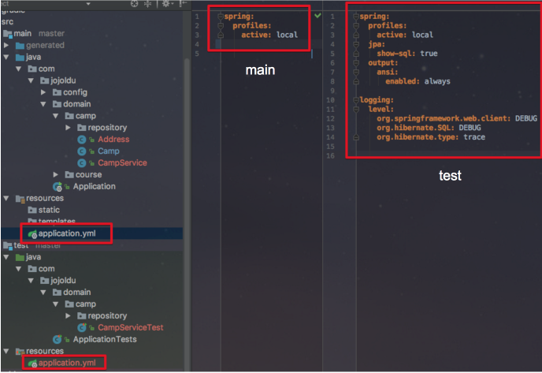

# SpringBoot에서 JPA 쿼리 파라미터 확인하기

안녕하세요? 이번 시간엔 아주 간단한 팁이지만, 필요하신 분들이 많이 계실것 같은 SpringBoot에서 JPA 쿼리에 사용된 파라미터 값을 확인하는 방법을 소개하려 합니다. 모든 코드는 [Github](https://github.com/jojoldu/blog-code/)에 있기 때문에 함께 보시면 더 이해하기 쉬우실 것 같습니다.  
(공부한 내용을 정리하는 [Github](https://github.com/jojoldu/blog-code)와 세미나+책 후기를 정리하는 [Github](https://github.com/jojoldu/review), 이 모든 내용을 담고 있는 [블로그](http://jojoldu.tistory.com/)가 있습니다. )<br/>

### 본문

사실 이렇게 포스팅하기엔 너무 깃털같은 양이라 부끄럽기도 합니다^^;  
방법은 아주 간단합니다.  
프로젝트의 application.yml/properties 에 ```logging.level.org.hibernate.type```을 추가하신후, 값을 ```trace```로 하시면 됩니다.  


### 추가 팁

application.yml / properties를 하나로 사용하실텐데요,  
**메인과 테스트의 설정을 분리해서 사용**하시는 것을 추천드립니다.  
저 같은 경우 위에서 사용한 ```logging.level.org.hibernate.type```은 **테스트 코드 실행외에 크게 확인할 일이 없습니다**.  
그래서 아래와 같이 ```src/main/resourcess```와 ```src/test/resourcess```에 각각의 ```application.yml```을 생성하여 각 환경에 맞게 설정값을 추가하여 사용하고 있습니다.  



아주 간단한 팁이였습니다!  
감사합니다!