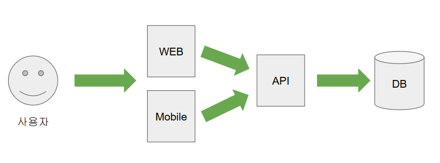
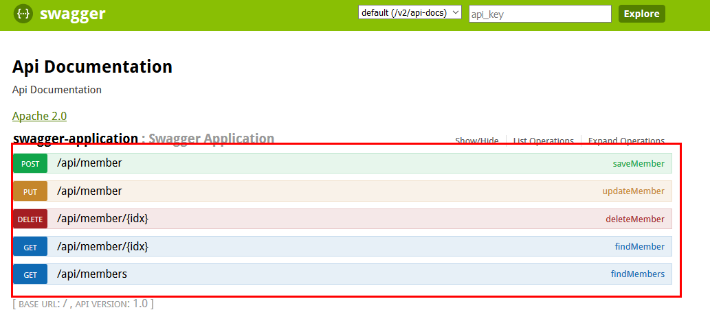
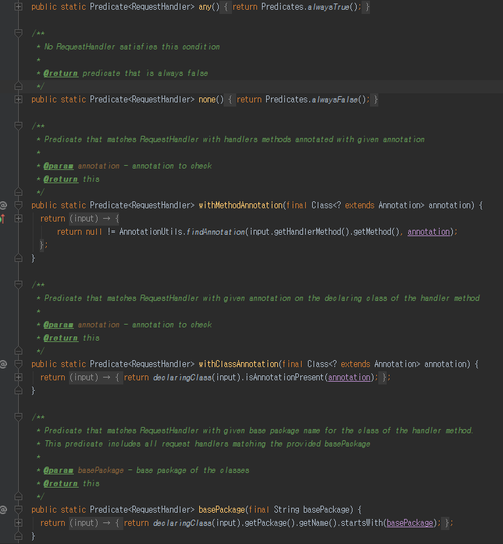
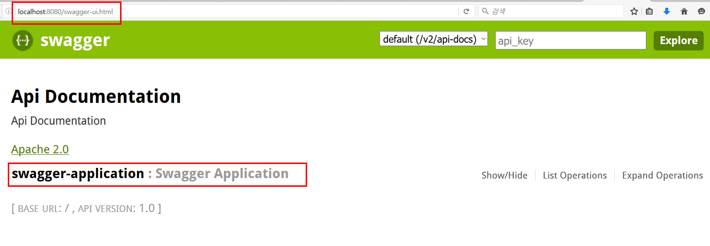
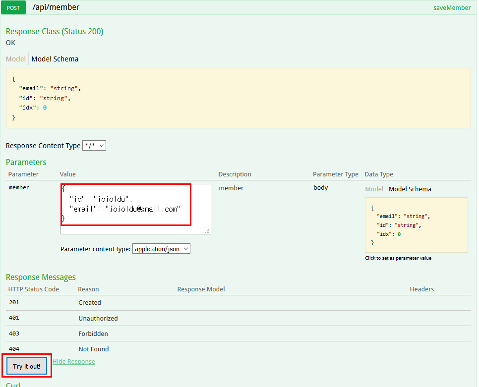
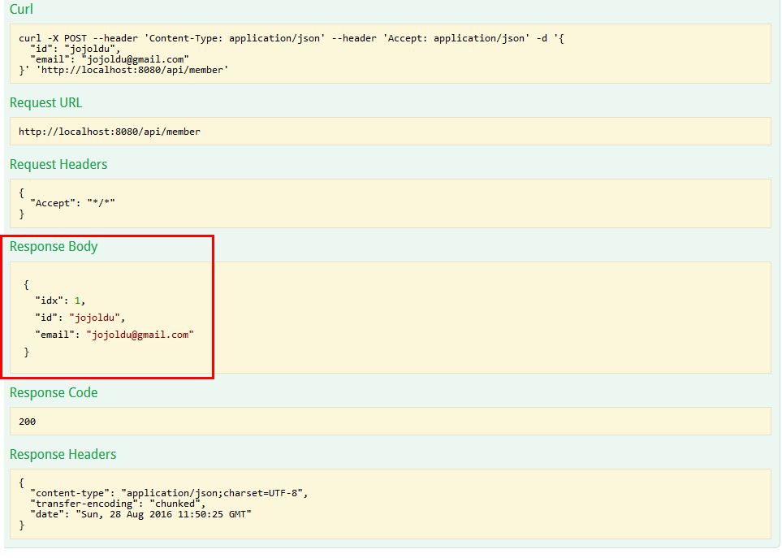

# Swagger로 REST API 문서 자동화 하기
일반적으로 여러명이서 개발하는 웹 서비스에서 단일 프로젝트가 DB에서 데이터를 가져오고, 화면을 그려주고, 회원정보를 저장하는등 모든것을 담당하진 않는다.
아무리 간단한 구조라해도 아래와 같은 형태정도는 유지한다.

(웹구조)

이런 구조로 처음 개발하거나 혹은 유지보수를 진행 중인 경우, 해당 API서버가 어떤 Spec을 가진 데이터를 주고 받는지에 대한 문서작업이 꼭 필요하다. <br/>
하지만 이런 문서작업은 굉장히 시간이 많이들고, 매번 기능이 추가되거나 변경될때마다 작업하기가 여간 귀찮은게 아니다. 그러다보니 이런 API Spec 문서를 자동화 하는것이 나오게 되었다.

## Swagger
Swagger는 간단한 설정으로 프로젝트에서 지정한 URL들을 HTML화면으로 확인할 수 있게 해주는 프로젝트이다. 
백마디 말보다는 바로 실제 화면을 보는것이 좋을것 같다. 참고로 앞으로 볼 모든 코드는 [Github](https://github.com/jojoldu/blog-code/tree/master/swagger) 에서 확인할 수 있다.

### Swagger가 적용된 화면


위 그림처럼 Swagger가 적용될 경우 설정된 URL 리스트들의 목록을 바로 확인을 할 수가 있다. 물론 단순히 저렇게 보여주기만 하는것이 아니다. <br/>
기능을 확인하기전에 설정 하는법에 대해 먼저 진행해보겠다. 

### Swagger 설정하기
참고로 설정하는 방법은 모두 SpringBoot & Gradle을 기반으로 하고 있다. Spring & Maven을 사용 중이라면 [여기](http://www.baeldung.com/swagger-2-documentation-for-spring-rest-api)를 참고하자.

#### 1.의존성 추가
build.gradle에 아래 의존성들을 추가한다.
```
compile group: 'io.springfox', name: 'springfox-swagger2', version: '2.5.0'
compile group: 'io.springfox', name: 'springfox-swagger-ui', version: '2.5.0'
```

#### 2. 프로젝트에 Swagger 설정 Bean을 등록
SwaggerConfig.java를 생성하여 아래의 코드를 추가
```
@Configuration
@EnableSwagger2
public class SwaggerConfig {

    @Bean
    public Docket api() {
        return new Docket(DocumentationType.SWAGGER_2)
                .select()
                .apis(RequestHandlerSelectors.any()) // 현재 RequestMapping으로 할당된 모든 URL 리스트를 추출
                .paths(PathSelectors.ant("/api/**")) // 그중 /api/** 인 URL들만 필터링
                .build();
    }
}
```
위 코드는 메소드명이 워낙 잘지어져있어 크게 이해하는데 어려움은 없을것 같다. <br/>
여기서 ```RequestHandlerSelectors.any()``` 의 경우 any외에도 아래처럼 여러 조건을 사용 할 수가 있으니 상황에 따라 사용하자.


```PathSelectors.ant("/api/**") ``` 의 경우 /api/ path를 가진 url들만 공개하겠다는 얘기인데, 모든 url들을 화면에 노출시키고 싶다면 /api를 지우면 된다. <br/>

자 이제 설정은 끝났으니 확인을 해보자.

#### 3. Swagger-ui 확인
브라우저를 켜고 ```localhost:8080/swagger-ui.html ``` 로 가보자.
그럼 아래와 같이 @Controller로 지정된 java파일명이 보인다.


현재 나는 SwaggerApplication을 Controller로 지정했으니 이렇게 나온다.<br/>
해당 Controller를 클릭해보면 처음 소개에서 나왔던것처럼 Controller가 가지고 있는 /api/ 하위 Path의 모든 메소드들이 출력된다.


우리가 별도로 작성하지 않고, API가 제공하는 기능들을 볼수있다는것을 확인하였다. <br/>
하지만 Swagger의 기능은 여기서 끝이 아니다. <br/>
[Postman](https://chrome.google.com/webstore/detail/postman/fhbjgbiflinjbdggehcddcbncdddomop)처럼 API 메소드들의 기능까지 테스트할수가 있다.

#### 4. Swagger-ui에서 기능 테스트하기
화면의 메소드들중, POST 기능을 하는 /api/member를 클릭하면 아래와 같은 화면이 나온다. <br/>
여기서 Parameters의 Value에 그 메소드가 받을 수 있는 형태의 데이터를 JSON 형식으러 넣어보자. <br/>
해당 POST 메소드가 어떤 형태를 받는지 모르겠다? <br/>
Swagger에선 해당 메소드가 받을 수 있는 Model Schema도 Parameter 화면에 표기해주고 있으니 보고 그대로 넣어주면 된다.
 

value를 채웠으면 아래의 Try it out! 버튼을 클릭해보자. 그러면!


짜잔! 아주 깔끔하게 결과가 출력됨을 알 수 있다. 자 그럼 DB에 정상적으로 데이터가 들어갔는지 확인을 해보자.


FindAll 메소드를 통해 방금 저장한 데이터가 정상적으로 DB에 저장된것도 확인하였다.

## 마무리
실제로 프로젝트가 1년이상 유지되다보면 문서관리가 굉장히 엉망이 되는 경우가 많기도 하고, 신규 프로젝트 시작시에 API & Web & Mobile 연동 테스트를 진행시에도 답답함을 많이 느끼게 된다. <br/>
하지만 이제 Swagger를 통해 그 어려움을 어느정도 해소할수 있을것 같다는 느낌이 든다. <br/>
실제로 토요일에 하고 있는 스터디에서 Swagger 내용을 발표하니 같이 스터디하고 계신 카카오 개발자분께서 본인의 셀에서도 많이 사용하고 있는것이라 하시니 장난감용 프로젝트는 아님을 확인할 수 있었다. <br/>
얼른 출근해서 적용을 해보아야겠다. 