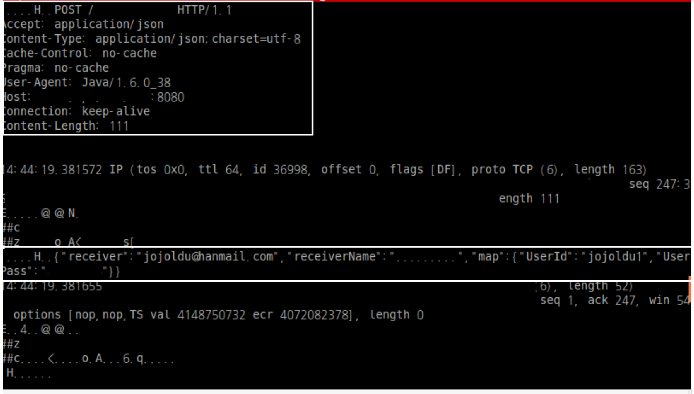

# tcpdump 사용하기 시리즈
tcpdump로 문제를 해결할때마다 기록하려고 함 <br/>
특별히 책이 있는것도 아닌데 한글 자료는 거의 대부분 옵션 설명이 전부라 처음이 너무 어려워 나같은 사람들이 있을것 같아 시작함

### 특정 서버로 POST 보내는 데이터 확인하기
회사에서 사용중인 메일 api에서 간혈적으로 에러가 발생하였다.
4년전에 배포된 서비스라 코드 품질이 엉망이였고, 로그를 특별히 잘 남기는 상태도 아니여서 뭐가 문젠지 서버 로그로는 확인하기 힘들었다.
<br/>
그래서 tcpdump를 이용해서 메일 api 서버에 어떤 값이 전송되는지 확인하고 문제를 해결하였다.
<br/>
상황은 아래와 같다.
> 회원 서비스에서 비밀번호 재발급 -> 수십번에 1번씩 재발급 메일 발송 실패 <br/>
각각의 서버명을 임의로 <br/>
회원 서비스 도메인: user.jojoldu.com <br/>
메일api 서비스 도메인: mail.api.jojoldu.com 으로 가정하겠다. 

이를 해결하기 위해 회원 서버에 tcpdump를 실행하였다.
```
user.jojoldu.com에 ssh 접속하여 아래의 커맨드를 입력
tcpdump -vvvs 1024 -l -A host mail.api.jojoldu.com
``` 

옵션에 대한 자세한 설명은 [여기](http://xinet.kr/tc/49)를 참고하자. <br/>
위 커맨드를 입력하면 회원서버에서 메일api 서버로 전송되는 모든 네트워크 패킷을 **아주 상세하게** 잡아서 보여준다.
(이렇게 상세한 옵션을 사용한 이유는 Request Header와 Request Body 내용을 전부 확인하기 위함이다.)
<br/>
여튼 커맨드 실행후 메일 발송을 해보면 결과 화면은 대략 아래와 같다.(민감한 부분은 제거했다.)



보는것처럼 한번에 Request Header와 Request Body 를 확인할 수 있다. <br/>
이를 보고 회원서비스에서 비밀번호 생성시 잘못된 값으로 생성하여 메일 서버에 보내 문제가 생긴것을 확인하고 수정할 수 있었다.
<br/>
만약에 모든 dump내용을 특정 파일로 기록하고 싶다면 ```-w``` 옵션을 사용하자

```
tcpdump -vvvs 1024 -l -A host mail.api.jojoldu.com -w /data/log/dump.out
```  