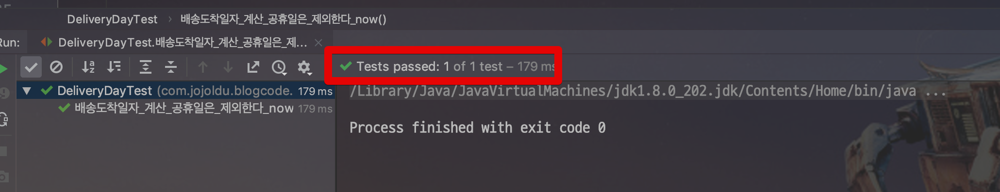
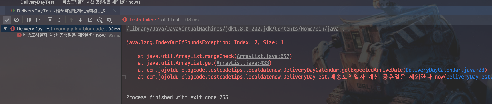
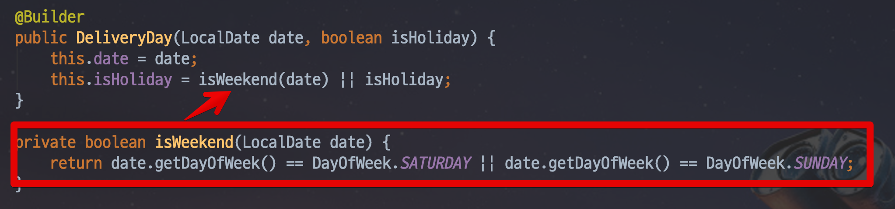
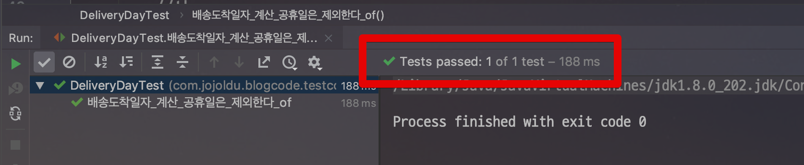

# 테스트 코드에선 LocalDate.now()를 쓰지말자.

여러 사람의 코드를 볼때 가끔 테스트 코드에서  ```LocalDate.now()``` 를 사용하는걸 종종 보게 됩니다.  
아무래도 편하게 작성할 수 있다보니 사용된것 같지만, 이는 좋은 패턴이 아닙니다.  
그래서 예제로 **테스트 코드에서 LocalDate.now()를 쓰면 안되는 이유**를 소개하겠습니다.
 
## 예제

예를 들어 다음과 같은 코드가 있다고 가정합니다.

* **배송 예정일**을 구합니다.
* 배송 예정일은 **주문일 +3 영업일**입니다.
* 즉, 월요일에 주문했다면 +3일인 목요일을, 목요일에 주문 했다면 금/월/화로 되어 화요일이 배송 예정일이 됩니다.
* 주말외에 공휴일 판단을 위해 **공휴일 여부 판단 엔티티**가 존재합니다.

위 조건을 만족하는 2개의 엔티티 클래스들입니다.  
  
첫번째는 **공휴일 여부를 가지는 엔티티**입니다.

```java
@Getter
@NoArgsConstructor
@Entity
public class DeliveryDay {

    @Id
    @GeneratedValue(strategy = GenerationType.IDENTITY)
    private Long id;

    private LocalDate date;

    private boolean isHoliday;

    @Builder
    public DeliveryDay(LocalDate date, boolean isHoliday) {
        this.date = date;
        this.isHoliday = isWeekend(date) || isHoliday;
    }

    private boolean isWeekend(LocalDate date) {
        return date.getDayOfWeek() == DayOfWeek.SATURDAY || date.getDayOfWeek() == DayOfWeek.SUNDAY;
    }

    public boolean isBusinessDay() {
        return !isHoliday;
    }

    public boolean isAfter (LocalDate compare) {
        return this.date.isAfter(compare);
    }
}

```

* 주말임을 판단하는 ```isWeekend```
* 영업일을 판단하는 ```isBusinessDay```
* 엔티티의 날짜가 파라미터의 날짜보다 이후인지 판단하는 ```isAfter```

로 구성되어있습니다.  

두번째 엔티티는 **배송예정일을 계산해주는 엔티티**입니다.

```java
public class DeliveryDayCalendar {
    private static final int CYCLE_DAY = 3;

    private final List<DeliveryDay> candidates;

    public DeliveryDayCalendar(List<DeliveryDay> candidates) {
        this.candidates = candidates;
    }

    public DeliveryDay getExpectedArriveDate(LocalDate orderDate) {
        List<DeliveryDay> businessDates = candidates.stream()
                .filter(d -> d.isAfter(orderDate))
                .filter(DeliveryDay::isBusinessDay)
                .collect(Collectors.toList());

        return businessDates.get(CYCLE_DAY-1);
    }
}

```

주기 (```CYCLE_DAY```)를 3일로 하여 **영업일 기준 +3일을 계산**하여 예정일을 구합니다.  
  
자 이제 이 엔티티들을 테스트 코드로 검증해보겠습니다.

```java
    @Test
    public void 배송도착일자_계산_공휴일은_제외한다_now() {
        //given
        LocalDate date = LocalDate.now();

        List<DeliveryDay> days = Arrays.asList(
                new DeliveryDay(date.plusDays(1), false),
                new DeliveryDay(date.plusDays(2), false),
                new DeliveryDay(date.plusDays(3), false)
        );

        DeliveryDayCalendar calendar = new DeliveryDayCalendar(days);

        //when
        DeliveryDay expectedArriveDate = calendar.getExpectedArriveDate(date);

        //then
        assertThat(expectedArriveDate.getDate()).isEqualTo(date.plusDays(3));
    }

```

코드에 나와있듯이 ```LocalDate.now()```로 **기준 날짜를 생성**하고, +3일까지의 날짜를 생성합니다.  
이 테스트 코드를 수행해보면!



정상적으로 테스트 코드가 성공하는 것을 확인할 수 있습니다.  
  
그럼 이 테스트 코드가 왜 문제일까요?  

D+3일에 대한 내용이 잘 검증되었고, 비지니스 로직도 깔끔하게 호출되었는데 말이죠.


## 문제점

이 코드는 **간혈적으로 실패**합니다.  
2019.05.07에 실행할때와 2019.05.10에 실행할때 둘의 결과는 다릅니다.  
2019.05.07에 실행할때는 성공하지만, 2019.05.10에 실행할때는 실패합니다.    

 

이유는 **날짜가 주말이면 isHoliday가 false라도 false로 지정**하기 때문입니다.  



즉, 날짜에 따라 **성공할수도 있고, 아닐수도 있습니다**.  
  
  
이런 테스트는 좋은 테스트가 아닙니다.  
  
**테스트 코드는 언제 어느때든 항상 같은 결과를 만들어야 합니다**  


## 해결책

이 문제를 해결하려면 아래와 같이 **테스트 코드에서 날짜를 고정**하면 됩니다.

```java
    @Test
    public void 배송도착일자_계산_공휴일은_제외한다_of() {
        //given
        LocalDate date = LocalDate.of(2019,5,7);

        List<DeliveryDay> days = Arrays.asList(
                new DeliveryDay(date.plusDays(1), false),
                new DeliveryDay(date.plusDays(2), false),
                new DeliveryDay(date.plusDays(3), false)
        );

        DeliveryDayCalendar calendar = new DeliveryDayCalendar(days);

        //when
        DeliveryDay expectedArriveDate = calendar.getExpectedArriveDate(date);

        //then
        assertThat(expectedArriveDate.getDate()).isEqualTo(date.plusDays(3));
    }
```

테스트 날짜가 2019.05.07로 고정되어 있기 때문에, **언제 어느때든 테스트 결과는 동일**하게 나옵니다.  
 
이렇게 변경한 테스트 코드 역시 정상적으로 성공하는 것을 확인할 수 있습니다.


