# Slack webhook 으로 Upsource 코드 리뷰 알람 받기 (멀티 슬랙 채널)

현재 Upsource는 Slack과의 통합 (Integration)을 지원하지 않습니다.  

[Integration with slack is not working via webhook](https://youtrack.jetbrains.com/issue/UP-10213)  
  
그래서 어쩔 수 없이 Slack의 웹훅을 통해 직접 연동을 구현해야하는데요.  
  
여기서 문제는, **Upsource는 웹훅 URL 호출만** 지원합니다.  


> 보시는것처럼 URL 호출값만 넣을 수 있습니다.

즉, Upsource의 메세지를 파싱해서 Slack 웹훅 포맷에 맞게 JSON을 만들어 보내는 등의 **로직이 있는 형태를 사용할 수가 없습니다**.  
  
그래서 Upsource -> Slack 사이에서 Upsource의 알람을 받아 파싱해서 Slack 웹훅을 호출해주는 중간 애플리케이션이 필수가 됩니다.  
  
단순히 코드리뷰 알람을 위해 별도의 서버를 구축하기는 아까우니, AWS API Gateway와 AWS Lambda를 이용해서 중간 애플리케이션을 구축해보겠습니다.  
  
그래서 전체 구조는 다음과 같이 됩니다.


**Slack Webhook 생성은 필수**입니다.  
  
아직 생성안하셨다면 미리 생성하고 시작하시면 됩니다.

> Slack Webhook 생성하기는 [기존 포스팅](https://jojoldu.tistory.com/552)을 참고해주세요.

## 1. Upsource Webhook

먼저 Upsource의 웹훅에 대해서 한번 알아보겠습니다.  
Upsource의 웹훅 API 문서는 아래 주소에서 볼 수 있는데요.

```bash
http://본인 Upsoure 도메인/~api_doc/index.html#webhooks
```

보시면 아래와 같이 Upsource에서 발생하는 웹훅 이벤트가 어떤 형식으로 전달되는지 볼 수 있는데요.  
아래 포맷으로 등록된 웹훅 API로 POST 요청간다고 보시면 됩니다.  

```bash
POST /my-webhook HTTP/1.1
Host: example.com
Content-Type: application/json; charset=UTF-8
Content-Length: XXX
Connection: close
User-Agent: Jakarta Commons-HttpClient/3.1
X-Request-Id: c8a5b163-508f-42b5-939a-e11b02caf72e

{
    "majorVersion": 3,
    "minorVersion": 0,
    "projectId": "demo-project",
    "dataType": "NewRevisionEventBean",
    "data": {
        "revisionId": "c1f4de8e6c5aca9b5615fa6656e1f26e4f26d0d0",
        "branches": [
        "master"
        ],
        "author": "John Doe <john.doe@mycompany.com>",
        "message": "#DSH-325 extract directives describes to top level\n",
        "date": 1454432013000
    }
}
```

Upsource의 웹훅 API 상세 스펙들은 아래 주소에서 확인할 수 있습니다.

```bash
http://본인 Upsoure 도메인/~api_doc/integration/index.html
```

열어보시면 다음과 같이 **트리거 이벤트**를 볼 수 있는데요.  
  
이 중 **코드리뷰 생성시 이벤트**를 한번 확인해보겠습니다.


클릭해보시면 아래와 같이 JSON 정보를 볼 수 있는데요.  
상세 정보를 담고 있는 ```base``` 필드 항목을 살펴봅니다.


그럼 아래와 같이 ```base``` 필드에 정보들이 담겨있는 것을 볼 수 있습니다.


즉, Upsource에서 코드리뷰가 생성되면 웹훅 API로 아래와 같이 JSON 정보가 Body로 넘어가게 됩니다.

```bash
{
    "majorVersion": 3,
    "minorVersion": 0,
    "projectId": "settler",
    "dataType": "ReviewCreatedFeedEventBean",
    "data": {
        "revisionId": "c1f4de8e6c5aca9b5615fa6656e1f26e4f26d0d0",
        "branches": [
            "master"
        ],
        "base": {
            "reviewId": "ST-501",
            "actor": {
                "userName": "jojoldu"
            },
            "feedEventId": "created"
        },
        "author": "jojoldu <jojoldu@gmail.com>",
        "date": 1454432013000
    }
}
```

즉, 정리하면 Upsource에서 넘겨주는 위 **JSON 정보를 AWS Gateway와 Lambda에서 잘 받아서 가공**한 뒤에 **Slack으로 발송**하면 되는 것입니다.  
  
자 그럼 바로 한번 AWS 환경을 구성해보겠습니다.

## 2. AWS Lambda

먼저 해볼 것은 AWS Lambda 입니다.

> 전체 코드는 [Github](https://github.com/jojoldu/blog-code/tree/master/upsource-to-slack)에 있으니 참고하시면 됩니다.

AWS 웹 콘솔페이지로 이동해서, Lambda 페이지로 이동합니다.  
Lambda 의 함수 생성 버튼을 클릭하여 신규 생성 페이지로 이동합니다.

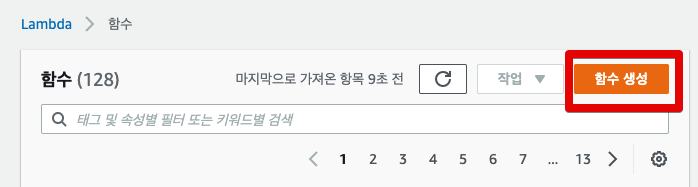

간단한 애플리케이션을 생성할 예정이라 아래와 같이 각 항목을 선택합니다.

> 저는 **Nodejs**를 선택해서 진행합니다.  
> 이미 Lambda가 익숙하고, Node보다는 다른 언어가 좀 더 낫겠다 싶으신 분들은 제 Node 코드를 참고해서 다른 코드로 변환해서 진행하셔도 됩니다.

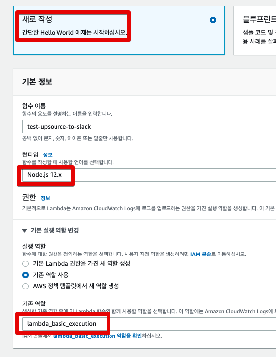

그럼 아래와 같이 Lambda가 생성이 되는데요.  

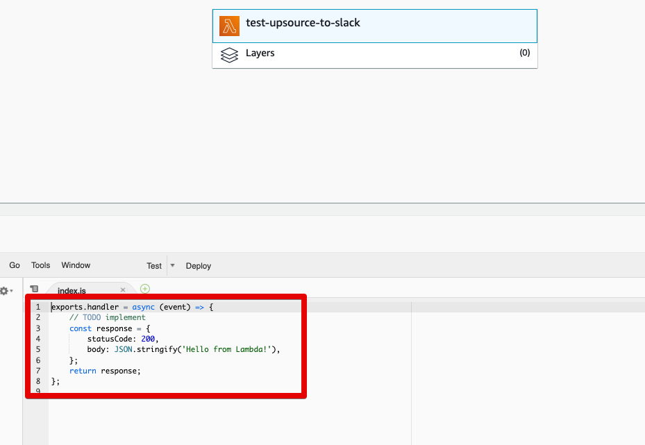

위 코드를 저는 아래와 같이 채웠습니다.  
  
**app.js** (index.js)

```js
const https = require('https');
const UPSOURCE_HOST = 'http://upsource.test.com'; // (1) 

exports.handler = async (event) => {
    console.log('event: '+JSON.stringify(event));

    const webhook = event.params.querystring.webhook; // (2)
    const message = exports.message(event.body, UPSOURCE_HOST);

    return await exports.postSlack(message, webhook);
};

exports.postSlack = async (message, slackUrl) => {
    return await request(exports.options(slackUrl), message);
}

exports.options = (slackUrl) => {
    const {host, pathname} = new URL(slackUrl);
    return {
        hostname: host,
        path: pathname,
        method: 'POST',
        headers: {
            'Content-Type': 'application/json'
        },
    };
}

exports.message = (eventBody, upsourceHost) => {
    const reviewId = eventBody.data.base.reviewId;
    const title = exports.convert(eventBody.dataType);
    const user = eventBody.data.base.actor.userName;
    const projectId = eventBody.projectId;

    return {
        attachments: [
            {
                color: '#2eb886',
                title: `${title}`,
                fields: [
                    {
                        value: `<${upsourceHost}/${projectId}/review/${reviewId}|${reviewId}> Report By ${user}`,
                        short: false
                    }
                ]
            }
        ]
    };
}

// (3)
exports.convert = (dataType) => {
    if(dataType === 'ReviewCreatedFeedEventBean') {
        return '리뷰가 생성되었습니다.';
    } else if (dataType === 'RevisionAddedToReviewFeedEventBean') {
        return '리뷰에 새 코드가 반영되었습니다.';
    } else {
        return '리뷰에 변경 사항이 있습니다.';
    }
}

function request(options, data) {
    return new Promise((resolve, reject) => {
        const req = https.request(options, (res) => {
            res.setEncoding('utf8');
            let responseBody = '';

            res.on('data', (chunk) => {
                responseBody += chunk;
            });

            res.on('end', () => {
                resolve(responseBody);
            });
        });

        req.on('error', (err) => {
            console.error(err);
            reject(err);
        });

        req.write(JSON.stringify(data));
        req.end();
    });
}
```

(1) ```const UPSOURCE_HOST = 'http://upsource.test.com';```

* 여러분들의 Upsource 도메인 주소를 쓰시면 됩니다.
* 여기서 필요한 이유는, 아래와 같이 **슬랙 메세지에 코드리뷰 링크**를 추가하기 위함입니다.

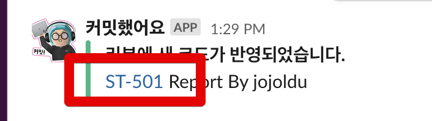

(2) ```event.params.querystring.webhook;```

* 매번 신규 프로젝트에 대한 알람 Lambda를 구현하기는 귀찮은 일입니다.
* 그래서 **어느 슬랙 채널로 발송할지**를 파라미터로 전달 받아 여러 프로젝트 & 여러 슬랙 채널에서 사용할 수 있는 구조로 가도록 queryString 파라미터로 슬랙 웹훅 주소를 받도록 합니다.

(3) ```exports.convert```

* 코드리뷰생성시 / 코드리뷰이후 신규커밋발생시 / 그 외 나머지로 타입을 나누어 메세지를 사용합니다.

저 코드를 그대로 복사하시면서, 혹시나 작업 중간중간 **function의 단위 테스트가 필요하시면** 아래를 참고해보셔도 좋습니다.

> 테스트 도구로 Jest를 사용했습니다.
  
**app.test.js**

```js
const app = require('./app');

test('request용 options 생성', () => {
    const {hostname, path, method} = app.options('https://hooks.slack.com/services/test1/test2/test3');

    expect(hostname).toBe('hooks.slack.com');
    expect(path).toBe('/services/test1/test2/test3');
    expect(method).toBe('POST');
});

describe('dataType에 맞게 메세지가 발행된다', () => {
    test('ReviewCreatedFeedEventBean 이면 리뷰 생성이다.', () => {
        const result = app.convert('ReviewCreatedFeedEventBean');

        expect(result).toBe('리뷰가 생성되었습니다.');
    });

    test('RevisionAddedToReviewFeedEventBean 이면 리뷰에 신규 코드 반영이다.', () => {
        const result = app.convert('RevisionAddedToReviewFeedEventBean');

        expect(result).toBe('리뷰에 새 코드가 반영되었습니다.');
    });

    test('나머지는 모두 리뷰내용 변경이다.', () => {
        const result = app.convert('ReviewCreatedFeedEventBean');

        expect(result).toBe('리뷰가 생성되었습니다.');
    });
});

test('request용 message 생성', () => {
    const projectId = "settler";
    const reviewId = "ST-501";
    const user = "jojoldu";
    const mockEvent =  {
        "body": {
            "projectId": projectId,
            "dataType": "ReviewCreatedFeedEventBean",
            "data": {
                "base": {
                    "reviewId": reviewId,
                    "actor": {
                        "userName": user
                    }
                }
            }
        }
    };

    const upsourceHost = 'http://upsource.test.com';
    const {attachments} = app.message(mockEvent.body, upsourceHost);

    expect(attachments.length).toBe(1);
    expect(attachments[0].title).toBe('리뷰가 생성되었습니다.');
    expect(attachments[0].fields[0].value).toBe(`<${upsourceHost}/${projectId}/review/${reviewId}|${reviewId}> Report By ${user}`);
});
```

만약 실제 슬랙 발송을 테스트해보고 싶다면 아래 파일을 테스트코드로 생성해서 실행해보시면 됩니다.

> 물론 이 파일은 실제 URL을 사용하니 ```.gitignore``` **로 Github 대상에서 제외**하셔야만 합니다.
 
**app.real.test.js**

```js
const app = require('./app');

test('slack 테스트', () => {
    const mockEvent =  {
        "body": {
            "majorVersion": 3,
            "minorVersion": 0,
            "projectId": "settler",
            "dataType": "ReviewCreatedFeedEventBean",
            "data": {
                "revisionId": "c1f4de8e6c5aca9b5615fa6656e1f26e4f26d0d0",
                "branches": [
                    "master"
                ],
                "base": {
                    "reviewId": "ST-501",
                    "actor": {
                        "userName": "jojoldu"
                    },
                    "feedEventId": "created"
                },
                "author": "jojoldu <jojoldu@gmail.com>",
                "date": 1454432013000
            }
        },
        "params": {
            "path": {},
            "querystring": {
                "webhook": "실제 웹훅 주소를 써주세요!!!" // 여기에 실제 웹훅 주소를 써주세요!!
            },
            "header": {}
        }
    };

    app.handler(mockEvent);
});
```

app.js 코드를 Lambda 웹 콘솔로 모두 복사하셨다면 아래와 같이 **배포**버튼을 클릭합니다.

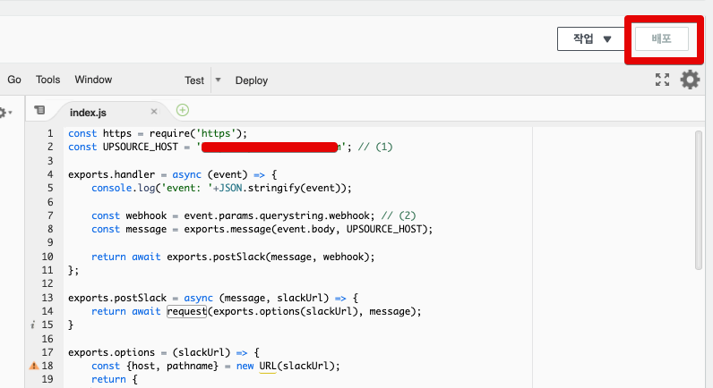

자 그럼 실제 이 코드가 잘 작동되는지 **Lambda 안에서 먼저 테스트**해보겠습니다.

### Lambda 테스트

Lambda 상단을 보시면 **테스트 이벤트 구성**이 보입니다.  
해당 버튼을 클릭합니다.

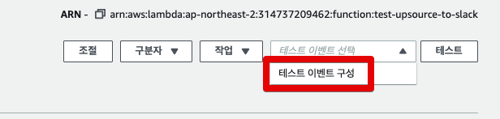

실제 Upsource에서 넘겨줄 JSON 데이터를 임의로 만들어서 Lambda를 실행해보겠습니다.  

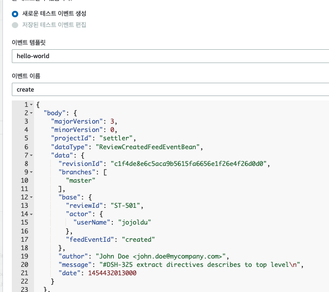

```js
{
  "body": {
    "majorVersion": 3,
    "minorVersion": 0,
    "projectId": "settler",
    "dataType": "ReviewCreatedFeedEventBean",
    "data": {
      "revisionId": "c1f4de8e6c5aca9b5615fa6656e1f26e4f26d0d0",
      "branches": [
        "master"
      ],
      "base": {
        "reviewId": "ST-501",
        "actor": {
          "userName": "jojoldu"
        },
        "feedEventId": "created"
      },
      "author": "John Doe <john.doe@mycompany.com>",
      "message": "#DSH-325 extract directives describes to top level\n",
      "date": 1454432013000
    }
  },
  "params": {
    "path": {},
    "querystring": {
      "webhook": "슬랙 웹훅 주소를 써주세요!" // 슬랙 웹훅 주소를 써주세요!
    },
    "header": {}
  }
}
```

**생성**버튼을 클릭 하시면 아래와 같이 테스트 환경이 구축된 것을 볼 수 있습니다.


테스트를 수행해보시면?  
정상적으로 슬랙으로 메세지가 간 것을 볼 수 있습니다.

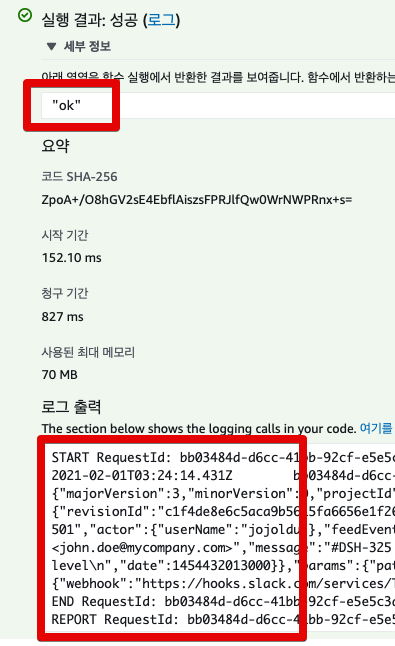

자 Lambda와 슬랙간에 연동에 문제가 없음을 확인하였으니, 이제 Lambda와 API Gateway를 연동해보겠습니다.

## 3. API Gateway

API Gateway 로 이동하신 뒤, API 생성 버튼을 클릭합니다.

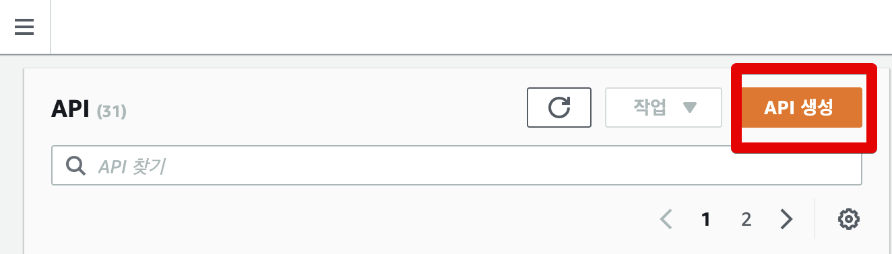

여기서 여러 형태가 선택 가능한데, 저희는 REST API를 선택합니다.

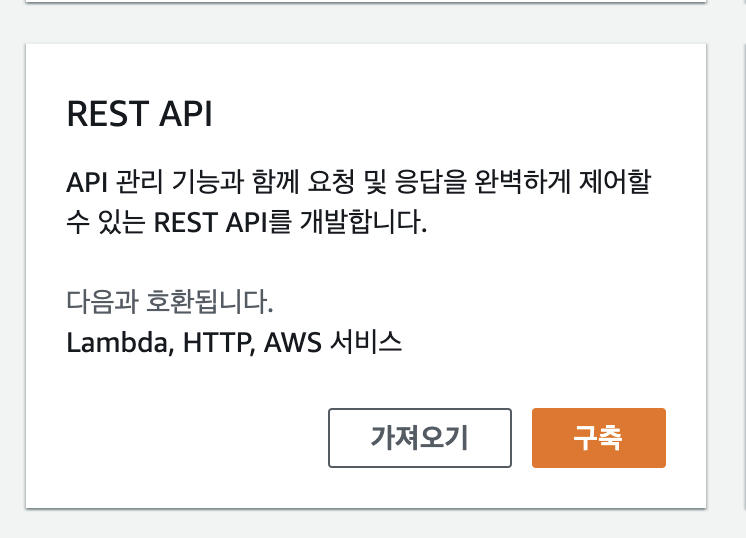

신규 API에 대한 각 항목들을 채웁니다.

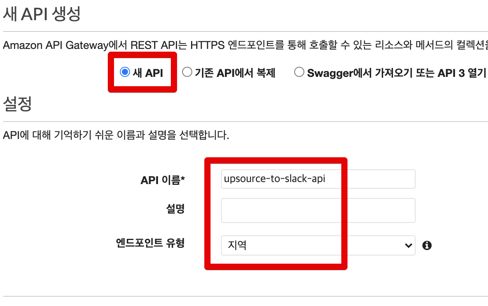

API가 생성되시면, 이제 신규 메소드 (GET/POST등 HTTP 메소드) 를 추가해야하는데요.  
API 페이지의 상단을 보시면 **작업** 버튼이 있습니다.  
해당 버튼 클릭 후 **메소드 생성**을 클릭합니다.

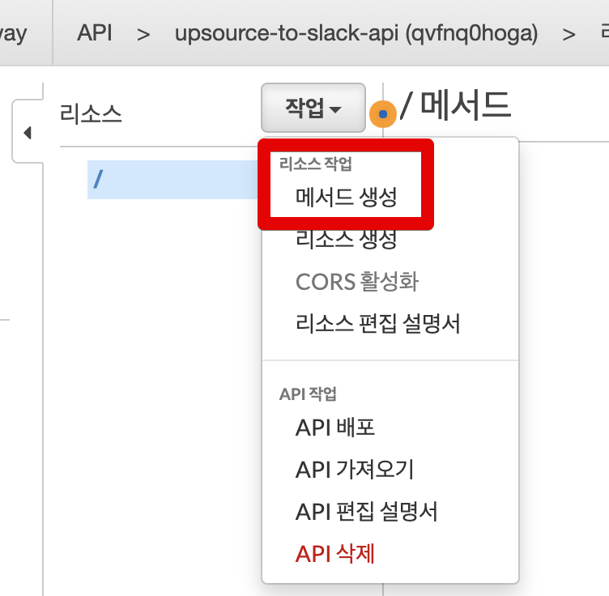

Upsource에서 POST로 JSON을 넘겨 주기 때문에 API Gateway도 POST를 선택합니다.

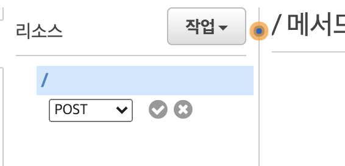

해당 Gateway 호출 시, 실행시킬 기능을 설정하는데요.  
저희는 이미 만들어둔 Lambda가 있으니 해당 Lambda 정보를 사용합니다.

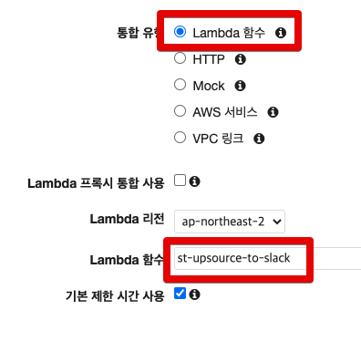

### 3-1. 메서드 요청

POST 메소드가 생성이 되면 아래와 같이 여러 설정들이 가능한데요.  
이 중 먼저 **메서드 요청**을 클릭합니다.

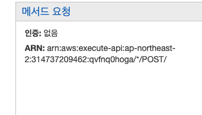

여기서는 **어떤 쿼리 파라미터를 등록할 것인지** 설정할 수 있는데요.  
Lambda 코드에서도 말씀드렸듯이, **어떤 슬랙 채널로 보낼지 웹훅 주소**를 쿼리 파라미터로 받겠습니다.

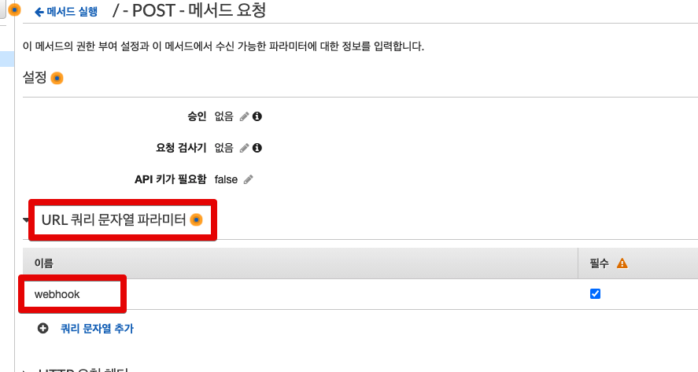

* webhook: URL Querystring으로 받을 수 있도록 등록합니다.

설정이 다 되셨으면 다시 POST 메소드 페이지로 뒤로가기 합니다.

### 3-2. 통합 요청

다음은 통합 요청인데요.  
Upsource가 보내 준, **JSON Body와 Querystring**을 Lambda가 좀 더 쉽게 가공할 수 있도록 정리를 합니다.  

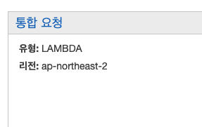

통합 요청 항목을 클릭하면 아래와 같이 매핑 템플릿을 볼 수 있는데요.  
여기서 **매핑 템플릿 추가**를 클릭합니다.

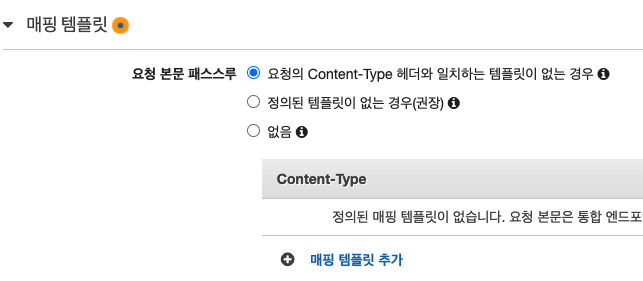

그럼 아래와 같이 신규 `Content-Type` 으로 `application/json`을 등록합니다.

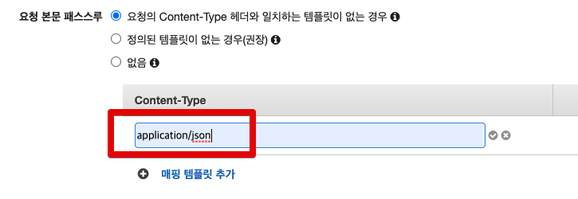

등록 하게 되면 팝업이 뜨는데 이때는 **예, 이 통합 보호**를 선택하시면 됩니다.

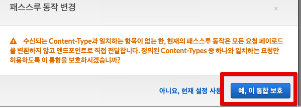

그럼 아래와 같이 **API Gateway로 넘어온 값들을 Lambda Json으로 어떻게 넘겨줄지** 정리할 수 있는데요.

> 문법은 [Apache Velocity](https://velocity.apache.org/) 입니다.

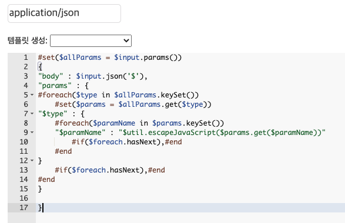

```js
#set($allParams = $input.params())
{
"body" : $input.json('$'),
"params" : {
#foreach($type in $allParams.keySet())
    #set($params = $allParams.get($type))
"$type" : {
    #foreach($paramName in $params.keySet())
    "$paramName" : "$util.escapeJavaScript($params.get($paramName))"
        #if($foreach.hasNext),#end
    #end
}
    #if($foreach.hasNext),#end
#end
}

}
```

이렇게 설정하게 되면 아래 2가지 형태가 Lambda의 `event` 객체에 담기게 됩니다.

* `body` : Upsource에서 넘겨준 Json Body
* `params.querystring`: Upsource에서 사용한 Querystring

자 그럼 API Gateway도 실제로 테스트를 해보겠습니다.

### 3-3. API Gateway 테스트

POST 메소드 페이지의 중앙에 있는 **테스트** 버튼을 클릭합니다.


먼저 실제 URL 쿼리 파라미터로 넘어올 ```webhook``` 항목과 Upsource에서 넘겨줄 JSON Body를 함께 채워줍니다.

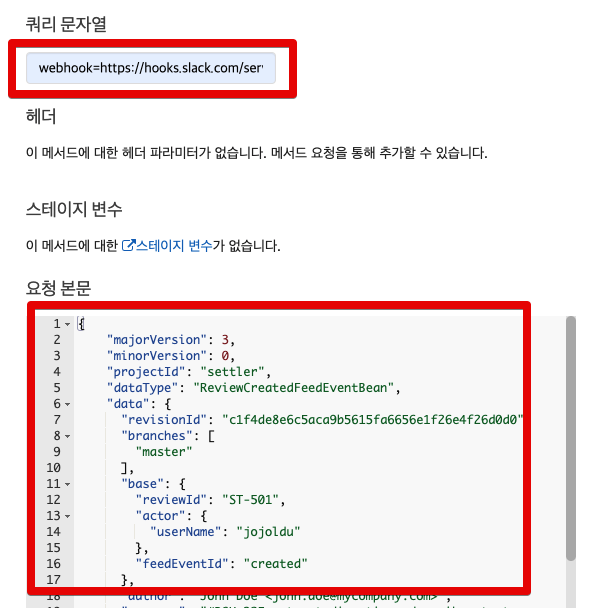

**쿼리 문자열**

```bash
webhook=https://hooks.slack.com/services/......
```

**요청 본문**

```js
{
    "majorVersion": 3,
    "minorVersion": 0,
    "projectId": "settler",
    "dataType": "ReviewCreatedFeedEventBean",
    "data": {
      "revisionId": "c1f4de8e6c5aca9b5615fa6656e1f26e4f26d0d0",
      "branches": [
        "master"
      ],
      "base": {
        "reviewId": "ST-501",
        "actor": {
          "userName": "jojoldu"
        },
        "feedEventId": "created"
      },
      "author": "John Doe <john.doe@mycompany.com>",
      "message": "#DSH-325 extract directives describes to top level\n",
      "date": 1454432013000
    }
}
```

테스트를 실행해보시면?  
아래와 같이 응답 본문으로 OK가 오는 것을 확인할 수 있습니다.

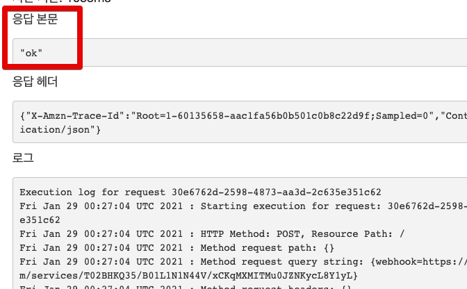

실제 슬랙으로도 알람이 잘 오는 것을 볼 수 있습니다.

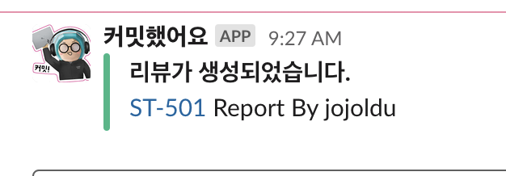

자 그럼 API Gateway의 구성이 모두 잘 되는 것을 확인하였으니, 최종 단계로 API Gateway를 배포하겠습니다.

### 3-4. API Gateway 배포

API Gateway는 배포를 하지 않으면 **API URL이 생성되지 않습니다**.  
그래서 꼭 배포를 하셔야만 외부에서 호출할 수 있으니, 잊지 않고 배포를 진행합니다.  
  
순서는 리소스 작업 -> API 배포를 클릭 하신뒤

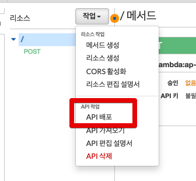

등장하는 팝업에서 본인이 원하는 환경명 (저는 `prod`) 를 등록하신 뒤, 생성하시면 됩니다.

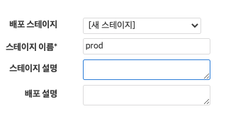

그럼 아래와 같이 **외부에서 호출 가능한 엔드포인트**(URL)이 생성됩니다.


이제 Upsource에서는 위 **URL을 등록만 하면** 코드리뷰가 자동으로 슬랙에 발송됩니다.

## 4. Upsource & API Gateway

이제 마지막 단계인 여태 만든 API Gateway와 Upsource를 연동해보겠습니다.  
  
Upsource의 우측 상단 설정 버튼을 클릭하신 뒤,


코드리뷰 알람을 받고자 하는 프로젝트의 **Edit project** 를 클릭합니다.


그럼 설정 페이지가 나오는데요.  
이 중 우측 상단에 있는 **Webhook**를 선택합니다.  


그리고 원하시는 이벤트를 선택하여 **API Gateway주소와 슬랙 웹훅 주소**를 등록합니다.


```bash
https://AWS게이트웨이URL?webhook=슬랙웹훅URL
```

* `On review created`: 코드리뷰 생성시
* `On revision added to review`: 코드리뷰생성 이후 추가커밋 발생시

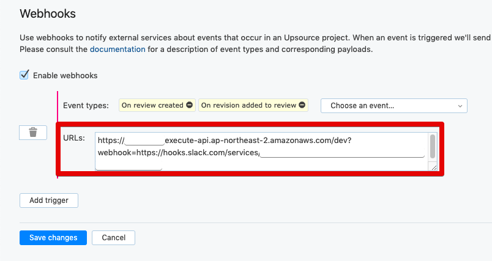

여기까지 다 하셨다면!  
이제 해당 채널에서는 코드리뷰가 추가/변경이 있을때마다 슬랙으로 알람을 받을 수 있게 됩니다.

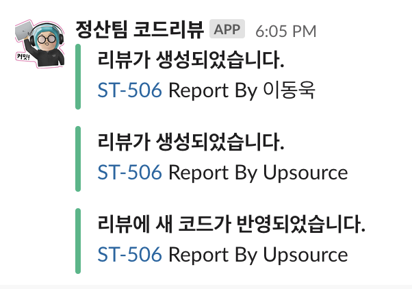


