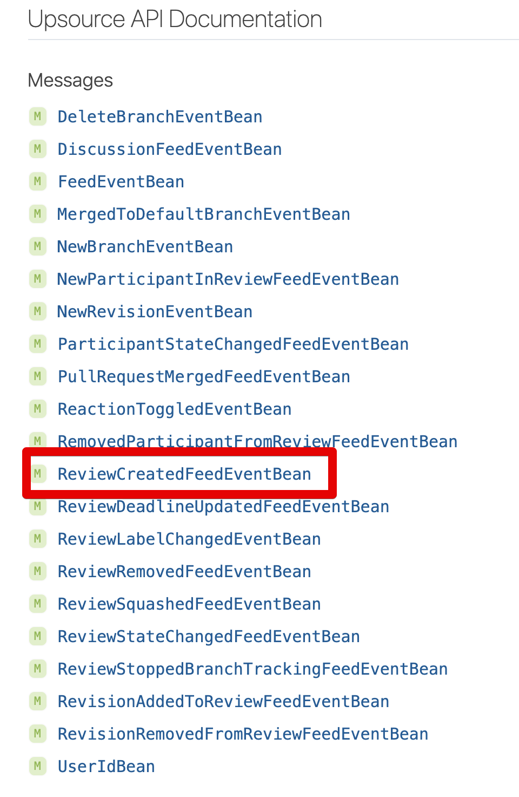
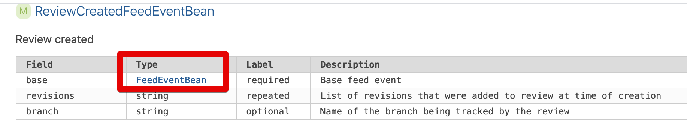
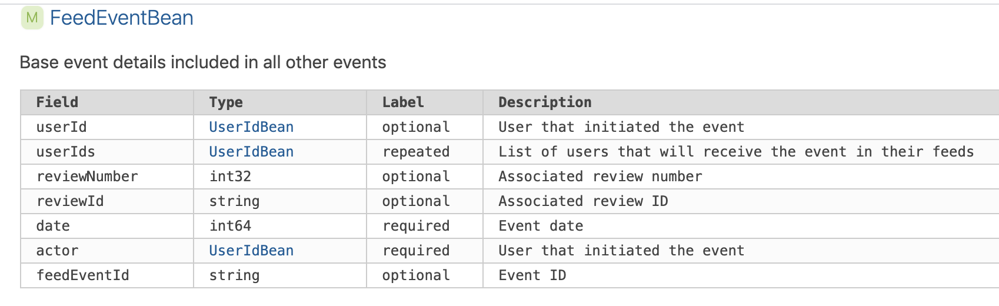
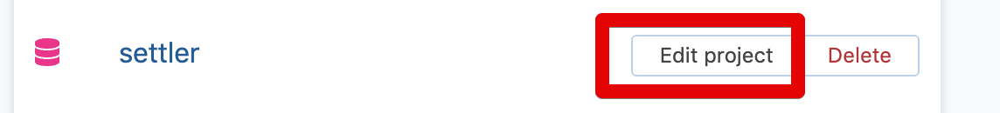
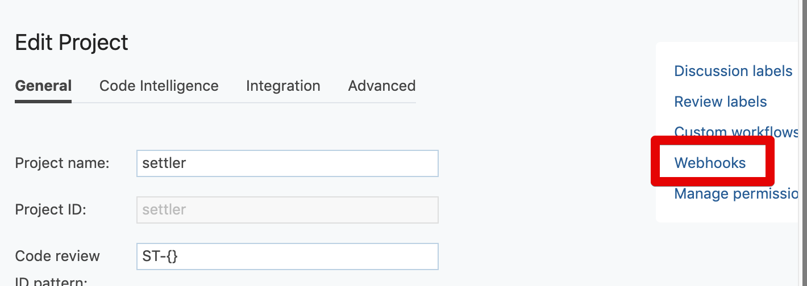
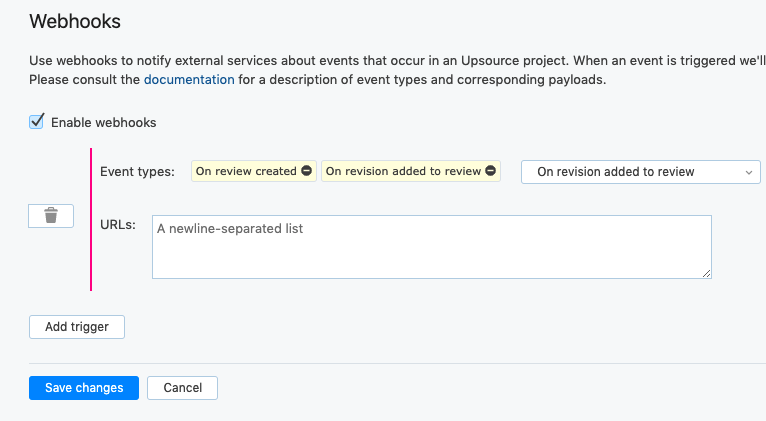

# Slack webhook 으로 Upsource 코드 리뷰 알람 받기

현재 Upsource는 
[Integration with slack is not working via webhook](https://youtrack.jetbrains.com/issue/UP-10213)

## Slack

## Upsource Webhook

API

```bash
http://본인들 Upsoure 도메인/~api_doc/index.html#webhooks
```

```bash
POST /my-webhook HTTP/1.1
Host: example.com
Content-Type: application/json; charset=UTF-8
Content-Length: XXX
Connection: close
User-Agent: Jakarta Commons-HttpClient/3.1
X-Request-Id: c8a5b163-508f-42b5-939a-e11b02caf72e

{
    "majorVersion": 3,
    "minorVersion": 0,
    "projectId": "demo-project",
    "dataType": "NewRevisionEventBean",
    "data": {
        "revisionId": "c1f4de8e6c5aca9b5615fa6656e1f26e4f26d0d0",
        "branches": [
        "master"
        ],
        "author": "John Doe <john.doe@mycompany.com>",
        "message": "#DSH-325 extract directives describes to top level\n",
        "date": 1454432013000
    }
}
```

```bash
http://본인들 Upsoure 도메인/~api_doc/integration/index.html
```







```bash
{
    "majorVersion": 3,
    "minorVersion": 0,
    "projectId": "settler",
    "dataType": "ReviewCreatedFeedEventBean",
    "data": {
        "revisionId": "c1f4de8e6c5aca9b5615fa6656e1f26e4f26d0d0",
        "branches": [
            "master"
        ],
        "base": {
            "reviewId": "ST-501",
            "actor": {
                "userName": "jojoldu"
            },
            "feedEventId": "created"
        },
        "author": "jojoldu <jojoldu@gmail.com>",
        "date": 1454432013000
    }
}
```

## AWS

### Lambda

**app.js**

```js
const https = require('https');
const UPSOURCE_HOST = 'http://upsource.test.com'; // 본인 Upsource 주소

exports.handler = async (event) => {
    console.log('event: '+JSON.stringify(event));

    const webhook = event.params.querystring.webhook;
    const message = exports.message(event.body, UPSOURCE_HOST);

    return await exports.postSlack(message, webhook);
};

exports.postSlack = async (message, slackUrl) => {
    return await request(exports.options(slackUrl), message);
}

exports.options = (slackUrl) => {
    const {host, pathname} = new URL(slackUrl);
    return {
        hostname: host,
        path: pathname,
        method: 'POST',
        headers: {
            'Content-Type': 'application/json'
        },
    };
}

exports.message = (eventBody, upsourceHost) => {
    const reviewId = eventBody.data.base.reviewId;
    const title = exports.convert(eventBody.dataType);
    const user = eventBody.data.base.actor.userName;
    const projectId = eventBody.projectId;

    return {
        attachments: [
            {
                color: '#2eb886',
                title: `${title}`,
                fields: [
                    {
                        value: `<${upsourceHost}/${projectId}/review/${reviewId}|${reviewId}> Report By ${user}`,
                        short: false
                    }
                ]
            }
        ]
    };
}

exports.convert = (dataType) => {
    if(dataType === 'NewRevisionEventBean') {
        return '리뷰에 새 코드가 반영되었습니다.';
    } else {
        return '리뷰가 생성되었습니다.';
    }
}

function request(options, data) {
    return new Promise((resolve, reject) => {
        const req = https.request(options, (res) => {
            res.setEncoding('utf8');
            let responseBody = '';

            res.on('data', (chunk) => {
                responseBody += chunk;
            });

            res.on('end', () => {
                resolve(responseBody);
            });
        });

        req.on('error', (err) => {
            console.error(err);
            reject(err);
        });

        req.write(JSON.stringify(data));
        req.end();
    });
}
```

**app.test.js**

```js
const app = require('./app');

test('request용 options 생성', () => {
    const {hostname, path, method} = app.options('https://hooks.slack.com/services/test1/test2/test3');

    expect(hostname).toBe('hooks.slack.com');
    expect(path).toBe('/services/test1/test2/test3');
    expect(method).toBe('POST');
});

test('request용 message 생성', () => {
    const projectId = "settler";
    const reviewId = "ST-501";
    const user = "jojoldu";
    const mockEvent =  {
        "body": {
            "projectId": projectId,
            "dataType": "ReviewCreatedFeedEventBean",
            "data": {
                "base": {
                    "reviewId": reviewId,
                    "actor": {
                        "userName": user
                    }
                }
            }
        }
    };

    const upsourceHost = 'http://upsource.test.com';
    const {attachments} = app.message(mockEvent.body, upsourceHost);

    expect(attachments.length).toBe(1);
    expect(attachments[0].title).toBe('리뷰가 생성되었습니다.');
    expect(attachments[0].fields[0].value).toBe(`<${upsourceHost}/${projectId}/review/${reviewId}|${reviewId}> Report By ${user}`);
});
```

**app.real.test.js**

```js
const app = require('./app');

test('slack 테스트', () => {
    const mockEvent =  {
        "body": {
            "majorVersion": 3,
            "minorVersion": 0,
            "projectId": "settler",
            "dataType": "ReviewCreatedFeedEventBean",
            "data": {
                "revisionId": "c1f4de8e6c5aca9b5615fa6656e1f26e4f26d0d0",
                "branches": [
                    "master"
                ],
                "base": {
                    "reviewId": "ST-501",
                    "actor": {
                        "userName": "jojoldu"
                    },
                    "feedEventId": "created"
                },
                "author": "jojoldu <jojoldu@gmail.com>",
                "date": 1454432013000
            }
        },
        "params": {
            "path": {},
            "querystring": {
                "webhook": "실제 웹훅 주소를 써주세요!!!" // 여기에 실제 웹훅 주소를 써주세요!!
            },
            "header": {}
        }
    };

    app.handler(mockEvent);
});
```

#### Lambda 테스트

### API Gateway

```js
#set($allParams = $input.params())
{
"body" : $input.json('$'),
"params" : {
#foreach($type in $allParams.keySet())
    #set($params = $allParams.get($type))
"$type" : {
    #foreach($paramName in $params.keySet())
    "$paramName" : "$util.escapeJavaScript($params.get($paramName))"
        #if($foreach.hasNext),#end
    #end
}
    #if($foreach.hasNext),#end
#end
}

}
```

#### API Gateway 테스트

```bash
webhook=https://hooks.slack.com/services/......
```

```js
{
    "majorVersion": 3,
    "minorVersion": 0,
    "projectId": "settler",
    "dataType": "ReviewCreatedFeedEventBean",
    "data": {
      "revisionId": "c1f4de8e6c5aca9b5615fa6656e1f26e4f26d0d0",
      "branches": [
        "master"
      ],
      "base": {
        "reviewId": "ST-501",
        "actor": {
          "userName": "jojoldu"
        },
        "feedEventId": "created"
      },
      "author": "John Doe <john.doe@mycompany.com>",
      "message": "#DSH-325 extract directives describes to top level\n",
      "date": 1454432013000
    }
}
```

## Upsource & API Gateway






