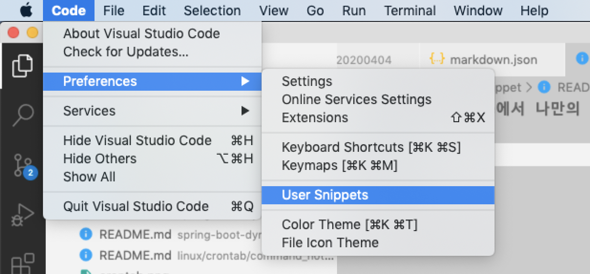
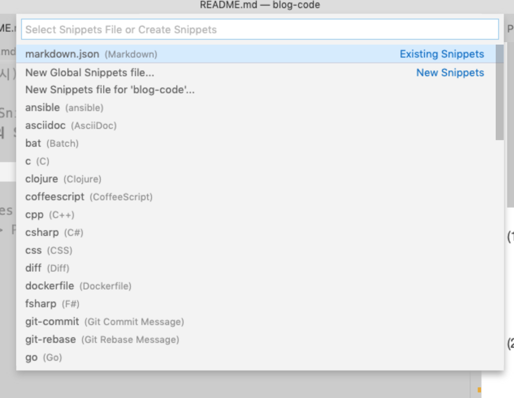
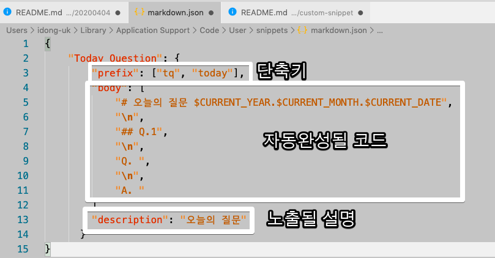
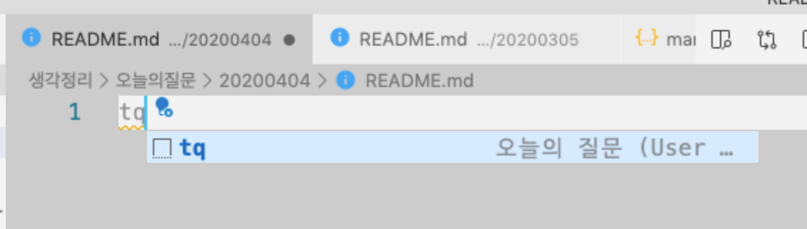
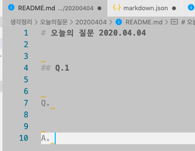

# VS Code에서 나만의 Snippets 만들기

저같은 경우 블로그 글을 마크다운 (Markdown) 으로 작성을 하는데요.  
이때 **카테고리 별로 정해진 포맷**을 사용합니다.  
매번 여러 카테고리의 글을 써야하니, 이 포맷들을 모두 기억하고 사용하기가 어렵습니다.  
  
그러다보니 카테고리별로 전체 마크다운 포맷을 미리 등록하여 사용하면 어떨까 싶었는데요.  
  
이와 비슷한 경우를 Snippets이란 이름으로 여러 에디터에서는 지원하고 있습니다.


(VS Code의 Snippets 예시)

각 언어별/프레임워크별로 Snippets을 지원하지만, 여기서는 제가 필요한대로 코드가 생성되어야 하므로 **나만의 Snippets**을 만들어 보겠습니다.

## 본문

먼저 Code -> Preferences -> User Snippets로 이동합니다.
> Windows에서는 File -> Preferences 입니다.



그럼 아래와 같이 **등록할 Snippets이 작동될 파일 확장자를 선택** 하는 화면이 나옵니다.  
  
저는 마크다운의 Snippets을 만들 예정이라 Markdown을 선택했습니다.



그럼 아래와 같이 마크다운용 Snippets 설정 파일이 열리는데요.  
여기에 각 항목을 채워주시면 됩니다.



(1) ```prefix```

* 단축어
* 지정된 파일포맷에서 등록한 단축어가 입력될 경우 Snippets을 사용할 수 있습니다.
* 저는 여기서 ```tq```와 ```today``` 라는 2가지 단축어를 등록하였습니다.

(2) ```body```

* 해당 단축어 입력시 완성될 코드입니다.
* 문자열 배열을 등록해야하며, 각 배열의 항목이 **한줄의 코드가 됩니다**
* ```\n```: 한줄 띄어쓰기가 됩니다.
  * 비슷하게 ```\t```를 입력하시면 탭 띄어쓰기가 됩니다.
* 사전 정의된 변수들 (```$``` 를 앞에 붙이면 사용할 수 있습니다.)
  * ```CURRENT_YEAR``` : 현재 년도
  * ```CURRENT_MONTH``` : 현재 월
  * ```CURRENT_DATE``` : 현재 일자

> 좀 더 자세한 사용 방법과 문법은 [공식 문서](https://code.visualstudio.com/docs/editor/userdefinedSnippetss)를 참고합니다.
  
(3) ```description```

* 단축어를 입력시 노출될 설명문

모든 항목을 다 채우셨다면 다시 마크 다운 파일로 이동하여서 등록된 단축어를 입력 하신뒤 ```Ctrl + Space``` 를 누르시면 아래와 같이 작성된 **description**이 보이면서 Snippets 선택화면이 나옵니다.



해당 Snippets 을 선택하시면?



등록한 형태대로 코드가 자동완성 되는 것을 확인할 수 있습니다.  


