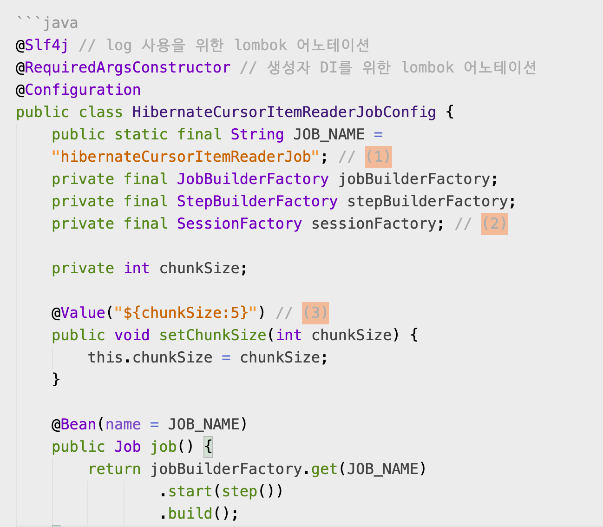
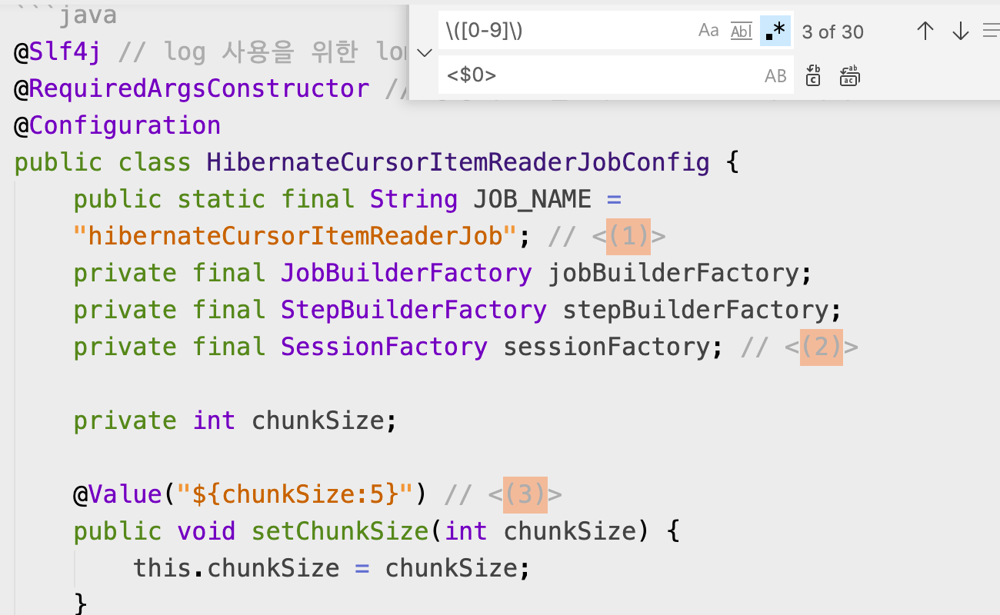
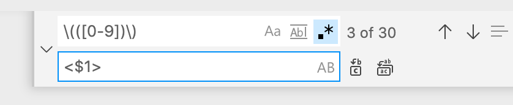
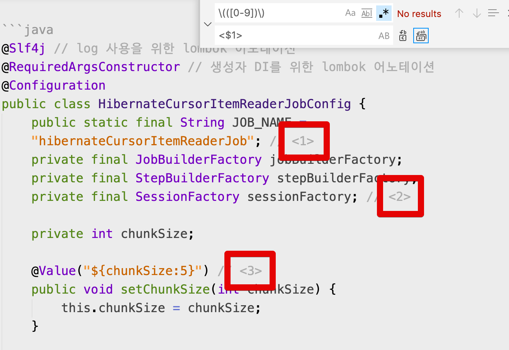

# VSCode에서 정규표현식(Regex)로 원하는 문자열 치환하기

아스키독 (adoc) 혹은 마크다운 (md) 파일을 작성하다보면 정규표현식을 통해 **특정 패턴의 문자들 중 일부만 교체** 해야할 때가 종종 있습니다.  
  
이를테면 다음과 같은 경우인데요.  
아래와 같은 화면에서 `(숫자)` 로 되어진 부분들을 `<숫자>`로 변경이 필요하다고 하겠습니다.  
(즉, 괄호안 숫자는 그대로 두고, 괄호 ```()``` 만 태그 ```<>``` 로 교체하는 것입니다.)



현재 찾고자 하는 패턴을 정규표현식으로 간단하게 표현하면 `\([0-9]\)` 가 됩니다.  
그래서 찾는 패턴은 `\([0-9]\)`로 두고, 어떻게 변환할지만 정하면 되는데요.  

여기서 아래와 같이 입력해서 변경을 시도해보실 수 있습니다.



```bash
\([0-9]\)
```

* 괄호를 escape 처리 하기 위해 backslash (`\`) 를 괄호 앞에 붙였습니다.

```
<$0>
```

* VS Code에서는 replace할때 **정규표현식으로 매칭된 영역**을 `$0` 으로 변수 지정이 가능합니다.

결과를 보시면 아시겠지만 의도했던 `<숫자>` 가 아닌, `<(숫자)>` 가 되었습니다.  
(태그+괄호가 함께 이루어졌습니다 ```<()>```)

> replace 입력창을 열어서 (Mac 기준 `CMD+R`) 검색 입력창에서 `.*`를 클릭해서 활성화 시키시면 변환 세팅은 완료됩니다.  

생각해보면, 정규표현식 매칭 되는 부분이 `(숫자)` 이기 때문에 이들 전체가 `$0`에 할당되니 `<$0>`로 할 경우 `<(숫자)>` 가 되는 것은 당연합니다.  
  
그래서 여기에서 저희가 필요한 것은 다음과 같습니다.

* `(숫자)` 로 이루어진 텍스트들을 대상으로 하되
* `(숫자)`가 아닌 괄호`()` 만 태그`<>`로 교체할 것

VS Code에서는 이럴 경우를 대비해서 괄호`()`를 기준으로 `$` 의 인덱스 번호가 매겨지도록 구성하였습니다.  
즉, 숫자를 나타내는 정규표현식 `[0-9]` 를 backslash (`\`) 없이 괄호만 사용할 경우 `$`의 또다른 인덱스번호가 된다는 것입니다.  



```bash
\(([0-9])\)
```

* `\([0-9]\)` 에서 `\(([0-9])\)` 로 변경하였습니다.
* 위에서 언급한대로 숫자를 나타내는 정규표현식 `[0-9]` 에 추가 괄호 `()`로 감싼형태입니다.
* 이렇게 감싼 형태의 숫자 매칭 영역은 이후 변경창에서 `$1`로 사용됩니다.


```bash
<$1>
```

* $1에는 숫자를 나타내는 정규표현식 `[0-9]`가 있으니 교체될 경우에는 `<숫자>`의 형태가 될 것입니다.

그럼 아래와 같이 의도한대로 `(숫자)`로 이루어진 모든 텍스트가 `<숫자>` 로 변경된 것을 확인할 수 있습니다.

