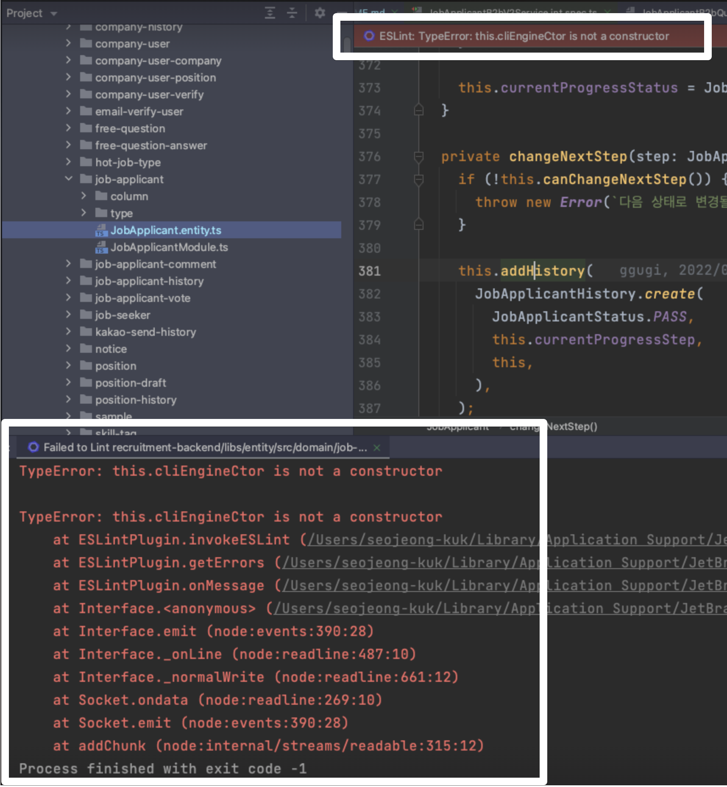
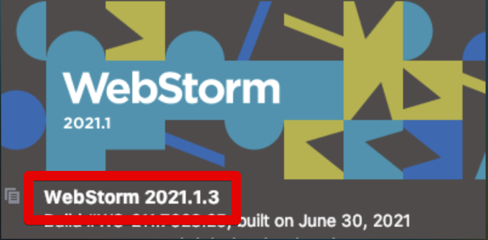
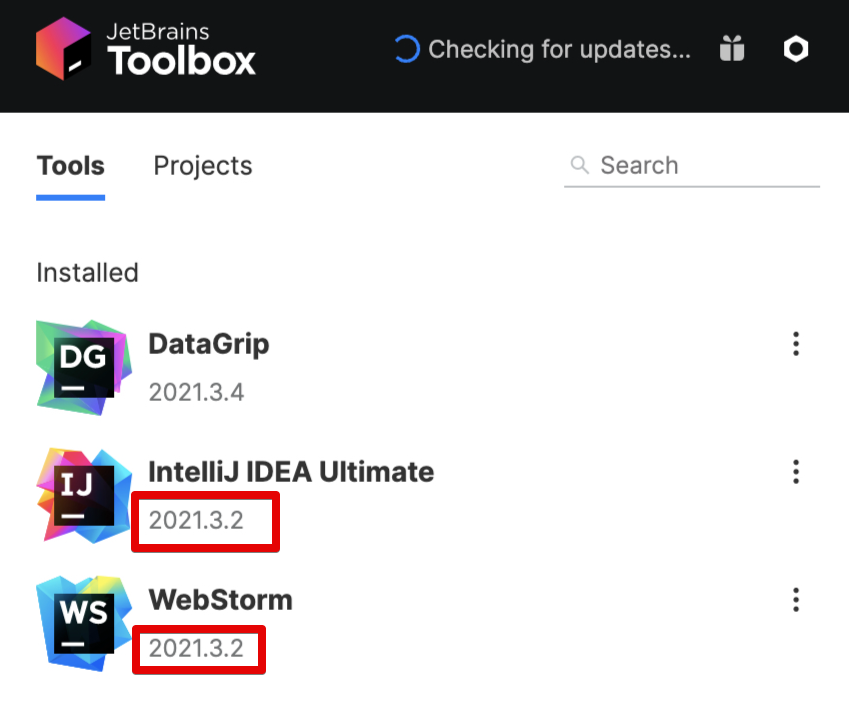

# WebStorm (IntelliJ IDEA) 에서 this.cliEngineCtor is not a constructor 이슈 발생시 (feat. ESLint 8.0)

ESLint 8.0 이상 버전을 사용할 경우 기존에 사용중인 WebStorm, IntelliJ 등에서 다음과 같이 에러가 발생하곤합니다.

```ts
TypeError: this.cliEngineCtor is not a constructor
```



아래 로그를 보시면 `this.cliEngineCtor is not a constructor` 내용을 볼 수 있는데요. 

```ts
TypeError: this.cliEngineCtor is not a constructor
    at ESLintPlugin.invokeESLint (/Users/seojeong-kuk/Library/Application Support/JetBrains/Toolbox/apps/WebStorm/ch-0/211.7628.25/WebStorm.app/Contents/plugins/JavaScriptLanguage/languageService/eslint/bin/eslint-plugin.js:103:25)
    at ESLintPlugin.getErrors (/Users/seojeong-kuk/Library/Application Support/JetBrains/Toolbox/apps/WebStorm/ch-0/211.7628.25/WebStorm.app/Contents/plugins/JavaScriptLanguage/languageService/eslint/bin/eslint-plugin.js:82:21)
    at ESLintPlugin.onMessage (/Users/seojeong-kuk/Library/Application Support/JetBrains/Toolbox/apps/WebStorm/ch-0/211.7628.25/WebStorm.app/Contents/plugins/JavaScriptLanguage/languageService/eslint/bin/eslint-plugin.js:56:64)
    at Interface.<anonymous> (/Users/seojeong-kuk/Library/Application Support/JetBrains/Toolbox/apps/WebStorm/ch-0/211.7628.25/WebStorm.app/Contents/plugins/JavaScriptLanguage/jsLanguageServicesImpl/js-language-service.js:105:39)
    at Interface.emit (node:events:390:28)
    at Interface._onLine (node:readline:487:10)
    at Interface._normalWrite (node:readline:661:12)
    at Socket.ondata (node:readline:269:10)
    at Socket.emit (node:events:390:28)
    at addChunk (node:internal/streams/readable:315:12)
Process finished with exit code -1
```

이는 ESLint 가 버전업이 됨에 따라 기존 클래스가 삭제되었기 때문인데요.

* [the-cliengine-class-has-been-removed](https://eslint.org/docs/user-guide/migrating-to-8.0.0#-the-cliengine-class-has-been-removed)

그래서 아래와 같이 **2021.2.2** 보다 낮은 버전에서는 ESLint 8.0 이상의 버전을 사용할 수가 없습니다.



이를 해결 하기 위해서는 **2021.2.2 이상**의 IDE를 사용하시면 됩니다.  
이미 정식 버전이 2021.3.2 까지 나왔기 때문에 여전히 2021.1 버전을 사용하신다면 얼른 업데이트 하시는 것을 추천드립니다.



## 참고

* [ESLint 8.0 support](https://youtrack.jetbrains.com/issue/WEB-52236)