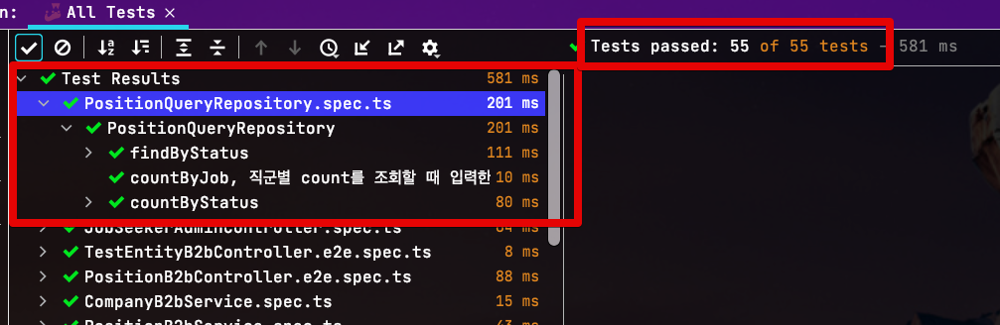
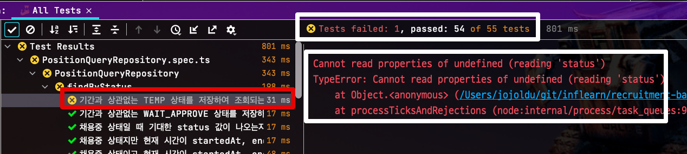
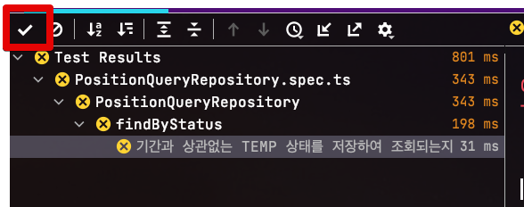
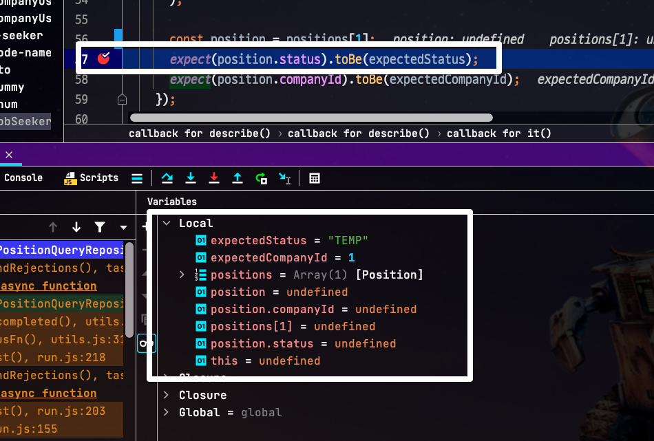
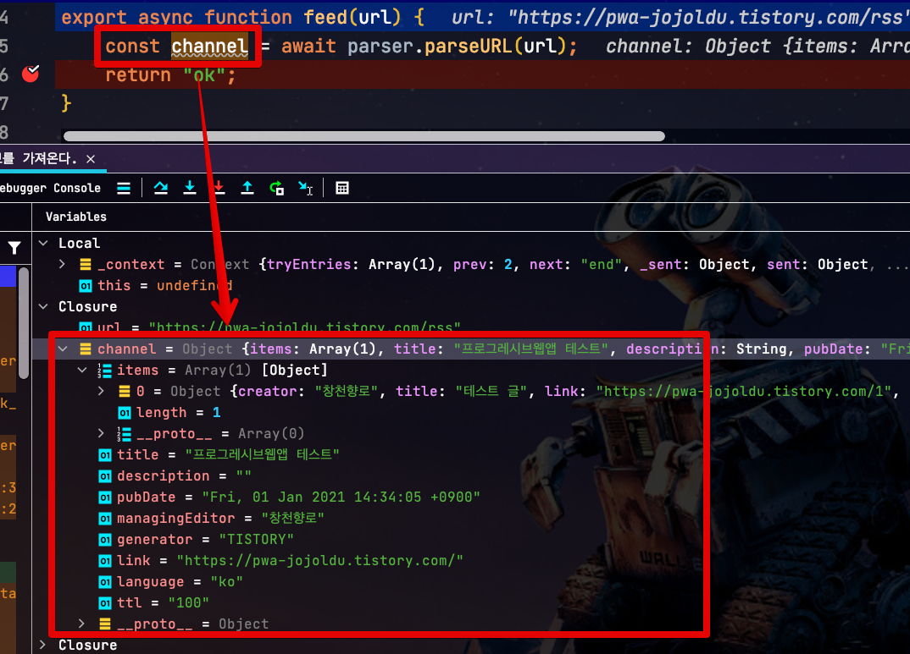
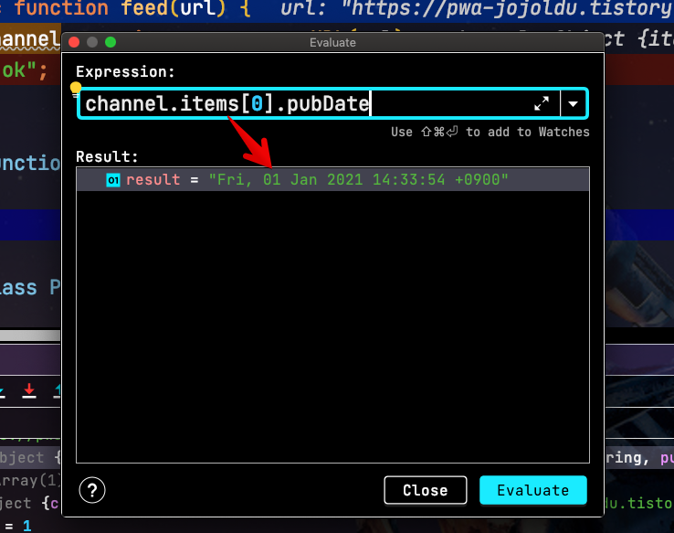
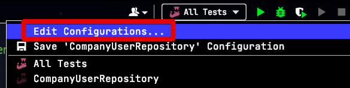
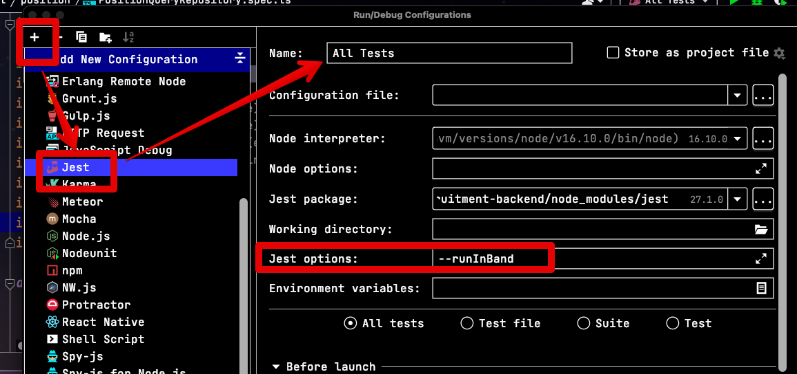

# Jest CLI 대신에 WebStorm Run (Debug)로 수행하자

NodeJS 통합 테스트를 CLI (`jest`)로 수행 하는 모습을 자주 보는데요.  
개인적으로는 단순 CLI로 수행하기 보다는 디버깅을 비롯해서 IDE가 지원하는 강력한 테스팅 환경을 사용하기 위해서 IDE로 수행하는 것을 추천합니다.  

이번시간에는 CLI 보다 IDE로 통합 테스트를 수행하는 방법의 장점을 알아보겠습니다.

## 1. 장점

먼저 깔끔하게 정리된 테스트 레포트를 볼 수 있는데요.  
아래와 같이 **지정해놓은 테스트 로그를 숨기고 결과만을 정리** 해서 보여줍니다.

기존 CLI에서는 테스트를 수행하는 동안 발생한 콘솔 로그 때문에 (특히 debug 용도로 찍어놓은 ㅠ) 정작 중요하게 봐야할 부분을 놓치기도 하는데요.  

**해당 테스트에서만 발생한 로그를 골라서 볼 수 있습니다**.  

> 추가적으로, 디버거를 사용할 수 있어서 굳이 테스트나 메인 코드에서 **불필요한 디버깅용 로그를 안넣어도** 되서 수백~수천개의 테스트가 돌때 전체 테스트 시간이 단축되는 효과도 있습니다.

만약 테스트가 많은데, 그 중 일부만 실패한 경우에 **테스트가 실패한 건들만 골라서 볼 수도 있습니다**

테스트를 많이 작성해서 수행하다보면 해당 테스트 하나만 실행시에는 문제가 없는데, **전체 테스트 수행시에만 문제**가 되는 경우가 생길때도 있는데요.  
이럴 경우에 CLI로만 수행한다면 `console.log` 로 하나하나 다 찍어보면서 추측하는 수 밖에 없는데요.  

이 역시 IDE에서 설정된 통합 테스트 실행을 디버그 (Debug) 로 수행한다면 다음과 같이 브레이킹 포인트를 걸어두고 그 당시의 각 로컬/글로벌 변수들의 값을 확인할 수 있고,

실제 **코드를 직접 수행해 볼 수도 있습니다**.

> JetBrains IDE의 디버거를 비롯한 다양한 기능을 알고싶으시면 [다음 강좌](http://bit.ly/2NTJBeR)를 추천드립니다.

## 2. WebStorm (IntelliJ 등 모든 JetBrains 제품군) 설정 방법

Jest CLI를 대체해 통합 테스트를 IDE Run Config로 실행하는 방법은 간단합니다.  
IDE 상단에 있는 Run Configuration의 `Edit Config...` 선택하신 뒤,

Jest 항목에서 아래와 같이 입력해주시면 됩니다.

(저같은 경우 DB 테스트를 위해서 `runInBand` 옵션을 넣었는데, 이외 다양한 옵션들을 선택적으로 `Jest options` 에 넣어서 사용해주시면 됩니다.)
