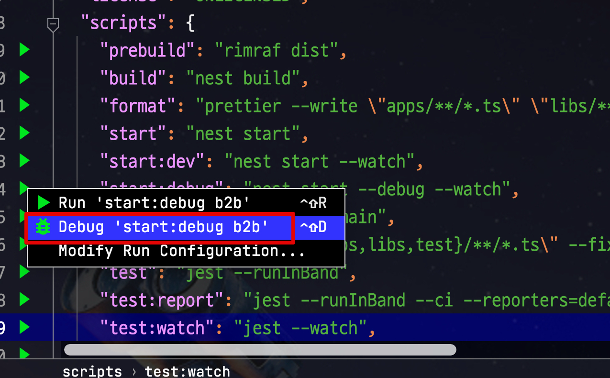
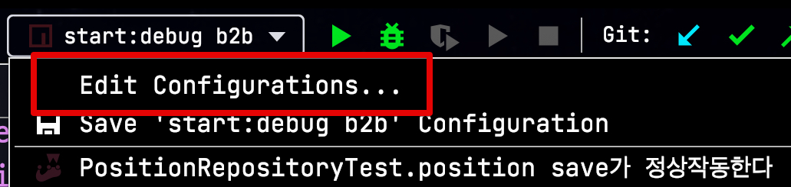
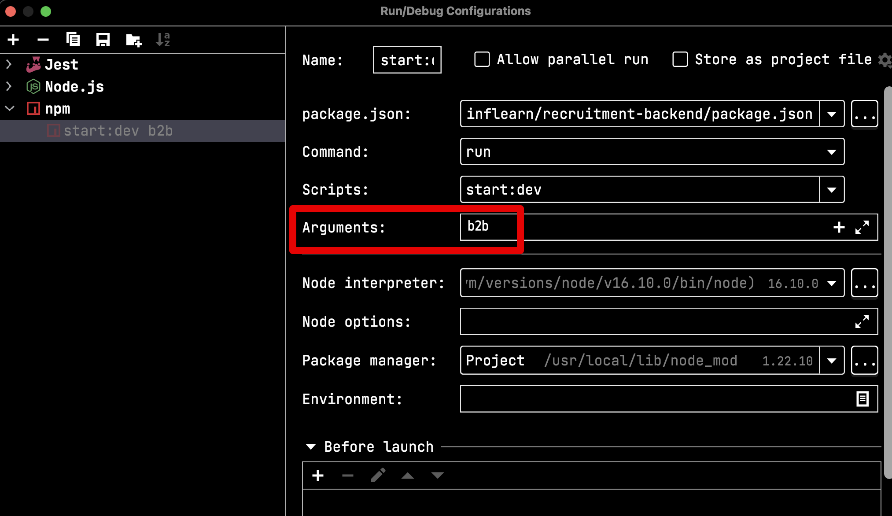
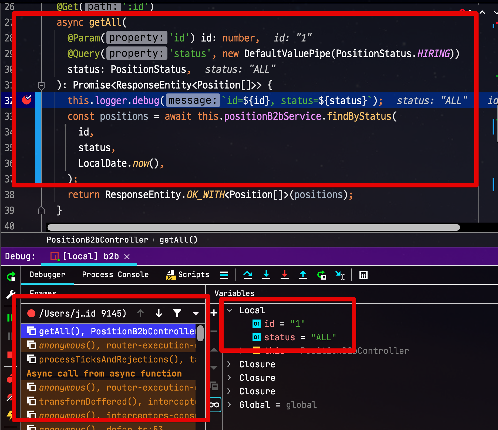
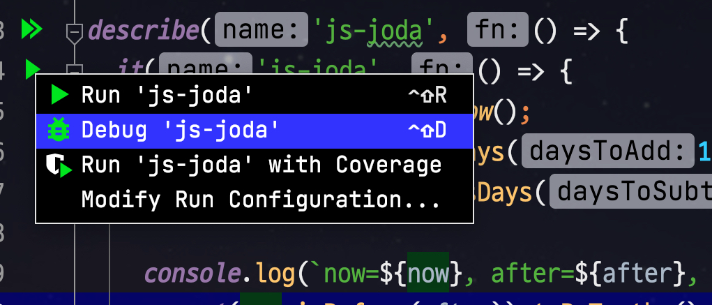

# NestJS (with Mono Repo) WebStorm으로 디버깅 하기

NestJS 공식 문서에서는 아래와 같이 CLI로 서비스 실행을 소개하곤 하는데요.

```bash
nest start --watch
```

> 물론 대부분의 백엔드 API 개발에 있어서는 `nest start` 를 쓸 일이 거의 없습니다.  
> 대부분 테스트 코드로 **단위 테스트 / E2E 테스트를 작성하면서 진행**하다보니 서버 실행할 이유가 없기 때문입니다.

어떤 개발 환경에서도 터미널만 있으면 실행할 수 있으니 좋습니다만,  
이럴 경우 **WebStorm/IntelliJ 등 디버깅 기능이 강력한 IDE의 도움을 못받습니다**.  
  
개발에 있어서 디버거의 사용유무는 중요합니다. 

* 실시간 데이터 변경 흐름 파악
* 특정 지점에서의 별도 로직 수행
* Logger를 추가할 수 없는 외부 라이브러리에 대한 코드 추적

등등 디버거를 통해 좀 더 깊게 문제를 확인할 수 있기 때문입니다.  

## 1. Nest 디버깅 환경 설정

NestJS 역시 IDE의 도움을 적극 받을 수 있도록 디버거 기능을 미리 `scripts` 에 등록되어있는데요.  
package.json 파일을 열어 아래와 같이 `start:debug` 의 **좌측 실행 버튼**을 클릭 한후, `Debug ...` 을 클릭합니다.



만약 저처럼 **모노레포 (Mono Repo)** 환경이라면 아래와 같이 WebStorm 상단의 `Edit Config...` 를 클릭해서



Arguments 에 실행할 `apps` 모듈을 등록합니다.  
(저는 b2b 모듈을 실행할 예정입니다.)



이렇게만 하면 디버거 실행환경은 끝입니다.  
  
원하는 곳에 브레이킹 포인트를 걸어두시고, 실행해보시면?  
  
아래와 같이 디버거 기능을 정상적으로 사용할 수 있습니다.



## 2. 테스트 코드에서의 디버깅

Jest 등 테스트코드에서의 디버깅은 이와 같이 별도로 설정할 것이 없습니다.  
  
Nest를 기반으로 실행하는게 아닌, 테스트 프레임워크를 통한 실행이기 때문인데요.  
아래와 같이 기존의 다른 NodeJS 프로그램처럼 **테스트 실행 버튼**을 클릭하시면 Debug 실행을 볼 수 있습니다.

