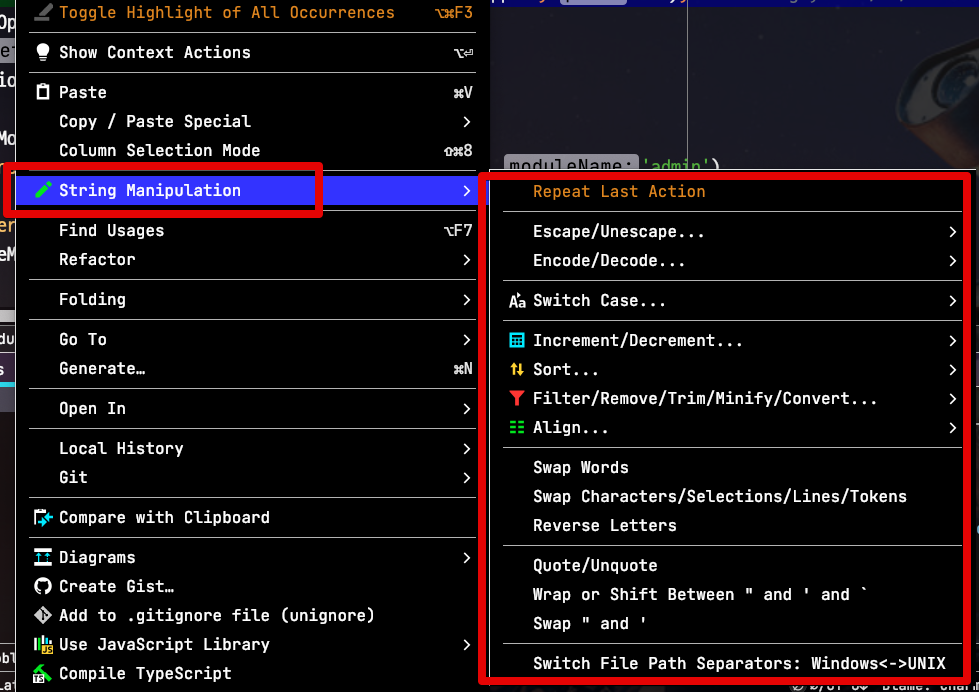
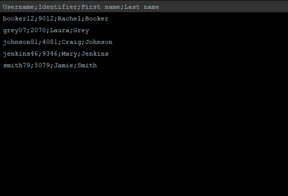
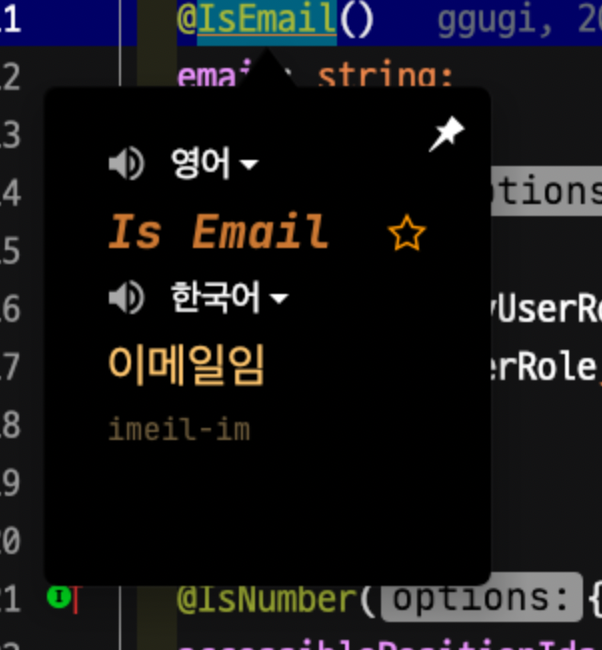
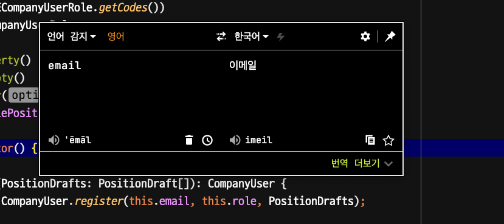
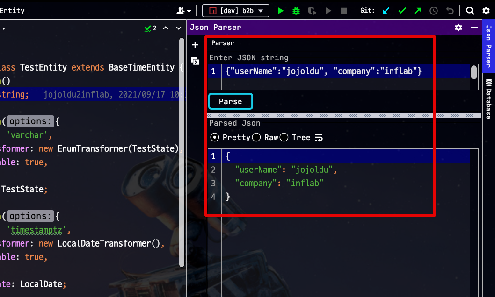
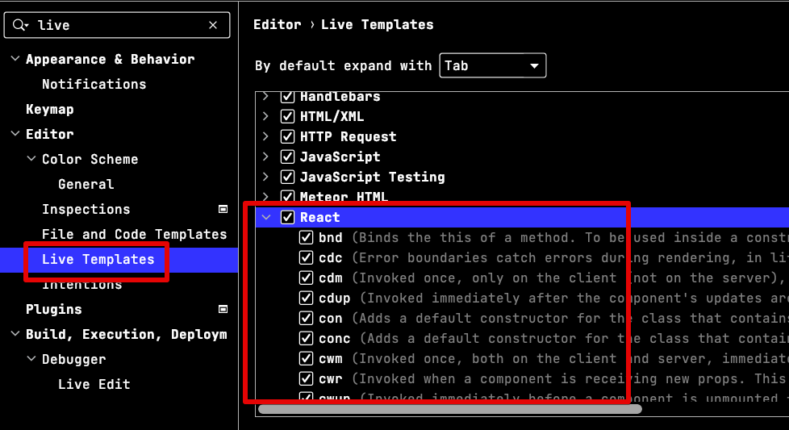
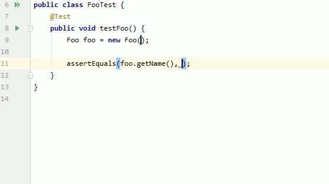
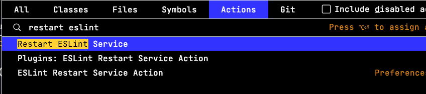
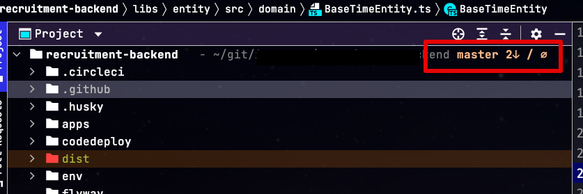
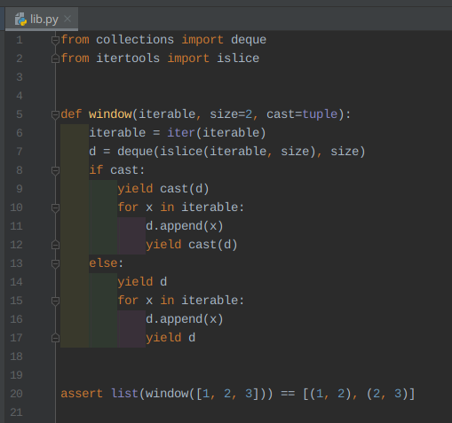

# 추천하는 WebStorm Plugin

WebStorm (웹스톰)의 경우 **JavaScript 개발을 목적으로한 IDE**이기 때문에 기본 환경으로도 개발하는데 충분합니다.  
그렇기 때문에 **플러그인이 필수는 아닙니다**.  
다만, 좀 더 생산성있는 개발을 위해서는 적절한 플러그인을 사용하는 것을 권장합니다.  
특히 일부의 플러그인들은 거의 필수제로 사용되니, 아래 플러그인들을 확인해보시고 필요한 항목들은 설치해보시는 것을 추천드립니다.

> 기본적인 [.env](https://plugins.jetbrains.com/plugin/9525--env-files-support), [.ignore](https://plugins.jetbrains.com/plugin/7495--ignore) 등의 플러그인은 다 설치되어있다고 가정했습니다.
> **생산성에 도움이 되는 플러그인들**만 작성했습니다.  
> [테마](https://plugins.jetbrains.com/plugin/11938-one-dark-theme) / [아이콘](https://plugins.jetbrains.com/plugin/11058-extra-icons) / [progress bar](https://plugins.jetbrains.com/plugin/14708-mario-progress-bar) / [power mode](https://plugins.jetbrains.com/plugin/8251-power-mode-ii) 등 UX에 관한 것들은 모두 배제했습니다.  

### String Manipulation

* [플러그인 링크](https://plugins.jetbrains.com/plugin/2162-string-manipulation)

문자열을 다루는데 여러 편의기능을 제공하는 플러그인 입니다.  
거의 문자열에 관한 모든 기능을 제공한다고 보셔도 무방한데요.  
아래 기능 외에도 다양한 기능들을 지원합니다.

* 케이스 전환
* 정렬
* 필터링
* 증분
* 열 정렬
* escaping
* encoding

특히나 escaping이나 encoding의 경우 상황에 따라 빈번하게 사용되는 기능이기도 하고,  
그 외 나머지 기능들 역시 DataGrip, DataSpell 등과 같이 개발용 IDE 외에서도 사용할 수 있기 때문에 적극 추천하는 플러그인입니다.

### CamelCase

* [플러그인 링크](https://plugins.jetbrains.com/plugin/7160-camelcase)

단축키 하나로 지정된 코드를 각종 네이밍 규칙들로 전환해주는 플러그인입니다.  
바로 위의 String Manipulation 플러그인이 있는데도 굳이 이 플러그인을 설치해야하는 이유가 바로 **단축키** 때문인데요.  

* 단축키: `Option` (`Alt`) + `Shift` + `U`

위 단축키를 수행하면 **지정된 영역의 문자열이 다음의 순서로 변환**됩니다.

* kebab-case
* SNAKE_CASE
* PascalCase
* camelCase
* snake_case
* space case

JSON으로 `user_name` 의 필드가 넘어오고, 이를 `userName` 으로 맵핑해야할 경우 CamelCase 단축키로 편하게 변환하는 등 개발하는데 있어 굉장히 자주 사용하는 단축키입니다.

### Translation

* [플러그인 링크](https://plugins.jetbrains.com/plugin/8579-translation)

IDE 내에서 구글 번역기와 같은 사용성을 지원하는 플러그인입니다.  
내부적으로 구글/알리바바/바이두 등의 번역 엔진을 사용하다보니 퀄리티가 굉장히 좋습니다.  
특히 구글 번역처럼 **언어 자동 인식**이 되다보니 한국어로 자동인식 되는 등 사용하기가 굉장히 편합니다.

> 특히 플러그인 메인 스폰서가 JetBrains 라서 잘 운영될 것 같습니다.

많은 다양한 기능들을 지원하다보니,  
**매번 웹브라우저로 화면 이동하는 횟수를 획기적으로 줄일수 있었습니다**

* 선택된 단어 번역: `Ctrl` + `Command` + `U`

* 번역창 오픈: `Ctrl` + `Command` + `U`

* 문서 전체 번역

### Json Parser

* [플러그인 링크](https://plugins.jetbrains.com/plugin/10650-json-parser)

[온라인 JSON Beautify](https://codebeautify.org/jsonviewer) 와 같이 JSON을 재정렬시키는 기능을 지원합니다.

JSON 값을 확인하기 위해 매번 IDE => 브라우저로 화면 전환을 하고, 값을 입력하는 식의 행위가 꽤나 불편합니다.  
특히 듀얼 모니터가 아니고 노트북 한대로 개발해야하는 경우엔 계속 화면 전환을 해야만 하기 때문에 JSON 데이터를 자주 보는 분들이라면 사용하시기에 좋습니다.

### React snippets

* [플러그인 링크](https://plugins.jetbrains.com/plugin/10113-react-snippets)

React용 Snippets 입니다.  
미리 정의된 **단축어**로 빠르게 React 코드를 생성해줍니다.  
플러그인을 설치하시면 아래와 같이 `Live Template` 에 `React` Live Template이 추가된 것을 확인할 수 있습니다.

단축어들을 입력하시면 빠르게 많은 양의 코드를 작성할 수 있으니 React 사용하시는 분들에겐 필수 플러그인입니다.

> 물론 본인이 직접 Live Template을 만들어 쓰셔도 무방합니다.

### Randomness

* [Randomness](https://plugins.jetbrains.com/plugin/9836-randomness)

코드를 작성하다가 테스트나 기능 개발을 위한 랜덤값이 필요할때가 종종 있습니다.  
그럴때 이 플러그인을 통해 **난수, 랜덤 문자열, UUID** 를 쉽게 생성할 수 있습니다.  

* 단축키 : `Option` (`Alt`) + `R`

액션을 사용할 때마다 계속해서 랜덤 값이 삽입됩니다.

### ESLint Restart Service Action

* [플러그인 링크](https://plugins.jetbrains.com/plugin/14119-eslint-restart-service-action)

가끔 ESLint 변경시 자동 적용이 안될때가 있습니다.  
그럴때 해당 플러그인이 설치 되어있으면 편하게 설정을 재적용할 수 있습니다.

* 단축키: `Command` (`Ctrl`) + `Shift` + `A` => `Restart ESLint Service` 검색 및 클릭
  * 별도의 단축키가 없어서 Action 검색 (`Command` (`Ctrl`) + `Shift` + `A`) 을 통해 실행합니다

### Git Toolbox

* [플러그인 링크](https://plugins.jetbrains.com/plugin/7499-gittoolbox)

IDE의 Git 기능을 확장 시켜주는 플러그인입니다.  

* Git Status 보여주기
* 에디터 내에 Git Blame 실시간 보여주기
* 현재 브랜치 Auto Git Fetch

더 많은 기능에 대한 소개는 [공식 메뉴얼](https://github.com/zielu/GitToolBox/wiki/Manual)을 참고하시면 좋습니다

### Indent Rainbow

* [플러그인 링크](https://plugins.jetbrains.com/plugin/13308-indent-rainbow)

들여쓰기의 깊이를 서로 다른 색으로 구별하기 쉽게 해주는 Plugin 입니다.  

주된 목표는 들여쓰기를 더 읽기 쉽게 만드는 것입니다.  
잘못된 들여쓰기를 사용하면 **빨간색 줄을 강조** 표시하여 들여쓰기 문제를 더 빨리 찾을 수 있게 도와줍니다.

