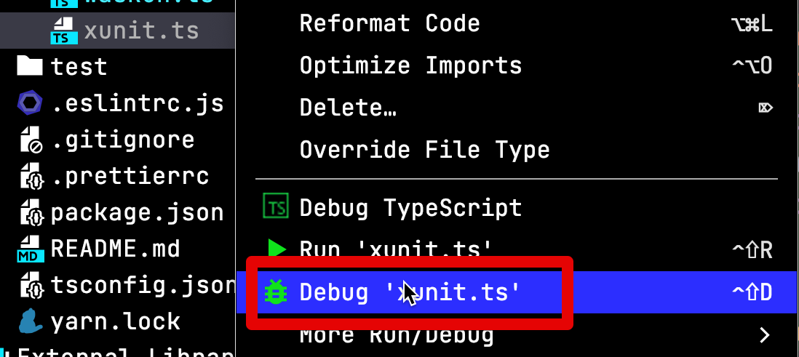

# WebStorm에서 TypeScript 파일 단독으로 실행하기

WebStorm에서 기본적으로는 TypeScript파일만 가지고 

* [Run Configuration for TypeScript](https://plugins.jetbrains.com/plugin/10841-run-configuration-for-typescript/)

```bash
yarn add --dev ts-node
```

